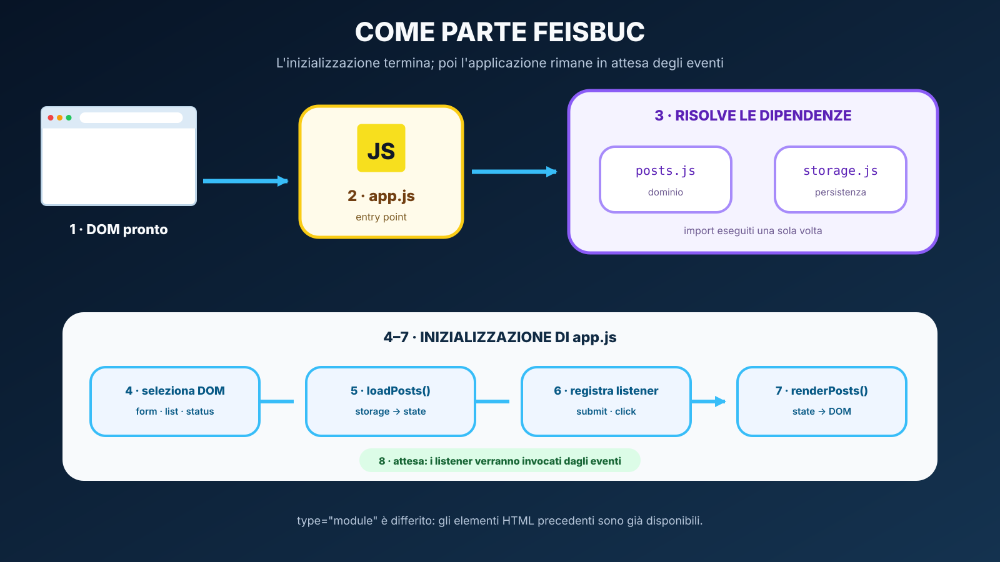

# Activity C — Feisbuc milestone 3

## Obiettivo

Portare Feisbuc da pagina responsive statica a piccola applicazione client-side senza server.

## Architettura richiesta

`posts.js` contiene trasformazioni dei dati, `storage.js` isola JSON e localStorage, mentre `app.js` coordina DOM, eventi e stato. Durante ogni interazione usa un solo percorso: nuovo stato → salvataggio → rendering → messaggio accessibile.

## Ordine consigliato

1. completa `posts.js` e verifica manualmente le funzioni dalla console/module;
2. completa `storage.js`;
3. implementa `createPostElement()` usando `createElement` e `textContent`;
4. implementa `renderPosts()`;
5. implementa `commitPosts()` come unico punto di sincronizzazione;
6. gestisci `submit` della form e ripristina il focus sul controllo `text`;
7. aggiungi un solo listener `click` a `#post-list`;
8. verifica reload, JSON corrotto e fallimento simulato di `setItem()`.

## Definition of done

- [ ] nessun post è scritto staticamente nel feed;
- [ ] la form pubblica con mouse e tastiera tramite `submit`;
- [ ] testo vuoto/spazi non crea post;
- [ ] ogni post è un `article[data-post-id]`;
- [ ] testo utente passa da `textContent`;
- [ ] ogni like button ha `data-action="like"` e `aria-pressed`;
- [ ] un post creato dopo il caricamento può ricevere like;
- [ ] esiste un solo listener click sul contenitore del feed;
- [ ] post e like sopravvivono al reload;
- [ ] JSON storage non valido non blocca la pagina;
- [ ] un errore di salvataggio viene annunciato in `#feed-status`;
- [ ] dopo la pubblicazione il controllo `text` riceve nuovamente il focus;
- [ ] non uso `fetch`, Promise o async/await;
- [ ] `app.js`, `posts.js`, `storage.js` sono ES modules.

## Test manuale minimo

1. cancella `feisbuc.posts` dal pannello Application/Storage;
2. ricarica: deve comparire empty state;
3. pubblica `Ciao <strong>mondo</strong>`: deve comparire letteralmente il testo, non markup interpretato;
4. premi Mi piace sul nuovo post;
5. ricarica: post e like devono restare;
6. modifica manualmente `feisbuc.posts` con JSON invalido e ricarica: la pagina deve tornare a uno stato utilizzabile.
7. inserisci temporaneamente `throw new DOMException("Errore simulato")` all'inizio del blocco `try` di `savePosts()`, pubblica un post e verifica che l'interfaccia continui a funzionare segnalando il mancato salvataggio; poi rimuovi la riga di prova.

## Domande finali

- dov'è la fonte di verità del numero di like?
- perché il listener sul feed funziona anche con post creati dopo?
- perché usiamo `data-post-id` invece di un id globale per ogni pulsante?
- che cosa cambierà in UDA 23 quando i post arriveranno da un server?
