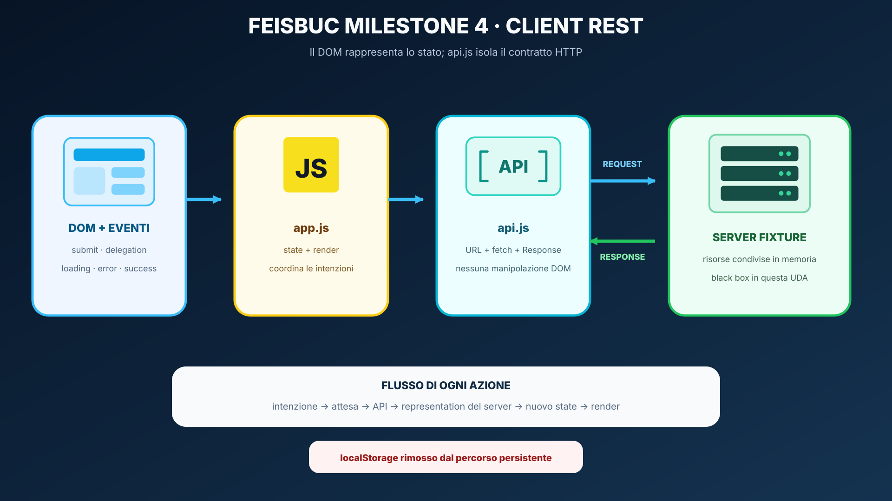
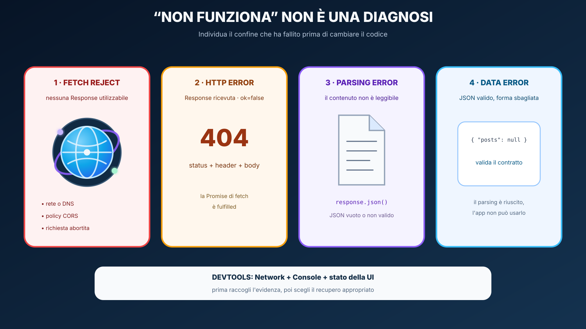

# Feisbuc milestone 4 — REST client

## Avvio

```bash
node server.mjs
```

Apri l'URL stampato dal server, normalmente `http://127.0.0.1:3000`.

La fixture serve **sia** la pagina **sia** la API: il primo esercizio è same-origin.

## Contratto API

### Leggere il feed

```text
GET /api/posts
-> 200 application/json
```

### Creare un post

```text
POST /api/posts
Content-Type: application/json

{"text":"Nuovo post"}

-> 201 Created
Location: /api/posts/:id
```

### Aggiornare il like

```text
PATCH /api/posts/:id
Content-Type: application/json

{"liked":true}

-> 200 OK
```

## Architettura richiesta



`app.js` non deve più salvare lo stato persistente in `localStorage`: la fonte condivisa è il server, mentre l'array JavaScript rimane soltanto lo stato corrente dell'interfaccia.

## La policy di `requestJson`

Il tuo helper deve ragionare in questo ordine:



L'ordine è: attendi `fetch`, leggi status e `Content-Type`, consuma il payload una sola volta, trasforma `!response.ok` in un errore utile e infine valida la struttura dei dati prima di aggiornare lo stato.

## DevTools obbligatorio

Verifica nel pannello Network almeno:

- GET iniziale;
- POST di un nuovo post;
- PATCH di un like.

Per ciascuno controlla method, status, request payload e response.

## Definition of done

- [ ] feed caricato via GET;
- [ ] POST crea il post e usa la representation restituita;
- [ ] PATCH aggiorna il like;
- [ ] nessun localStorage/sessionStorage;
- [ ] `api.js` non manipola il DOM;
- [ ] `app.js` non costruisce manualmente URL/status handling duplicato;
- [ ] response 4xx/5xx diventa un messaggio UI;
- [ ] JSON valido ma non conforme al contratto viene rifiutato;
- [ ] testo utente scritto con `textContent`;
- [ ] loading state visibile/semanticamente rappresentato;
- [ ] dopo il POST la form viene svuotata e il focus torna al campo di testo;
- [ ] Network panel usato per verificare le tre request.
