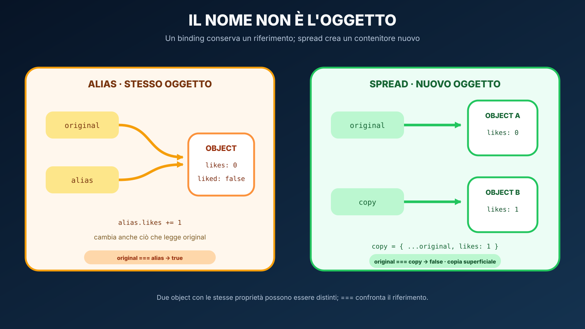

# Activity B — Like come aggiornamento di stato

## Obiettivo

Implementare `toggleLike(posts, targetId)` senza modificare direttamente l'array ricevuto.

## Modello mentale

`map()` crea il nuovo array: un post diverso dal target viene restituito invariato; per il target, object spread crea un nuovo object con `liked` e `likes` aggiornati.

Il DOM arriverà dopo. Qui vogliamo rendere testabile la logica che il browser chiamerà quando avverrà un evento.

## Regole

- usa `map`;
- per il target crea `{ ...post, liked, likes }`;
- un like aggiunto incrementa il contatore;
- un like rimosso decrementa senza scendere sotto zero;
- id assente: valori invariati;
- niente log extra su stdout.

## Domande da saper rispondere

1. Perché `const post` non impedisce di mutare `post.likes`?
2. Perché qui scegliamo di non mutare comunque il post ricevuto?
3. Quale parte del codice crea il nuovo array?
4. Quale parte crea il nuovo object?
5. Come collegheremo questa funzione a `event delegation` nel browser?
