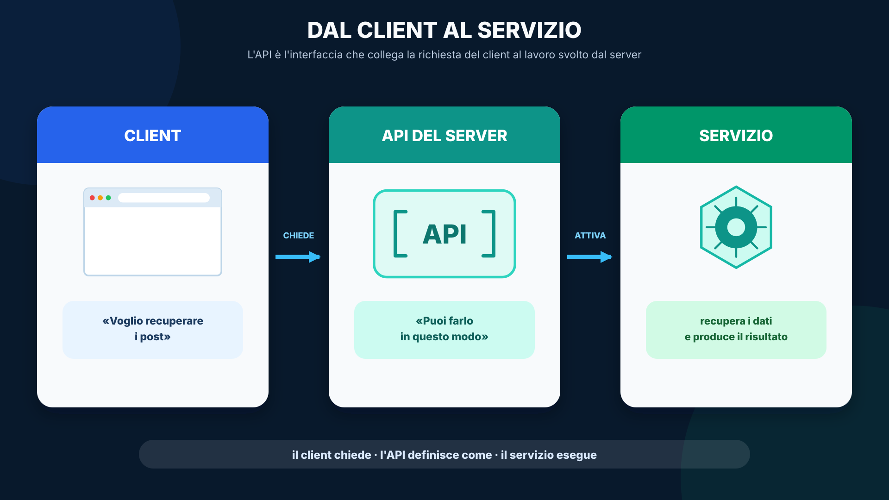
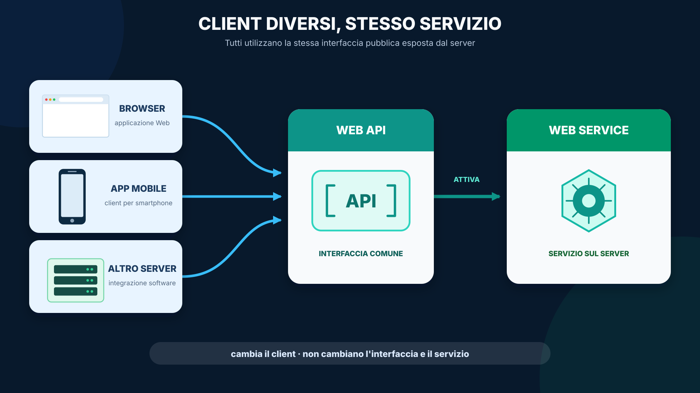
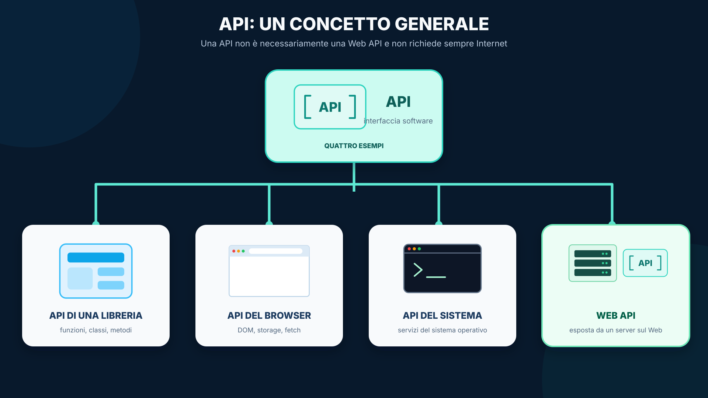
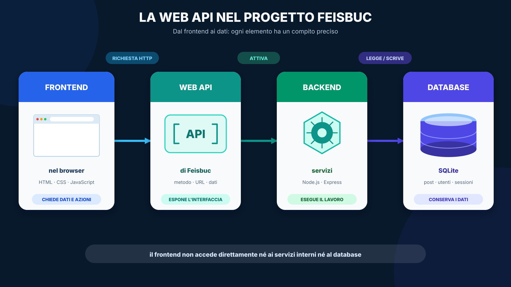
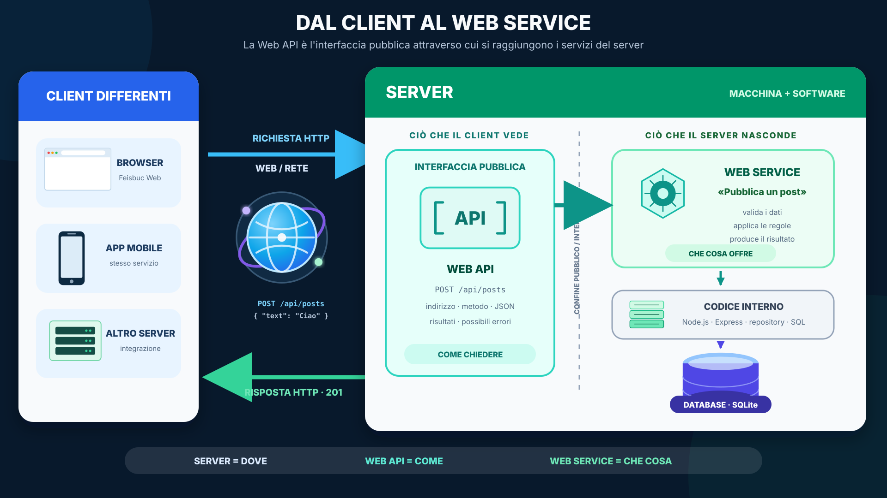
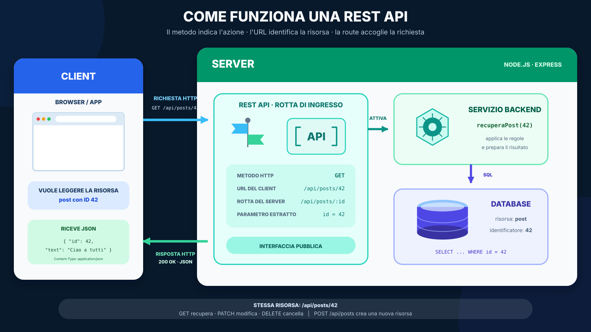

# Architettura didattica del corso Full Stack

## In questa unità impareremo

<table align="center">
<tr><td>
<details>
<summary>&#129517; <strong>Orientamento della sezione</strong></summary>

<p align="justify"><strong><span style="font-size: 1.15em;">&#128506;</span> Contesto:</strong>
Questa unità introduce il percorso e rende visibile il filo logico dell'anno: una applicazione web non è una collezione di tecnologie isolate, ma una catena di componenti che collaborano attraverso contratti espliciti.</p>

<p align="justify"><strong><span style="font-size: 1.15em;">&#10067;</span> Domande guida:</strong>
Quando premiamo «Pubblica», dove va il testo? Chi lo riceve? Dove viene salvato? Come arriva agli altri utenti? Quali regole permettono a browser e server di capirsi?</p>

<p align="justify"><strong><span style="font-size: 1.15em;">&#127919;</span> Obiettivi:</strong>
Al termine lo studente dovrà saper:</p>
<ul>
  <li>distinguere client e server sia come dispositivi sia come programmi;</li>
  <li>spiegare perché client e server hanno bisogno di un protocollo condiviso;</li>
  <li>distinguere il modello request/response di HTTP dal canale persistente e bidirezionale di WebSocket;</li>
  <li>riconoscere servizi, API, risorse e metodi HTTP in una semplice applicazione web;</li>
  <li>descrivere, a livello introduttivo, il percorso completo di una richiesta.</li>
</ul>

<p align="justify"><strong><span style="font-size: 1.15em;">&#10145;</span> Prossimo passo:</strong>
Costruiremo prima il modello mentale client–server, poi collegheremo protocolli, API, backend e database fino a ricostruire l'intero percorso di una richiesta in Feisbuc.</p>

</details>
</td></tr>
</table>

<p align="center"></p>

## Problema iniziale

<p align="justify">Quando premiamo «Pubblica» in un social network, dove va il testo? Chi lo riceve? Dove viene salvato? Come arriva agli altri utenti? Perché il browser può mostrare nuovi dati senza ricaricare tutta la pagina?</p>

<p align="justify">Il corso risponderà progressivamente a queste domande costruendo e ricostruendo lo stesso progetto: <strong>Feisbuc</strong>.</p>

## Client e server: due ruoli

<p align="justify">Quando utilizziamo un'applicazione web, almeno due soggetti collaborano: un <strong>client</strong> e un <strong>server</strong>.</p>

<p align="justify">Queste parole non indicano soltanto due tipi di computer. Indicano soprattutto due <strong>ruoli</strong>:</p>
<ul>
  <li>il client chiede un servizio o una risorsa;</li>
  <li>il server riceve la richiesta, la elabora e restituisce una risposta.</li>
</ul>

<p align="justify">Possiamo osservare questi ruoli da due punti di vista.</p>

<table align="center">
<thead><tr><th>Punto di vista</th><th>Client</th><th>Server</th></tr></thead>
<tbody>
<tr><td><strong>Hardware</strong></td><td>Il computer, tablet o smartphone dell'utente</td><td>Un computer fisico o virtuale, spesso ospitato in un data center o nel cloud</td></tr>
<tr><td><strong>Software</strong></td><td>Il programma che invia le richieste</td><td>Il programma che rimane in ascolto e risponde alle richieste</td></tr>
</tbody>
</table>

<p align="center"></p>

<p align="justify">Client e server non sono necessariamente due “scatole” diverse. Durante lo sviluppo possono anche trovarsi sullo stesso computer: quando apriamo un'applicazione su <code>localhost</code>, il browser svolge il ruolo di client e il programma Node.js svolge il ruolo di server.</p>

## Il WWW come esempio

<p align="justify">Nel World Wide Web il client software è normalmente il <strong>browser</strong>:</p>
<ul>
  <li>Mozilla Firefox;</li>
  <li>Google Chrome;</li>
  <li>Apple Safari;</li>
  <li>Microsoft Edge.</li>
</ul>

<p align="justify">Il browser richiede pagine e dati, interpreta HTML, CSS e JavaScript e mostra l'interfaccia all'utente.</p>

<p align="justify">Sul lato server troviamo invece un software capace di ricevere richieste web. Alcuni esempi sono:</p>
<ul>
  <li>Apache HTTP Server;</li>
  <li>Nginx;</li>
  <li>Microsoft IIS;</li>
  <li>un'applicazione Node.js, spesso costruita con Express.</li>
</ul>

<p align="justify">In questo corso il backend principale sarà realizzato con <strong>Node.js ed Express</strong>.</p>

<table align="center"><tr><td>
<p align="justify"><strong><span style="font-size: 1.15em;">&#9888;</span> Attenzione:</strong>
Node.js è l'ambiente nel quale eseguiamo JavaScript sul server; Express è il framework che useremo per organizzare route, middleware e risposte HTTP.</p>
</td></tr></table>

## Il protocollo: le regole della comunicazione

<p align="justify">Client e server devono accordarsi su come comunicare. Non è sufficiente che siano collegati alla stessa rete.</p>

<table align="center"><tr><td>
<p align="justify"><strong><span style="font-size: 1.15em;">&#128214;</span> Definizione — protocollo:</strong>
Un <strong>protocollo</strong> è un insieme di regole condivise che stabilisce come due soggetti costruiscono, interpretano e scambiano i messaggi.</p>
</td></tr></table>

<p align="justify">Un protocollo stabilisce, per esempio:</p>
<ul>
  <li>come iniziare una comunicazione;</li>
  <li>come sono costruiti i messaggi;</li>
  <li>quale significato hanno i messaggi;</li>
  <li>in quale ordine possono essere inviati;</li>
  <li>come segnalare un risultato o un errore.</li>
</ul>

### Un protocollo nella vita quotidiana

<p align="justify">Immaginiamo questa conversazione:</p>

<blockquote><p align="justify">
<strong>Marco:</strong> «Ciao Giulia, posso chiederti una cosa?»<br>
<strong>Giulia:</strong> «Sì, dimmi.»<br>
<strong>Marco:</strong> «Mi passi il quaderno blu?»<br>
<strong>Giulia:</strong> «Non ho capito quale quaderno. Puoi ripetere?»<br>
<strong>Marco:</strong> «Quello blu sul banco vicino alla finestra.»<br>
<strong>Giulia:</strong> «Ricevuto, eccolo.»<br>
<strong>Marco:</strong> «Grazie, ciao.»
</p></blockquote>

<p align="justify">Anche questa semplice conversazione funziona perché Marco e Giulia seguono alcune regole condivise.</p>

<p align="center"></p>

<table align="center">
<thead><tr><th>Regola del protocollo</th><th>Esempio nella conversazione</th></tr></thead>
<tbody>
<tr><td><strong>1. Come iniziare la comunicazione</strong></td><td>Marco saluta e chiede se può parlare. Giulia risponde e accetta di iniziare la conversazione.</td></tr>
<tr><td><strong>2. Come sono costruiti i messaggi</strong></td><td>Entrambi usano frasi in italiano. La richiesta contiene un'azione, «passare», e l'oggetto interessato, «il quaderno blu».</td></tr>
<tr><td><strong>3. Quale significato hanno i messaggi</strong></td><td>Marco e Giulia attribuiscono lo stesso significato alle parole «quaderno», «blu» e «sul banco».</td></tr>
<tr><td><strong>4. In quale ordine vengono inviati</strong></td><td>Prima avviene il saluto, poi la richiesta, quindi la risposta e infine la chiusura. Giulia non consegna un quaderno prima di sapere quale deve prendere.</td></tr>
<tr><td><strong>5. Come indicare un risultato o un errore</strong></td><td>«Ricevuto, eccolo» indica che la richiesta è stata completata. «Non ho capito» segnala invece un errore e richiede un messaggio più preciso.</td></tr>
</tbody>
</table>

<p align="justify">Se uno dei due ignorasse queste regole — parlasse una lingua sconosciuta, rispondesse prima della richiesta o non segnalasse di non aver capito — la comunicazione potrebbe fallire.</p>

<p align="justify">Allo stesso modo, client e server devono concordare come iniziare lo scambio, come rappresentare i messaggi, che cosa significa ogni messaggio, in quale ordine scambiarli e come comunicare risultati ed errori.</p>

<p align="justify">La differenza è che, tra programmi, queste regole devono essere definite con grande precisione: un computer non può affidarsi all'intuizione per interpretare un messaggio ambiguo.</p>

<p align="justify">Nel corso incontreremo soprattutto due protocolli: <strong>HTTP</strong> e <strong>WebSocket</strong>.</p>

### HTTP e WebSocket

<table align="center">
<thead><tr><th>HTTP</th><th>WebSocket</th></tr></thead>
<tbody>
<tr><td>Ogni scambio viene iniziato dal client</td><td>Dopo il collegamento, client e server possono inviare messaggi</td></tr>
<tr><td>Il client invia una richiesta e il server restituisce una risposta</td><td>La connessione rimane aperta e la comunicazione è bidirezionale</td></tr>
<tr><td>È adatto a pagine, API e operazioni sui dati</td><td>È adatto agli aggiornamenti in tempo reale</td></tr>
<tr><td>Può essere pensato, in modo semplificato, come “pull”</td><td>Permette anche il “push” dal server</td></tr>
</tbody>
</table>

<p align="justify">Con HTTP il browser può chiedere: «Dammi gli ultimi post» oppure «Salva questo nuovo post».</p>

<p align="justify">Con WebSocket il server può comunicare: «È appena arrivato un nuovo post», senza aspettare che ogni browser ripeta continuamente la stessa richiesta.</p>

<table align="center"><tr><td>
<p align="justify"><strong><span style="font-size: 1.15em;">&#128161;</span> Modello introduttivo:</strong>
La semplificazione <strong>HTTP = pull</strong> e <strong>WebSocket = push</strong> è utile come primo modello mentale, ma non è una definizione completa.</p>
<ul>
  <li>HTTP usa un modello request/response iniziato dal client;</li>
  <li>WebSocket crea un canale persistente e bidirezionale.</li>
</ul>
</td></tr></table>

<p align="justify">Nel progetto Feisbuc useremo HTTP per i comandi e il recupero dei dati, e WebSocket/Socket.IO per distribuire gli aggiornamenti in tempo reale.</p>

## Dal servizio alla Web API

<table align="center"><tr><td>
<p align="justify"><strong><span style="font-size: 1.15em;">&#128506;</span> Percorso concettuale:</strong>
Prima di parlare di REST, dobbiamo mettere in relazione alcuni termini che incontreremo spesso: <strong>servizio</strong>, <strong>interfaccia pubblica</strong>, <strong>API</strong>, <strong>web service</strong> e <strong>Web API</strong>. Li introdurremo uno alla volta, seguendo il percorso compiuto da un client per utilizzare una funzionalità offerta da un server.</p>
</td></tr></table>

### Dal servizio all'interfaccia

<p align="justify">Un server viene realizzato per offrire uno o più <strong>servizi</strong> ai client.</p>

<p align="justify">Per esempio, il server di Feisbuc può offrire servizi per:</p>
<ul>
  <li>recuperare i post;</li>
  <li>pubblicare un nuovo post;</li>
  <li>modificare o cancellare un post;</li>
  <li>autenticare un utente.</li>
</ul>

<p align="justify">Un client non deve conoscere il codice interno con cui il server realizza queste operazioni. Deve però sapere quali servizi può richiedere, a quale indirizzo inviare la richiesta, quali dati fornire e quale risultato aspettarsi.</p>

<p align="justify">Il server ha quindi bisogno di un punto d'ingresso ben definito: una <strong>interfaccia pubblica</strong> attraverso la quale i client possono utilizzare i servizi offerti.</p>

<p align="justify">“Pubblica” non significa necessariamente “accessibile a tutti”: l'interfaccia può richiedere autenticazione e autorizzazione. Significa che quella è la parte del server esposta ai client, mentre l'implementazione interna rimane nascosta.</p>

<p align="justify">Nel nostro contesto, l'interfaccia pubblica attraverso cui un programma utilizza i servizi del server è chiamata <strong>API</strong>. Vediamo quindi che cosa significa questo termine.</p>

### Che cos'è un'API?

<table align="center"><tr><td>
<p align="justify"><strong><span style="font-size: 1.15em;">&#128214;</span> Definizione — API:</strong>
API significa <strong>Application Programming Interface</strong>, cioè <strong>interfaccia di programmazione di un'applicazione</strong>. È un insieme di regole che permette a un programma di utilizzare le funzionalità offerte da un altro programma.</p>
</td></tr></table>

<p align="center"></p>

<p align="justify">Possiamo immaginare l'API come la reception di un albergo: il cliente esprime una richiesta alla reception, il lavoro viene svolto dalle parti interne dell'albergo e il cliente riceve il risultato senza dover conoscere l'organizzazione interna.</p>

<p align="justify">Allo stesso modo, il client comunica con l'API senza conoscere direttamente il codice del backend, le tabelle del database o le istruzioni SQL.</p>

<table align="center"><tr><td>
<p align="justify"><strong><span style="font-size: 1.15em;">&#128273;</span> Idea chiave:</strong>
L'API descrive <strong>come entrare</strong> nel sistema. Il servizio descrive <strong>che cosa il sistema sa fare</strong>.</p>
</td></tr></table>

<p align="justify">Questa definizione di API è generale e non implica necessariamente l'uso del Web. Quando invece il servizio viene eseguito su un server ed è accessibile attraverso la rete con le tecnologie del Web, parliamo di <strong>web service</strong>.</p>

### Che cos'è un web service?

<table align="center"><tr><td>
<p align="justify"><strong><span style="font-size: 1.15em;">&#128214;</span> Definizione — web service:</strong>
Un <strong>web service</strong> è un servizio software accessibile attraverso una rete utilizzando tecnologie e protocolli del Web.</p>
</td></tr></table>

<p align="justify">Per esempio, Feisbuc può offrire un servizio per pubblicare un post. Il servizio viene eseguito sul server e può essere utilizzato da client differenti:</p>
<ul>
  <li>un'applicazione eseguita nel browser;</li>
  <li>un'applicazione per smartphone;</li>
  <li>un altro server;</li>
  <li>uno strumento di test.</li>
</ul>

<p align="center"></p>

<p align="justify">I client possono essere diversi, ma utilizzano tutti la stessa interfaccia esposta dal server. Per descrivere con precisione questa interfaccia dobbiamo ora distinguere il termine generale <strong>API</strong> dal caso particolare <strong>Web API</strong>.</p>

### API e Web API

<p align="justify">Non tutte le API utilizzano Internet. Anche una libreria JavaScript possiede una API: funzioni, classi e metodi che possiamo utilizzare nel nostro programma.</p>

<table align="center"><tr><td>
<p align="justify"><strong><span style="font-size: 1.15em;">&#128214;</span> Definizione — Web API:</strong>
Quando l'API è esposta da un server attraverso il Web, parliamo di <strong>Web API</strong>.</p>
</td></tr></table>

<p align="center"></p>

<p align="justify">Nel nostro progetto il frontend utilizza la Web API di Feisbuc per raggiungere i servizi del backend e, attraverso questi, i dati persistenti.</p>

<p align="center"></p>

<p align="justify">Nel nostro corso i web service saranno esposti principalmente tramite una <strong>Web API basata su HTTP</strong>. Ora che tutti i termini sono stati introdotti, l'immagine seguente riassume il loro rapporto. Subito dopo vedremo come organizzare questa Web API secondo lo stile REST.</p>

<p align="center"></p>

## Che cos'è una REST API?

<table align="center"><tr><td>
<p align="justify"><strong><span style="font-size: 1.15em;">&#128214;</span> Definizione — REST API:</strong>
Una <strong>REST API</strong> è una Web API organizzata seguendo lo stile architetturale REST. Il suo modello fondamentale è basato sulle <strong>risorse</strong>.</p>
</td></tr></table>

<p align="justify">Seguiamo una richiesta completa: il client chiede il post con ID 42, la REST API riconosce metodo e URL, associa l'URL alla route del server, estrae l'identificatore, attiva il servizio e restituisce il risultato in JSON.</p>

<p align="center"></p>

<p align="justify">Una risorsa è qualcosa che il sistema gestisce e che possiamo identificare. In Feisbuc avremo, per esempio, post, utenti, commenti e sessioni.</p>

<p align="justify">Ogni risorsa accessibile attraverso l'API possiede un identificatore rappresentato da un URL.</p>

```text
/api/posts       → collezione dei post
/api/posts/42    → post identificato dal numero 42
/api/users/7     → utente identificato dal numero 7
```

<p align="justify"><code>/api/posts/42</code> è l'URL utilizzato dal client per identificare la risorsa. Nel backend potremmo definire una route parametrica:</p>

```text
/api/posts/:id
```

<p align="justify">La route dice al server: «Riconosci tutti gli URL con questa struttura e conserva il valore finale nel parametro <code>id</code>».</p>

```text
URL richiesto:       /api/posts/42
Route del backend:   /api/posts/:id
Parametro ottenuto:  id = 42
```

<p align="justify">Quindi:</p>
<ul>
  <li>l'<strong>URL</strong> identifica la risorsa per il client;</li>
  <li>la <strong>route</strong> è la regola usata dal backend per riconoscere quell'URL;</li>
  <li>l'<strong>ID</strong> distingue una singola risorsa dalle altre.</li>
</ul>

### Risorse e metodi HTTP

<p align="justify">L'URL indica <strong>su quale risorsa</strong> vogliamo operare. Il metodo HTTP indica <strong>quale azione</strong> vogliamo compiere.</p>

<table align="center">
<thead><tr><th>Metodo HTTP</th><th>Significato introduttivo</th><th>Esempio</th></tr></thead>
<tbody>
<tr><td><code>GET</code></td><td>Recuperare una o più risorse</td><td>Leggere i post</td></tr>
<tr><td><code>POST</code></td><td>Creare una nuova risorsa</td><td>Pubblicare un post</td></tr>
<tr><td><code>PUT</code></td><td>Sostituire completamente una risorsa</td><td>Sostituire un post</td></tr>
<tr><td><code>PATCH</code></td><td>Modificare una parte della risorsa</td><td>Modificare il testo</td></tr>
<tr><td><code>DELETE</code></td><td>Cancellare una risorsa</td><td>Eliminare un post</td></tr>
</tbody>
</table>

<p align="justify">La combinazione tra metodo e URL esprime l'operazione richiesta:</p>

```http
GET /api/posts
GET /api/posts/42
POST /api/posts
PATCH /api/posts/42
DELETE /api/posts/42
```

<p align="justify">La risorsa può rimanere la stessa mentre cambia l'azione espressa dal metodo HTTP.</p>

<table align="center"><tr><td>
<details>
<summary>&#129504; <strong>Riepilogo rapido</strong></summary>
<p align="justify">In questa prima lezione ci basta ricordare:</p>
<ol>
  <li>il server offre dei servizi;</li>
  <li>l'API è l'interfaccia attraverso cui i client possono richiederli;</li>
  <li>una Web API è raggiungibile attraverso tecnologie Web;</li>
  <li>una REST API organizza il sistema intorno alle risorse;</li>
  <li>l'URL identifica la risorsa;</li>
  <li>il metodo HTTP indica l'azione richiesta.</li>
</ol>
</details>
</td></tr></table>

<p align="justify">Nel modulo dedicato a HTTP analizzeremo con maggiore precisione request, response, header, body, status code, semantica dei metodi e progettazione REST.</p>

## Anatomia di un'applicazione web full stack

<p align="center"></p>

<p align="justify">Una web application full stack comprende più parti con responsabilità diverse.</p>

<p align="justify">Il <strong>frontend</strong> viene eseguito nel browser e gestisce ciò che l'utente vede e con cui interagisce. Le sue tecnologie fondamentali sono:</p>
<ul>
  <li>HTML per struttura e contenuto;</li>
  <li>CSS per presentazione e layout;</li>
  <li>JavaScript per comportamento e interazione.</li>
</ul>

<p align="justify">Il <strong>backend</strong> viene eseguito sul server. Riceve le richieste, applica le regole dell'applicazione e decide quali dati leggere o modificare. Nel nostro stack useremo principalmente Node.js ed Express.</p>

<p align="justify">Il <strong>database</strong> conserva i dati anche dopo la chiusura del browser o il riavvio dell'applicazione. Lo interrogheremo usando SQL; il database principale del corso sarà SQLite.</p>

<p align="justify">Il browser non dovrebbe collegarsi direttamente al database. Comunica con il backend, che controlla e protegge l'accesso ai dati.</p>

## Esempio completo: pubblicare un post

<p align="justify">Quando un utente preme «Pubblica» in Feisbuc:</p>
<ol>
  <li>JavaScript intercetta l'azione nel browser;</li>
  <li>il frontend prepara i dati del post;</li>
  <li>il browser invia una richiesta HTTP <code>POST /api/posts</code>;</li>
  <li>la REST API riceve il documento JSON;</li>
  <li>Express controlla la richiesta e valida i dati;</li>
  <li>il backend esegue un'istruzione SQL;</li>
  <li>SQLite conserva il nuovo post;</li>
  <li>il server restituisce una risposta HTTP in JSON;</li>
  <li>il frontend aggiorna ciò che l'utente vede;</li>
  <li>in modalità realtime, il server può notificare gli altri browser attraverso WebSocket/Socket.IO.</li>
</ol>

<p align="justify">Questa catena è il filo conduttore dell'intero corso. Durante l'anno studieremo ogni passaggio separatamente, poi li collegheremo in un'unica applicazione.</p>

### Checkpoint

<table align="center"><tr><td>
<details>
<summary>&#9989; <strong>Verifica rapida — cancellare un post</strong></summary>
<p align="justify">Per cancellare il post numero 12:</p>
<ol>
  <li>qual è la risorsa?</li>
  <li>qual è il suo URL?</li>
  <li>quale metodo HTTP useresti?</li>
  <li>quale parte rappresenta l'API e quale il servizio interno?</li>
</ol>
<p align="justify"><strong>Richiesta attesa:</strong></p>
<pre lang="http"><code>DELETE /api/posts/12</code></pre>
</details>
</td></tr></table>

## Principio di progressione

<ol>
  <li>capire la Web Platform senza framework;</li>
  <li>capire JavaScript nel browser e il DOM;</li>
  <li>capire HTTP prima di nasconderlo dietro librerie;</li>
  <li>costruire il backend principale con Node.js + Express;</li>
  <li>usare SQL direttamente prima dell'ORM;</li>
  <li>introdurre autenticazione e sicurezza;</li>
  <li>confrontare il rendering server-side prima della SPA;</li>
  <li>passare a un frontend componentizzato con <strong>Vue 3 + Vite</strong>;</li>
  <li>introdurre routing e TypeScript mirato ai boundary;</li>
  <li>introdurre realtime con WebSocket/Socket.IO;</li>
  <li>usare React in un laboratorio di traduzione/comparazione, non come secondo framework core;</li>
  <li>riscrivere una parte mirata del backend con FastAPI/SQLAlchemy per rendere visibili gli stessi contratti da un altro stack;</li>
  <li>testare e distribuire il prodotto finale raccogliendo evidence verificabili.</li>
</ol>

## Ambienti di laboratorio

<table align="center"><tr><td>
<details>
<summary>&#128187; <strong>Strumenti disponibili</strong></summary>
<ul>
  <li><strong>MDN Playground</strong> per micro-esempi Web Platform;</li>
  <li><strong>JSFiddle</strong> per preservare e analizzare esempi legacy quando utile;</li>
  <li><strong>StackBlitz</strong> opzionale per esperimenti zero-install;</li>
  <li><strong>TheBitLab</strong> per Activity valutate e riproducibili;</li>
  <li><strong>repository Git</strong> per Feisbuc e i progetti reali.</li>
</ul>
<p align="justify">Nessun laboratorio valutato deve dipendere obbligatoriamente da un SaaS esterno.</p>
</details>
</td></tr></table>

## Tassonomia Activity

<p align="justify">La tassonomia ufficiale resta quella TheBitLab:</p>
<ul>
  <li><strong>A</strong> — esegui/osserva;</li>
  <li><strong>B</strong> — modifica controllata;</li>
  <li><strong>C</strong> — implementazione autonoma;</li>
  <li><strong>D</strong> — debug/diagnosi;</li>
  <li><strong>E</strong> — mini-progetto;</li>
  <li><strong>F</strong> — prodotto integrato.</li>
</ul>

## Decisioni congelate per il 2026/27

<table align="center"><tr><td>
<details>
<summary>&#128274; <strong>Decisioni architetturali del Content Pack 1.0.0</strong></summary>
<p align="justify">Il Content Pack <strong>1.0.0 / approved</strong> ha già chiuso le decisioni architetturali del core:</p>
<ul>
  <li><strong>D1:</strong> Vue 3 + Vite è il framework frontend principale; React resta un translation/comparison lab;</li>
  <li><strong>D2:</strong> nessun ORM Node nel core: prima SQL raw + SQLite + repository;</li>
  <li><strong>D3:</strong> TypeScript è usato in modo mirato ai boundary frontend, non come riscrittura totale dello stack;</li>
  <li><strong>D4:</strong> il mirror FastAPI è mirato e serve a confrontare contratti e confini, non a duplicare Feisbuc;</li>
  <li><strong>D5:</strong> il futuro corso SQL può integrarsi con TPSI5, ma non è un prerequisito bloccante.</li>
</ul>
<p align="justify">Queste scelte sono parte del curriculum congelato e non vengono ridefinite durante la delivery ordinaria.</p>
</details>
</td></tr></table>

## Orientamento e primo laboratorio

<table align="center"><tr><td>
<details>
<summary>&#128187; <strong>Primo laboratorio operativo</strong></summary>
<p align="justify">Questo modulo 00 è una <strong>lezione di orientamento</strong> e non ha una Activity separata nel Content Pack.</p>
<p align="justify">Il primo laboratorio operativo arriva nel modulo 01, <strong>Web Platform e HTML moderno</strong>, con l'Activity <a href="../../activities/tpsi5/html_anatomy_a/student/README.md">Anatomia di un documento HTML moderno</a>.</p>
</details>
</td></tr></table>
