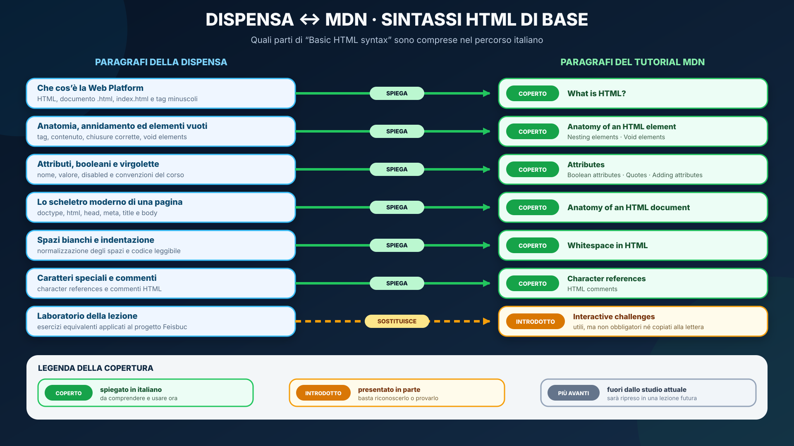
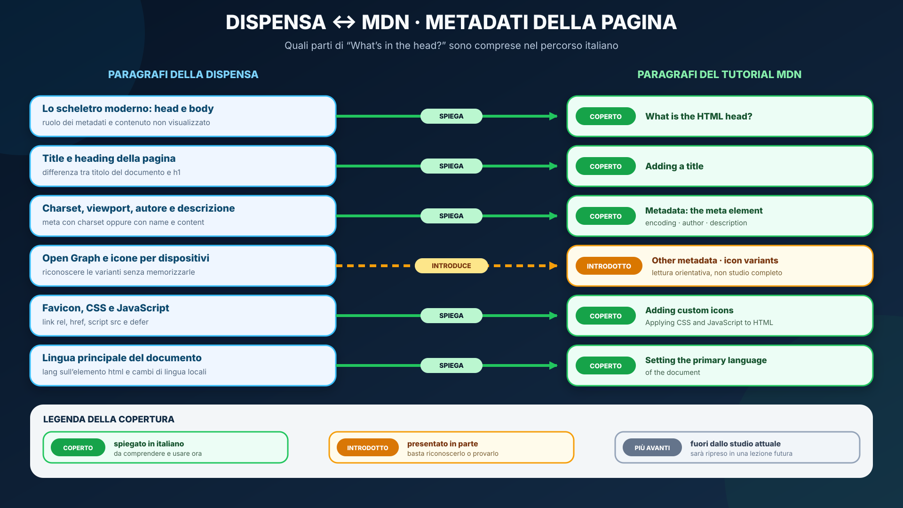
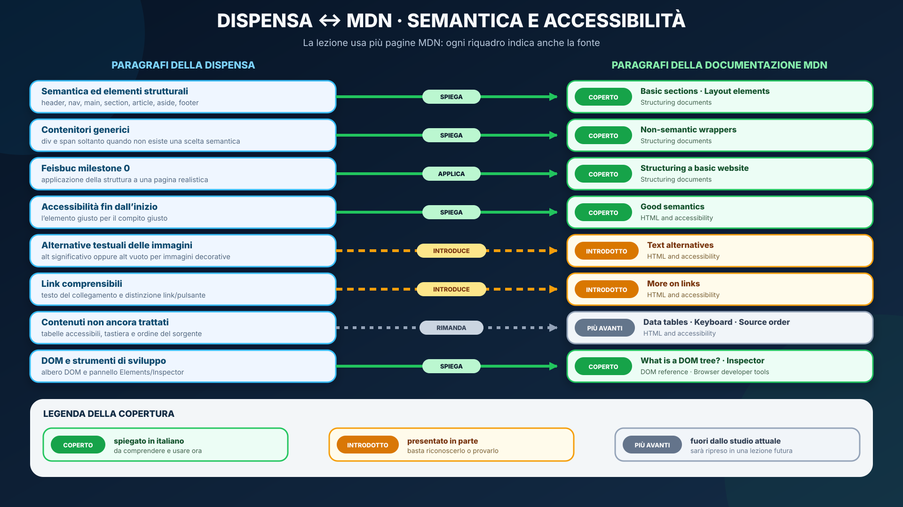
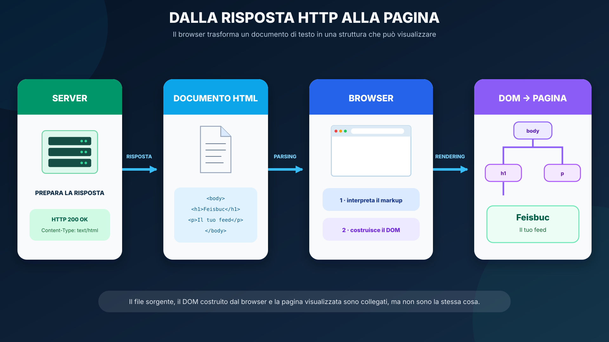
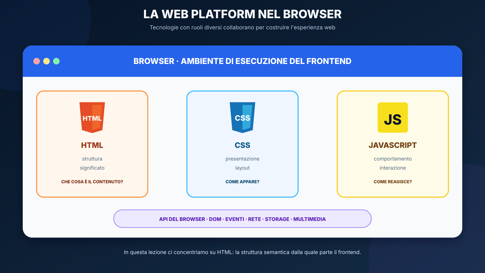
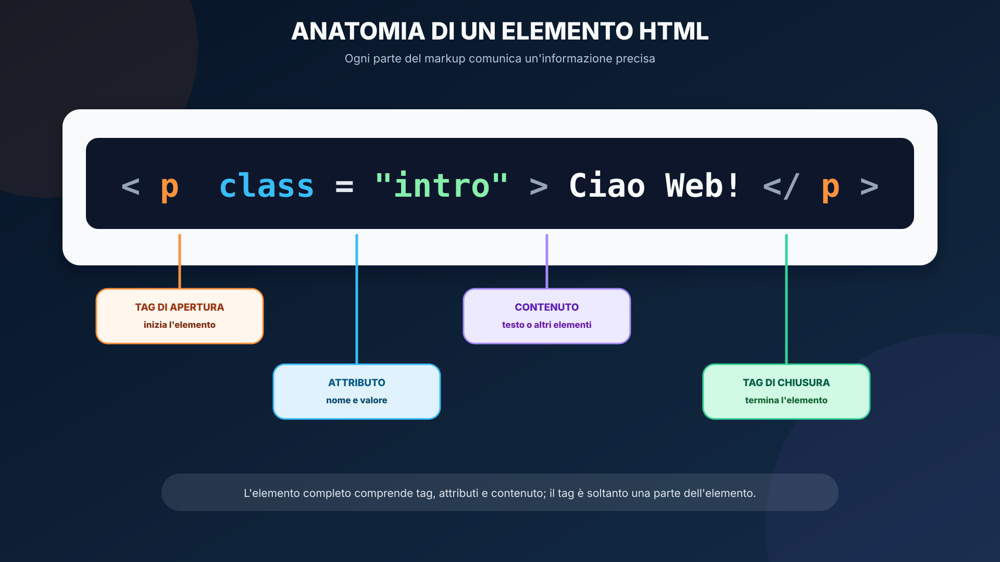
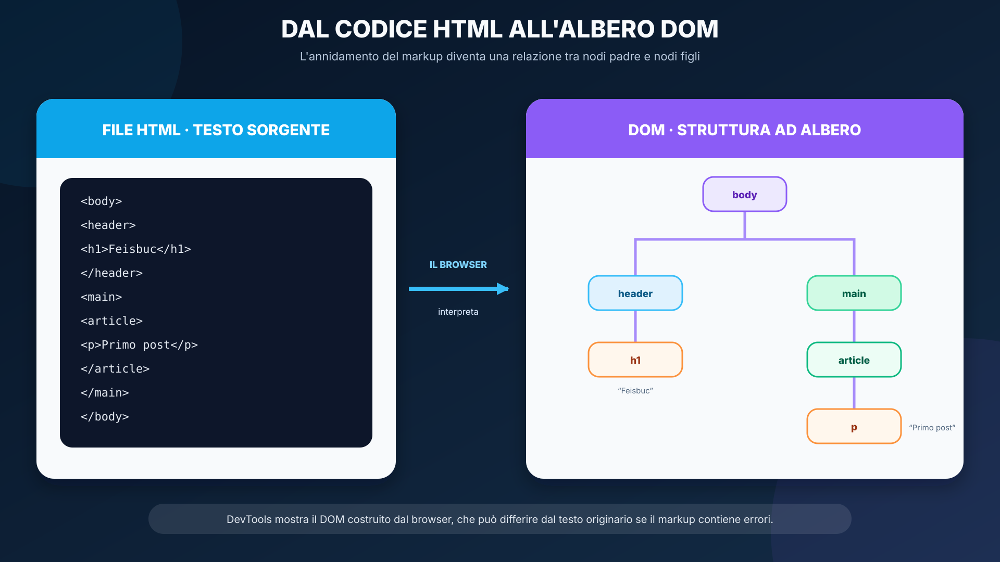

<a id="lesson-start"></a>
# Web Platform e HTML moderno

<a id="lesson-objectives"></a>
## In questa unità impareremo

<table align="center">
<tr><td>
<details>
<summary>&#129517; <strong>Orientamento della sezione</strong></summary>

<p align="justify"><strong><span style="font-size: 1.15em;">&#128506;</span> Contesto:</strong>
Nella lezione precedente abbiamo osservato l'intera applicazione full stack: browser, protocolli, backend e database. Ora rimaniamo nel frontend e studiamo il primo documento che il server può inviare al browser: il documento HTML.</p>

<p align="justify"><strong><span style="font-size: 1.15em;">&#10067;</span> Domande guida:</strong>
Che cosa riceve il browser prima di mostrare una pagina? Come riconosce un titolo, una navigazione o il contenuto principale? Qual è la differenza tra il file HTML, il DOM e ciò che vediamo sullo schermo?</p>

<p align="justify"><strong><span style="font-size: 1.15em;">&#127919;</span> Obiettivi:</strong>
Al termine lo studente dovrà saper:</p>
<ul>
  <li>spiegare il ruolo di HTML nella Web Platform;</li>
  <li>distinguere struttura, significato, presentazione e comportamento;</li>
  <li>riconoscere elemento, tag, contenuto e attributi;</li>
  <li>scrivere attributi normali e booleani usando correttamente le virgolette;</li>
  <li>riconoscere spazi bianchi, riferimenti a caratteri e commenti HTML;</li>
  <li>scrivere lo scheletro di un documento HTML moderno;</li>
  <li>usare consapevolmente <code>lang</code>, <code>meta charset</code>, viewport e <code>title</code>;</li>
  <li>collegare favicon, fogli di stile e script al documento;</li>
  <li>scegliere elementi semantici invece di usare <code>div</code> come contenitore universale;</li>
  <li>distinguere file sorgente, DOM e pagina visualizzata;</li>
  <li>ispezionare il DOM con gli strumenti di sviluppo del browser;</li>
  <li>costruire il primo scheletro semantico del progetto Feisbuc.</li>
</ul>

<p align="justify"><strong><span style="font-size: 1.15em;">&#10145;</span> Prossimo passo:</strong>
Dopo aver dato struttura e significato ai contenuti, useremo CSS per controllarne presentazione, layout e adattamento alle diverse dimensioni dello schermo.</p>

</details>
</td></tr>
</table>

<a id="lesson-mdn-maps"></a>
## Orientamento nella documentazione MDN

<p align="justify">La dispensa costruisce un percorso guidato in italiano, mentre MDN rimane la documentazione tecnica da imparare a consultare. Le mappe seguenti mettono a sinistra i paragrafi della lezione e a destra le parti corrispondenti di MDN: le frecce mostrano il raccordo e i colori indicano fino a quale profondità è richiesto lo studio.</p>

<table align="center"><tr><td>
<p align="justify"><strong><span style="font-size: 1.15em;">&#128506;</span> Come leggere i colori:</strong>
<strong>coperto</strong> significa che l'argomento è spiegato in italiano e deve essere compreso ora;
<strong>introdotto</strong> indica una prima presentazione da riconoscere o sperimentare;
<strong>più avanti</strong> segnala una parte della pagina MDN che verrà studiata in una lezione futura. Ogni stato è scritto anche dentro i riquadri: il colore non è l'unico segnale.</p>
</td></tr></table>

<a id="lesson-mdn-map-basic"></a>
<table align="center"><tr><td>
<details>
<summary>&#128506;&#65039; <strong>Mappa 1 — Sintassi HTML di base</strong></summary>

<p align="justify">La prima mappa segue l'indice del tutorial <a href="https://developer.mozilla.org/en-US/docs/Learn_web_development/Core/Structuring_content/Basic_HTML_syntax">MDN — Basic HTML syntax</a> e collega definizioni, sintassi, documento minimo ed esercizi alle parti della dispensa.</p>

<p align="center">
  
</p>

</details>
</td></tr></table>

<a id="lesson-mdn-map-metadata"></a>
<table align="center"><tr><td>
<details>
<summary>&#128506;&#65039; <strong>Mappa 2 — Metadati della pagina</strong></summary>

<p align="justify">La seconda mappa mostra la copertura del tutorial <a href="https://developer.mozilla.org/en-US/docs/Learn_web_development/Core/Structuring_content/Webpage_metadata">MDN — What's in the head? Web page metadata</a>. Le basi di <code>head</code>, titolo, metadati, favicon, CSS, JavaScript e lingua sono spiegate; alcune varianti vengono soltanto presentate.</p>

<p align="center">
  
</p>

</details>
</td></tr></table>

<a id="lesson-mdn-map-semantics"></a>
<table align="center"><tr><td>
<details>
<summary>&#128506;&#65039; <strong>Mappa 3 — Semantica, accessibilità e strumenti</strong></summary>

<p align="justify">L'ultima mappa unisce i riferimenti MDN usati per la struttura semantica, l'accessibilità, il DOM e gli strumenti di sviluppo. In questo caso è particolarmente importante distinguere ciò che viene spiegato completamente da ciò che viene soltanto introdotto.</p>

<p align="center">
  
</p>

</details>
</td></tr></table>

<a id="lesson-mdn-cross-index"></a>
<table align="center"><tr><td>
<details>
<summary>&#128279; <strong>Indice incrociato navigabile — Dispensa ↔ MDN</strong></summary>

<p align="justify">La tabella traduce le mappe in un indice utilizzabile durante lo studio. Ogni testo è un collegamento: nella colonna sinistra porta al punto esatto della dispensa, in quella destra apre il paragrafo o la scheda MDN corrispondente. Una cella vuota indica volutamente che, a questo livello dell'indice, non esiste una corrispondenza diretta.</p>

<table align="center">
<thead>
<tr>
  <th>Indice dei contenuti della dispensa</th>
  <th>Indice dei contenuti MDN corrispondenti</th>
</tr>
</thead>
<tbody>
<tr>
  <td><a href="#lesson-objectives"><strong>In questa unità impareremo</strong><br>Contesto, domande guida, obiettivi e collegamento con la lezione CSS.</a></td>
  <td></td>
</tr>
<tr>
  <td><a href="#lesson-mdn-map-basic"><strong>Mappa 1 — Sintassi HTML di base</strong><br>Copertura visuale di definizioni, sintassi, documento ed esercizi.</a></td>
  <td><a href="https://developer.mozilla.org/en-US/docs/Learn_web_development/Core/Structuring_content/Basic_HTML_syntax"><strong>Basic HTML syntax</strong><br>Indice completo del tutorial MDN sulla sintassi HTML.</a></td>
</tr>
<tr>
  <td><a href="#lesson-mdn-map-metadata"><strong>Mappa 2 — Metadati della pagina</strong><br>Copertura visuale dei contenuti inseriti in <code>head</code>.</a></td>
  <td><a href="https://developer.mozilla.org/en-US/docs/Learn_web_development/Core/Structuring_content/Webpage_metadata"><strong>What's in the head? Web page metadata</strong><br>Indice completo del tutorial MDN sui metadati.</a></td>
</tr>
<tr>
  <td><a href="#lesson-mdn-map-semantics"><strong>Mappa 3 — Semantica, accessibilità e strumenti</strong><br>Copertura visuale delle diverse pagine MDN impiegate.</a></td>
  <td><a href="https://developer.mozilla.org/en-US/docs/Learn_web_development/Core/Structuring_content/Structuring_documents"><strong>Structuring documents</strong></a><br><a href="https://developer.mozilla.org/en-US/docs/Learn_web_development/Core/Accessibility/HTML"><strong>HTML: A good basis for accessibility</strong></a><br><a href="https://developer.mozilla.org/en-US/docs/Web/API/Document_Object_Model"><strong>Document Object Model</strong></a></td>
</tr>
<tr>
  <td><a href="#lesson-server-to-page"><strong>Dal server alla pagina visualizzata</strong><br>Risposta HTTP, documento HTML, DOM e rendering nel browser.</a></td>
  <td><a href="https://developer.mozilla.org/en-US/docs/Learn_web_development/Getting_started/Web_standards/How_the_web_works#clients_and_servers"><strong>How the web works — Clients and servers</strong></a><br><a href="https://developer.mozilla.org/en-US/docs/Learn_web_development/Getting_started/Web_standards/How_the_web_works#so_what_happens_exactly"><strong>So what happens, exactly?</strong></a></td>
</tr>
<tr>
  <td><a href="#lesson-web-platform"><strong>Che cos'è la Web Platform</strong><br>Ruoli di HTML, CSS, JavaScript e API del browser; documenti <code>.html</code> e <code>index.html</code>.</a></td>
  <td><a href="https://developer.mozilla.org/en-US/docs/Learn_web_development/Core/Structuring_content/Basic_HTML_syntax#what_is_html"><strong>Basic HTML syntax — What is HTML?</strong><br>Definizione di HTML, documenti e convenzione dei tag minuscoli.</a></td>
</tr>
<tr>
  <td><a href="#lesson-html-living-standard"><strong>HTML5 o HTML Living Standard?</strong><br>Differenza tra il nome storico e lo standard mantenuto nel tempo.</a></td>
  <td><a href="https://developer.mozilla.org/en-US/docs/Glossary/HTML5"><strong>Glossary — HTML5</strong><br>Uso storico e significati del termine HTML5.</a></td>
</tr>
<tr>
  <td><a href="#lesson-element-anatomy"><strong>Anatomia di un elemento HTML</strong><br>Tag di apertura, contenuto, chiusura, attributi ed elemento completo.</a></td>
  <td><a href="https://developer.mozilla.org/en-US/docs/Learn_web_development/Core/Structuring_content/Basic_HTML_syntax#anatomy_of_an_html_element"><strong>Anatomy of an HTML element</strong><br>Parti che compongono un elemento HTML.</a></td>
</tr>
<tr>
  <td><a href="#lesson-void-elements"><strong>Elementi vuoti</strong><br><code>meta</code>, <code>img</code>, <code>br</code> e barra finale facoltativa.</a></td>
  <td><a href="https://developer.mozilla.org/en-US/docs/Learn_web_development/Core/Structuring_content/Basic_HTML_syntax#void_elements"><strong>Void elements</strong><br>Elementi che non possono contenere altro HTML.</a></td>
</tr>
<tr>
  <td><a href="#lesson-nesting"><strong>Annidamento</strong><br>Ordine corretto di apertura e chiusura degli elementi.</a></td>
  <td><a href="https://developer.mozilla.org/en-US/docs/Learn_web_development/Core/Structuring_content/Basic_HTML_syntax#nesting_elements"><strong>Nesting elements</strong><br>Annidamento corretto ed elementi sovrapposti per errore.</a></td>
</tr>
<tr>
  <td><a href="#lesson-attributes"><strong>Attributi: informazioni aggiuntive</strong><br>Posizione, nome, valore, attributi globali e specifici.</a></td>
  <td><a href="https://developer.mozilla.org/en-US/docs/Learn_web_development/Core/Structuring_content/Basic_HTML_syntax#attributes"><strong>Attributes</strong><br>Sintassi e funzione delle informazioni aggiunte agli elementi.</a></td>
</tr>
<tr>
  <td><a href="#lesson-boolean-attributes"><strong>Attributi booleani</strong><br>Presenza, assenza e caso dell'attributo <code>disabled</code>.</a></td>
  <td><a href="https://developer.mozilla.org/en-US/docs/Learn_web_development/Core/Structuring_content/Basic_HTML_syntax#boolean_attributes"><strong>Boolean attributes</strong><br>Perché la presenza dell'attributo rappresenta il valore vero.</a></td>
</tr>
<tr>
  <td><a href="#lesson-attribute-quotes"><strong>Virgolette nei valori</strong><br>Errori evitati dalle virgolette e convenzione delle virgolette doppie.</a></td>
  <td><a href="https://developer.mozilla.org/en-US/docs/Learn_web_development/Core/Structuring_content/Basic_HTML_syntax#omitting_quotes_around_attribute_values"><strong>Omitting quotes around attribute values</strong></a><br><a href="https://developer.mozilla.org/en-US/docs/Learn_web_development/Core/Structuring_content/Basic_HTML_syntax#single_or_double_quotes"><strong>Single or double quotes?</strong></a></td>
</tr>
<tr>
  <td><a href="#lesson-whitespace"><strong>Spazi bianchi e indentazione</strong><br>Normalizzazione degli spazi e indentazione a due spazi.</a></td>
  <td><a href="https://developer.mozilla.org/en-US/docs/Learn_web_development/Core/Structuring_content/Basic_HTML_syntax#whitespace_in_html"><strong>Whitespace in HTML</strong><br>Come il parser tratta gli spazi e come formattare il sorgente.</a></td>
</tr>
<tr>
  <td><a href="#lesson-character-references"><strong>Riferimenti ai caratteri speciali</strong><br><code>&amp;lt;</code>, <code>&amp;gt;</code>, <code>&amp;quot;</code>, <code>&amp;apos;</code> e <code>&amp;amp;</code>.</a></td>
  <td><a href="https://developer.mozilla.org/en-US/docs/Learn_web_development/Core/Structuring_content/Basic_HTML_syntax#character_references_including_special_characters_in_html"><strong>Character references</strong><br>Rappresentare nel contenuto i caratteri riservati dalla sintassi.</a></td>
</tr>
<tr>
  <td><a href="#lesson-comments"><strong>Commenti HTML</strong><br>Sintassi, utilità e limiti dei commenti nel sorgente.</a></td>
  <td><a href="https://developer.mozilla.org/en-US/docs/Learn_web_development/Core/Structuring_content/Basic_HTML_syntax#html_comments"><strong>HTML comments</strong><br>Testo presente nel sorgente ma non visualizzato nella pagina.</a></td>
</tr>
<tr>
  <td><a href="#lesson-document-skeleton"><strong>Lo scheletro moderno di una pagina</strong><br>Struttura completa minima di un documento HTML.</a></td>
  <td><a href="https://developer.mozilla.org/en-US/docs/Learn_web_development/Core/Structuring_content/Basic_HTML_syntax#anatomy_of_an_html_document"><strong>Anatomy of an HTML document</strong><br>Combinazione degli elementi in una pagina completa.</a></td>
</tr>
<tr>
  <td><a href="#lesson-doctype"><strong><code>&lt;!doctype html&gt;</code></strong><br>Modalità standard e significato storico del doctype.</a></td>
  <td><a href="https://developer.mozilla.org/en-US/docs/Learn_web_development/Core/Structuring_content/Basic_HTML_syntax#anatomy_of_an_html_document"><strong>Anatomy of an HTML document — punto 1</strong><br>Forma moderna e origine del doctype.</a></td>
</tr>
<tr>
  <td><a href="#lesson-html-lang"><strong><code>&lt;html lang="it"&gt;</code></strong><br>Elemento radice e lingua principale o locale del contenuto.</a></td>
  <td><a href="https://developer.mozilla.org/en-US/docs/Learn_web_development/Core/Structuring_content/Webpage_metadata#setting_the_primary_language_of_the_document"><strong>Setting the primary language of the document</strong><br>Lingua del documento e cambi di lingua interni.</a></td>
</tr>
<tr>
  <td><a href="#lesson-head"><strong><code>&lt;head&gt;</code></strong><br>Contenitore delle informazioni sul documento non mostrate nel corpo.</a></td>
  <td><a href="https://developer.mozilla.org/en-US/docs/Learn_web_development/Core/Structuring_content/Webpage_metadata#what_is_the_html_head"><strong>What is the HTML head?</strong><br>Differenza tra metadati in <code>head</code> e contenuto in <code>body</code>.</a></td>
</tr>
<tr>
  <td><a href="#lesson-meta-charset"><strong><code>&lt;meta charset="utf-8"&gt;</code></strong><br>Codifica del documento e corretta rappresentazione dei caratteri.</a></td>
  <td><a href="https://developer.mozilla.org/en-US/docs/Learn_web_development/Core/Structuring_content/Webpage_metadata#specifying_your_documents_character_encoding"><strong>Specifying your document's character encoding</strong><br>Perché impostare UTF-8.</a></td>
</tr>
<tr>
  <td><a href="#lesson-viewport"><strong>Viewport</strong><br><code>width=device-width</code>, <code>initial-scale</code> e comportamento mobile.</a></td>
  <td><a href="https://developer.mozilla.org/en-US/docs/Web/HTML/Reference/Elements/meta/name/viewport"><strong><code>meta name="viewport"</code></strong><br>Riferimento alle direttive della viewport.</a></td>
</tr>
<tr>
  <td><a href="#lesson-title"><strong><code>&lt;title&gt;</code></strong><br>Titolo del documento, scheda del browser, preferiti e differenza da <code>h1</code>.</a></td>
  <td><a href="https://developer.mozilla.org/en-US/docs/Learn_web_development/Core/Structuring_content/Webpage_metadata#adding_a_title"><strong>Adding a title</strong><br>Ruoli differenti di <code>title</code> e <code>h1</code>.</a></td>
</tr>
<tr>
  <td><a href="#lesson-body"><strong><code>&lt;body&gt;</code></strong><br>Contenitore di tutto ciò che forma il contenuto della pagina.</a></td>
  <td><a href="https://developer.mozilla.org/en-US/docs/Learn_web_development/Core/Structuring_content/Basic_HTML_syntax#anatomy_of_an_html_document"><strong>Anatomy of an HTML document — punto 6</strong><br>Ruolo del corpo del documento.</a></td>
</tr>
<tr>
  <td><a href="#lesson-meta-name-content"><strong>Metadati con <code>name</code> e <code>content</code></strong><br>Autore, descrizione e metadato <code>keywords</code> ormai superato.</a></td>
  <td><a href="https://developer.mozilla.org/en-US/docs/Learn_web_development/Core/Structuring_content/Webpage_metadata#adding_an_author_and_description"><strong>Adding an author and description</strong><br>Metadati descrittivi e possibili usi della descrizione.</a></td>
</tr>
<tr>
  <td><a href="#lesson-open-graph"><strong>Altri metadati: riconoscere Open Graph</strong><br>Proprietà sociali presentate senza richiederne la memorizzazione.</a></td>
  <td><a href="https://developer.mozilla.org/en-US/docs/Learn_web_development/Core/Structuring_content/Webpage_metadata#other_types_of_metadata"><strong>Other types of metadata</strong><br>Esempio di metadati proprietari e Open Graph Data.</a></td>
</tr>
<tr>
  <td><a href="#lesson-favicon"><strong>Collegare una favicon</strong><br><code>link</code> con <code>rel</code>, <code>href</code> e <code>type</code>.</a></td>
  <td><a href="https://developer.mozilla.org/en-US/docs/Learn_web_development/Core/Structuring_content/Webpage_metadata#adding_custom_icons_to_your_site"><strong>Adding custom icons to your site</strong><br>Favicon di base e varianti per dispositivi.</a></td>
</tr>
<tr>
  <td><a href="#lesson-css-javascript"><strong>Collegare CSS e JavaScript</strong><br>Foglio di stile, script esterno, <code>src</code> e <code>defer</code>.</a></td>
  <td><a href="https://developer.mozilla.org/en-US/docs/Learn_web_development/Core/Structuring_content/Webpage_metadata#applying_css_and_javascript_to_html"><strong>Applying CSS and JavaScript to HTML</strong><br>Collegare risorse esterne al documento.</a></td>
</tr>
<tr>
  <td><a href="#lesson-text-lists-links-images"><strong>Testo, liste, collegamenti e immagini</strong><br>Esempio combinato dei contenuti fondamentali inseriti in <code>body</code>.</a></td>
  <td><a href="https://developer.mozilla.org/en-US/docs/Learn_web_development/Core/Structuring_content/Basic_HTML_syntax#adding_some_features_to_an_html_document"><strong>Adding some features to an HTML document</strong><br>Esercizio con heading, testo, link e immagine.</a></td>
</tr>
<tr>
  <td><a href="#lesson-headings-paragraphs"><strong>Heading e paragrafi</strong><br>Gerarchia dei titoli, paragrafi, importanza ed enfasi.</a></td>
  <td><a href="https://developer.mozilla.org/en-US/docs/Web/HTML/Reference/Elements/Heading_Elements"><strong><code>&lt;h1&gt;–&lt;h6&gt;</code></strong></a><br><a href="https://developer.mozilla.org/en-US/docs/Web/HTML/Reference/Elements/p"><strong><code>&lt;p&gt;</code></strong></a><br><a href="https://developer.mozilla.org/en-US/docs/Web/HTML/Reference/Elements/strong"><strong><code>&lt;strong&gt;</code></strong></a> · <a href="https://developer.mozilla.org/en-US/docs/Web/HTML/Reference/Elements/em"><strong><code>&lt;em&gt;</code></strong></a></td>
</tr>
<tr>
  <td><a href="#lesson-lists"><strong>Liste</strong><br>Liste ordinate, non ordinate e relativi elementi.</a></td>
  <td><a href="https://developer.mozilla.org/en-US/docs/Web/HTML/Reference/Elements/ul"><strong><code>&lt;ul&gt;</code></strong></a> · <a href="https://developer.mozilla.org/en-US/docs/Web/HTML/Reference/Elements/ol"><strong><code>&lt;ol&gt;</code></strong></a> · <a href="https://developer.mozilla.org/en-US/docs/Web/HTML/Reference/Elements/li"><strong><code>&lt;li&gt;</code></strong></a><br><a href="https://developer.mozilla.org/en-US/docs/Web/HTML/Reference/Elements/ul">Schede MDN degli elementi di lista.</a></td>
</tr>
<tr>
  <td><a href="#lesson-links"><strong>Collegamenti</strong><br><code>href</code>, URL assoluti, percorsi relativi, frammenti e differenza tra link e pulsante.</a></td>
  <td><a href="https://developer.mozilla.org/en-US/docs/Web/HTML/Reference/Elements/a"><strong><code>&lt;a&gt;</code>: The Anchor element</strong><br>Destinazioni e attributi dei collegamenti.</a><br><a href="https://developer.mozilla.org/en-US/docs/Learn_web_development/Core/Accessibility/HTML#more_on_links"><strong>More on links</strong><br>Testi dei link comprensibili.</a></td>
</tr>
<tr>
  <td><a href="#lesson-images"><strong>Immagini</strong><br><code>src</code>, <code>alt</code>, <code>width</code>, <code>height</code> e primo richiamo a <code>loading</code>.</a></td>
  <td><a href="https://developer.mozilla.org/en-US/docs/Learn_web_development/Core/Structuring_content/Basic_HTML_syntax#adding_attributes_to_an_element"><strong>Adding attributes to an element</strong></a><br><a href="https://developer.mozilla.org/en-US/docs/Web/HTML/Reference/Elements/img"><strong><code>&lt;img&gt;</code>: The Image Embed element</strong></a><br><a href="https://developer.mozilla.org/en-US/docs/Learn_web_development/Core/Accessibility/HTML#text_alternatives"><strong>Text alternatives</strong></a></td>
</tr>
<tr>
  <td><a href="#lesson-semantics"><strong>Semantica: scegliere l'elemento per ciò che significa</strong><br>Dalla struttura visuale alla descrizione esplicita dei ruoli.</a></td>
  <td><a href="https://developer.mozilla.org/en-US/docs/Learn_web_development/Core/Structuring_content/Structuring_documents#basic_sections_of_a_document"><strong>Basic sections of a document</strong></a><br><a href="https://developer.mozilla.org/en-US/docs/Learn_web_development/Core/Structuring_content/Structuring_documents#html_layout_elements_in_more_detail"><strong>HTML layout elements in more detail</strong></a></td>
</tr>
<tr>
  <td><a href="#lesson-structural-elements"><strong>Elementi strutturali che useremo spesso</strong><br><code>header</code>, <code>nav</code>, <code>main</code>, <code>section</code>, <code>article</code>, <code>aside</code>, <code>footer</code>; uso consapevole di <code>div</code>.</a></td>
  <td><a href="https://developer.mozilla.org/en-US/docs/Learn_web_development/Core/Structuring_content/Structuring_documents#html_layout_elements_in_more_detail"><strong>HTML layout elements in more detail</strong></a><br><a href="https://developer.mozilla.org/en-US/docs/Learn_web_development/Core/Structuring_content/Structuring_documents#non-semantic_wrappers"><strong>Non-semantic wrappers</strong></a></td>
</tr>
<tr>
  <td><a href="#lesson-accessibility"><strong>Accessibilità: iniziamo subito</strong><br>Lingua, heading, semantica, alternative testuali, link, pulsanti ed etichette.</a></td>
  <td><a href="https://developer.mozilla.org/en-US/docs/Learn_web_development/Core/Accessibility/HTML#good_semantics"><strong>Good semantics</strong></a><br><a href="https://developer.mozilla.org/en-US/docs/Learn_web_development/Core/Accessibility/HTML#use_semantic_ui_controls_where_possible"><strong>Use semantic UI controls where possible</strong></a><br><a href="https://developer.mozilla.org/en-US/docs/Learn_web_development/Core/Accessibility/HTML#text_alternatives"><strong>Text alternatives</strong></a> · <a href="https://developer.mozilla.org/en-US/docs/Learn_web_development/Core/Accessibility/HTML#more_on_links"><strong>More on links</strong></a></td>
</tr>
<tr>
  <td><a href="#lesson-dom-devtools"><strong>Il DOM e gli strumenti di sviluppo</strong><br>Albero DOM, pannello Elements/Inspector, modifiche temporanee e validazione.</a></td>
  <td><a href="https://developer.mozilla.org/en-US/docs/Web/API/Document_Object_Model#what_is_a_dom_tree"><strong>What is a DOM tree?</strong></a><br><a href="https://developer.mozilla.org/en-US/docs/Learn_web_development/Howto/Tools_and_setup/What_are_browser_developer_tools#the_inspector_dom_explorer_and_css_editor"><strong>The Inspector: DOM explorer and CSS editor</strong></a></td>
</tr>
<tr>
  <td><a href="#lesson-feisbuc-m0"><strong>Esempio realistico: Feisbuc milestone 0</strong><br>Applicazione di una struttura semantica a una singola pagina.</a></td>
  <td><a href="https://developer.mozilla.org/en-US/docs/Learn_web_development/Core/Structuring_content/Structuring_documents#html_for_structuring_content"><strong>HTML for structuring content</strong><br>Tradurre le parti visuali di una pagina in elementi HTML.</a></td>
</tr>
<tr>
  <td></td>
  <td><a href="https://developer.mozilla.org/en-US/docs/Learn_web_development/Core/Structuring_content/Structuring_documents#structuring_a_basic_website"><strong>Structuring a basic website</strong><br>Architettura dell'informazione e organizzazione di un sito multipagina: verrà affrontata più avanti.</a></td>
</tr>
<tr>
  <td></td>
  <td><a href="https://developer.mozilla.org/en-US/docs/Learn_web_development/Core/Accessibility/HTML#accessible_data_tables"><strong>Accessible data tables</strong><br>Intestazioni e struttura accessibile delle tabelle: verrà affrontato più avanti.</a></td>
</tr>
<tr>
  <td></td>
  <td><a href="https://developer.mozilla.org/en-US/docs/Learn_web_development/Core/Accessibility/HTML#figures_and_figure_captions"><strong>Figures and figure captions</strong><br><code>figure</code> e <code>figcaption</code>: verranno affrontati più avanti.</a></td>
</tr>
<tr>
  <td></td>
  <td><a href="https://developer.mozilla.org/en-US/docs/Learn_web_development/Core/Accessibility/HTML#building_keyboard_accessibility_back_in"><strong>Building keyboard accessibility back in</strong><br><code>tabindex</code>, focus e comportamento da tastiera: verranno affrontati più avanti.</a></td>
</tr>
<tr>
  <td><a href="#lesson-common-errors"><strong>Errori frequenti</strong><br>Dieci controlli sugli sbagli più comuni della lezione.</a></td>
  <td></td>
</tr>
<tr>
  <td><a href="#lesson-lab"><strong>Laboratorio</strong><br>Anatomia del documento e trasformazione semantica di Feisbuc.</a></td>
  <td><a href="https://developer.mozilla.org/en-US/docs/Learn_web_development/Core/Structuring_content/Basic_HTML_syntax#creating_your_first_html_element"><strong>Creating your first HTML element</strong></a><br><a href="https://developer.mozilla.org/en-US/docs/Learn_web_development/Core/Structuring_content/Basic_HTML_syntax#adding_attributes_to_an_element"><strong>Adding attributes to an element</strong></a></td>
</tr>
<tr>
  <td><a href="#lesson-checkpoint"><strong>Verifica rapida</strong><br>Quindici domande per controllare la comprensione.</a></td>
  <td></td>
</tr>
<tr>
  <td><a href="#lesson-summary"><strong>Sintesi</strong><br>Concetti essenziali della lezione e passaggio al modulo CSS.</a></td>
  <td><a href="https://developer.mozilla.org/en-US/docs/Learn_web_development/Core/Structuring_content/Basic_HTML_syntax#summary"><strong>Basic HTML syntax — Summary</strong></a><br><a href="https://developer.mozilla.org/en-US/docs/Learn_web_development/Core/Structuring_content/Webpage_metadata#summary"><strong>Web page metadata — Summary</strong></a><br><a href="https://developer.mozilla.org/en-US/docs/Learn_web_development/Core/Structuring_content/Structuring_documents#summary"><strong>Structuring documents — Summary</strong></a></td>
</tr>
<tr>
  <td><a href="#lesson-reading-mdn"><strong>Imparare a leggere MDN</strong><br>Metodo di consultazione e tabella degli elementi da studiare ora o riconoscere.</a></td>
  <td><a href="https://developer.mozilla.org/en-US/docs/Web/HTML/Reference/Elements"><strong>HTML elements reference</strong><br>Indice delle schede tecniche dei singoli elementi.</a></td>
</tr>
<tr>
  <td><a href="#lesson-sources"><strong>Fonti e documentazione</strong><br>Raccolta finale delle fonti MDN, WHATWG e del validatore.</a></td>
  <td></td>
</tr>
</tbody>
</table>

</details>
</td></tr></table>

<p align="justify">Le mappe sono un orientamento, non una percentuale di importanza: una parte indicata come “più avanti” può essere fondamentale, ma non appartiene ancora agli obiettivi di questa lezione. I collegamenti puntuali accanto ai singoli paragrafi restano il modo più rapido per aprire il punto esatto di MDN.</p>

<a id="lesson-server-to-page"></a>
## Dal server alla pagina visualizzata

<p align="justify">Nella lezione 00 abbiamo visto che il browser svolge il ruolo di client. Quando richiede una pagina, il server può rispondere tramite HTTP inviando un documento HTML. All'inizio quel documento non è ancora la pagina grafica che vediamo sullo schermo: è una sequenza di caratteri che descrive i contenuti e le relazioni tra essi.</p>

<p align="justify">Il browser interpreta il markup HTML, costruisce una rappresentazione ad albero chiamata <strong>DOM</strong> e usa questa struttura per produrre la pagina visualizzata. Più avanti CSS contribuirà alla presentazione e JavaScript potrà leggere o modificare il DOM.</p>

<p align="center">
  
</p>

<table align="center"><tr><td>
<p align="justify"><strong><span style="font-size: 1.15em;">&#128161;</span> Idea chiave:</strong>
il file HTML, il DOM costruito dal browser e la pagina visualizzata sono tre rappresentazioni collegate, ma non sono la stessa cosa.</p>
</td></tr></table>

<p align="justify"><strong><span style="font-size: 1.15em;">&#128279;</span> Riferimenti MDN:</strong>
<a href="https://developer.mozilla.org/en-US/docs/Learn_web_development/Getting_started/Web_standards/How_the_web_works#clients_and_servers">How the web works — Clients and servers</a> e
<a href="https://developer.mozilla.org/en-US/docs/Learn_web_development/Getting_started/Web_standards/How_the_web_works#so_what_happens_exactly">So what happens, exactly?</a>. Collega la richiesta del browser, la risposta del server e i file che formano una pagina.</p>

<a id="lesson-web-platform"></a>
## Che cos'è la Web Platform

<p align="justify">La <strong>Web Platform</strong> è l'insieme delle tecnologie standard che i browser comprendono e mettono a disposizione per costruire applicazioni web. Nel frontend incontreremo soprattutto HTML, CSS, JavaScript e le API fornite dal browser.</p>

<p align="justify">Queste tecnologie collaborano, ma hanno responsabilità differenti:</p>
<ul>
  <li><strong>HTML</strong> descrive la struttura e il significato del contenuto;</li>
  <li><strong>CSS</strong> descrive la presentazione e il layout;</li>
  <li><strong>JavaScript</strong> aggiunge comportamento e interazione;</li>
  <li>le <strong>API del browser</strong> offrono al codice funzionalità come DOM, eventi, rete, storage e multimedia.</li>
</ul>

<p align="center">
  
</p>

<table align="center"><tr><td>
<p align="justify"><strong><span style="font-size: 1.15em;">&#128214;</span> Definizione — HTML:</strong>
HTML significa <em>HyperText Markup Language</em>. È un <strong>linguaggio di markup</strong>: usa marcatori per descrivere la struttura e il significato dei contenuti. Non è un linguaggio di programmazione, perché non descrive algoritmi o procedure da eseguire.</p>
</td></tr></table>

<p align="justify">Il codice HTML vive in documenti di testo con estensione <code>.html</code>. Il nome <code>index.html</code> viene usato comunemente per il documento iniziale di un sito o di una cartella. I nomi dei tag non distinguono maiuscole e minuscole, ma nel corso li scriveremo sempre in minuscolo per coerenza e leggibilità.</p>

<p align="justify">La prima regola di questa parte del corso sarà quindi: prima costruiamo una struttura con un significato, poi decidiamo come appare e come si comporta.</p>

<p align="justify"><strong><span style="font-size: 1.15em;">&#128279;</span> Riferimento MDN:</strong>
<a href="https://developer.mozilla.org/en-US/docs/Learn_web_development/Core/Structuring_content/Basic_HTML_syntax#what_is_html">Basic HTML syntax — What is HTML?</a>. Studia la definizione di HTML, il concetto di documento con estensione <code>.html</code> e la convenzione di scrivere i tag in minuscolo.</p>

<a id="lesson-html-living-standard"></a>
### HTML5 o HTML Living Standard?

<p align="justify">Nel linguaggio comune si usa ancora spesso il nome “HTML5” per indicare l'HTML moderno. La specifica viene però mantenuta e aggiornata dal WHATWG come <strong>HTML Living Standard</strong>. Per scrivere le nostre pagine non cambia la sintassi di base: questa distinzione ci ricorda semplicemente che lo standard continua a evolvere.</p>

<p align="justify">Riferimento ufficiale: <a href="https://html.spec.whatwg.org/">WHATWG — HTML Living Standard</a>.</p>

<p align="justify"><strong><span style="font-size: 1.15em;">&#128279;</span> Approfondimento MDN:</strong>
<a href="https://developer.mozilla.org/en-US/docs/Glossary/HTML5">Glossary — HTML5</a>. Usa questa pagina per distinguere il nome storico “HTML5” dalla piattaforma web moderna composta da più tecnologie.</p>

<a id="lesson-element-anatomy"></a>
## Anatomia di un elemento HTML

```html
<p class="intro">Ciao Web!</p>
```

<p align="justify">Possiamo leggere questo frammento come una piccola frase strutturata:</p>
<ul>
  <li><code>p</code> è il nome del tipo di elemento;</li>
  <li><code>&lt;p class="intro"&gt;</code> è il tag di apertura;</li>
  <li><code>class="intro"</code> è un attributo formato da nome e valore;</li>
  <li><code>Ciao Web!</code> è il contenuto;</li>
  <li><code>&lt;/p&gt;</code> è il tag di chiusura;</li>
  <li>l'intera espressione è un elemento HTML.</li>
</ul>

<p align="center">
  
</p>

<table align="center"><tr><td>
<p align="justify"><strong><span style="font-size: 1.15em;">&#9888;</span> Attenzione — tag ed elemento:</strong>
un tag è una parte della sintassi, per esempio <code>&lt;p&gt;</code>. L'elemento comprende invece il tag di apertura, gli eventuali attributi, il contenuto e il tag di chiusura.</p>
</td></tr></table>

<p align="justify"><strong>Elemento usato nell'esempio:</strong>
<a href="https://developer.mozilla.org/en-US/docs/Web/HTML/Reference/Elements/p"><code>&lt;p&gt;</code> — paragrafo</a>. Non possiede attributi specifici indispensabili: può usare gli attributi globali comuni agli elementi HTML.</p>

<p align="justify"><strong><span style="font-size: 1.15em;">&#128279;</span> Riferimento MDN:</strong>
<a href="https://developer.mozilla.org/en-US/docs/Learn_web_development/Core/Structuring_content/Basic_HTML_syntax#anatomy_of_an_html_element">Basic HTML syntax — Anatomy of an HTML element</a>. Studia tag di apertura, contenuto, tag di chiusura e differenza tra tag ed elemento.</p>

<a id="lesson-void-elements"></a>
### Elementi vuoti

<p align="justify">Non tutti gli elementi racchiudono un contenuto. Alcuni sono detti <em>void elements</em>, cioè elementi vuoti, e non hanno un tag di chiusura. Esempi comuni sono <code>meta</code>, <code>img</code> e <code>br</code>. Negli elementi vuoti puoi incontrare una barra finale, per esempio <code>&lt;br /&gt;</code>: in HTML è ammessa, ma non è necessaria e non rappresenta un vero tag di chiusura.</p>

```html
<meta charset="utf-8">

<p>Prima riga<br>Seconda riga</p>
```

<p align="justify"><strong>Schede degli elementi:</strong>
<a href="https://developer.mozilla.org/en-US/docs/Web/HTML/Reference/Elements/meta"><code>&lt;meta&gt;</code></a>,
<a href="https://developer.mozilla.org/en-US/docs/Web/HTML/Reference/Elements/img"><code>&lt;img&gt;</code></a> e
<a href="https://developer.mozilla.org/en-US/docs/Web/HTML/Reference/Elements/br"><code>&lt;br&gt;</code></a>. <code>br</code> introduce un'interruzione di riga motivata dal contenuto, per esempio in un indirizzo o in una poesia; non deve essere usato per creare spazio grafico tra blocchi.</p>

<p align="justify"><strong><span style="font-size: 1.15em;">&#128279;</span> Riferimento MDN:</strong>
<a href="https://developer.mozilla.org/en-US/docs/Learn_web_development/Core/Structuring_content/Basic_HTML_syntax#void_elements">Basic HTML syntax — Void elements</a>. Studia che cosa distingue un elemento vuoto dagli elementi con contenuto e perché la barra finale è facoltativa.</p>

<a id="lesson-nesting"></a>
### Annidamento

<p align="justify">Gli elementi possono contenere altri elementi. Questa relazione si chiama <strong>annidamento</strong>. Le aperture e le chiusure devono essere coerenti: se apriamo un elemento dentro un altro, chiudiamo prima quello più interno.</p>

```html
<p>Sto studiando <strong>HTML</strong>.</p>
```

<p align="justify">Possiamo pensarli come scatole: <code>strong</code> è contenuto dentro <code>p</code>, quindi viene chiuso prima di <code>p</code>.</p>

<p align="justify"><strong>Elementi usati nell'esempio:</strong>
<a href="https://developer.mozilla.org/en-US/docs/Web/HTML/Reference/Elements/p"><code>&lt;p&gt;</code> — paragrafo</a> e
<a href="https://developer.mozilla.org/en-US/docs/Web/HTML/Reference/Elements/strong"><code>&lt;strong&gt;</code> — forte importanza</a>. <code>strong</code> comunica importanza semantica; non va scelto soltanto per ottenere il grassetto.</p>

<p align="justify"><strong><span style="font-size: 1.15em;">&#128279;</span> Riferimento MDN:</strong>
<a href="https://developer.mozilla.org/en-US/docs/Learn_web_development/Core/Structuring_content/Basic_HTML_syntax#nesting_elements">Basic HTML syntax — Nesting elements</a>. Confronta l'esempio corretto con quello in cui gli elementi si sovrappongono.</p>

<a id="lesson-attributes"></a>
## Attributi: informazioni aggiuntive

<p align="justify">Un attributo aggiunge a un elemento un'informazione che non fa parte del contenuto visibile. Si scrive nel tag di apertura, dopo il nome dell'elemento. Più attributi sono separati da spazi.</p>

```html
<p class="introduzione" lang="it">Benvenuti nel corso.</p>
```

<p align="justify">Nell'esempio <code>class</code> e <code>lang</code> sono i nomi degli attributi; <code>introduzione</code> e <code>it</code> sono i rispettivi valori. Nel corso useremo questa forma:</p>

```text
nome-attributo="valore"
```

<p align="justify"><code>class</code>, <code>id</code>, <code>lang</code> e <code>title</code> sono esempi di <a href="https://developer.mozilla.org/en-US/docs/Web/HTML/Reference/Global_attributes">attributi globali</a>: possono essere applicati a molti elementi HTML. <code>class</code> associa uno o più nomi riutilizzabili, utili soprattutto per CSS e JavaScript; <code>id</code> assegna invece un identificatore che deve essere unico nel documento. Gli elementi possono inoltre possedere attributi specifici, come <code>href</code> per un link e <code>src</code> per un'immagine.</p>

<p align="justify"><strong><span style="font-size: 1.15em;">&#128279;</span> Riferimento MDN:</strong>
<a href="https://developer.mozilla.org/en-US/docs/Learn_web_development/Core/Structuring_content/Basic_HTML_syntax#attributes">Basic HTML syntax — Attributes</a>. Studia posizione, nome, segno di uguale e valore dell'attributo.</p>

<a id="lesson-boolean-attributes"></a>
### Attributi booleani

<p align="justify">Un attributo booleano rappresenta una condizione vera o falsa. Se l'attributo è presente, la condizione è vera; se è assente, è falsa. Per esempio <code>disabled</code> rende non utilizzabile un controllo di input.</p>

```html
<label for="nome">Nome</label>
<input id="nome" name="nome" disabled>
```

<p align="justify">Nel corso preferiremo la forma compatta <code>disabled</code>. Scrivere <code>disabled="false"</code> <strong>non</strong> riattiva il controllo: l'attributo è comunque presente e quindi la condizione resta vera. Gli elementi <code>label</code> e <code>input</code> verranno studiati nel modulo sui form; qui servono soltanto per riconoscere la sintassi di un attributo booleano.</p>

<p align="justify"><strong>Schede degli elementi:</strong>
<a href="https://developer.mozilla.org/en-US/docs/Web/HTML/Reference/Elements/label"><code>&lt;label&gt;</code></a> e
<a href="https://developer.mozilla.org/en-US/docs/Web/HTML/Reference/Elements/input"><code>&lt;input&gt;</code></a>. Per ora, nella scheda di <code>input</code>, osserva soltanto gli attributi <code>id</code>, <code>name</code> e <a href="https://developer.mozilla.org/en-US/docs/Web/HTML/Reference/Elements/input#disabled"><code>disabled</code></a>.</p>

<p align="justify"><strong><span style="font-size: 1.15em;">&#128279;</span> Riferimento MDN:</strong>
<a href="https://developer.mozilla.org/en-US/docs/Learn_web_development/Core/Structuring_content/Basic_HTML_syntax#boolean_attributes">Basic HTML syntax — Boolean attributes</a>. Studia la relazione tra presenza dell'attributo e valore booleano.</p>

<a id="lesson-attribute-quotes"></a>
### Virgolette nei valori

<p align="justify">In alcuni casi HTML consente di omettere le virgolette, ma basta uno spazio nel valore per cambiare il modo in cui il browser interpreta il markup. Per evitare errori e rendere il codice più leggibile, nel corso racchiuderemo sempre i valori tra virgolette doppie.</p>

```html
<!-- Corretto e leggibile -->
<a href="https://www.mozilla.org/" title="Pagina iniziale di Mozilla">
  Mozilla
</a>
```

<p align="justify">Le virgolette singole sono valide, ma non devono essere mescolate con quelle doppie che delimitano lo stesso valore.</p>

<p align="justify"><strong>Elemento usato nell'esempio:</strong>
<a href="https://developer.mozilla.org/en-US/docs/Web/HTML/Reference/Elements/a"><code>&lt;a&gt;</code> — collegamento ipertestuale</a>. L'attributo fondamentale è <code>href</code>, che indica la destinazione. <code>title</code> può fornire un'informazione supplementare, ma non deve contenere informazioni indispensabili disponibili soltanto al passaggio del mouse.</p>

<p align="justify"><strong><span style="font-size: 1.15em;">&#128279;</span> Riferimenti MDN:</strong>
<a href="https://developer.mozilla.org/en-US/docs/Learn_web_development/Core/Structuring_content/Basic_HTML_syntax#omitting_quotes_around_attribute_values">Omitting quotes around attribute values</a> e
<a href="https://developer.mozilla.org/en-US/docs/Learn_web_development/Core/Structuring_content/Basic_HTML_syntax#single_or_double_quotes">Single or double quotes?</a>.</p>

<a id="lesson-whitespace"></a>
### Spazi bianchi e indentazione

<p align="justify">Nel normale contenuto HTML, il browser riduce generalmente una sequenza di spazi, tab e ritorni a capo a un solo spazio visualizzato. Possiamo quindi usare ritorni a capo e indentazione per rendere leggibile il sorgente senza creare automaticamente nuovi spazi nella pagina.</p>

```html
<section>
  <h2>Profilo</h2>
  <p>Studente TPSI quinto anno.</p>
</section>
```

<p align="justify">Negli esempi del corso ogni livello annidato usa due spazi di indentazione. Esistono elementi, come <a href="https://developer.mozilla.org/en-US/docs/Web/HTML/Reference/Elements/pre"><code>&lt;pre&gt;</code></a>, nei quali gli spazi vengono invece conservati: li introdurremo quando ne avremo bisogno.</p>

<p align="justify"><strong><span style="font-size: 1.15em;">&#128279;</span> Riferimento MDN:</strong>
<a href="https://developer.mozilla.org/en-US/docs/Learn_web_development/Core/Structuring_content/Basic_HTML_syntax#whitespace_in_html">Basic HTML syntax — Whitespace in HTML</a>. Studia la normalizzazione degli spazi e l'uso dell'indentazione a due spazi.</p>

<a id="lesson-character-references"></a>
### Riferimenti ai caratteri speciali

<p align="justify">I caratteri <code>&lt;</code>, <code>&gt;</code>, <code>&amp;</code> e le virgolette partecipano alla sintassi HTML. Quando vogliamo mostrarli come testo possiamo usare un <strong>riferimento a carattere</strong>, che inizia con <code>&amp;</code> e termina con <code>;</code>.</p>

<table align="center">
<thead><tr><th>Carattere da mostrare</th><th>Riferimento HTML</th></tr></thead>
<tbody>
<tr><td><code>&lt;</code></td><td><code>&amp;lt;</code></td></tr>
<tr><td><code>&gt;</code></td><td><code>&amp;gt;</code></td></tr>
<tr><td><code>&amp;</code></td><td><code>&amp;amp;</code></td></tr>
<tr><td><code>&quot;</code></td><td><code>&amp;quot;</code></td></tr>
<tr><td><code>'</code></td><td><code>&amp;apos;</code></td></tr>
</tbody>
</table>

```html
<p>Un paragrafo si scrive con &lt;p&gt; e &lt;/p&gt;.</p>
```

<p align="justify">Con UTF-8 non è necessario sostituire normalmente le lettere accentate o altri caratteri comuni con entità numeriche: i riferimenti servono soprattutto quando un carattere potrebbe essere interpretato come sintassi.</p>

<p align="justify"><strong><span style="font-size: 1.15em;">&#128279;</span> Riferimento MDN:</strong>
<a href="https://developer.mozilla.org/en-US/docs/Learn_web_development/Core/Structuring_content/Basic_HTML_syntax#character_references_including_special_characters_in_html">Basic HTML syntax — Character references</a>.</p>

<a id="lesson-comments"></a>
### Commenti HTML

<p align="justify">Un commento permette di lasciare una nota nel sorgente. Il browser non ne visualizza il contenuto nella pagina, ma il commento rimane leggibile nel file e negli strumenti di sviluppo.</p>

```html
<!-- Navigazione principale della pagina -->
<nav>...</nav>
```

<p align="justify">I commenti devono spiegare una decisione o un passaggio non evidente. Non vanno usati per ripetere ciò che il codice comunica già chiaramente e non devono contenere password, chiavi o informazioni riservate: il sorgente HTML può essere letto dall'utente.</p>

<p align="justify"><strong><span style="font-size: 1.15em;">&#128279;</span> Riferimento MDN:</strong>
<a href="https://developer.mozilla.org/en-US/docs/Learn_web_development/Core/Structuring_content/Basic_HTML_syntax#html_comments">Basic HTML syntax — HTML comments</a>.</p>

<a id="lesson-document-skeleton"></a>
## Lo scheletro moderno di una pagina

```html
<!doctype html>
<html lang="it">
  <head>
    <meta charset="utf-8">
    <meta name="viewport" content="width=device-width, initial-scale=1">
    <title>Feisbuc</title>
  </head>
  <body>
    <h1>Feisbuc</h1>
  </body>
</html>
```

<a id="lesson-doctype"></a>
### `<!doctype html>`

<p align="justify">Non è un normale elemento HTML e non racchiude contenuto. Oggi ha soprattutto una funzione storica e di compatibilità: comunica al browser che deve interpretare il documento nella modalità standard prevista per l'HTML moderno. Va scritto come prima riga di ogni pagina.</p>

<p align="justify"><strong><span style="font-size: 1.15em;">&#128279;</span> Riferimento MDN:</strong>
<a href="https://developer.mozilla.org/en-US/docs/Learn_web_development/Core/Structuring_content/Basic_HTML_syntax#anatomy_of_an_html_document">Basic HTML syntax — Anatomy of an HTML document</a>. Nel punto 1 trovi il significato storico e la forma moderna del doctype.</p>

<a id="lesson-html-lang"></a>
### `<html lang="it">`

<p align="justify"><code>html</code> è l'elemento radice: contiene l'intero documento. L'attributo <code>lang="it"</code> indica che la lingua principale è l'italiano. Questa informazione aiuta browser, motori di ricerca e tecnologie assistive a interpretare correttamente il testo.</p>

```html
<html lang="it">
  ...
  <p>Il termine <span lang="en">browser</span> è inglese.</p>
</html>
```

<p align="justify">L'attributo globale <code>lang</code> può essere applicato anche a una porzione scritta in una lingua diversa. Nell'esempio la lingua principale resta l'italiano, mentre <code>span</code> identifica una breve espressione in inglese.</p>

<p align="justify"><strong>Schede MDN:</strong>
<a href="https://developer.mozilla.org/en-US/docs/Web/HTML/Reference/Elements/html"><code>&lt;html&gt;</code> — elemento radice</a>,
<a href="https://developer.mozilla.org/en-US/docs/Web/HTML/Reference/Global_attributes/lang"><code>lang</code> — attributo globale della lingua</a> e
<a href="https://developer.mozilla.org/en-US/docs/Web/HTML/Reference/Elements/span"><code>&lt;span&gt;</code> — contenitore generico in linea</a>.</p>

<p align="justify"><strong><span style="font-size: 1.15em;">&#128279;</span> Paragrafo MDN corrispondente:</strong>
<a href="https://developer.mozilla.org/en-US/docs/Learn_web_development/Core/Structuring_content/Webpage_metadata#setting_the_primary_language_of_the_document">Web page metadata — Setting the primary language of the document</a>. Studia sia la lingua dell'intero documento sia il caso di una parte in un'altra lingua.</p>

<a id="lesson-head"></a>
### `<head>`

<p align="justify">Contiene informazioni sul documento e collegamenti alle sue risorse. Queste informazioni sono chiamate <strong>metadati</strong> e non costituiscono il contenuto principale mostrato nella pagina.</p>

<p align="justify"><strong>Scheda dell'elemento:</strong>
<a href="https://developer.mozilla.org/en-US/docs/Web/HTML/Reference/Elements/head"><code>&lt;head&gt;</code> — contenitore dei metadati</a>. Non richiede attributi specifici per il nostro documento minimo.</p>

<p align="justify"><strong><span style="font-size: 1.15em;">&#128279;</span> Paragrafo MDN corrispondente:</strong>
<a href="https://developer.mozilla.org/en-US/docs/Learn_web_development/Core/Structuring_content/Webpage_metadata#what_is_the_html_head">Web page metadata — What is the HTML head?</a>. Osserva la differenza fra il contenuto non visualizzato di <code>head</code> e il contenuto della pagina in <code>body</code>.</p>

<a id="lesson-meta-charset"></a>
### `<meta charset="utf-8">`

<p align="justify">Dichiara UTF-8 come codifica dei caratteri. Permette di interpretare correttamente lettere accentate, simboli e caratteri appartenenti a molte lingue. Nel corso lo inseriremo sempre all'inizio di <code>head</code>.</p>

<p align="justify"><strong>Scheda dell'elemento e attributo:</strong>
<a href="https://developer.mozilla.org/en-US/docs/Web/HTML/Reference/Elements/meta"><code>&lt;meta&gt;</code> — metadati del documento</a> e
<a href="https://developer.mozilla.org/en-US/docs/Web/HTML/Reference/Elements/meta#charset"><code>charset</code></a>. In questa forma l'attributo da conoscere è <code>charset="utf-8"</code>.</p>

<p align="justify"><strong><span style="font-size: 1.15em;">&#128279;</span> Paragrafo MDN corrispondente:</strong>
<a href="https://developer.mozilla.org/en-US/docs/Learn_web_development/Core/Structuring_content/Webpage_metadata#specifying_your_documents_character_encoding">Web page metadata — Specifying your document's character encoding</a>. Studia perché UTF-8 evita interpretazioni errate dei caratteri.</p>

<a id="lesson-viewport"></a>
### Viewport

```html
<meta name="viewport" content="width=device-width, initial-scale=1">
```

<p align="justify">Chiede al browser mobile di impostare la larghezza iniziale dell'area di visualizzazione in base alla larghezza del dispositivo, espressa in pixel CSS. Diventerà importante quando studieremo il responsive design.</p>

<p align="justify"><strong>Attributi da conoscere:</strong> <code>name="viewport"</code> identifica il tipo di metadato; <code>content</code> ne contiene le direttive. <code>width=device-width</code> usa come riferimento la larghezza del dispositivo e <code>initial-scale=1</code> imposta il livello iniziale di ingrandimento.</p>

<p align="justify"><strong>Scheda MDN:</strong>
<a href="https://developer.mozilla.org/en-US/docs/Web/HTML/Reference/Elements/meta/name/viewport"><code>meta name="viewport"</code></a>. Per ora studia soltanto <code>width</code> e <code>initial-scale</code>; le altre direttive richiedono attenzione, soprattutto perché non devono impedire all'utente di ingrandire la pagina.</p>

<a id="lesson-title"></a>
### `<title>`

<p align="justify">Descrive il titolo del documento e viene usato, per esempio, nella scheda del browser e nei preferiti. Non sostituisce il titolo visibile della pagina, normalmente espresso con un heading come <code>h1</code>.</p>

```html
<head>
  <title>Profilo di Ada — Feisbuc</title>
</head>
<body>
  <h1>Profilo di Ada</h1>
</body>
```

<p align="justify"><strong>Schede degli elementi:</strong>
<a href="https://developer.mozilla.org/en-US/docs/Web/HTML/Reference/Elements/title"><code>&lt;title&gt;</code> — titolo del documento</a> e
<a href="https://developer.mozilla.org/en-US/docs/Web/HTML/Reference/Elements/Heading_Elements"><code>&lt;h1&gt;–&lt;h6&gt;</code> — heading di sezione</a>. Nessuno dei due richiede attributi specifici nel caso base.</p>

<p align="justify"><strong><span style="font-size: 1.15em;">&#128279;</span> Paragrafo MDN corrispondente:</strong>
<a href="https://developer.mozilla.org/en-US/docs/Learn_web_development/Core/Structuring_content/Webpage_metadata#adding_a_title">Web page metadata — Adding a title</a>. Verifica dove compaiono <code>title</code> e <code>h1</code> e perché non sono intercambiabili.</p>

<a id="lesson-body"></a>
### `<body>`

<p align="justify">Contiene ciò che appartiene alla pagina: testo, immagini, collegamenti, moduli e strutture dell'interfaccia.</p>

<p align="justify"><strong>Scheda dell'elemento:</strong>
<a href="https://developer.mozilla.org/en-US/docs/Web/HTML/Reference/Elements/body"><code>&lt;body&gt;</code> — corpo del documento</a>. In questa fase non useremo attributi specifici di <code>body</code>.</p>

<p align="justify"><strong><span style="font-size: 1.15em;">&#128279;</span> Riferimento MDN:</strong>
<a href="https://developer.mozilla.org/en-US/docs/Learn_web_development/Core/Structuring_content/Basic_HTML_syntax#anatomy_of_an_html_document">Basic HTML syntax — Anatomy of an HTML document</a>. Nel punto 6 trovi il ruolo di <code>body</code>.</p>

<a id="lesson-meta-name-content"></a>
## Metadati con `name` e `content`

<p align="justify">L'elemento <code>meta</code> può descrivere informazioni diverse. In molte forme usa due attributi:</p>
<ul>
  <li><code>name</code> indica quale informazione stiamo dichiarando;</li>
  <li><code>content</code> contiene il valore di quella informazione.</li>
</ul>

```html
<meta name="author" content="Classe 5A Informatica">
<meta
  name="description"
  content="Feisbuc è il progetto full stack sviluppato durante il corso TPSI">
```

<p align="justify"><code>author</code> documenta l'autore del contenuto. <code>description</code> fornisce una descrizione breve e significativa del documento, che può essere usata da strumenti e motori di ricerca, anche se il motore può decidere di mostrare un testo differente nei risultati.</p>

<table align="center"><tr><td>
<p align="justify"><strong><span style="font-size: 1.15em;">&#9888;</span> Metadato da non usare — <code>keywords</code>:</strong>
il vecchio <code>&lt;meta name="keywords"&gt;</code> non è una strategia moderna per migliorare il posizionamento. I motori di ricerca lo ignorano perché è stato abusato per inserire elenchi di parole non realmente rappresentative del contenuto.</p>
</td></tr></table>

<p align="justify"><strong>Scheda dell'elemento:</strong>
<a href="https://developer.mozilla.org/en-US/docs/Web/HTML/Reference/Elements/meta"><code>&lt;meta&gt;</code></a>. Per questa parte studia gli attributi <code>name</code> e <code>content</code> e i valori standard più comuni di <code>name</code>.</p>

<p align="justify"><strong><span style="font-size: 1.15em;">&#128279;</span> Paragrafo MDN corrispondente:</strong>
<a href="https://developer.mozilla.org/en-US/docs/Learn_web_development/Core/Structuring_content/Webpage_metadata#adding_an_author_and_description">Web page metadata — Adding an author and description</a>.</p>

<a id="lesson-open-graph"></a>
### Altri metadati: riconoscere Open Graph

<p align="justify">Nel sorgente di molti siti incontrerai metadati con l'attributo <code>property</code>, per esempio <code>og:title</code>, <code>og:description</code> e <code>og:image</code>. Appartengono al protocollo Open Graph e vengono utilizzati da diverse piattaforme per costruire un'anteprima ricca quando una pagina viene condivisa.</p>

```html
<meta property="og:title" content="Feisbuc">
<meta property="og:description" content="Il social didattico della classe 5A">
<meta property="og:image" content="https://example.test/feisbuc-preview.png">
```

<p align="justify">Per ora devi saperli riconoscere, non memorizzare tutte le proprietà. Non sostituiscono <code>title</code> e <code>meta name="description"</code>: rispondono a un caso d'uso aggiuntivo.</p>

<p align="justify"><strong><span style="font-size: 1.15em;">&#128279;</span> Paragrafo MDN corrispondente:</strong>
<a href="https://developer.mozilla.org/en-US/docs/Learn_web_development/Core/Structuring_content/Webpage_metadata#other_types_of_metadata">Web page metadata — Other types of metadata</a>.</p>

<a id="lesson-favicon"></a>
## Collegare una favicon

<p align="justify">Una favicon è una piccola icona associata al sito, mostrata dal browser in contesti come schede e preferiti. Il file rimane una risorsa separata; l'elemento <code>link</code> dichiara la relazione tra il documento e quella risorsa.</p>

```html
<link rel="icon" href="/favicon.ico" type="image/x-icon">
```

<p align="justify"><strong>Attributi da conoscere:</strong></p>
<ul>
  <li><code>rel="icon"</code> descrive la relazione: la risorsa è un'icona del sito;</li>
  <li><code>href</code> indica il percorso del file;</li>
  <li><code>type</code> può dichiarare il tipo MIME della risorsa;</li>
  <li><code>sizes</code> può indicare le dimensioni disponibili quando forniamo più icone.</li>
</ul>

<p align="justify"><strong>Scheda dell'elemento:</strong>
<a href="https://developer.mozilla.org/en-US/docs/Web/HTML/Reference/Elements/link"><code>&lt;link&gt;</code> — collegamento a una risorsa esterna</a>. È un elemento vuoto e deve trovarsi normalmente in <code>head</code> per gli usi mostrati qui.</p>

<p align="justify"><strong><span style="font-size: 1.15em;">&#128279;</span> Paragrafo MDN corrispondente:</strong>
<a href="https://developer.mozilla.org/en-US/docs/Learn_web_development/Core/Structuring_content/Webpage_metadata#adding_custom_icons_to_your_site">Web page metadata — Adding custom icons to your site</a>. Studia l'esempio base con <code>rel</code>, <code>href</code> e <code>type</code>; le varianti per dispositivi diversi sono per ora da riconoscere.</p>

<a id="lesson-css-javascript"></a>
## Collegare CSS e JavaScript

<p align="justify">HTML descrive il documento, mentre CSS e JavaScript possono essere conservati in file separati. Nel documento HTML dichiariamo le risorse da caricare.</p>

```html
<head>
  <link rel="stylesheet" href="css/style.css">
  <script src="js/app.js" defer></script>
</head>
```

<p align="justify">Per il foglio di stile, <code>rel="stylesheet"</code> indica la relazione e <code>href</code> contiene il percorso del file CSS. Per lo script, <code>src</code> contiene il percorso del file JavaScript e l'attributo booleano <code>defer</code> fa eseguire lo script dopo che il documento è stato analizzato, conservando l'ordine relativo degli script differiti.</p>

<table align="center"><tr><td>
<p align="justify"><strong><span style="font-size: 1.15em;">&#9888;</span> Attenzione — <code>script</code> non è un elemento vuoto:</strong>
anche quando carica un file esterno tramite <code>src</code>, deve avere il tag di chiusura <code>&lt;/script&gt;</code>.</p>
</td></tr></table>

<p align="justify"><strong>Schede degli elementi:</strong>
<a href="https://developer.mozilla.org/en-US/docs/Web/HTML/Reference/Elements/link"><code>&lt;link&gt;</code></a> — studia <code>rel</code> e <code>href</code>;
<a href="https://developer.mozilla.org/en-US/docs/Web/HTML/Reference/Elements/script"><code>&lt;script&gt;</code></a> — studia <code>src</code> e <code>defer</code>. L'attributo <code>type="module"</code> verrà introdotto con i moduli JavaScript.</p>

<p align="justify"><strong><span style="font-size: 1.15em;">&#128279;</span> Paragrafo MDN corrispondente:</strong>
<a href="https://developer.mozilla.org/en-US/docs/Learn_web_development/Core/Structuring_content/Webpage_metadata#applying_css_and_javascript_to_html">Web page metadata — Applying CSS and JavaScript to HTML</a>.</p>

<a id="lesson-text-lists-links-images"></a>
## Testo, liste, collegamenti e immagini

<p align="justify">HTML non indica soltanto dove inizia e finisce un contenuto: ne descrive anche il ruolo. Un titolo, un paragrafo, una lista e un collegamento hanno significati differenti.</p>

```html
<h1>Profilo di Ada</h1>
<p>Sviluppatrice web.</p>

<h2>Interessi</h2>
<ul>
  <li>Web Platform</li>
  <li>Accessibilità</li>
  <li>JavaScript</li>
</ul>

<p>
  Consulta la
  <a href="https://developer.mozilla.org/">documentazione MDN</a>.
</p>


```

<a id="lesson-headings-paragraphs"></a>
### Heading e paragrafi

<p align="justify">Gli elementi da <code>h1</code> a <code>h6</code> descrivono i livelli della gerarchia dei contenuti: <code>h1</code> è il titolo principale, <code>h2</code> introduce una sua sezione, <code>h3</code> una sottosezione e così via. Non vanno scelti per ottenere una certa dimensione del testo: la presentazione arriverà con CSS.</p>

<p align="justify"><code>p</code> rappresenta un paragrafo. Non deve essere usato come contenitore generico di qualsiasi elemento e non può contenere blocchi come un altro paragrafo, una lista o una sezione.</p>

<p align="justify"><code>strong</code> comunica forte importanza, serietà o urgenza; <code>em</code> comunica enfasi, cioè cambia l'accento con cui una frase dovrebbe essere letta. Non sono semplicemente comandi per ottenere grassetto e corsivo.</p>

```html
<h1>Regolamento del laboratorio</h1>
<p>
  Salva <strong>sempre</strong> il lavoro prima di spegnere il computer.
  Non eliminare i file <em>condivisi</em> con il gruppo.
</p>
```

<p align="justify"><strong>Schede degli elementi:</strong>
<a href="https://developer.mozilla.org/en-US/docs/Web/HTML/Reference/Elements/Heading_Elements"><code>&lt;h1&gt;–&lt;h6&gt;</code></a>,
<a href="https://developer.mozilla.org/en-US/docs/Web/HTML/Reference/Elements/p"><code>&lt;p&gt;</code></a>,
<a href="https://developer.mozilla.org/en-US/docs/Web/HTML/Reference/Elements/strong"><code>&lt;strong&gt;</code></a> e
<a href="https://developer.mozilla.org/en-US/docs/Web/HTML/Reference/Elements/em"><code>&lt;em&gt;</code></a>. Per questi elementi non ci sono attributi specifici indispensabili nella lezione: studia significato, contenuto ammesso, accessibilità ed esempi.</p>

<p align="justify"><strong><span style="font-size: 1.15em;">&#128279;</span> Riferimento MDN:</strong>
<a href="https://developer.mozilla.org/en-US/docs/Learn_web_development/Core/Structuring_content/Basic_HTML_syntax#adding_some_features_to_an_html_document">Basic HTML syntax — Adding some features to an HTML document</a>. Osserva l'uso combinato di <code>h1</code>, <code>p</code> e <code>strong</code>.</p>

<a id="lesson-lists"></a>
### Liste

<p align="justify"><code>ul</code> rappresenta una lista non ordinata, cioè un insieme di elementi per i quali la posizione non esprime una sequenza. Ogni voce viene rappresentata da <code>li</code>. Se invece l'ordine dei passaggi è significativo useremo <a href="https://developer.mozilla.org/en-US/docs/Web/HTML/Reference/Elements/ol"><code>&lt;ol&gt;</code></a>.</p>

```html
<h2>Tecnologie frontend</h2>
<ul>
  <li>HTML</li>
  <li>CSS</li>
  <li>JavaScript</li>
</ul>
```

<p align="justify"><strong>Schede degli elementi:</strong>
<a href="https://developer.mozilla.org/en-US/docs/Web/HTML/Reference/Elements/ul"><code>&lt;ul&gt;</code> — lista non ordinata</a>,
<a href="https://developer.mozilla.org/en-US/docs/Web/HTML/Reference/Elements/ol"><code>&lt;ol&gt;</code> — lista ordinata</a> e
<a href="https://developer.mozilla.org/en-US/docs/Web/HTML/Reference/Elements/li"><code>&lt;li&gt;</code> — elemento di lista</a>. Per il caso base non servono attributi specifici; nella scheda di <code>ol</code> puoi riconoscere <code>start</code> e <code>reversed</code>, ma non sono ancora da memorizzare.</p>

<a id="lesson-links"></a>
### Collegamenti

<p align="justify">L'elemento <code>a</code>, chiamato anche <em>anchor</em>, trasforma il proprio contenuto in un collegamento. L'attributo fondamentale è <code>href</code>, che specifica la destinazione.</p>

```html
<a href="https://developer.mozilla.org/">Apri MDN</a>
<a href="profilo.html">Apri il profilo</a>
<a href="#feed">Vai al feed nella pagina corrente</a>
```

<p align="justify"><code>href</code> può contenere un URL assoluto, un percorso relativo oppure un frammento che inizia con <code>#</code> e identifica un elemento della pagina tramite il suo attributo <code>id</code>.</p>

<p align="justify"><strong>Attributi da conoscere ora:</strong></p>
<ul>
  <li><code>href</code>: destinazione del collegamento;</li>
  <li><code>target</code>: contesto nel quale aprire la destinazione; <code>_blank</code> apre normalmente una nuova scheda;</li>
  <li><code>rel</code>: relazione con la destinazione; diventa particolarmente importante con collegamenti aperti in nuovi contesti;</li>
  <li><code>download</code>: suggerisce che la risorsa venga scaricata invece di essere aperta.</li>
</ul>

<p align="justify"><strong>Scheda dell'elemento:</strong>
<a href="https://developer.mozilla.org/en-US/docs/Web/HTML/Reference/Elements/a"><code>&lt;a&gt;</code> — elemento anchor</a>. Studia prima <code>href</code>; riconosci <code>target</code>, <code>rel</code> e <code>download</code> e consulta gli esempi di accessibilità.</p>

<table align="center"><tr><td>
<p align="justify"><strong><span style="font-size: 1.15em;">&#128161;</span> Link o pulsante?</strong>
Un link porta l'utente verso una destinazione, come un'altra pagina o una sezione. Un <a href="https://developer.mozilla.org/en-US/docs/Web/HTML/Reference/Elements/button"><code>&lt;button&gt;</code></a> esegue un'azione, come pubblicare un post o aprire un menu. L'aspetto grafico non deve determinare la scelta dell'elemento.</p>
</td></tr></table>

<p align="justify"><strong><span style="font-size: 1.15em;">&#128279;</span> Riferimento MDN:</strong>
<a href="https://developer.mozilla.org/en-US/docs/Learn_web_development/Core/Structuring_content/Basic_HTML_syntax#omitting_quotes_around_attribute_values">Basic HTML syntax — Omitting quotes around attribute values</a> usa <code>a</code> per mostrare la funzione di <code>href</code> e il motivo per cui manteniamo le virgolette.</p>

<a id="lesson-images"></a>
### Immagini

<p align="justify">L'elemento vuoto <code>img</code> incorpora un'immagine nel documento. Non racchiude il file dentro l'HTML: indica al browser quale risorsa richiedere e quale alternativa testuale usare.</p>

```html

```

<p align="justify"><strong>Attributi da conoscere ora:</strong></p>
<ul>
  <li><code>src</code>: percorso o URL della risorsa; nella prima parte del corso useremo soprattutto immagini locali;</li>
  <li><code>alt</code>: sostituzione testuale che comunica il contenuto o la funzione dell'immagine;</li>
  <li><code>width</code> e <code>height</code>: dimensioni intrinseche in pixel, scritte come numeri senza <code>px</code>; permettono al browser di riservare spazio prima del caricamento;</li>
  <li><code>loading="lazy"</code>: può rinviare il caricamento di immagini inizialmente lontane dall'area visibile.</li>
</ul>

<p align="justify">Il valore di <code>alt</code> dipende dal ruolo dell'immagine:</p>
<ul>
  <li>se comunica un'informazione, descrivi l'informazione utile nel contesto;</li>
  <li>se svolge la funzione di un comando o di un collegamento, descrivi la funzione;</li>
  <li>se è puramente decorativa e non aggiunge informazione, usa <code>alt=""</code>;</li>
  <li>non iniziare automaticamente con “immagine di”: il lettore di schermo conosce già il tipo di elemento.</li>
</ul>

<table align="center"><tr><td>
<p align="justify"><strong><span style="font-size: 1.15em;">&#9888;</span> Attenzione — dimensioni e presentazione:</strong>
<code>width</code> e <code>height</code> aiutano il browser a conoscere il rapporto dell'immagine; la presentazione responsive verrà controllata con CSS. Non deformare l'immagine assegnando un rapporto diverso da quello del file originale.</p>
</td></tr></table>

<p align="justify"><strong>Scheda dell'elemento:</strong>
<a href="https://developer.mozilla.org/en-US/docs/Web/HTML/Reference/Elements/img"><code>&lt;img&gt;</code> — incorporamento di immagini</a>. Studia introduzione, <code>src</code>, <code>alt</code>, <code>width</code>, <code>height</code> e gli esempi di accessibilità. <code>srcset</code> e <code>sizes</code> saranno ripresi con le immagini responsive.</p>

<p align="justify"><strong><span style="font-size: 1.15em;">&#128279;</span> Paragrafo MDN corrispondente:</strong>
<a href="https://developer.mozilla.org/en-US/docs/Learn_web_development/Core/Structuring_content/Basic_HTML_syntax#adding_attributes_to_an_element">Basic HTML syntax — Adding attributes to an element</a>. L'esercizio mostra <code>src</code>, <code>alt</code>, <code>width</code> e <code>height</code>.</p>

<a id="semantica-scegliere-lelemento-per-cio-che-significa"></a>

<a id="lesson-semantics"></a>
## Semantica: scegliere l'elemento per ciò che significa

<p align="justify">Consideriamo una pagina costruita soltanto con contenitori generici:</p>

```html
<div class="header">
  <div class="menu">...</div>
</div>
<div class="content">...</div>
<div class="footer">...</div>
```

<p align="justify">Il browser riconosce tre contenitori, ma i nomi delle classi non assegnano automaticamente un significato strutturale. Possiamo esprimere meglio l'intenzione usando elementi semantici:</p>

```html
<header>
  <nav>...</nav>
</header>
<main>...</main>
<footer>...</footer>
```

<p align="justify">Gli elementi semantici rendono più esplicito il ruolo delle parti del documento per chi legge il codice, per il browser e per le tecnologie assistive.</p>

<p align="justify"><strong><span style="font-size: 1.15em;">&#128279;</span> Riferimento MDN:</strong>
<a href="https://developer.mozilla.org/en-US/docs/Learn_web_development/Core/Structuring_content/Structuring_documents#html_layout_elements_in_more_detail">Document and website structure — HTML layout elements in more detail</a>. Studia il passaggio dalla struttura visuale agli elementi che descrivono semanticamente il layout.</p>

<a id="lesson-structural-elements"></a>
### Elementi strutturali che useremo spesso

<ul>
  <li><a href="https://developer.mozilla.org/en-US/docs/Web/HTML/Reference/Elements/header"><code>&lt;header&gt;</code></a>: contenuto introduttivo o intestazione di una pagina o di una sezione;</li>
  <li><a href="https://developer.mozilla.org/en-US/docs/Web/HTML/Reference/Elements/nav"><code>&lt;nav&gt;</code></a>: una sezione che contiene collegamenti di navigazione importanti;</li>
  <li><a href="https://developer.mozilla.org/en-US/docs/Web/HTML/Reference/Elements/main"><code>&lt;main&gt;</code></a>: il contenuto principale e specifico del documento;</li>
  <li><a href="https://developer.mozilla.org/en-US/docs/Web/HTML/Reference/Elements/section"><code>&lt;section&gt;</code></a>: una sezione tematica del documento, normalmente identificata da un titolo;</li>
  <li><a href="https://developer.mozilla.org/en-US/docs/Web/HTML/Reference/Elements/article"><code>&lt;article&gt;</code></a>: un contenuto autonomo, per esempio un post;</li>
  <li><a href="https://developer.mozilla.org/en-US/docs/Web/HTML/Reference/Elements/aside"><code>&lt;aside&gt;</code></a>: un contenuto collegato, ma complementare rispetto a quello principale;</li>
  <li><a href="https://developer.mozilla.org/en-US/docs/Web/HTML/Reference/Elements/footer"><code>&lt;footer&gt;</code></a>: informazioni conclusive sulla pagina o sulla sezione a cui appartiene.</li>
</ul>

<p align="justify">Questi elementi non possiedono normalmente attributi specifici indispensabili per il loro significato di base; possono usare gli attributi globali. Negli esempi Feisbuc useremo soprattutto <a href="https://developer.mozilla.org/en-US/docs/Web/HTML/Reference/Global_attributes/id"><code>id</code></a> per identificare una sezione, <a href="https://developer.mozilla.org/en-US/docs/Web/Accessibility/ARIA/Reference/Attributes/aria-label"><code>aria-label</code></a> per assegnare un nome accessibile alla navigazione e <a href="https://developer.mozilla.org/en-US/docs/Web/Accessibility/ARIA/Reference/Attributes/aria-labelledby"><code>aria-labelledby</code></a> per collegare una sezione al suo heading.</p>

<table align="center"><tr><td>
<p align="justify"><strong><span style="font-size: 1.15em;">&#9888;</span> Attenzione — <code>div</code> non è sbagliato:</strong>
<code>div</code> è un contenitore generico e rimane utile quando non esiste un elemento con un significato più preciso. L'errore consiste nell'usarlo automaticamente per qualsiasi blocco.</p>
</td></tr></table>

<p align="justify"><strong>Scheda dell'elemento generico:</strong>
<a href="https://developer.mozilla.org/en-US/docs/Web/HTML/Reference/Elements/div"><code>&lt;div&gt;</code> — divisione generica</a>. Studia quando usarlo come ultima scelta dopo aver verificato che non esista un elemento semantico adatto.</p>

<p align="justify"><strong><span style="font-size: 1.15em;">&#128279;</span> Paragrafo MDN corrispondente:</strong>
<a href="https://developer.mozilla.org/en-US/docs/Learn_web_development/Core/Structuring_content/Structuring_documents#non-semantic_wrappers">Document and website structure — Non-semantic wrappers</a>. Confronta il ruolo di <code>div</code> e <code>span</code> con quello degli elementi semantici.</p>

<a id="lesson-accessibility"></a>
## Accessibilità: iniziamo subito

<p align="justify">L'accessibilità non sarà un'aggiunta da applicare alla fine. Alcune abitudini devono nascere insieme alla struttura HTML.</p>

<p align="justify">Da subito:</p>
<ul>
  <li>impostiamo correttamente la lingua con <code>lang</code>;</li>
  <li>costruiamo una gerarchia di heading comprensibile;</li>
  <li>usiamo elementi semantici adatti al loro scopo;</li>
  <li>forniamo alle immagini il testo alternativo appropriato;</li>
  <li>usiamo link per le destinazioni e pulsanti per le azioni;</li>
  <li>quando introdurremo i form, assoceremo ogni controllo alla sua etichetta.</li>
</ul>

<p align="justify"><strong><span style="font-size: 1.15em;">&#128279;</span> Riferimenti MDN:</strong>
<a href="https://developer.mozilla.org/en-US/docs/Learn_web_development/Core/Accessibility/HTML#good_semantics">HTML and accessibility — Good semantics</a>,
<a href="https://developer.mozilla.org/en-US/docs/Learn_web_development/Core/Accessibility/HTML#text_alternatives">Text alternatives</a> e
<a href="https://developer.mozilla.org/en-US/docs/Learn_web_development/Core/Accessibility/HTML#more_on_links">More on links</a>. Studia perché la semantica nativa viene prima delle correzioni aggiunte successivamente.</p>

<a id="lesson-dom-devtools"></a>
## Il DOM e gli strumenti di sviluppo

<table align="center"><tr><td>
<p align="justify"><strong><span style="font-size: 1.15em;">&#128214;</span> Definizione — DOM:</strong>
DOM significa <em>Document Object Model</em>. È la rappresentazione ad albero del documento che il browser costruisce dopo aver interpretato l'HTML. Ogni elemento, attributo e contenuto diventa parte di questa struttura.</p>
</td></tr></table>

<p align="center">
  
</p>

<p align="justify">Apri una pagina HTML e usa il pannello <strong>Elements</strong> o <strong>Inspector</strong> degli strumenti di sviluppo. Nella maggior parte dei browser puoi aprirlo con <code>F12</code>, con il menu degli strumenti per sviluppatori oppure scegliendo “Ispeziona” dal menu contestuale.</p>

<p align="justify">Con DevTools puoi:</p>
<ul>
  <li>osservare la struttura DOM prodotta dal browser;</li>
  <li>espandere e richiudere i nodi dell'albero;</li>
  <li>leggere e modificare temporaneamente contenuti e attributi;</li>
  <li>confrontare il file sorgente con la struttura interpretata;</li>
  <li>individuare il nodo coinvolto in un problema.</li>
</ul>

<p align="justify">Il browser può correggere automaticamente alcuni errori di markup. Per questo motivo “la pagina si vede” non significa necessariamente “l'HTML è corretto”. Le modifiche effettuate nel pannello Elements sono inoltre temporanee: ricaricando la pagina, il browser ricostruisce il DOM dal documento sorgente.</p>

<p align="justify"><strong><span style="font-size: 1.15em;">&#128279;</span> Riferimenti MDN:</strong>
<a href="https://developer.mozilla.org/en-US/docs/Web/API/Document_Object_Model#what_is_a_dom_tree">Document Object Model — What is a DOM tree?</a> e
<a href="https://developer.mozilla.org/en-US/docs/Learn_web_development/Howto/Tools_and_setup/What_are_browser_developer_tools#the_inspector_dom_explorer_and_css_editor">Browser developer tools — The Inspector: DOM explorer and CSS editor</a>.</p>

<table align="center"><tr><td>
<details>
<summary>&#9989; <strong>Controllo aggiuntivo — validare il documento</strong></summary>

<p align="justify">Il <a href="https://validator.w3.org/nu/">Nu Html Checker</a> controlla il markup e segnala errori o avvertimenti. Il rendering nel browser e la validazione rispondono a domande diverse: il primo mostra che cosa il browser riesce a rappresentare; la seconda aiuta a verificare se il documento rispetta le regole del linguaggio.</p>

</details>
</td></tr></table>

<a id="lesson-feisbuc-m0"></a>
## Esempio realistico: Feisbuc milestone 0

<p align="justify">La prima versione di Feisbuc non deve ancora essere bella e non deve avere JavaScript. Deve descrivere in modo chiaro l'intestazione, la navigazione, il contenuto principale, i post, il profilo e il piè di pagina.</p>

```html
<body>
  <header>
    <h1>Feisbuc</h1>
    <nav aria-label="Navigazione principale">
      <a href="#feed">Feed</a>
      <a href="#profilo">Profilo</a>
    </nav>
  </header>

  <main>
    <section id="feed" aria-labelledby="feed-title">
      <h2 id="feed-title">Feed</h2>

      <article>
        <h3>Post di Ada</h3>
        <p>Il mio primo post semantico.</p>
      </article>
    </section>

    <section id="profilo" aria-labelledby="profilo-title">
      <h2 id="profilo-title">Profilo</h2>
      <p>Studente TPSI quinto anno.</p>
    </section>
  </main>

  <footer>
    <p>Progetto didattico TPSI</p>
  </footer>
</body>
```

<p align="justify">Ora entrambi i collegamenti della navigazione hanno una destinazione nel documento: <code>#feed</code> identifica la sezione con <code>id="feed"</code>, mentre <code>#profilo</code> identifica quella con <code>id="profilo"</code>.</p>

<p align="justify">Questo è il primo mattone di Feisbuc. Nei moduli successivi lo stesso documento riceverà CSS, layout responsive, comportamento JavaScript, REST API, database, autenticazione e funzionalità realtime.</p>

<a id="lesson-common-errors"></a>
## Errori frequenti

<ol>
  <li>dimenticare <code>&lt;!doctype html&gt;</code>;</li>
  <li>omettere l'attributo <code>lang</code>;</li>
  <li>confondere <code>head</code> con l'header visibile della pagina;</li>
  <li>confondere <code>title</code> con <code>h1</code>;</li>
  <li>scegliere <code>h1</code>, <code>h2</code> o <code>h3</code> soltanto per la loro dimensione;</li>
  <li>usare <code>div</code> per qualsiasi contenitore;</li>
  <li>annidare gli elementi in modo scorretto;</li>
  <li>usare un'immagine senza decidere consapevolmente il valore di <code>alt</code>;</li>
  <li>usare un link per eseguire un'azione o un pulsante per raggiungere una destinazione;</li>
  <li>considerare il rendering visivo come prova che il markup sia corretto.</li>
</ol>

<a id="lesson-lab"></a>
## Laboratorio

<p align="justify">Questa unità è pensata come un percorso, non come una singola ora: un primo incontro per Web Platform e sintassi di base; un secondo per documento, <code>head</code> e metadati; un terzo per contenuti semantici, accessibilità e DOM. L'Activity A richiede circa 30 minuti e l'Activity B circa 45 minuti; possono essere assegnate in momenti diversi.</p>

<table align="center"><tr><td>
<details>
<summary>&#128187; <strong>Activity A — Anatomia di un documento HTML moderno</strong></summary>

<p align="justify">Parti da una pagina che il browser riesce già a visualizzare, aggiungi i metadati mancanti e confronta il file sorgente con il DOM mostrato da DevTools.</p>

<p align="justify"><a href="../../activities/tpsi5/html_anatomy_a/student/README.md">Apri la consegna dell'Activity A</a> e lavora sullo <a href="../../activities/tpsi5/html_anatomy_a/starter/index.html">starter <code>index.html</code></a>.</p>

</details>
</td></tr></table>

<table align="center"><tr><td>
<details>
<summary>&#128187; <strong>Activity B — Feisbuc semantico</strong></summary>

<p align="justify">Trasforma uno scheletro Feisbuc composto quasi soltanto da <code>div</code> in una struttura semantica. Non sostituire meccanicamente ogni <code>div</code>: scegli gli elementi in base al significato del contenuto.</p>

<p align="justify"><a href="../../activities/tpsi5/feisbuc_semantic_b/student/README.md">Apri la consegna dell'Activity B</a> e lavora sullo <a href="../../activities/tpsi5/feisbuc_semantic_b/starter/index.html">starter <code>index.html</code></a>.</p>

</details>
</td></tr></table>

<a id="lesson-checkpoint"></a>
## Verifica rapida

<table align="center"><tr><td>
<details>
<summary>&#9989; <strong>Checkpoint — controlla ciò che hai compreso</strong></summary>

<ol>
  <li>Quale percorso trasforma una risposta HTTP in una pagina visualizzata?</li>
  <li>Quali responsabilità hanno HTML, CSS e JavaScript?</li>
  <li>Qual è la differenza tra un tag e un elemento?</li>
  <li>Da quali parti è formato un attributo? Che cosa cambia per un attributo booleano?</li>
  <li>Perché nel corso racchiudiamo sempre i valori degli attributi tra virgolette?</li>
  <li>Come mostri nel testo i caratteri <code>&lt;</code> e <code>&amp;</code> senza farli interpretare come sintassi?</li>
  <li>Qual è la differenza tra <code>head</code> e <code>header</code>?</li>
  <li>A che cosa servono <code>lang="it"</code>, <code>meta charset</code> e viewport?</li>
  <li>Quale differenza c'è fra <code>title</code>, <code>meta name="description"</code> e <code>h1</code>?</li>
  <li>Come colleghi al documento una favicon, un foglio CSS e un file JavaScript differito?</li>
  <li>Quali attributi di <code>img</code> devi saper usare subito?</li>
  <li>Perché <code>main</code>, <code>nav</code> e <code>article</code> possono comunicare più significato di tre <code>div</code>?</li>
  <li>Quando <code>div</code> rimane una scelta corretta?</li>
  <li>Qual è la differenza tra file HTML, DOM e pagina visualizzata?</li>
  <li>Perché il fatto che una pagina sia visibile non dimostra che il markup sia corretto?</li>
</ol>

</details>
</td></tr></table>

<a id="lesson-summary"></a>
## Sintesi

<ul>
  <li>il server può inviare HTML nel corpo di una risposta HTTP;</li>
  <li>HTML descrive struttura e significato, non l'aspetto grafico;</li>
  <li>il browser interpreta il documento e costruisce il DOM;</li>
  <li>elementi, attributi e annidamento formano il markup;</li>
  <li>gli attributi hanno nome e valore; quelli booleani dipendono dalla presenza;</li>
  <li>spazi, riferimenti a caratteri e commenti seguono regole precise;</li>
  <li><code>head</code> contiene metadati, mentre <code>body</code> contiene la pagina;</li>
  <li><code>head</code> collega anche favicon, fogli di stile e script;</li>
  <li><code>img</code> richiede una risorsa e una decisione consapevole sull'alternativa testuale;</li>
  <li>gli elementi semantici comunicano il ruolo delle parti del documento;</li>
  <li>DevTools mostra il DOM; un validator controlla le regole del markup;</li>
  <li>CSS controllerà l'aspetto e JavaScript il comportamento.</li>
</ul>

<a id="lesson-reading-mdn"></a>
## Imparare a leggere MDN

<p align="justify">La dispensa costruisce il percorso didattico in italiano; MDN viene usata come documentazione tecnica di riferimento. Quando incontriamo un elemento, non dobbiamo copiare l'intera pagina: dobbiamo saper trovare le informazioni necessarie per usarlo correttamente.</p>

<p align="justify">Per ogni elemento HTML controlleremo progressivamente:</p>
<ol>
  <li>quale problema risolve e quale significato esprime;</li>
  <li>la sintassi e un esempio minimo;</li>
  <li>gli attributi importanti per il nostro caso d'uso;</li>
  <li>quali elementi può contenere e dove può essere inserito;</li>
  <li>le note di accessibilità;</li>
  <li>gli errori più frequenti e gli eventuali vincoli.</li>
</ol>

<p align="justify">Questa è la mappa delle schede elemento collegate alla lezione. “Studiare ora” indica ciò che deve essere compreso e utilizzato; “riconoscere” indica funzionalità che verranno approfondite più avanti.</p>

<table align="center">
<thead><tr><th>Elemento MDN</th><th>Studiare ora</th><th>Riconoscere per dopo</th></tr></thead>
<tbody>
<tr><td><a href="https://developer.mozilla.org/en-US/docs/Web/HTML/Reference/Elements/html"><code>&lt;html&gt;</code></a></td><td>elemento radice, <code>lang</code></td><td>—</td></tr>
<tr><td><a href="https://developer.mozilla.org/en-US/docs/Web/HTML/Reference/Elements/head"><code>&lt;head&gt;</code></a></td><td>contenitore dei metadati</td><td>—</td></tr>
<tr><td><a href="https://developer.mozilla.org/en-US/docs/Web/HTML/Reference/Elements/title"><code>&lt;title&gt;</code></a></td><td>titolo del documento, differenza da <code>h1</code></td><td>—</td></tr>
<tr><td><a href="https://developer.mozilla.org/en-US/docs/Web/HTML/Reference/Elements/meta"><code>&lt;meta&gt;</code></a></td><td><code>charset</code>, <code>name</code>, <code>content</code>, viewport</td><td>metadati sociali</td></tr>
<tr><td><a href="https://developer.mozilla.org/en-US/docs/Web/HTML/Reference/Elements/body"><code>&lt;body&gt;</code></a></td><td>contenitore del contenuto della pagina</td><td>—</td></tr>
<tr><td><a href="https://developer.mozilla.org/en-US/docs/Web/HTML/Reference/Elements/Heading_Elements"><code>&lt;h1&gt;–&lt;h6&gt;</code></a></td><td>gerarchia dei contenuti</td><td>—</td></tr>
<tr><td><a href="https://developer.mozilla.org/en-US/docs/Web/HTML/Reference/Elements/p"><code>&lt;p&gt;</code></a></td><td>paragrafo e contenuto ammesso</td><td>—</td></tr>
<tr><td><a href="https://developer.mozilla.org/en-US/docs/Web/HTML/Reference/Elements/strong"><code>&lt;strong&gt;</code></a>, <a href="https://developer.mozilla.org/en-US/docs/Web/HTML/Reference/Elements/em"><code>&lt;em&gt;</code></a></td><td>importanza ed enfasi</td><td>—</td></tr>
<tr><td><a href="https://developer.mozilla.org/en-US/docs/Web/HTML/Reference/Elements/ul"><code>&lt;ul&gt;</code></a>, <a href="https://developer.mozilla.org/en-US/docs/Web/HTML/Reference/Elements/ol"><code>&lt;ol&gt;</code></a>, <a href="https://developer.mozilla.org/en-US/docs/Web/HTML/Reference/Elements/li"><code>&lt;li&gt;</code></a></td><td>liste ordinate e non ordinate</td><td><code>start</code>, <code>reversed</code></td></tr>
<tr><td><a href="https://developer.mozilla.org/en-US/docs/Web/HTML/Reference/Elements/a"><code>&lt;a&gt;</code></a></td><td><code>href</code>, URL assoluti, percorsi relativi, frammenti</td><td><code>target</code>, <code>rel</code>, <code>download</code></td></tr>
<tr><td><a href="https://developer.mozilla.org/en-US/docs/Web/HTML/Reference/Elements/img"><code>&lt;img&gt;</code></a></td><td><code>src</code>, <code>alt</code>, <code>width</code>, <code>height</code></td><td><code>loading</code>, <code>srcset</code>, <code>sizes</code></td></tr>
<tr><td><a href="https://developer.mozilla.org/en-US/docs/Web/HTML/Reference/Elements/br"><code>&lt;br&gt;</code></a></td><td>interruzione di riga motivata dal contenuto</td><td>—</td></tr>
<tr><td><a href="https://developer.mozilla.org/en-US/docs/Web/HTML/Reference/Elements/header"><code>&lt;header&gt;</code></a>, <a href="https://developer.mozilla.org/en-US/docs/Web/HTML/Reference/Elements/nav"><code>&lt;nav&gt;</code></a>, <a href="https://developer.mozilla.org/en-US/docs/Web/HTML/Reference/Elements/main"><code>&lt;main&gt;</code></a></td><td>intestazione, navigazione, contenuto principale</td><td>landmark di accessibilità</td></tr>
<tr><td><a href="https://developer.mozilla.org/en-US/docs/Web/HTML/Reference/Elements/section"><code>&lt;section&gt;</code></a>, <a href="https://developer.mozilla.org/en-US/docs/Web/HTML/Reference/Elements/article"><code>&lt;article&gt;</code></a>, <a href="https://developer.mozilla.org/en-US/docs/Web/HTML/Reference/Elements/aside"><code>&lt;aside&gt;</code></a></td><td>sezione tematica, contenuto autonomo, contenuto complementare</td><td>annidamento di sezioni e articoli</td></tr>
<tr><td><a href="https://developer.mozilla.org/en-US/docs/Web/HTML/Reference/Elements/footer"><code>&lt;footer&gt;</code></a></td><td>informazioni conclusive del contesto</td><td>—</td></tr>
<tr><td><a href="https://developer.mozilla.org/en-US/docs/Web/HTML/Reference/Elements/div"><code>&lt;div&gt;</code></a>, <a href="https://developer.mozilla.org/en-US/docs/Web/HTML/Reference/Elements/span"><code>&lt;span&gt;</code></a></td><td>contenitori generici di blocco e in linea</td><td>uso con CSS e JavaScript</td></tr>
<tr><td><a href="https://developer.mozilla.org/en-US/docs/Web/HTML/Reference/Elements/link"><code>&lt;link&gt;</code></a></td><td><code>rel</code>, <code>href</code>, foglio di stile e favicon</td><td><code>type</code>, <code>sizes</code></td></tr>
<tr><td><a href="https://developer.mozilla.org/en-US/docs/Web/HTML/Reference/Elements/script"><code>&lt;script&gt;</code></a></td><td><code>src</code>, <code>defer</code>, tag di chiusura</td><td><code>type="module"</code></td></tr>
<tr><td><a href="https://developer.mozilla.org/en-US/docs/Web/HTML/Reference/Elements/label"><code>&lt;label&gt;</code></a>, <a href="https://developer.mozilla.org/en-US/docs/Web/HTML/Reference/Elements/input"><code>&lt;input&gt;</code></a></td><td>solo esempio dell'attributo booleano <code>disabled</code></td><td>form e controlli accessibili</td></tr>
</tbody>
</table>

<a id="lesson-sources"></a>
## Fonti e documentazione

<ul>
  <li><a href="https://developer.mozilla.org/en-US/docs/Learn_web_development/Core/Structuring_content">MDN — Structuring content with HTML</a>;</li>
  <li><a href="https://developer.mozilla.org/en-US/docs/Learn_web_development/Core/Structuring_content/Basic_HTML_syntax">MDN — Basic HTML syntax</a>;</li>
  <li><a href="https://developer.mozilla.org/en-US/docs/Learn_web_development/Core/Structuring_content/Webpage_metadata">MDN — What's in the head? Web page metadata</a>;</li>
  <li><a href="https://developer.mozilla.org/en-US/docs/Learn_web_development/Core/Structuring_content/Structuring_documents">MDN — Document and website structure</a>;</li>
  <li><a href="https://html.spec.whatwg.org/">WHATWG — HTML Living Standard</a>;</li>
  <li><a href="https://validator.w3.org/nu/">Nu Html Checker</a>.</li>
</ul>
