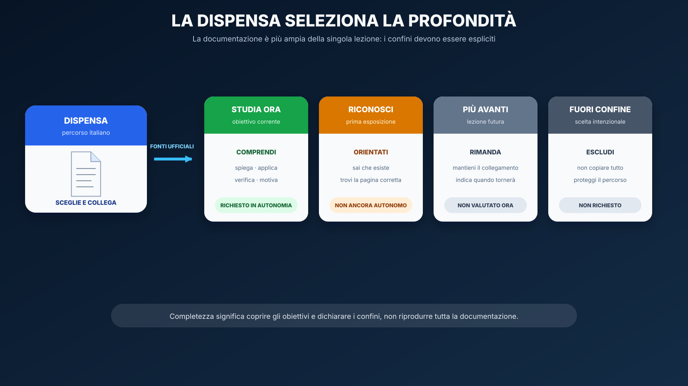

# CSS moderno, layout e responsive design

<table align="center" width="100%"><tr><td>
<details>
<summary>&#128506; <strong>Orientamento della lezione</strong></summary>

<p align="justify"><strong>Contesto:</strong> la lezione precedente ha dato struttura e significato alla pagina. Ora dobbiamo controllarne presentazione e layout senza compromettere semantica, leggibilità e adattamento allo spazio disponibile.</p>
<p align="justify"><strong>Domande guida:</strong> come decide il browser quale dichiarazione CSS applicare? Quando conviene Flexbox e quando Grid? Come si costruisce un layout che reagisce al contenuto invece che a un elenco di dispositivi?</p>
<p align="justify"><strong>Obiettivi osservabili:</strong> prevedere la cascade, ispezionare il box model, scegliere il sistema di layout adatto, individuare un overflow e realizzare una shell Feisbuc mobile-first.</p>
<p align="justify"><strong>Prossimo passo:</strong> nella lezione 03 confronteremo il CSS scritto direttamente con le convenzioni e i componenti di Bootstrap.</p>

</details>
</td></tr></table>

<p align="justify">Stato: <strong>draft didattico</strong>. Questa lezione prosegue UDA 21 dopo <code>01_WEB_PLATFORM_HTML_MODERNO.md</code> e trasforma lo scheletro semantico di Feisbuc in una interfaccia responsive senza introdurre ancora Bootstrap o framework frontend.</p>

## Obiettivi

<p align="justify">Al termine della lezione lo studente deve saper:</p>

<ul>
  <li>spiegare il ruolo di CSS nella Web Platform senza confonderlo con HTML;</li>
  <li>leggere e scrivere regole CSS composte da selettore, proprietà e valore;</li>
  <li>prevedere il risultato di conflitti semplici usando cascade, specificità e ordine;</li>
  <li>usare il box model e <code>box-sizing: border-box</code> in modo consapevole;</li>
  <li>distinguere normal flow, <code>block</code>, <code>inline</code> e contenitori di layout;</li>
  <li>scegliere Flexbox per problemi prevalentemente monodimensionali;</li>
  <li>scegliere Grid per layout bidimensionali;</li>
  <li>costruire layout che si adattano al viewport invece di fissare larghezze rigide;</li>
  <li>usare media query solo quando il layout fluido da solo non basta;</li>
  <li>definire e riusare custom properties CSS;</li>
  <li>diagnosticare overflow, specificità e breakpoint errati con DevTools;</li>
  <li>realizzare la milestone responsive iniziale di Feisbuc.</li>
</ul>

## Prerequisiti

<ul>
  <li>completamento di <code>01_WEB_PLATFORM_HTML_MODERNO.md</code>;</li>
  <li>struttura semantica con <code>header</code>, <code>nav</code>, <code>main</code>, <code>section</code>, <code>article</code>, <code>footer</code>;</li>
  <li>uso essenziale di browser DevTools;</li>
  <li>nessuna conoscenza di Bootstrap richiesta.</li>
</ul>

## Orientamento nella documentazione

<p align="center">
  
</p>

<table align="center"><tr><td>
<details>
<summary>&#128279; <strong>Indice incrociato — CSS ↔ MDN</strong></summary>

<table align="center">
<thead><tr><th>Dispensa</th><th>Documentazione ufficiale</th><th>Profondità</th></tr></thead>
<tbody>
<tr><td><a href="#lesson-css-foundations">Ruolo, sintassi e selettori</a></td><td><a href="https://developer.mozilla.org/en-US/docs/Learn_web_development/Core/Styling_basics/What_is_CSS">What is CSS?</a><br><a href="https://developer.mozilla.org/en-US/docs/Learn_web_development/Core/Styling_basics/Basic_selectors">Basic CSS selectors</a></td><td>&#128994; studiare ora</td></tr>
<tr><td><a href="#lesson-css-cascade">Cascade, specificità ed ereditarietà</a></td><td><a href="https://developer.mozilla.org/en-US/docs/Learn_web_development/Core/Styling_basics/Handling_conflicts">Handling conflicts</a></td><td>&#128994; studiare ora</td></tr>
<tr><td><a href="#lesson-css-layout">Box model, Flexbox e Grid</a></td><td><a href="https://developer.mozilla.org/en-US/docs/Learn_web_development/Core/CSS_layout">CSS layout</a></td><td>&#128994; studiare ora</td></tr>
<tr><td><a href="#lesson-css-responsive">Responsive design e media query</a></td><td><a href="https://developer.mozilla.org/en-US/docs/Learn_web_development/Core/CSS_layout/Responsive_Design">Responsive web design</a></td><td>&#128994; studiare ora</td></tr>
<tr><td>Writing modes, animazioni e layout avanzati</td><td><a href="https://developer.mozilla.org/en-US/docs/Web/CSS">CSS reference</a></td><td>&#128993; riconoscere o studiare più avanti</td></tr>
</tbody>
</table>

</details>
</td></tr></table>

## Problema iniziale

<p align="justify">Il nostro HTML semantico sa gia dire che cosa sono header, navigazione, feed e post. Ma il browser, senza istruzioni di presentazione, li mostra quasi tutti nel normale flusso del documento.</p>

<p align="justify">Vogliamo ottenere una pagina che:</p>

<ul>
  <li>resti leggibile su uno smartphone;</li>
  <li>sfrutti piu spazio su un desktop;</li>
  <li>non abbia larghezze fissate per un solo monitor;</li>
  <li>non dipenda da <code>float</code> per costruire le colonne;</li>
  <li>non richieda una cascata di <code>!important</code> per funzionare.</li>
</ul>

<p align="justify">Questo e il problema che affrontiamo con CSS.</p>

<a id="lesson-css-foundations"></a>
## HTML e CSS hanno responsabilita diverse

<p align="justify">HTML descrive soprattutto <strong>struttura e significato</strong>. CSS descrive <strong>presentazione e layout</strong>.</p>

```html
<article class="post">
  <h2>Primo post</h2>
  <p>Ciao Feisbuc!</p>
</article>
```

```css
.post {
  border: 1px solid #bbb;
  border-radius: 0.75rem;
  padding: 1rem;
}
```

<p align="justify">Cambiare il bordo non trasforma <code>article</code> in un altro tipo di contenuto: cambia il modo in cui viene presentato.</p>

### Da dove arriva lo stile

<p align="justify">Prima ancora del nostro CSS, il browser applica un proprio foglio di stile: e il motivo per cui, per esempio, un <code>h1</code> appare grande e in grassetto anche in una pagina senza CSS. Questi <strong>stili predefiniti</strong> sono una base utile, non un errore da eliminare alla cieca.</p>

<p align="justify">Possiamo aggiungere CSS in tre modi:</p>

<ol>
  <li>con un foglio esterno collegato da <code>&lt;link&gt;</code>: e la scelta normale del corso, perche separa struttura e presentazione e permette il riuso;</li>
  <li>con un elemento <code>&lt;style&gt;</code> nel documento: utile per una demo isolata o una pagina autosufficiente;</li>
  <li>con l'attributo <code>style</code> sul singolo elemento: da riconoscere e saper ispezionare, ma da non usare come strategia abituale.</li>
</ol>

```html
<head>
  <link rel="stylesheet" href="styles.css">
</head>
```

<p align="justify">Il riferimento guidato e <a href="https://developer.mozilla.org/en-US/docs/Learn_web_development/Core/Styling_basics/Getting_started#applying_css_to_html">Applying CSS to HTML</a>: studia il collegamento esterno e riconosci le altre due possibilita.</p>

## Anatomia di una regola CSS

```css
.post {
  padding: 1rem;
  border: 1px solid #bbb;
}
```

<ul>
  <li><code>.post</code> e il <strong>selettore</strong>;</li>
  <li><code>padding</code> e <code>border</code> sono <strong>proprieta</strong>;</li>
  <li><code>1rem</code> e <code>1px solid #bbb</code> sono <strong>valori</strong>;</li>
  <li><code>padding: 1rem</code> e una <strong>dichiarazione</strong>;</li>
  <li>l'insieme fra <code>{</code> e <code>}</code> e il blocco delle dichiarazioni.</li>
</ul>

### Selettori da padroneggiare nel core

```css
article { }
.post { }
#feed { }
nav a { }
.post > h2 { }
button:hover { }
input[type="email"] { }
.post + .post { }
.post::first-line { }
```

<p align="justify">Un selettore dice <strong>quali elementi devono ricevere una regola</strong>. Non descrive un percorso imperativo nel DOM: il browser confronta gli elementi con il pattern dichiarato.</p>

<ul>
  <li><code>article</code>, <code>.post</code>, <code>#feed</code> sono selettori di tipo, classe e ID;</li>
  <li><code>[type="email"]</code> seleziona in base a un attributo;</li>
  <li><code>:hover</code> descrive uno stato, quindi e una pseudo-classe;</li>
  <li><code>::first-line</code> seleziona una parte generata dell'elemento, quindi e uno pseudo-elemento;</li>
  <li>lo spazio, <code>&gt;</code> e <code>+</code> mettono in relazione elementi discendenti, figli o fratelli adiacenti;</li>
  <li>una virgola raggruppa selettori che condividono le stesse dichiarazioni.</li>
</ul>

<p align="justify">Nel corso preferiremo normalmente classi e selettori semplici per lo styling. Gli ID rimangono utili per identificazione, fragment link, accessibilita e casi mirati, ma non vogliamo costruire fogli di stile impossibili da sovrascrivere. Nella <a href="https://developer.mozilla.org/en-US/docs/Learn_web_development/Core/Styling_basics/Basic_selectors">guida MDN ai selettori</a> studia i selettori di base; combinatori, pseudo-classi e pseudo-elementi vanno saputi leggere e cercare nella documentazione.</p>

<a id="lesson-css-cascade"></a>
## Cascade: perche una regola vince su un'altra?

<p align="justify">CSS significa <em>Cascading Style Sheets</em>: piu dichiarazioni possono riguardare lo stesso elemento e il browser deve decidere quale applicare.</p>

<p align="justify">Per i casi iniziali ragioniamo in questo ordine mentale:</p>

<ol>
  <li>le dichiarazioni sono entrambe applicabili all'elemento?</li>
  <li>c'e un'importanza/origine diversa?</li>
  <li>quale selettore e piu specifico?</li>
  <li>se la priorita e equivalente, quale dichiarazione arriva dopo?</li>
</ol>

<p align="justify">Esempio:</p>

```css
.post {
  color: #222;
}

#feed .post {
  color: #333;
}
```

<p align="justify">Il secondo selettore ha specificita maggiore.</p>

### Specificita senza formule magiche

<p align="justify">Per il livello core basta ricordare una gerarchia pratica:</p>

<ul>
  <li>selettori di tipo (<code>article</code>) hanno peso basso;</li>
  <li>classi, attributi e pseudo-classi (<code>.post</code>, <code>[hidden]</code>, <code>:hover</code>) hanno peso maggiore;</li>
  <li>ID (<code>#feed</code>) hanno peso ancora maggiore;</li>
  <li>gli stili inline sono ancora piu difficili da sovrascrivere nel normale author CSS.</li>
</ul>

<p align="justify">Non useremo la specificita come una gara a costruire il selettore piu lungo. Il buon obiettivo e il contrario: <strong>regole semplici e prevedibili</strong>.</p>

### Perche evitare `!important` come soluzione abituale

<p align="justify"><code>!important</code> cambia la priorita nella cascata. Esistono casi reali in cui e utile, ma non deve diventare il cerotto con cui nascondiamo una architettura CSS confusa.</p>

<p align="justify">Quando senti il bisogno di scrivere:</p>

```css
#feed .post.card.special {
  padding: 2rem !important;
}
```

<p align="justify">prima chiediti:</p>

<ul>
  <li>sto usando selettori troppo specifici?</li>
  <li>sto duplicando regole?</li>
  <li>l'ordine del foglio e comprensibile?</li>
  <li>posso modellare meglio i componenti con classi?</li>
</ul>

## Inheritance

<p align="justify">Alcune proprieta possono essere ereditate dai discendenti, altre no.</p>

```css
body {
  color: #222;
  font-family: system-ui, sans-serif;
}
```

<p align="justify">Molto testo dentro <code>body</code> usera naturalmente questi valori. Un <code>margin</code> assegnato a <code>body</code>, invece, non viene semplicemente ereditato da tutti i figli.</p>

<p align="justify">Quando non ricordi se una proprieta eredita, consulta la sezione <strong>Formal definition</strong> della pagina MDN della proprieta.</p>

## Box model: ogni elemento genera scatole

<p align="justify">Per capire dimensioni e spazi dobbiamo visualizzare:</p>

```text
margin
└─ border
   └─ padding
      └─ content
```

<p align="justify">Un elemento puo avere:</p>

<ul>
  <li>area del contenuto;</li>
  <li>padding attorno al contenuto;</li>
  <li>bordo;</li>
  <li>margine esterno.</li>
</ul>

<p align="justify">Esempio:</p>

```css
.post {
  width: 20rem;
  padding: 1rem;
  border: 0.25rem solid #777;
}
```

<p align="justify">Con il box model standard la <code>width</code> indica la larghezza del <strong>content box</strong>, quindi padding e border si sommano alla dimensione finale.</p>

### `box-sizing: border-box`

<p align="justify">Per interfacce applicative e spesso piu facile ragionare cosi:</p>

```css
*,
*::before,
*::after {
  box-sizing: border-box;
}
```

<p align="justify">Con <code>border-box</code>, quando impostiamo una larghezza, padding e border rientrano nella dimensione dichiarata.</p>

<p align="justify">Questo non e un reset magico di tutto il CSS: risolve un problema preciso di calcolo delle dimensioni.</p>

## Normal flow prima del layout speciale

<p align="justify">Prima di Flexbox e Grid, il browser ha gia un algoritmo di layout: il <strong>normal flow</strong>.</p>

<p align="justify">Gli elementi block tendono a disporsi uno dopo l'altro lungo la direzione di blocco. Il contenuto inline scorre invece dentro le righe.</p>

<p align="justify">Capire il normal flow serve perche Flexbox e Grid non sostituiscono CSS: cambiano il modo in cui vengono disposti i figli di uno specifico contenitore.</p>

<a id="lesson-css-layout"></a>
## Flexbox: una dimensione alla volta

<p align="justify">Flexbox e adatto quando il problema principale e distribuire elementi in una <strong>riga oppure colonna</strong>.</p>

<p align="justify">Esempio: il menu di Feisbuc.</p>

```css
.nav-list {
  display: flex;
  flex-wrap: wrap;
  gap: 0.75rem;
  align-items: center;
}
```

<p align="justify">Concetti essenziali:</p>

<ul>
  <li>flex container;</li>
  <li>flex item;</li>
  <li>main axis;</li>
  <li>cross axis;</li>
  <li><code>flex-direction</code>;</li>
  <li><code>justify-content</code>;</li>
  <li><code>align-items</code>;</li>
  <li><code>gap</code>;</li>
  <li><code>flex-wrap</code>;</li>
  <li><code>flex</code> / crescita e restringimento quando serve.</li>
</ul>

### Errore comune: memorizzare `justify` = orizzontale

<p align="justify">Non e corretto. <code>justify-content</code> lavora sull'<strong>asse principale</strong>. Se cambi <code>flex-direction</code>, cambia anche l'orientamento dell'asse principale.</p>

## Grid: righe e colonne coordinate

<p align="justify">Grid e adatto quando il layout deve ragionare contemporaneamente su <strong>due dimensioni</strong>.</p>

<p align="justify">Per Feisbuc, su uno schermo ampio potremmo voler coordinare:</p>

```text
profilo | feed | tendenze
```

```css
.page-shell {
  display: grid;
  grid-template-columns:
    minmax(12rem, 16rem)
    minmax(0, 1fr)
    minmax(12rem, 16rem);
  gap: 1rem;
}
```

<p align="justify">Concetti core:</p>

<ul>
  <li>grid container;</li>
  <li>grid item;</li>
  <li>righe e colonne;</li>
  <li>track;</li>
  <li><code>fr</code>;</li>
  <li><code>gap</code>;</li>
  <li><code>grid-template-columns</code>;</li>
  <li><code>minmax()</code>;</li>
  <li>auto-placement;</li>
  <li>grid areas solo dopo avere capito le colonne di base.</li>
</ul>

### Perche `minmax(0, 1fr)` nel feed?

<p align="justify">Il valore <code>1fr</code> distribuisce spazio flessibile. In certi layout, un contenuto lungo puo pero impedire alla colonna di restringersi come immaginiamo. Rendere esplicito il minimo <code>0</code> e una tecnica utile per permettere alla colonna centrale di contrarsi e gestire correttamente l'overflow.</p>

## Flexbox o Grid?

<p align="justify">Usa questa domanda, non una regola religiosa:</p>

<blockquote>
<p align="justify">Sto organizzando soprattutto una fila/colonna, oppure devo coordinare righe e colonne?</p>
</blockquote>

<p align="justify">Esempi Feisbuc:</p>

<ul>
  <li>menu orizzontale con wrapping → Flexbox;</li>
  <li>pulsanti di una card → Flexbox;</li>
  <li>layout profilo/feed/tendenze → Grid;</li>
  <li>griglia di card con colonne → Grid;</li>
  <li>una singola riga di avatar → Flexbox.</li>
</ul>

<p align="justify">Le due tecnologie si combinano normalmente nella stessa pagina.</p>

<a id="lesson-css-responsive"></a>
## Responsive design: non significa scegliere tre telefoni

<p align="justify">Responsive design significa progettare affinche il contenuto rimanga utilizzabile in una gamma di spazi disponibili.</p>

<p align="justify">Partiamo da un layout semplice per viewport piccoli:</p>

```css
.page-shell {
  display: grid;
  grid-template-columns: 1fr;
  gap: 1rem;
}
```

<p align="justify">Poi aggiungiamo un breakpoint quando <strong>il contenuto</strong> ha spazio sufficiente per una struttura piu ricca:</p>

```css
@media (min-width: 56rem) {
  .page-shell {
    grid-template-columns:
      minmax(12rem, 16rem)
      minmax(0, 1fr)
      minmax(12rem, 16rem);
  }
}
```

<p align="justify">Questo e un approccio mobile-first: la base funziona con poco spazio; una media query aggiunge il layout ampio.</p>

### Media query solo quando serve

<p align="justify">Flexbox e Grid sono gia flessibili. Non dobbiamo creare un breakpoint per ogni modello di telefono.</p>

<p align="justify">Prima prova:</p>

<ul>
  <li>dimensioni relative;</li>
  <li>wrapping;</li>
  <li><code>minmax()</code>;</li>
  <li><code>max-width</code>;</li>
  <li>Grid/Flex flessibili.</li>
</ul>

<p align="justify">Aggiungi <code>@media</code> quando la struttura ha davvero bisogno di cambiare.</p>

## Unita utili

<p align="justify">Non esiste una singola unita corretta per tutto.</p>

<ul>
  <li><code>px</code>: utile per dettagli come alcuni border;</li>
  <li><code>%</code>: relativo a un riferimento contestuale;</li>
  <li><code>rem</code>: utile per spazi e dimensioni scalabili rispetto alla root;</li>
  <li><code>fr</code>: quota dello spazio disponibile in Grid;</li>
  <li><code>vw</code>/<code>vh</code>: viewport-relative, da usare con consapevolezza;</li>
  <li><code>min()</code>, <code>max()</code>, <code>clamp()</code> possono esprimere dimensioni fluide, ma sono un passo successivo.</li>
</ul>

<p align="justify">Evitiamo layout come:</p>

```css
.page-shell {
  width: 1200px;
}
```

<p align="justify">se quella larghezza rigida e l'unico modo in cui la pagina funziona.</p>

### Testo leggibile: font, ritmo e colore

<p align="justify">Lo stile del testo non e decorazione separata dal layout: dimensione, interlinea e larghezza della riga decidono se il contenuto si legge bene.</p>

```css
body {
  color: #1f2937;
  font-family: system-ui, sans-serif;
  font-size: 1rem;
  line-height: 1.5;
}

.post__text {
  max-width: 65ch;
}
```

<ul>
  <li>una <strong>font stack</strong> offre alternative se il primo font non e disponibile;</li>
  <li><code>rem</code> collega le dimensioni alla base del documento e rispetta meglio le preferenze utente;</li>
  <li><code>line-height</code> senza unita mantiene una proporzione utile anche nei discendenti;</li>
  <li><code>ch</code> puo limitare righe di testo troppo lunghe;</li>
  <li>il colore deve avere contrasto sufficiente e non deve essere l'unico segnale di stato.</li>
</ul>

<p align="justify">Nella pagina MDN <a href="https://developer.mozilla.org/en-US/docs/Learn_web_development/Core/Text_styling/Fundamentals">Fundamental text and font styling</a> studia famiglie, dimensioni, peso, stile e interlinea; le proprieta tipografiche avanzate restano materiale di consultazione.</p>

## Immagini responsive

<p align="justify">Una regola semplice evita molte sorprese:</p>

```css
img {
  max-width: 100%;
  height: auto;
}
```

<p align="justify">Non risolve da sola art direction, formati o performance delle immagini, ma impedisce spesso che una immagine superi il contenitore.</p>

## Custom properties: valori con un nome

<p align="justify">Possiamo dichiarare valori riusabili:</p>

```css
:root {
  --space-1: 0.5rem;
  --space-2: 1rem;
  --surface: #fff;
  --border: #d7d7d7;
}

.post {
  padding: var(--space-2);
  background: var(--surface);
  border: 1px solid var(--border);
}
```

<p align="justify">Il vantaggio didattico non e solo evitare copia-incolla: i nomi permettono di esprimere intenzioni.</p>

## Feisbuc milestone 1: shell responsive

<p align="justify">Partiamo dallo scheletro semantico della milestone 0.</p>

```html
<main class="page-shell">
  <section class="profile" aria-labelledby="profile-title">...</section>
  <section id="feed" aria-labelledby="feed-title">...</section>
  <aside class="trends" aria-labelledby="trends-title">...</aside>
</main>
```

<p align="justify">La base mobile:</p>

```css
.page-shell {
  width: min(100% - 2rem, 75rem);
  margin-inline: auto;
  display: grid;
  grid-template-columns: 1fr;
  gap: 1rem;
}
```

<p align="justify">La versione ampia:</p>

```css
@media (min-width: 56rem) {
  .page-shell {
    grid-template-columns:
      minmax(12rem, 16rem)
      minmax(0, 1fr)
      minmax(12rem, 16rem);
    align-items: start;
  }
}
```

<p align="justify">Il menu e le azioni di un post possono invece essere Flexbox.</p>

<p align="justify">Questa separazione e intenzionale:</p>

```text
Grid    → macro layout della pagina
Flexbox → gruppi monodimensionali dentro le regioni
```

## Debug CSS: osserva prima di cambiare

<p align="justify">Quando un layout si rompe:</p>

<ol>
  <li>riproduci il problema a una larghezza precisa;</li>
  <li>individua l'elemento che provoca l'overflow o il conflitto;</li>
  <li>usa DevTools per vedere regole applicate e barrate;</li>
  <li>controlla box model e dimensioni calcolate;</li>
  <li>controlla quale regola vince nella cascade;</li>
  <li>modifica una ipotesi alla volta;</li>
  <li>verifica di nuovo mobile e desktop.</li>
</ol>

<p align="justify">Non partire aggiungendo <code>overflow-x: hidden</code>: potrebbe nascondere il sintomo senza correggere la causa.</p>

## Errori frequenti

### 1. Layout a larghezza fissa

```css
main {
  width: 1200px;
}
```

<p align="justify">Su un viewport piu piccolo puo produrre overflow.</p>

### 2. Usare `float` come sistema principale di colonne

<p align="justify"><code>float</code> resta una funzionalita CSS reale, ma non e il nostro strumento principale per costruire il layout applicativo moderno di Feisbuc.</p>

### 3. `!important` ovunque

<p align="justify">Nasconde conflitti invece di farli comprendere.</p>

### 4. Breakpoint invertiti

<p align="justify">Se la base e mobile-first, una regola <code>min-width</code> dovrebbe normalmente aggiungere complessita quando cresce lo spazio, non forzare la singola colonna proprio sui viewport piu larghi.</p>

### 5. Confondere Grid e Flex

<p align="justify">Usare Flexbox per simulare una tabella bidimensionale o Grid per una semplice riga di bottoni puo rendere il codice piu difficile del necessario.</p>

### 6. Riordinare visivamente senza pensare alla semantica

<p align="justify">CSS puo modificare la posizione visuale. L'ordine del DOM rimane pero importante per lettura, tastiera e tecnologie assistive. Non usiamo il layout per mascherare una struttura HTML sbagliata.</p>

## Approfondimento guidato su MDN

<table align="center"><tr><td>
<p align="justify"><strong><span style="font-size: 1.15em;">&#128279;</span> Percorso MDN — CSS:</strong> usa il metodo generale della <a href="GUIDA_USO_MDN.md">guida trasversale a MDN</a> e, quando apri la scheda di una proprietà, segui l'ordine indicato in <a href="GUIDA_USO_MDN.md#mdn-guide-css">Come leggere una reference CSS</a>.</p>
<ul>
  <li><strong>Cascade e specificità:</strong> studia <a href="https://developer.mozilla.org/en-US/docs/Learn_web_development/Core/Styling_basics/Handling_conflicts">Handling conflicts</a>; ricostruisci quali dichiarazioni sono candidate e perché una vince;</li>
  <li><strong>box model:</strong> studia <a href="https://developer.mozilla.org/en-US/docs/Learn_web_development/Core/Styling_basics/Box_model">The box model</a>; confronta content, padding, border e margin nei DevTools;</li>
  <li><strong>Flexbox:</strong> studia <a href="https://developer.mozilla.org/en-US/docs/Learn_web_development/Core/CSS_layout/Flexbox">Flexbox</a>; identifica container, item, main axis e cross axis;</li>
  <li><strong>Grid:</strong> studia <a href="https://developer.mozilla.org/en-US/docs/Learn_web_development/Core/CSS_layout/Grids">CSS grid layout</a>; identifica track, righe, colonne, gap e posizione degli item;</li>
  <li><strong>responsive:</strong> studia <a href="https://developer.mozilla.org/en-US/docs/Learn_web_development/Core/CSS_layout/Responsive_Design">Responsive web design</a> e <a href="https://developer.mozilla.org/en-US/docs/Learn_web_development/Core/CSS_layout/Media_queries">Media query fundamentals</a>; aggiungi un breakpoint soltanto quando lo richiede il contenuto.</li>
</ul>
<p align="justify"><strong>Prodotto atteso:</strong> per ogni problema annota la regola CSS responsabile, la prova svolta nei DevTools e il cambiamento osservato.</p>
</td></tr></table>

## Esempi da modificare

### A — osservazione

<p align="justify">Modifica <code>padding</code>, <code>border</code> e <code>margin</code> di una card e osserva il box model nei DevTools.</p>

### B — modifica controllata

<p align="justify">Trasforma un menu verticale in un flex container con wrapping.</p>

### C — implementazione autonoma

<p align="justify"><strong>Activity <code>tpsi5-activity-c-feisbuc-responsive-layout-001</code></strong>: costruisci la shell responsive di Feisbuc usando Grid per il macro-layout e Flexbox per i gruppi interni.</p>

### D — debug e diagnosi

<p align="justify"><strong>Activity <code>tpsi5-activity-d-debug-responsive-css-001</code></strong>: ricevi una pagina che funziona apparentemente solo su desktop. Prima documenta le cause, poi correggi il CSS senza <code>!important</code> e senza nascondere l'overflow.</p>

### E — mini-progetto futuro

<p align="justify">Costruire una pagina profilo completa con layout responsive, form e componenti visuali riusabili.</p>

### F — prodotto integrato futuro

<p align="justify">Integrare layout, comportamento JavaScript, API e backend nel Feisbuc full stack.</p>

## Verifica rapida

<ol>
  <li>Che differenza c'e fra HTML e CSS?</li>
  <li>Da quali parti e composto il box model?</li>
  <li>Che cosa cambia con <code>box-sizing: border-box</code>?</li>
  <li>Quando useresti Flexbox invece di Grid?</li>
  <li>Perche <code>justify-content</code> non significa semplicemente “allinea orizzontalmente”?</li>
  <li>Perche un layout <code>width: 1200px</code> puo essere fragile?</li>
  <li>A cosa serve una media query?</li>
  <li>Perche non serve una media query per ogni telefono?</li>
  <li>Che cosa risolve la specificita?</li>
  <li>Perche <code>!important</code> non deve essere la prima soluzione?</li>
  <li>Che cosa rappresenta <code>1fr</code> in Grid?</li>
  <li>Perche in un debug CSS e utile vedere le regole barrate nei DevTools?</li>
</ol>

## Sintesi inclusiva

```text
HTML → che cosa significa il contenuto
CSS  → come viene presentato e disposto

Cascade → quale dichiarazione vince
Box model → content + padding + border + margin

Flexbox → soprattutto una dimensione
Grid    → due dimensioni

Responsive → layout che si adatta allo spazio
Media query → cambia regole quando una condizione lo richiede

Feisbuc mobile → una colonna
Feisbuc wide   → profilo | feed | tendenze
```

## Fonti e provenance

<p align="justify">Fonti tecniche professionali:</p>

<ul>
  <li>MDN CSS: <a href="https://developer.mozilla.org/en-US/docs/Web/CSS">https://developer.mozilla.org/en-US/docs/Web/CSS</a></li>
  <li>MDN Handling conflicts: <a href="https://developer.mozilla.org/en-US/docs/Learn_web_development/Core/Styling_basics/Handling_conflicts">https://developer.mozilla.org/en-US/docs/Learn_web_development/Core/Styling_basics/Handling_conflicts</a></li>
  <li>MDN Box model: <a href="https://developer.mozilla.org/en-US/docs/Learn_web_development/Core/Styling_basics/Box_model">https://developer.mozilla.org/en-US/docs/Learn_web_development/Core/Styling_basics/Box_model</a></li>
  <li>MDN Flexbox: <a href="https://developer.mozilla.org/en-US/docs/Learn_web_development/Core/CSS_layout/Flexbox">https://developer.mozilla.org/en-US/docs/Learn_web_development/Core/CSS_layout/Flexbox</a></li>
  <li>MDN Grid: <a href="https://developer.mozilla.org/en-US/docs/Learn_web_development/Core/CSS_layout/Grids">https://developer.mozilla.org/en-US/docs/Learn_web_development/Core/CSS_layout/Grids</a></li>
  <li>MDN Responsive design: <a href="https://developer.mozilla.org/en-US/docs/Learn_web_development/Core/CSS_layout/Responsive_Design">https://developer.mozilla.org/en-US/docs/Learn_web_development/Core/CSS_layout/Responsive_Design</a></li>
  <li>MDN Media queries: <a href="https://developer.mozilla.org/en-US/docs/Learn_web_development/Core/CSS_layout/Media_queries">https://developer.mozilla.org/en-US/docs/Learn_web_development/Core/CSS_layout/Media_queries</a></li>
  <li>MDN Custom properties: <a href="https://developer.mozilla.org/en-US/docs/Web/CSS/Guides/Cascading_variables/Using_custom_properties">https://developer.mozilla.org/en-US/docs/Web/CSS/Guides/Cascading_variables/Using_custom_properties</a></li>
</ul>

<p align="justify">Provenance interna:</p>

<ul>
  <li><code>TheBitPoets/html_css_summary</code> pinned: sintassi CSS, box model, block/inline, padding/margin/border;</li>
  <li><code>TheBitPoets/feisbuc</code> pinned: layout legacy basato su colonne/float e progetto longitudinale da modernizzare.</li>
</ul>

<p align="justify">Riferimento docente licensed, non riprodotto nel corso:</p>

<ul>
  <li>Manning, <em>CSS in Depth, Second Edition</em>.</li>
</ul>

<p align="justify">Il testo, gli esempi canonici, le Activity e le soluzioni di riferimento di questo modulo sono materiale originale del corso.</p>
