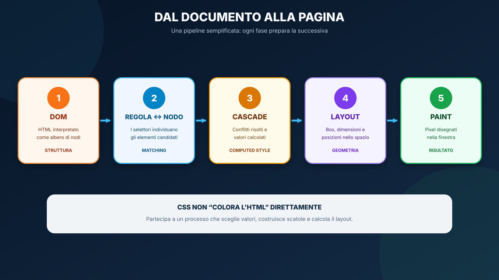
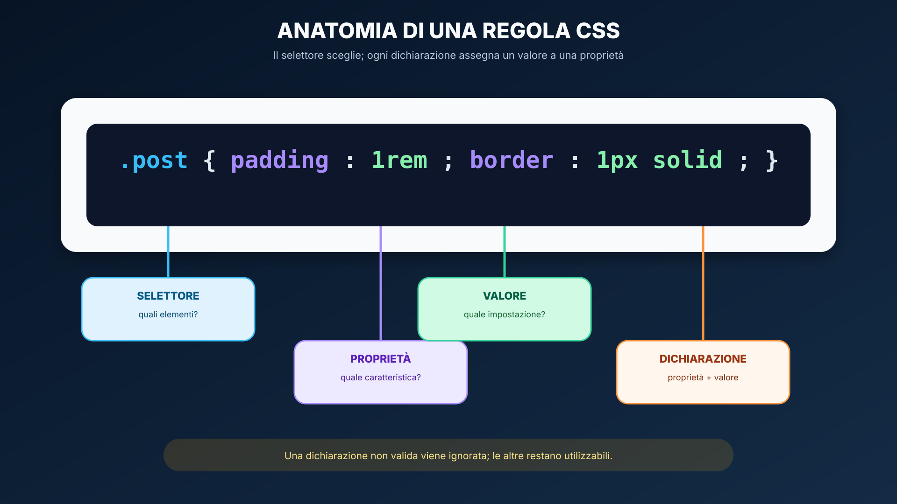
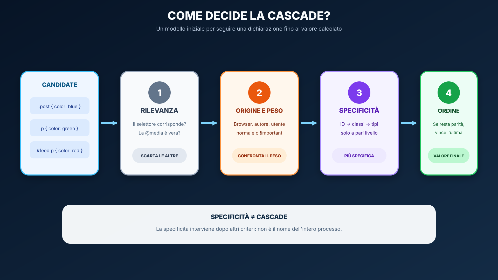
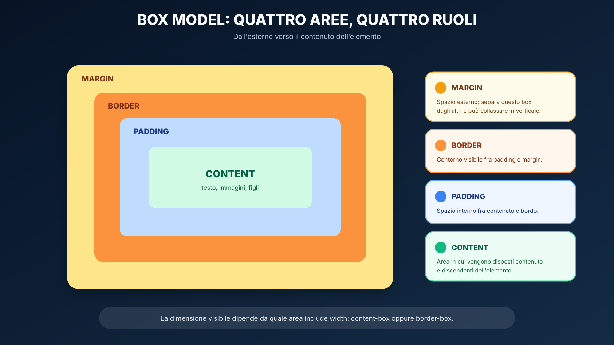
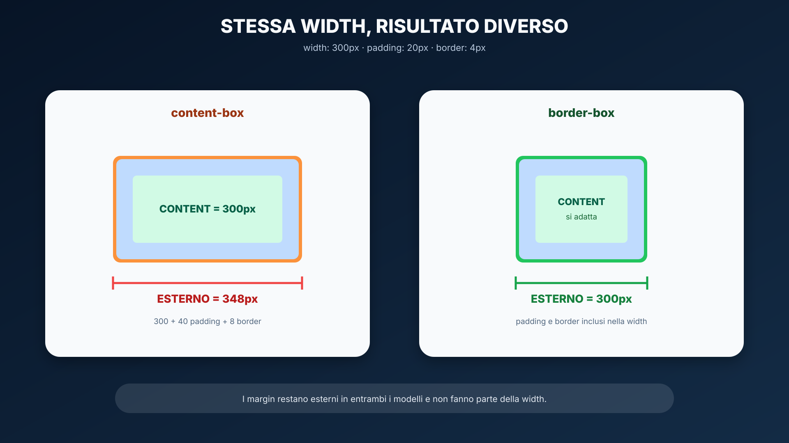
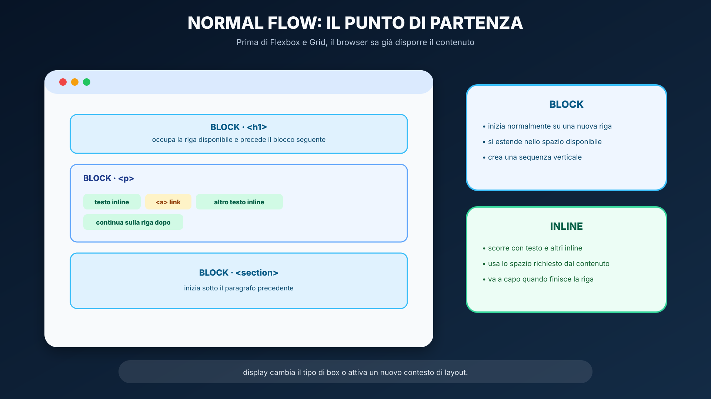
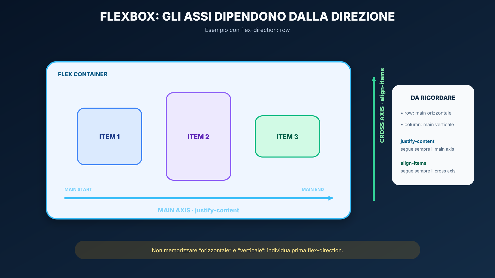
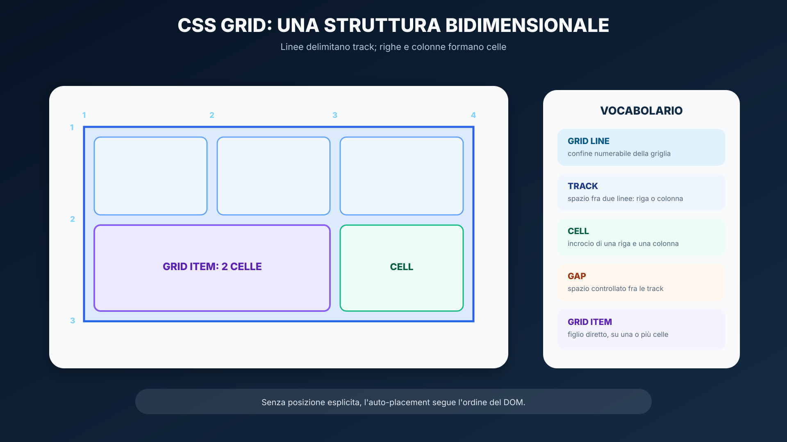
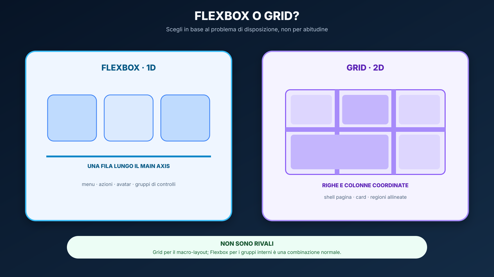
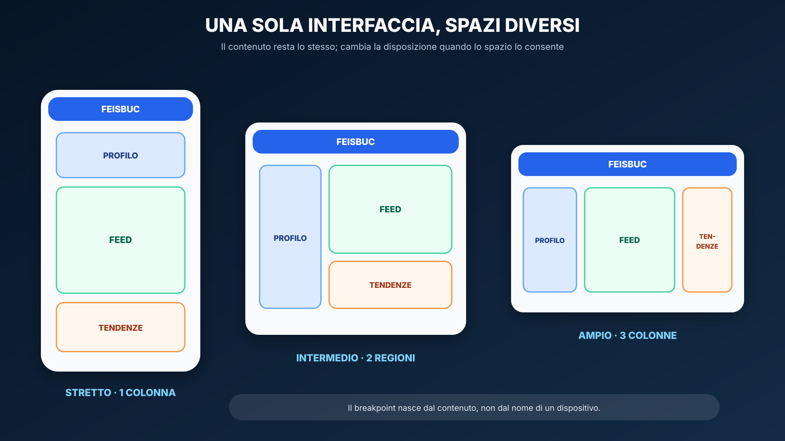

<a id="lesson-start"></a>
# CSS moderno, layout e responsive design

<a id="lesson-objectives"></a>
## In questa unità impareremo

<table align="center"><tr><td>
<details>
<summary>&#129517; <strong>Orientamento della sezione</strong></summary>

<p align="justify"><strong><span style="font-size: 1.15em;">&#128506;</span> Contesto:</strong>
la lezione precedente ha dato struttura e significato alla pagina. Ora dobbiamo controllarne presentazione e layout senza compromettere semantica, leggibilità e adattamento allo spazio disponibile.</p>

<p align="justify"><strong><span style="font-size: 1.15em;">&#10067;</span> Domande guida:</strong>
come decide il browser quale dichiarazione CSS applicare? Quando conviene Flexbox e quando Grid? Come si costruisce un layout che reagisce al contenuto invece che a un elenco di dispositivi?</p>

<p align="justify"><strong><span style="font-size: 1.15em;">&#127919;</span> Obiettivi:</strong>
Al termine lo studente dovrà saper:</p>
<ul>
  <li>spiegare il ruolo di CSS nella Web Platform senza confonderlo con HTML;</li>
  <li>descrivere il percorso semplificato che porta da DOM e regole CSS ai box visualizzati;</li>
  <li>leggere e scrivere regole CSS composte da selettore, proprietà e valore;</li>
  <li>prevedere il risultato di conflitti semplici distinguendo cascade, specificità, ordine ed ereditarietà;</li>
  <li>calcolare le dimensioni di un box e usare <code>box-sizing: border-box</code> in modo consapevole;</li>
  <li>distinguere normal flow, <code>block</code>, <code>inline</code> e contenitori di layout;</li>
  <li>scegliere Flexbox per problemi prevalentemente monodimensionali;</li>
  <li>scegliere Grid per layout bidimensionali;</li>
  <li>costruire layout che si adattano al viewport invece di fissare larghezze rigide;</li>
  <li>usare media query solo quando il layout fluido da solo non basta;</li>
  <li>definire e riusare custom properties CSS;</li>
  <li>diagnosticare overflow, specificità e breakpoint errati con DevTools;</li>
  <li>realizzare la milestone responsive iniziale di Feisbuc.</li>
</ul>

<p align="justify"><strong><span style="font-size: 1.15em;">&#129504;</span> Prerequisiti:</strong></p>
<ul>
  <li>aver completato la lezione <a href="01_WEB_PLATFORM_HTML_MODERNO.md">Web Platform e HTML moderno</a>;</li>
  <li>saper riconoscere una struttura semantica con <code>header</code>, <code>nav</code>, <code>main</code>, <code>section</code>, <code>article</code> e <code>footer</code>;</li>
  <li>saper usare le funzioni essenziali dei browser DevTools;</li>
  <li>non è richiesta alcuna conoscenza di Bootstrap.</li>
</ul>

<p align="justify"><strong><span style="font-size: 1.15em;">&#10145;</span> Prossimo passo:</strong>
nella lezione 03 confronteremo il CSS scritto direttamente con le convenzioni e i componenti di Bootstrap.</p>

</details>
</td></tr></table>

<a id="lesson-mdn-maps"></a>
## Orientamento nella documentazione MDN

<p align="justify">La dispensa costruisce un percorso guidato in italiano, mentre MDN rimane la documentazione tecnica da imparare a consultare. Se è la prima volta che la usi, apri prima la <a href="GUIDA_USO_MDN.md">guida trasversale a MDN</a>. La mappa e l'indice seguenti mostrano quali argomenti studiare ora e quali riconoscere per un approfondimento successivo.</p>

<table align="center"><tr><td>
<p align="justify"><strong><span style="font-size: 1.15em;">&#128506;</span> Come leggere i colori:</strong>
<strong>coperto</strong> indica i contenuti spiegati dalla dispensa e richiesti in questa lezione; <strong>introdotto</strong> segnala una prima presentazione da riconoscere o sperimentare; <strong>più avanti</strong> identifica gli argomenti esclusi dallo studio attuale. Ogni stato è scritto anche accanto al colore, che non è quindi l'unico segnale.</p>
</td></tr></table>

<a id="lesson-mdn-map-css"></a>
<table align="center"><tr><td>
<details>
<summary>&#128506;&#65039; <strong>Mappa — CSS moderno, layout e responsive design</strong></summary>

<p align="justify">La mappa collega i nuclei della dispensa alle pagine e alle sezioni MDN corrispondenti. Le frecce verdi indicano ciò che viene spiegato in italiano, la freccia ambra una prima introduzione e quella grigia gli argomenti esclusi dallo studio attuale.</p>

<p align="center">
  
</p>

</details>
</td></tr></table>

<a id="lesson-mdn-cross-index"></a>
<table align="center" width="100%"><tr><td>
<details>
<summary>&#128279; <strong>Indice incrociato navigabile — Dispensa ↔ MDN</strong></summary>

<p align="justify">L’indice è organizzato in gruppi espandibili e in schede abbinate. In ogni scheda, il titolo della dispensa conduce al punto esatto della lezione e il titolo MDN apre la documentazione corrispondente. Le descrizioni sono brevi punti elenco e non sono cliccabili.</p>

<p><strong>Legenda:</strong> &#128309; contenuto della dispensa · &#128994; contenuto MDN · una voce in corsivo segnala che non esiste una corrispondenza diretta.</p>

<details>
<summary><strong>Orientamento e fondamenti</strong> · 4 voci</summary>

<blockquote>
<p><strong>01 · CORRISPONDENZA</strong></p>
<p><strong>&#128309; DISPENSA</strong><br>
<strong><a href="#lesson-objectives">In questa unità impareremo</a></strong></p>
<ul><li>Contesto, domande guida, obiettivi e prerequisiti.</li></ul>
<p><strong>&#128994; MDN</strong><br>
<em>Nessun riferimento MDN diretto per questa voce.</em></p>
</blockquote>

<blockquote>
<p><strong>02 · CORRISPONDENZA</strong></p>
<p><strong>&#128309; DISPENSA</strong><br>
<strong><a href="#lesson-mdn-map-css">Mappa — CSS moderno, layout e responsive design</a></strong></p>
<ul><li>Raccordo visuale fra i nuclei della dispensa e le fonti MDN.</li></ul>
<p><strong>&#128994; MDN</strong><br>
<strong><a href="https://developer.mozilla.org/en-US/docs/Learn_web_development/Core/Styling_basics">CSS styling basics</a></strong><br>
<strong><a href="https://developer.mozilla.org/en-US/docs/Learn_web_development/Core/CSS_layout">CSS layout</a></strong></p>
<ul><li>I due moduli MDN attraversati dalla lezione.</li></ul>
</blockquote>

<blockquote>
<p><strong>03 · CORRISPONDENZA</strong></p>
<p><strong>&#128309; DISPENSA</strong><br>
<strong><a href="#lesson-css-foundations">HTML e CSS hanno responsabilità diverse</a></strong></p>
<ul><li>Ruolo di CSS, stili predefiniti e collegamento del foglio esterno.</li></ul>
<p><strong>&#128994; MDN</strong><br>
<strong><a href="https://developer.mozilla.org/en-US/docs/Learn_web_development/Core/Styling_basics/What_is_CSS">What is CSS?</a></strong><br>
<strong><a href="https://developer.mozilla.org/en-US/docs/Learn_web_development/Core/Styling_basics/Getting_started#applying_css_to_html">Applying CSS to HTML</a></strong></p>
<ul><li>Scopo di CSS, stili del browser e modalità di applicazione.</li></ul>
</blockquote>

<blockquote>
<p><strong>04 · CORRISPONDENZA</strong></p>
<p><strong>&#128309; DISPENSA</strong><br>
<strong><a href="#lesson-css-rule">Anatomia di una regola CSS</a></strong></p>
<ul><li>Selettore, dichiarazioni, proprietà, valori e selettori core.</li></ul>
<p><strong>&#128994; MDN</strong><br>
<strong><a href="https://developer.mozilla.org/en-US/docs/Learn_web_development/Core/Styling_basics/What_is_CSS#css_syntax_basics">CSS syntax basics</a></strong><br>
<strong><a href="https://developer.mozilla.org/en-US/docs/Learn_web_development/Core/Styling_basics/Basic_selectors">Basic CSS selectors</a></strong></p>
<ul><li>Sintassi di una regola e selettori fondamentali.</li></ul>
</blockquote>

</details>

<details>
<summary><strong>Cascade e dimensioni</strong> · 3 voci</summary>

<blockquote>
<p><strong>05 · CORRISPONDENZA</strong></p>
<p><strong>&#128309; DISPENSA</strong><br>
<strong><a href="#lesson-css-cascade">Cascade, specificità ed ereditarietà</a></strong></p>
<ul><li>Scelta della dichiarazione vincente e uso prudente di <code>!important</code>.</li></ul>
<p><strong>&#128994; MDN</strong><br>
<strong><a href="https://developer.mozilla.org/en-US/docs/Learn_web_development/Core/Styling_basics/Handling_conflicts">Handling conflicts</a></strong></p>
<ul><li>Inheritance, cascade, specificity e ordine delle regole.</li></ul>
</blockquote>

<blockquote>
<p><strong>06 · CORRISPONDENZA</strong></p>
<p><strong>&#128309; DISPENSA</strong><br>
<strong><a href="#lesson-css-box-model">Box model: ogni elemento genera scatole</a></strong></p>
<ul><li>Content, padding, border, margin e <code>border-box</code>.</li></ul>
<p><strong>&#128994; MDN</strong><br>
<strong><a href="https://developer.mozilla.org/en-US/docs/Learn_web_development/Core/Styling_basics/Box_model">The box model</a></strong></p>
<ul><li>Parti della scatola e modelli alternativi di calcolo.</li></ul>
</blockquote>

<blockquote>
<p><strong>07 · CORRISPONDENZA</strong></p>
<p><strong>&#128309; DISPENSA</strong><br>
<strong><a href="#lesson-css-normal-flow">Normal flow prima del layout speciale</a></strong></p>
<ul><li>Disposizione iniziale di contenuti block e inline.</li></ul>
<p><strong>&#128994; MDN</strong><br>
<strong><a href="https://developer.mozilla.org/en-US/docs/Learn_web_development/Core/CSS_layout/Introduction">Introduction to CSS layout</a></strong></p>
<ul><li>Flusso normale e panoramica dei metodi di layout.</li></ul>
</blockquote>

</details>

<details>
<summary><strong>Sistemi di layout</strong> · 3 voci</summary>

<blockquote>
<p><strong>08 · CORRISPONDENZA</strong></p>
<p><strong>&#128309; DISPENSA</strong><br>
<strong><a href="#lesson-css-layout">Flexbox: una dimensione alla volta</a></strong></p>
<ul><li>Container, item, assi, allineamento, gap e wrapping.</li></ul>
<p><strong>&#128994; MDN</strong><br>
<strong><a href="https://developer.mozilla.org/en-US/docs/Learn_web_development/Core/CSS_layout/Flexbox">Flexbox</a></strong></p>
<ul><li>Modello monodimensionale e proprietà fondamentali.</li></ul>
</blockquote>

<blockquote>
<p><strong>09 · CORRISPONDENZA</strong></p>
<p><strong>&#128309; DISPENSA</strong><br>
<strong><a href="#lesson-css-grid">Grid: righe e colonne coordinate</a></strong></p>
<ul><li>Track, frazioni, gap, auto-placement e <code>minmax()</code>.</li></ul>
<p><strong>&#128994; MDN</strong><br>
<strong><a href="https://developer.mozilla.org/en-US/docs/Learn_web_development/Core/CSS_layout/Grids">CSS grid layout</a></strong></p>
<ul><li>Griglie bidimensionali, righe, colonne e posizionamento.</li></ul>
</blockquote>

<blockquote>
<p><strong>10 · CORRISPONDENZA</strong></p>
<p><strong>&#128309; DISPENSA</strong><br>
<strong><a href="#lesson-css-layout-choice">Flexbox o Grid?</a></strong></p>
<ul><li>Criterio pratico per scegliere il sistema di layout.</li></ul>
<p><strong>&#128994; MDN</strong><br>
<em>Nessun paragrafo MDN unico: la scelta nasce dal confronto fra i due modelli.</em></p>
</blockquote>

</details>

<details>
<summary><strong>Responsive design e riuso</strong> · 3 voci</summary>

<blockquote>
<p><strong>11 · CORRISPONDENZA</strong></p>
<p><strong>&#128309; DISPENSA</strong><br>
<strong><a href="#lesson-css-responsive">Responsive design e media query</a></strong></p>
<ul><li>Layout mobile-first, breakpoint guidati dal contenuto e fluidità.</li></ul>
<p><strong>&#128994; MDN</strong><br>
<strong><a href="https://developer.mozilla.org/en-US/docs/Learn_web_development/Core/CSS_layout/Responsive_Design">Responsive web design</a></strong><br>
<strong><a href="https://developer.mozilla.org/en-US/docs/Learn_web_development/Core/CSS_layout/Media_queries">Media query fundamentals</a></strong></p>
<ul><li>Strategia responsive e condizioni applicate tramite media query.</li></ul>
</blockquote>

<blockquote>
<p><strong>12 · CORRISPONDENZA</strong></p>
<p><strong>&#128309; DISPENSA</strong><br>
<strong><a href="#lesson-css-units">Unità, testo e immagini responsive</a></strong></p>
<ul><li>Misure relative, leggibilità e contenuti che non superano il contenitore.</li></ul>
<p><strong>&#128994; MDN</strong><br>
<strong><a href="https://developer.mozilla.org/en-US/docs/Learn_web_development/Core/Styling_basics/Values_and_units">Values and units</a></strong><br>
<strong><a href="https://developer.mozilla.org/en-US/docs/Learn_web_development/Core/Text_styling/Fundamentals">Fundamental text and font styling</a></strong></p>
<ul><li>Unità CSS e proprietà tipografiche fondamentali.</li></ul>
</blockquote>

<blockquote>
<p><strong>13 · CORRISPONDENZA</strong></p>
<p><strong>&#128309; DISPENSA</strong><br>
<strong><a href="#lesson-css-custom-properties">Custom properties: valori con un nome</a></strong></p>
<ul><li>Dichiarazione di valori riusabili e prima applicazione di <code>var()</code>.</li></ul>
<p><strong>&#128994; MDN</strong><br>
<strong><a href="https://developer.mozilla.org/en-US/docs/Web/CSS/Guides/Cascading_variables/Using_custom_properties">Using CSS custom properties</a></strong></p>
<ul><li>Guida completa alle proprietà personalizzate e ai valori di fallback.</li></ul>
</blockquote>

</details>

<details>
<summary><strong>Applicazione, debug e confini</strong> · 3 voci</summary>

<blockquote>
<p><strong>14 · CORRISPONDENZA</strong></p>
<p><strong>&#128309; DISPENSA</strong><br>
<strong><a href="#lesson-css-debug">Debug CSS ed errori frequenti</a></strong></p>
<ul><li>Procedura con DevTools per overflow, cascade e breakpoint errati.</li></ul>
<p><strong>&#128994; MDN</strong><br>
<em>Nessun riferimento MDN diretto selezionato per questa voce.</em></p>
</blockquote>

<blockquote>
<p><strong>15 · CORRISPONDENZA</strong></p>
<p><strong>&#128309; DISPENSA</strong><br>
<strong><a href="#lesson-lab">Laboratorio</a></strong></p>
<ul><li>Osservazione, shell responsive Feisbuc e diagnosi guidata.</li></ul>
<p><strong>&#128994; MDN</strong><br>
<em>Le Activity applicano i concetti senza riprodurre un esercizio MDN.</em></p>
</blockquote>

<blockquote>
<p><strong>16 · CORRISPONDENZA</strong></p>
<p><strong>&#128309; DISPENSA</strong><br>
<em>Nessun paragrafo operativo: contenuti esclusi dalla lezione.</em></p>
<p><strong>&#128994; MDN</strong><br>
<strong><a href="https://developer.mozilla.org/en-US/docs/Web/CSS">CSS reference</a></strong></p>
<ul><li>Writing modes, animazioni e moduli avanzati da studiare più avanti.</li></ul>
</blockquote>

</details>

</details>
</td></tr></table>

<a id="lesson-mdn-property-map"></a>
<table align="center" width="100%"><tr><td>
<details>
<summary>&#129513; <strong>Mappa delle schede proprietà CSS collegate alla lezione</strong></summary>

<p align="justify">“Studiare ora” indica i valori e i comportamenti da comprendere e utilizzare in questa lezione; “riconoscere per dopo” segnala varianti e funzionalità che verranno approfondite quando saranno necessarie.</p>

<table align="center">
<thead><tr><th>Proprietà o funzione MDN</th><th>Studiare ora</th><th>Riconoscere per dopo</th></tr></thead>
<tbody>
<tr><td><ul><li><a href="https://developer.mozilla.org/en-US/docs/Web/CSS/Reference/Properties/display"><code>display</code></a></li></ul></td><td><ul><li><code>block</code> e <code>inline</code>.</li><li><code>flex</code> e <code>grid</code>.</li></ul></td><td><ul><li><code>inline-block</code>.</li><li><code>none</code> e altri valori.</li></ul></td></tr>
<tr><td><ul><li><a href="https://developer.mozilla.org/en-US/docs/Web/CSS/Reference/Properties/box-sizing"><code>box-sizing</code></a></li></ul></td><td><ul><li><code>content-box</code>.</li><li><code>border-box</code>.</li></ul></td><td><ul><li>Valori globali.</li></ul></td></tr>
<tr><td><ul><li><a href="https://developer.mozilla.org/en-US/docs/Web/CSS/Reference/Properties/width"><code>width</code></a></li><li><a href="https://developer.mozilla.org/en-US/docs/Web/CSS/Reference/Properties/max-width"><code>max-width</code></a></li><li><a href="https://developer.mozilla.org/en-US/docs/Web/CSS/Reference/Properties/height"><code>height</code></a></li></ul></td><td><ul><li>Dimensioni fisse e relative.</li><li>Limite massimo del contenitore.</li><li><code>height: auto</code> per le immagini.</li></ul></td><td><ul><li><code>min-width</code> e <code>min-height</code>.</li><li>Funzioni di sizing avanzate.</li></ul></td></tr>
<tr><td><ul><li><a href="https://developer.mozilla.org/en-US/docs/Web/CSS/Reference/Properties/margin"><code>margin</code></a></li><li><a href="https://developer.mozilla.org/en-US/docs/Web/CSS/Reference/Properties/margin-inline"><code>margin-inline</code></a></li><li><a href="https://developer.mozilla.org/en-US/docs/Web/CSS/Reference/Properties/padding"><code>padding</code></a></li></ul></td><td><ul><li>Spazio esterno e interno nel box model.</li><li>Centratura con margini automatici.</li></ul></td><td><ul><li>Shorthand da uno a quattro valori.</li><li>Proprietà logiche per ogni lato.</li><li>Margini negativi.</li></ul></td></tr>
<tr><td><ul><li><a href="https://developer.mozilla.org/en-US/docs/Web/CSS/Reference/Properties/border"><code>border</code></a></li><li><a href="https://developer.mozilla.org/en-US/docs/Web/CSS/Reference/Properties/border-radius"><code>border-radius</code></a></li></ul></td><td><ul><li>Spessore, stile e colore del bordo.</li><li>Arrotondamento degli angoli.</li></ul></td><td><ul><li>Bordi e raggi differenti per lato.</li></ul></td></tr>
<tr><td><ul><li><a href="https://developer.mozilla.org/en-US/docs/Web/CSS/Reference/Properties/color"><code>color</code></a></li><li><a href="https://developer.mozilla.org/en-US/docs/Web/CSS/Reference/Properties/background"><code>background</code></a></li></ul></td><td><ul><li>Colore del testo e dello sfondo.</li><li>Contrasto e significato non affidato al solo colore.</li></ul></td><td><ul><li>Gradienti e sfondi multipli.</li><li>Spazi colore avanzati.</li></ul></td></tr>
<tr><td><ul><li><a href="https://developer.mozilla.org/en-US/docs/Web/CSS/Reference/Properties/font-family"><code>font-family</code></a></li><li><a href="https://developer.mozilla.org/en-US/docs/Web/CSS/Reference/Properties/font-size"><code>font-size</code></a></li><li><a href="https://developer.mozilla.org/en-US/docs/Web/CSS/Reference/Properties/line-height"><code>line-height</code></a></li></ul></td><td><ul><li>Font stack con fallback.</li><li>Dimensioni relative con <code>rem</code>.</li><li>Interlinea senza unità.</li></ul></td><td><ul><li>Web font e font variabili.</li><li>Proprietà tipografiche avanzate.</li></ul></td></tr>
<tr><td><ul><li><a href="https://developer.mozilla.org/en-US/docs/Web/CSS/Reference/Properties/gap"><code>gap</code></a></li></ul></td><td><ul><li>Spazio fra elementi Flexbox e track Grid.</li></ul></td><td><ul><li><code>row-gap</code> e <code>column-gap</code>.</li></ul></td></tr>
<tr><td><ul><li><a href="https://developer.mozilla.org/en-US/docs/Web/CSS/Reference/Properties/flex-direction"><code>flex-direction</code></a></li><li><a href="https://developer.mozilla.org/en-US/docs/Web/CSS/Reference/Properties/flex-wrap"><code>flex-wrap</code></a></li></ul></td><td><ul><li>Asse principale in riga o colonna.</li><li>Disposizione su più righe.</li></ul></td><td><ul><li>Valori <code>*-reverse</code>.</li><li>Effetti sull'ordine visivo.</li></ul></td></tr>
<tr><td><ul><li><a href="https://developer.mozilla.org/en-US/docs/Web/CSS/Reference/Properties/justify-content"><code>justify-content</code></a></li><li><a href="https://developer.mozilla.org/en-US/docs/Web/CSS/Reference/Properties/align-items"><code>align-items</code></a></li></ul></td><td><ul><li>Allineamento sull'asse principale.</li><li>Allineamento sull'asse trasversale.</li></ul></td><td><ul><li><code>align-content</code>.</li><li><code>align-self</code> e <code>justify-self</code>.</li></ul></td></tr>
<tr><td><ul><li><a href="https://developer.mozilla.org/en-US/docs/Web/CSS/Reference/Properties/flex"><code>flex</code></a></li></ul></td><td><ul><li>Crescita e restringimento degli item.</li><li>Uso della shorthand nei casi semplici.</li></ul></td><td><ul><li><code>flex-grow</code>, <code>flex-shrink</code> e <code>flex-basis</code> separati.</li></ul></td></tr>
<tr><td><ul><li><a href="https://developer.mozilla.org/en-US/docs/Web/CSS/Reference/Properties/grid-template-columns"><code>grid-template-columns</code></a></li><li><a href="https://developer.mozilla.org/en-US/docs/Web/CSS/Reference/Values/minmax"><code>minmax()</code></a></li></ul></td><td><ul><li>Colonne esplicite e unità <code>fr</code>.</li><li>Limiti minimi e massimi delle track.</li><li><code>minmax(0, 1fr)</code>.</li></ul></td><td><ul><li><code>repeat()</code> e auto-fit.</li><li>Subgrid e named lines.</li></ul></td></tr>
<tr><td><ul><li><a href="https://developer.mozilla.org/en-US/docs/Web/CSS/Reference/Properties/grid-column"><code>grid-column</code></a></li><li><a href="https://developer.mozilla.org/en-US/docs/Web/CSS/Reference/Properties/grid-row"><code>grid-row</code></a></li></ul></td><td><ul><li>Posizionamento mediante linee.</li><li>Estensione su più track.</li></ul></td><td><ul><li>Named lines.</li><li>Posizionamento avanzato e sovrapposizione.</li></ul></td></tr>
<tr><td><ul><li><a href="https://developer.mozilla.org/en-US/docs/Web/CSS/Reference/At-rules/@media"><code>@media</code></a></li></ul></td><td><ul><li>Condizione <code>min-width</code>.</li><li>Strategia mobile-first.</li><li>Breakpoint scelti dal contenuto.</li></ul></td><td><ul><li>Preferenze utente e altri media feature.</li><li>Media type diversi dallo schermo.</li></ul></td></tr>
<tr><td><ul><li><a href="https://developer.mozilla.org/en-US/docs/Web/CSS/Guides/Cascading_variables/Using_custom_properties">Custom properties</a></li><li><a href="https://developer.mozilla.org/en-US/docs/Web/CSS/Reference/Values/var"><code>var()</code></a></li></ul></td><td><ul><li>Dichiarazione con prefisso <code>--</code>.</li><li>Lettura di un valore riusabile.</li></ul></td><td><ul><li>Fallback di <code>var()</code>.</li><li>Scope, ereditarietà e registrazione con <code>@property</code>.</li></ul></td></tr>
<tr><td><ul><li><a href="https://developer.mozilla.org/en-US/docs/Web/CSS/Reference/Properties/float"><code>float</code></a></li><li><a href="https://developer.mozilla.org/en-US/docs/Web/CSS/Reference/Properties/overflow-x"><code>overflow-x</code></a></li></ul></td><td><ul><li>Riconoscere perché non sostituiscono un layout moderno.</li><li>Non nascondere un overflow senza diagnosticarlo.</li></ul></td><td><ul><li>Contornamento del testo con <code>float</code>.</li><li>Gestione completa dell'overflow.</li></ul></td></tr>
</tbody>
</table>

</details>
</td></tr></table>

<p align="justify">Le mappe sono un orientamento, non una percentuale di importanza: una parte indicata come “riconoscere per dopo” può essere fondamentale, ma non appartiene ancora agli obiettivi operativi della lezione. I collegamenti puntuali accanto ai singoli paragrafi restano il modo più rapido per aprire il punto esatto di MDN.</p>

## Problema iniziale

<p align="justify">Il nostro HTML semantico sa già dire che cosa sono header, navigazione, feed e post. Ma il browser, senza istruzioni di presentazione, li mostra quasi tutti nel normale flusso del documento.</p>

<p align="justify">Vogliamo ottenere una pagina che:</p>

<ul>
  <li>resti leggibile su uno smartphone;</li>
  <li>sfrutti più spazio su un desktop;</li>
  <li>non abbia larghezze fissate per un solo monitor;</li>
  <li>non dipenda da <code>float</code> per costruire le colonne;</li>
  <li>non richieda una cascata di <code>!important</code> per funzionare.</li>
</ul>

<p align="justify">Questo è il problema che affrontiamo con CSS.</p>

<table align="center"><tr><td>
<details>
<summary>&#129517; <strong>Articolazione suggerita — cinque incontri</strong></summary>

<ol>
  <li>ruolo di CSS, sintassi, selettori e percorso dal documento alla pagina;</li>
  <li>cascade, specificità, ereditarietà e box model osservati con DevTools;</li>
  <li>normal flow e Flexbox;</li>
  <li>Grid e scelta motivata del sistema di layout;</li>
  <li>responsive design, shell Feisbuc e debug.</li>
</ol>

<p align="justify">I cinque passaggi appartengono alla stessa unità: ogni incontro riprende il modello precedente e aggiunge un solo livello di controllo sul layout.</p>

</details>
</td></tr></table>

<a id="lesson-css-foundations"></a>
## HTML e CSS hanno responsabilità diverse

<table align="center"><tr><td>
<p align="justify"><strong><span style="font-size: 1.15em;">&#128161;</span> Idea chiave — responsabilità distinte:</strong>
HTML descrive soprattutto <strong>struttura e significato</strong>. CSS descrive <strong>presentazione e layout</strong>.</p>
</td></tr></table>

```html
<article class="post">
  <h2>Primo post</h2>
  <p>Ciao Feisbuc!</p>
</article>
```

```css
.post {
  border: 1px solid #bbb;
  border-radius: 0.75rem;
  padding: 1rem;
}
```

<p align="justify">Cambiare il bordo non trasforma <code>article</code> in un altro tipo di contenuto: cambia il modo in cui viene presentato.</p>

### Dal documento alla pagina visualizzata

<p align="justify">HTML e CSS arrivano al browser come sorgenti distinti, ma vengono combinati per produrre la pagina. Nel modello semplificato che useremo nel corso:</p>

<ol>
  <li>il browser interpreta l'HTML e costruisce il DOM;</li>
  <li>interpreta le regole CSS e individua quali elementi corrispondono ai selettori;</li>
  <li>risolve eventuali conflitti con la cascade e calcola gli stili;</li>
  <li>genera le scatole, ne calcola posizione e dimensioni durante il layout;</li>
  <li>disegna il risultato nella finestra del browser.</li>
</ol>

<p align="center">
  
</p>

<table align="center"><tr><td>
<p align="justify"><strong><span style="font-size: 1.15em;">&#128161;</span> Modello mentale — CSS non modifica il significato:</strong>
il DOM descrive gli elementi del documento; CSS decide come le scatole associate a quegli elementi devono essere presentate. Il risultato visivo nasce dalla loro combinazione.</p>
</td></tr></table>

<p align="justify">Questo percorso è volutamente semplificato: ci serve per collegare selettori, cascade, box model e layout. Il riferimento è <a href="https://developer.mozilla.org/en-US/docs/Learn_web_development/Core/Styling_basics/What_is_CSS#how_is_css_applied_to_html">MDN — How is CSS applied to HTML?</a>.</p>

### Da dove arriva lo stile

<p align="justify">Prima ancora del nostro CSS, il browser applica un proprio foglio di stile: è il motivo per cui, per esempio, un <code>h1</code> appare grande e in grassetto anche in una pagina senza CSS. Questi <strong>stili predefiniti</strong> sono una base utile, non un errore da eliminare alla cieca.</p>

<p align="justify">Possiamo aggiungere CSS in tre modi:</p>

<ol>
  <li>con un foglio esterno collegato da <code>&lt;link&gt;</code>: è la scelta normale del corso, perché separa struttura e presentazione e permette il riuso;</li>
  <li>con un elemento <code>&lt;style&gt;</code> nel documento: utile per una demo isolata o una pagina autosufficiente;</li>
  <li>con l'attributo <code>style</code> sul singolo elemento: da riconoscere e saper ispezionare, ma da non usare come strategia abituale.</li>
</ol>

```html
<head>
  <link rel="stylesheet" href="styles.css">
</head>
```

<p align="justify">Il riferimento guidato è <a href="https://developer.mozilla.org/en-US/docs/Learn_web_development/Core/Styling_basics/Getting_started#applying_css_to_html">Applying CSS to HTML</a>: studia il collegamento esterno e riconosci le altre due possibilità.</p>

<a id="lesson-css-rule"></a>
## Anatomia di una regola CSS

```css
.post {
  padding: 1rem;
  border: 1px solid #bbb;
}
```

<ul>
  <li><code>.post</code> è il <strong>selettore</strong>;</li>
  <li><a href="https://developer.mozilla.org/en-US/docs/Web/CSS/Reference/Properties/padding"><code>padding</code></a> e <a href="https://developer.mozilla.org/en-US/docs/Web/CSS/Reference/Properties/border"><code>border</code></a> sono <strong>proprietà</strong>;</li>
  <li><code>1rem</code> e <code>1px solid #bbb</code> sono <strong>valori</strong>;</li>
  <li><code>padding: 1rem</code> è una <strong>dichiarazione</strong>;</li>
  <li>l'insieme fra <code>{</code> e <code>}</code> è il blocco delle dichiarazioni.</li>
</ul>

<p align="justify">Il punto e virgola separa le dichiarazioni. Il browser può ignorare una dichiarazione che non comprende senza annullare necessariamente l'intera regola: per questo, quando uno stile non appare, dobbiamo controllare sia la sintassi sia il valore ammesso dalla proprietà.</p>

<p align="center">
  
</p>

### Selettori da padroneggiare nel core

```css
article { }
.post { }
#feed { }
nav a { }
.post > h2 { }
button:hover { }
input[type="email"] { }
.post + .post { }
.post::first-line { }
```

<p align="justify">Un selettore dice <strong>quali elementi devono ricevere una regola</strong>. Non descrive un percorso imperativo nel DOM: il browser confronta gli elementi con il pattern dichiarato.</p>

<ul>
  <li><code>article</code>, <code>.post</code>, <code>#feed</code> sono selettori di tipo, classe e ID;</li>
  <li><code>[type="email"]</code> seleziona in base a un attributo;</li>
  <li><code>:hover</code> descrive uno stato, quindi è una pseudo-classe;</li>
  <li><code>::first-line</code> seleziona una parte generata dell'elemento, quindi è uno pseudo-elemento;</li>
  <li>lo spazio, <code>&gt;</code> e <code>+</code> mettono in relazione elementi discendenti, figli o fratelli adiacenti;</li>
  <li>una virgola raggruppa selettori che condividono le stesse dichiarazioni.</li>
</ul>

<p align="justify">Nel corso preferiremo normalmente classi e selettori semplici per lo styling. Gli ID rimangono utili per identificazione, collegamenti a frammenti, accessibilità e casi mirati, ma non vogliamo costruire fogli di stile impossibili da sovrascrivere. Nella <a href="https://developer.mozilla.org/en-US/docs/Learn_web_development/Core/Styling_basics/Basic_selectors">guida MDN ai selettori</a> studia i selettori di base; combinatori, pseudo-classi e pseudo-elementi vanno saputi leggere e cercare nella documentazione.</p>

<a id="lesson-css-cascade"></a>
## Cascade: perché una regola vince su un'altra?

<table align="center"><tr><td>
<p align="justify"><strong><span style="font-size: 1.15em;">&#128214;</span> Definizione — cascade:</strong>
CSS significa <em>Cascading Style Sheets</em>: quando più dichiarazioni assegnano valori diversi alla stessa proprietà dello stesso elemento, la cascade stabilisce quale dichiarazione vince.</p>
</td></tr></table>

<p align="justify">Consideriamo un post che corrisponde a entrambe le regole:</p>

```html
<main id="feed">
  <article class="post">...</article>
</main>
```

```css
.post {
  color: #222;
}

#feed .post {
  color: #334155;
}
```

<p align="justify">Le due dichiarazioni sono entrambe candidate per <code>color</code>, ma non vengono sommate: dopo il confronto ne rimane una vincente. Per i casi del corso useremo questo algoritmo semplificato:</p>

<ol>
  <li><strong>rilevanza:</strong> la regola corrisponde all'elemento e le eventuali condizioni, come una media query, sono vere?</li>
  <li><strong>origine e importanza:</strong> lo stile proviene dal browser, dall'utente o dall'autore? La dichiarazione è normale oppure <code>!important</code>?</li>
  <li><strong>specificità:</strong> fra dichiarazioni rimaste nello stesso livello, quale selettore identifica l'elemento in modo più specifico?</li>
  <li><strong>ordine nel sorgente:</strong> se anche la specificità è equivalente, quale dichiarazione compare dopo?</li>
</ol>

<p align="center">
  
</p>

<table align="center"><tr><td>
<p align="justify"><strong><span style="font-size: 1.15em;">&#9888;</span> Confine del modello:</strong>
animazioni, transizioni, cascade layers e prossimità di <code>@scope</code> fanno parte dell'algoritmo completo, ma non sono richieste in questa lezione. Dobbiamo saperne riconoscere i nomi nella documentazione senza usarli ancora.</p>
</td></tr></table>

### Rilevanza: la regola partecipa davvero?

<p align="justify">Una dichiarazione entra nel confronto soltanto se il selettore corrisponde all'elemento. Inoltre una regola racchiusa in <code>@media</code> partecipa soltanto quando la condizione è vera.</p>

```css
@media (min-width: 56rem) {
  .profile {
    display: block;
  }
}
```

<p align="justify">Su un viewport più stretto di <code>56rem</code>, quella dichiarazione non perde per specificità: <strong>non è rilevante</strong> e quindi non entra affatto nella competizione.</p>

### Origine e importanza

<p align="justify">Gli stili possono provenire da più origini. Il browser possiede un foglio predefinito, l'autore della pagina collega il proprio CSS e l'utente può avere preferenze o stili personali. Nei normali esempi del corso lavoriamo quasi sempre con dichiarazioni dell'autore non importanti: in quel contesto saranno soprattutto specificità e ordine a risolvere i conflitti.</p>

<p align="justify"><code>!important</code> sposta una dichiarazione in un livello di importanza differente. Non significa “rendila molto specifica” e non aggiunge peso al selettore: modifica una fase precedente della cascade.</p>

### Specificità senza formule magiche

<p align="justify">La specificità si confronta soltanto fra dichiarazioni che hanno già superato le fasi precedenti. Per i selettori del corso possiamo rappresentarla con tre colonne, confrontate da sinistra verso destra:</p>

<table align="center">
<thead><tr><th>Colonna</th><th>Che cosa conta</th><th>Esempio</th></tr></thead>
<tbody>
<tr><td>ID</td><td>Selettori ID</td><td><code>#feed</code></td></tr>
<tr><td>Classi</td><td>Classi, attributi e pseudo-classi</td><td><code>.post</code>, <code>[hidden]</code>, <code>:hover</code></td></tr>
<tr><td>Tipi</td><td>Elementi e pseudo-elementi</td><td><code>article</code>, <code>::first-line</code></td></tr>
</tbody>
</table>

<table align="center">
<thead><tr><th>Selettore</th><th>ID</th><th>Classi</th><th>Tipi</th></tr></thead>
<tbody>
<tr><td><code>.post</code></td><td>0</td><td>1</td><td>0</td></tr>
<tr><td><code>article.post</code></td><td>0</td><td>1</td><td>1</td></tr>
<tr><td><code>#feed .post</code></td><td>1</td><td>1</td><td>0</td></tr>
</tbody>
</table>

<p align="justify"><code>#feed .post</code> vince su <code>article.post</code> perché la colonna degli ID è già maggiore. Non trasformiamo queste colonne in un numero decimale e non costruiamo selettori più lunghi solo per “vincere”: l'obiettivo è mantenere regole semplici e prevedibili.</p>

<p align="justify">Gli stili inline partecipano con una precedenza particolare rispetto ai normali selettori dell'autore. Nel corso li riconosceremo nei DevTools, ma non li useremo come strategia abituale di styling.</p>

### Ordine nel sorgente: l'ultimo criterio

<p align="justify">Se origine, importanza e specificità sono equivalenti, prevale la dichiarazione che compare più tardi:</p>

```css
.post {
  color: #222;
}

.post {
  color: #334155;
}
```

<p align="justify">In questo caso il colore finale è <code>#334155</code>. L'ordine risolve il conflitto soltanto perché i due selettori hanno la stessa specificità.</p>

### Perché evitare `!important` come soluzione abituale

<table align="center"><tr><td>
<p align="justify"><strong><span style="font-size: 1.15em;">&#9888;</span> Attenzione — <code>!important</code>:</strong>
<code>!important</code> cambia la priorità nella cascata. Esistono casi reali in cui è utile, ma non deve diventare il cerotto con cui nascondiamo un'architettura CSS confusa.</p>
</td></tr></table>

<p align="justify">Quando senti il bisogno di scrivere:</p>

```css
#feed .post.card.special {
  padding: 2rem !important;
}
```

<p align="justify">prima chiediti:</p>

<ul>
  <li>sto usando selettori troppo specifici?</li>
  <li>sto duplicando regole?</li>
  <li>l'ordine del foglio è comprensibile?</li>
  <li>posso modellare meglio i componenti con classi?</li>
</ul>

## Ereditarietà

<table align="center"><tr><td>
<p align="justify"><strong><span style="font-size: 1.15em;">&#128214;</span> Definizione — ereditarietà:</strong>
alcune proprietà, soprattutto legate al testo, possono ricevere dal genitore il valore calcolato; altre proprietà partono invece dal proprio valore iniziale.</p>
</td></tr></table>

```css
body {
  color: #222;
  font-family: system-ui, sans-serif;
}
```

<p align="justify">Il testo contenuto nei discendenti di <code>body</code> userà normalmente questi valori di <code>color</code> e <code>font-family</code>, finché una dichiarazione più vicina non assegna un valore differente. Un <code>margin</code> impostato su <code>body</code>, invece, non viene ereditato dai figli.</p>

<table align="center">
<thead><tr><th>Tende a ereditare</th><th>Non tende a ereditare</th></tr></thead>
<tbody>
<tr><td><code>color</code>, <code>font-family</code>, <code>line-height</code></td><td><code>margin</code>, <code>padding</code>, <code>border</code>, <code>width</code></td></tr>
</tbody>
</table>

<p align="justify">Cascade ed ereditarietà rispondono quindi a domande differenti: la cascade sceglie fra dichiarazioni concorrenti; l'ereditarietà può fornire un valore quando la proprietà lo consente. Nei DevTools gli stili ereditati vengono normalmente mostrati separati dalle regole applicate direttamente.</p>

<p align="justify">Quando non ricordi se una proprietà eredita, consulta la voce <strong>Inherited</strong> nella sezione <strong>Formal definition</strong> della sua pagina MDN. Il percorso completo di riferimento è <a href="https://developer.mozilla.org/en-US/docs/Learn_web_development/Core/Styling_basics/Handling_conflicts">MDN — Handling conflicts</a>.</p>

<a id="lesson-css-box-model"></a>
## Box model: ogni elemento genera scatole

<table align="center"><tr><td>
<p align="justify"><strong><span style="font-size: 1.15em;">&#128214;</span> Definizione — box model:</strong>
ogni elemento genera una scatola composta dall'area del contenuto e, procedendo verso l'esterno, da padding, bordo e margine.</p>
</td></tr></table>

<p align="center">
  
</p>

<p align="justify">Le quattro zone hanno ruoli differenti:</p>

<ul>
  <li><strong>content:</strong> contiene testo, immagini o altri elementi;</li>
  <li><strong>padding:</strong> crea spazio interno fra contenuto e bordo; lo sfondo dell'elemento si estende normalmente anche qui;</li>
  <li><strong>border:</strong> delimita la scatola ed entra nel calcolo della sua dimensione;</li>
  <li><strong>margin:</strong> crea spazio esterno rispetto alle altre scatole; non appartiene allo sfondo e non fa parte della larghezza dichiarata.</li>
</ul>

### Calcolare la larghezza reale

<p align="justify">Usiamo valori in pixel per rendere visibile il calcolo:</p>

```css
.post {
  width: 300px;
  padding: 20px;
  border: 4px solid #777;
  margin: 16px;
}
```

<p align="justify">Con il modello standard, chiamato <code>content-box</code>, <code>width: 300px</code> descrive soltanto il contenuto. La larghezza visibile fino al bordo è:</p>

```text
300px content
+ 20px padding sinistro + 20px padding destro
+  4px border sinistro  +  4px border destro
= 348px fino al bordo
```

<p align="justify">I margini aggiungono spazio esterno occupato nel layout, ma non cambiano la dimensione della scatola fino al bordo. In questo esempio lo spazio orizzontale complessivo arriva a <code>380px</code>: <code>348px + 16px + 16px</code>.</p>

### `box-sizing: border-box`

<p align="justify">Con <code>border-box</code>, la larghezza dichiarata comprende content, padding e border. A parità di dichiarazioni, la scatola fino al bordo rimane larga <code>300px</code> e il browser riduce lo spazio disponibile per il contenuto.</p>

<p align="center">
  
</p>

<p align="justify">Per molte interfacce è quindi più semplice applicare:</p>

```css
*,
*::before,
*::after {
  box-sizing: border-box;
}
```

<p align="justify">Lo pseudo-elemento <code>::before</code> e <code>::after</code> viene incluso perché può generare una propria scatola. Questa regola non è un reset universale: rende prevedibile il calcolo delle dimensioni e non modifica automaticamente margini, font o colori.</p>

### Margini verticali che possono collassare

<p align="justify">Nel normale flusso, i margini verticali di alcuni elementi block adiacenti possono <strong>collassare</strong>: invece di sommarsi, viene normalmente mantenuto il margine maggiore. Due paragrafi con <code>margin-bottom: 24px</code> e <code>margin-top: 16px</code> possono quindi risultare separati da <code>24px</code>, non da <code>40px</code>.</p>

<table align="center"><tr><td>
<p align="justify"><strong><span style="font-size: 1.15em;">&#9888;</span> Attenzione — il padding non collassa:</strong>
il comportamento riguarda determinati margini nel normale flusso. Padding, border e <code>gap</code> seguono regole differenti.</p>
</td></tr></table>

<p align="justify">Per esercizi ed eccezioni consulta <a href="https://developer.mozilla.org/en-US/docs/Learn_web_development/Core/Styling_basics/Box_model">MDN — The box model</a>. In questa lezione devi saper riconoscere il fenomeno e verificarlo nei DevTools.</p>

<a id="lesson-css-normal-flow"></a>
## Normal flow prima del layout speciale

<table align="center"><tr><td>
<p align="justify"><strong><span style="font-size: 1.15em;">&#128214;</span> Definizione — normal flow:</strong>
è il modo predefinito con cui il browser dispone gli elementi quando nessuna regola CSS attiva un metodo di layout differente o li rimuove dal flusso.</p>
</td></tr></table>

<p align="center">
  
</p>

<table align="center">
<thead><tr><th>Scatola block</th><th>Scatola inline</th></tr></thead>
<tbody>
<tr><td><ul><li>inizia normalmente su una nuova riga;</li><li>tende a occupare lo spazio disponibile nella direzione inline;</li><li><code>width</code> e <code>height</code> vengono rispettati.</li></ul></td><td><ul><li>scorre insieme al testo;</li><li>va a capo quando termina lo spazio;</li><li>le dimensioni dipendono soprattutto dal contenuto.</li></ul></td></tr>
</tbody>
</table>

<p align="justify">La proprietà <a href="https://developer.mozilla.org/en-US/docs/Web/CSS/Reference/Properties/display"><code>display</code></a> controlla sia il modo in cui la scatola partecipa al flusso esterno sia il layout usato per i suoi figli. Con <code>display: flex</code> o <code>display: grid</code> l'elemento continua ad avere una propria scatola nel documento, ma i suoi figli diretti vengono organizzati da un nuovo algoritmo.</p>

<p align="justify">Un documento semanticamente corretto dovrebbe rimanere leggibile anche nel normal flow. Flexbox e Grid servono a migliorare la disposizione, non a riparare un ordine HTML privo di significato. Il riferimento è <a href="https://developer.mozilla.org/en-US/docs/Learn_web_development/Core/CSS_layout/Introduction">MDN — Introduction to CSS layout</a>.</p>

<a id="lesson-css-layout"></a>
## Flexbox: una dimensione alla volta

<table align="center"><tr><td>
<p align="justify"><strong><span style="font-size: 1.15em;">&#128161;</span> Modello mentale — Flexbox:</strong>
Flexbox è adatto quando il problema principale è distribuire elementi in una <strong>riga oppure colonna</strong>.</p>
</td></tr></table>

<p align="justify">Quando assegniamo <code>display: flex</code> a un elemento, quell'elemento diventa il <strong>flex container</strong> e i suoi figli diretti diventano <strong>flex item</strong>. I discendenti più profondi non diventano automaticamente flex item.</p>

<p align="center">
  
</p>

### Assi, direzione e allineamento

<p align="justify">Flexbox ragiona sempre rispetto a due assi:</p>

<ul>
  <li>il <strong>main axis</strong> segue <code>flex-direction</code>;</li>
  <li>il <strong>cross axis</strong> è perpendicolare al main axis;</li>
  <li><a href="https://developer.mozilla.org/en-US/docs/Web/CSS/Reference/Properties/justify-content"><code>justify-content</code></a> distribuisce lo spazio lungo il main axis;</li>
  <li><a href="https://developer.mozilla.org/en-US/docs/Web/CSS/Reference/Properties/align-items"><code>align-items</code></a> allinea gli item lungo il cross axis;</li>
  <li><a href="https://developer.mozilla.org/en-US/docs/Web/CSS/Reference/Properties/gap"><code>gap</code></a> crea uno spazio regolare fra gli item senza aggiungerlo ai bordi esterni.</li>
</ul>

<p align="justify">Con il valore iniziale <code>flex-direction: row</code>, in una pagina italiana il main axis è normalmente orizzontale. Se impostiamo <code>column</code>, il main axis diventa verticale: per questo non dobbiamo memorizzare <code>justify-content</code> come sinonimo di “allineamento orizzontale”.</p>

### Esempio Feisbuc: menu che può andare a capo

```html
<nav aria-label="Navigazione principale">
  <ul class="nav-list">
    <li><a href="#feed">Feed</a></li>
    <li><a href="#profile">Profilo</a></li>
    <li><a href="#settings">Impostazioni</a></li>
  </ul>
</nav>
```

```css
.nav-list {
  display: flex;
  flex-wrap: wrap;
  gap: 0.75rem;
  align-items: center;
  padding: 0;
  list-style: none;
}
```

<p align="justify"><a href="https://developer.mozilla.org/en-US/docs/Web/CSS/Reference/Properties/flex-wrap"><code>flex-wrap: wrap</code></a> consente agli item di creare nuove righe quando lo spazio non basta. Senza wrapping, il browser tenta normalmente di mantenere tutti gli item sulla stessa linea flessibile, restringendoli quando possibile.</p>

### Crescita e restringimento degli item

<p align="justify">Ogni flex item possiede tre idee fondamentali:</p>

<ul>
  <li><strong>base:</strong> la dimensione di partenza;</li>
  <li><strong>grow:</strong> quanto può ricevere dello spazio positivo disponibile;</li>
  <li><strong>shrink:</strong> quanto può restringersi quando lo spazio è insufficiente.</li>
</ul>

<p align="justify">La proprietà shorthand <a href="https://developer.mozilla.org/en-US/docs/Web/CSS/Reference/Properties/flex"><code>flex</code></a> combina questi comportamenti. In questa lezione è sufficiente comprendere il modello e saper leggere un caso semplice; le differenze precise fra <code>flex-basis</code>, <code>width</code> e le varie shorthand restano nella scheda MDN.</p>

<table align="center"><tr><td>
<p align="justify"><strong><span style="font-size: 1.15em;">&#9888;</span> Attenzione — ordine visivo:</strong>
valori come <code>row-reverse</code> e la proprietà <code>order</code> possono cambiare l'ordine visuale senza cambiare l'ordine nel DOM. Non usarli per nascondere una sequenza HTML scorretta.</p>
</td></tr></table>

<p align="justify">Il percorso completo per gli argomenti richiesti è <a href="https://developer.mozilla.org/en-US/docs/Learn_web_development/Core/CSS_layout/Flexbox">MDN — Flexbox</a>: concentrati su flex model, direzione, wrapping, sizing e allineamento.</p>

<a id="lesson-css-grid"></a>
## Grid: righe e colonne coordinate

<table align="center"><tr><td>
<p align="justify"><strong><span style="font-size: 1.15em;">&#128161;</span> Modello mentale — Grid:</strong>
Grid è adatto quando il layout deve ragionare contemporaneamente su <strong>due dimensioni</strong>.</p>
</td></tr></table>

<p align="justify">Con <code>display: grid</code> l'elemento diventa un <strong>grid container</strong> e i suoi figli diretti diventano <strong>grid item</strong>. Il contenitore definisce una griglia di linee orizzontali e verticali sulla quale vengono collocati gli item.</p>

<p align="center">
  
</p>

<ul>
  <li>una <strong>grid line</strong> è una linea che delimita righe o colonne;</li>
  <li>una <strong>track</strong> è lo spazio fra due linee adiacenti: può essere una riga o una colonna;</li>
  <li>una <strong>cell</strong> è l'intersezione fra una riga e una colonna;</li>
  <li>il <strong>gap</strong> è lo spazio fra le track;</li>
  <li>un <strong>grid item</strong> può occupare una o più celle.</li>
</ul>

<p align="justify">Se non assegniamo esplicitamente una posizione agli item, entra in funzione l'<strong>auto-placement</strong>: il browser li colloca nella griglia seguendo il proprio algoritmo e l'ordine del DOM.</p>

### Posizionare un item usando le linee

<p align="justify">La numerazione riguarda le <strong>linee</strong>, non le colonne. In una griglia con tre colonne esistono quattro linee verticali. Possiamo fare occupare a un elemento lo spazio compreso fra la prima e la terza linea:</p>

```css
.post--featured {
  grid-column: 1 / 3;
}
```

<p align="justify">L'item attraversa così due track di colonna. La forma <code>grid-column: 1 / 3</code> è una shorthand per inizio e fine; <code>grid-row</code> usa lo stesso modello sulle linee orizzontali. Questa lettura spiega perché nell'immagine un item può occupare più celle senza trasformare le celle in contenitori separati.</p>

### Esempio Feisbuc: tre regioni coordinate

<p align="justify">Su uno schermo ampio vogliamo coordinare profilo, feed e tendenze. Le tre regioni appartengono alla stessa struttura bidimensionale:</p>

```css
.page-shell {
  display: grid;
  grid-template-columns:
    minmax(12rem, 16rem)
    minmax(0, 1fr)
    minmax(12rem, 16rem);
  gap: 1rem;
}
```

<p align="justify">Leggiamo <code>grid-template-columns</code> una colonna alla volta:</p>

<ol>
  <li><code>minmax(12rem, 16rem)</code>: il profilo può crescere da <code>12rem</code> a <code>16rem</code>;</li>
  <li><code>minmax(0, 1fr)</code>: il feed riceve una frazione dello spazio disponibile e può restringersi prima che il contenuto provochi overflow;</li>
  <li><code>minmax(12rem, 16rem)</code>: la colonna delle tendenze segue gli stessi limiti del profilo.</li>
</ol>

<p align="justify">L'unità <code>fr</code> rappresenta una quota dello <strong>spazio disponibile nella griglia</strong>, non una percentuale rigida della larghezza totale. Prima vengono considerati limiti, track non flessibili e gap; poi lo spazio rimanente viene distribuito fra le frazioni.</p>

### Perché `minmax(0, 1fr)` nel feed?

<p align="justify">Il valore <code>1fr</code> distribuisce spazio flessibile. In certi layout, un contenuto lungo può però impedire alla colonna di restringersi come immaginiamo. Rendere esplicito il minimo <code>0</code> è una tecnica utile per permettere alla colonna centrale di contrarsi e gestire correttamente l'overflow.</p>

<table align="center"><tr><td>
<p align="justify"><strong><span style="font-size: 1.15em;">&#9888;</span> Attenzione — Grid non corregge il DOM:</strong>
anche se possiamo posizionare visivamente gli item in celle differenti, l'ordine del documento continua a essere importante per lettura, tastiera e tecnologie assistive.</p>
</td></tr></table>

<p align="justify">Nella pagina <a href="https://developer.mozilla.org/en-US/docs/Learn_web_development/Core/CSS_layout/Grids">MDN — CSS grid layout</a> studia creazione della griglia, righe, colonne, gap e posizionamento di base. Grid areas, named lines e subgrid sono approfondimenti successivi.</p>

<a id="lesson-css-layout-choice"></a>
## Flexbox o Grid?

<p align="justify">Usa questa domanda, non una regola religiosa:</p>

<table align="center"><tr><td>
<p align="justify"><strong><span style="font-size: 1.15em;">&#10067;</span> Domanda guida:</strong>
sto organizzando soprattutto una fila o una colonna, oppure devo coordinare righe e colonne?</p>
</td></tr></table>

<p align="center">
  
</p>

<table align="center">
<thead><tr><th>Domanda</th><th>Flexbox</th><th>Grid</th></tr></thead>
<tbody>
<tr><td>Quante dimensioni coordino?</td><td>Soprattutto una: riga oppure colonna.</td><td>Due: righe e colonne insieme.</td></tr>
<tr><td>Chi guida la disposizione?</td><td>Il contenuto e lo spazio lungo un asse.</td><td>La struttura delle track definita dal contenitore.</td></tr>
<tr><td>Esempio Feisbuc</td><td>Menu, pulsanti, avatar e azioni di un post.</td><td>Profilo, feed, tendenze e griglie di card.</td></tr>
<tr><td>Possono essere combinati?</td><td colspan="2">Sì: Grid per il macro-layout e Flexbox dentro le singole regioni.</td></tr>
</tbody>
</table>

<p align="justify">Esempi Feisbuc:</p>

<ul>
  <li>menu orizzontale con wrapping → Flexbox;</li>
  <li>pulsanti di una card → Flexbox;</li>
  <li>layout profilo/feed/tendenze → Grid;</li>
  <li>griglia di card con colonne → Grid;</li>
  <li>una singola riga di avatar → Flexbox.</li>
</ul>

<p align="justify">Le due tecnologie si combinano normalmente nella stessa pagina.</p>

<a id="lesson-css-responsive"></a>
## Responsive design: non significa scegliere tre telefoni

<table align="center"><tr><td>
<p align="justify"><strong><span style="font-size: 1.15em;">&#128214;</span> Definizione — responsive design:</strong>
responsive design significa progettare affinché il contenuto rimanga utilizzabile in una gamma di spazi disponibili.</p>
</td></tr></table>

<p align="justify">Un layout responsive non corrisponde a tre schermate progettate separatamente. È un unico sistema che utilizza:</p>

<ul>
  <li>contenitori fluidi, capaci di crescere e restringersi;</li>
  <li>dimensioni relative e limiti minimi o massimi;</li>
  <li>Flexbox e Grid, che reagiscono allo spazio disponibile;</li>
  <li>media query, soltanto quando la struttura deve cambiare;</li>
  <li>testo e immagini che rimangono leggibili e contenuti.</li>
</ul>

<p align="center">
  
</p>

### Viewport del dispositivo e viewport CSS

<p align="justify">La lezione HTML ha introdotto il metadato viewport. Senza una configurazione corretta, i browser mobili possono usare un viewport virtuale più ampio e poi ridurre la pagina, rendendo inaffidabile il ragionamento sui breakpoint.</p>

```html
<meta name="viewport" content="width=device-width, initial-scale=1">
```

<p align="justify"><code>width=device-width</code> collega la larghezza del viewport CSS alla larghezza del dispositivo. <code>initial-scale=1</code> stabilisce la scala iniziale. Il responsive design nasce quindi dalla collaborazione fra documento HTML e regole CSS.</p>

### Mobile-first: una base completa, non una versione ridotta

<p align="justify">Partiamo da un layout semplice per viewport piccoli:</p>

```css
.page-shell {
  display: grid;
  grid-template-columns: 1fr;
  gap: 1rem;
}
```

<p align="justify">Poi aggiungiamo un breakpoint quando <strong>il contenuto</strong> ha spazio sufficiente per una struttura più ricca:</p>

```css
@media (min-width: 56rem) {
  .page-shell {
    grid-template-columns:
      minmax(12rem, 16rem)
      minmax(0, 1fr)
      minmax(12rem, 16rem);
  }
}
```

<p align="justify">Questo è un approccio mobile-first: la base funziona con poco spazio; una media query aggiunge il layout ampio.</p>

<p align="justify">Mobile-first non significa progettare soltanto per il telefono. Significa partire dalla condizione con meno spazio, assicurarsi che contenuto e funzionalità siano già utilizzabili e aggiungere una disposizione più articolata quando lo spazio la rende sostenibile.</p>

### Anatomia della media query

```css
@media (min-width: 56rem) {
  /* queste regole partecipano alla cascade da 56rem in poi */
}
```

<ul>
  <li><code>@media</code> introduce una regola condizionale;</li>
  <li><code>min-width</code> è la caratteristica verificata;</li>
  <li><code>56rem</code> è la soglia;</li>
  <li>le dichiarazioni interne sono rilevanti soltanto quando la condizione risulta vera.</li>
</ul>

<p align="justify">La media query non sostituisce le regole di base: le affianca. Se una proprietà viene dichiarata sia fuori sia dentro la condizione, quando la condizione è vera il conflitto viene risolto dalla cascade.</p>

### Media query solo quando serve

<p align="justify">Flexbox e Grid sono già flessibili. Non dobbiamo creare un breakpoint per ogni modello di telefono.</p>

<p align="justify">Prima prova:</p>

<ul>
  <li>dimensioni relative;</li>
  <li>wrapping;</li>
  <li><code>minmax()</code>;</li>
  <li><code>max-width</code>;</li>
  <li>Grid/Flex flessibili.</li>
</ul>

<p align="justify">Aggiungi <code>@media</code> quando la struttura ha davvero bisogno di cambiare.</p>

<table align="center"><tr><td>
<p align="justify"><strong><span style="font-size: 1.15em;">&#128161;</span> Come scegliere un breakpoint:</strong>
riduci gradualmente il viewport finché il contenuto non è più leggibile o il layout non dispone bene le regioni. La larghezza appena precedente al problema è una candidata da verificare, non un numero universale legato al nome di un dispositivo.</p>
</td></tr></table>

<p align="justify">Il percorso di riferimento è formato da <a href="https://developer.mozilla.org/en-US/docs/Learn_web_development/Core/CSS_layout/Responsive_Design">MDN — Responsive web design</a> e <a href="https://developer.mozilla.org/en-US/docs/Learn_web_development/Core/CSS_layout/Media_queries">MDN — Media query fundamentals</a>.</p>

<a id="lesson-css-units"></a>
## Unità utili

<p align="justify">Una lunghezza CSS è formata da un numero e da un'unità. Le unità <strong>assolute</strong>, come <code>px</code>, non dipendono da un'altra misura dichiarata nel foglio; quelle <strong>relative</strong> ricavano invece il proprio valore da un contesto, per esempio la dimensione del font, il contenitore o il viewport. Relativo non significa automaticamente migliore: dobbiamo scegliere quale relazione esprime davvero il progetto.</p>

<table align="center">
<thead><tr><th>Unità</th><th>Riferimento</th><th>Uso ragionato nella lezione</th></tr></thead>
<tbody>
<tr><td><code>px</code></td><td>CSS pixel</td><td>Bordi sottili e dettagli che non devono scalare con il font.</td></tr>
<tr><td><code>%</code></td><td>Dipende dalla proprietà e dal containing block</td><td>Larghezze fluide; prima va compreso rispetto a che cosa viene calcolata.</td></tr>
<tr><td><code>rem</code></td><td>Dimensione del font dell'elemento radice</td><td>Spaziature e dimensioni che devono seguire la scala tipografica della pagina.</td></tr>
<tr><td><code>em</code></td><td>Dimensione del font nel contesto dell'elemento</td><td>Misure che devono seguire il componente; l'annidamento richiede attenzione.</td></tr>
<tr><td><code>ch</code></td><td>Larghezza approssimativa del glifo <code>0</code></td><td>Limiti leggibili per righe di testo.</td></tr>
<tr><td><code>fr</code></td><td>Quota dello spazio disponibile nella Grid</td><td>Track flessibili dopo aver considerato limiti e gap.</td></tr>
<tr><td><code>vw</code>/<code>vh</code></td><td>Percentuale del viewport</td><td>Effetti legati allo schermo, senza usarli ciecamente per tutto il testo.</td></tr>
</tbody>
</table>

<p align="justify">Le funzioni <code>min()</code>, <code>max()</code> e <code>clamp()</code> possono confrontare limiti e valori fluidi. In questa unità usiamo <code>min()</code>; è sufficiente riconoscere le altre due e consultarle quando il progetto le richiederà.</p>

```css
.page-shell {
  width: min(100% - 2rem, 75rem);
}
```

<p align="justify">La shell occupa lo spazio disponibile meno due margini complessivi di <code>2rem</code>, ma smette di crescere a <code>75rem</code>. Non stiamo scegliendo fra “fluido” e “limitato”: stiamo combinando le due esigenze nella stessa dichiarazione.</p>

<p align="justify">Evitiamo layout come:</p>

```css
.page-shell {
  width: 1200px;
}
```

<p align="justify">se quella larghezza rigida è l'unico modo in cui la pagina funziona. Uno schermo più stretto non dispone infatti dei <code>1200px</code> richiesti e la pagina può produrre overflow orizzontale.</p>

<p align="justify">La pagina <a href="https://developer.mozilla.org/en-US/docs/Learn_web_development/Core/Styling_basics/Values_and_units">MDN — CSS values and units</a> approfondisce i tipi di valore e il riferimento usato da ciascuna unità.</p>

### Testo leggibile: font, ritmo e colore

<p align="justify">Lo stile del testo non è decorazione separata dal layout: dimensione, interlinea e larghezza della riga decidono se il contenuto si legge bene.</p>

```css
body {
  color: #1f2937;
  font-family: system-ui, sans-serif;
  font-size: 1rem;
  line-height: 1.5;
}

.post__text {
  max-width: 65ch;
}
```

<ul>
  <li>una <strong>font stack</strong> offre alternative se il primo font non è disponibile;</li>
  <li><a href="https://developer.mozilla.org/en-US/docs/Web/CSS/Reference/Properties/font-size"><code>font-size</code></a> in <code>rem</code> collega le dimensioni alla base del documento e rispetta meglio le preferenze utente;</li>
  <li><a href="https://developer.mozilla.org/en-US/docs/Web/CSS/Reference/Properties/line-height"><code>line-height</code></a> senza unità mantiene una proporzione utile anche nei discendenti;</li>
  <li><code>ch</code> può limitare righe di testo troppo lunghe;</li>
  <li>il colore deve avere contrasto sufficiente e non deve essere l'unico segnale di stato.</li>
</ul>

<p align="justify">Nella pagina MDN <a href="https://developer.mozilla.org/en-US/docs/Learn_web_development/Core/Text_styling/Fundamentals">Fundamental text and font styling</a> studia famiglie, dimensioni, peso, stile e interlinea; le proprietà tipografiche avanzate restano materiale di consultazione.</p>

## Immagini responsive

<p align="justify">Un'immagine possiede dimensioni intrinseche. Se la sua larghezza naturale è maggiore dello spazio disponibile, può uscire dal contenitore. Questa regola stabilisce un limite senza ingrandire forzatamente le immagini più piccole:</p>

```css
img {
  max-width: 100%;
  height: auto;
}
```

<p align="justify"><code>max-width: 100%</code> impedisce di superare la larghezza del contenitore; <code>height: auto</code> conserva il rapporto d'aspetto quando cambia la larghezza. La regola non risolve da sola art direction, scelta del formato, densità o performance: questi aspetti appartengono al tema più ampio delle responsive images.</p>

<a id="lesson-css-custom-properties"></a>
## Custom properties: valori con un nome

<table align="center"><tr><td>
<p align="justify"><strong><span style="font-size: 1.15em;">&#128214;</span> Definizione — custom property:</strong>
una custom property è una proprietà CSS il cui nome inizia con <code>--</code> e alla quale assegniamo un valore riusabile. <code>var()</code> legge quel valore nel punto in cui serve.</p>
</td></tr></table>

<p align="justify">Possiamo dichiarare i valori condivisi su <code>:root</code>, così saranno disponibili nel documento tramite l'ereditarietà:</p>

```css
:root {
  --space-1: 0.5rem;
  --space-2: 1rem;
  --surface: #fff;
  --border: #d7d7d7;
}

.post {
  padding: var(--space-2);
  background: var(--surface);
  border: 1px solid var(--border);
}
```

<p align="justify">Quando il browser incontra <code>var(--space-2)</code>, cerca il valore della custom property nel contesto dell'elemento. Possiamo ridefinire lo stesso nome in un sottoalbero per creare una variante locale senza modificare tutti i componenti.</p>

```css
.post--featured {
  --surface: #eef6ff;
}
```

<p align="justify">È possibile dichiarare anche un fallback, per esempio <code>var(--surface, white)</code>. In questa lezione è sufficiente saperlo riconoscere: la gestione completa di scope, fallback e temi resta nella <a href="https://developer.mozilla.org/en-US/docs/Web/CSS/Guides/Cascading_variables/Using_custom_properties">guida MDN alle custom properties</a>.</p>

<p align="justify">Il vantaggio non è solo evitare copia-incolla. Nomi come <code>--surface</code> e <code>--space-2</code> esprimono un'intenzione; valori isolati come <code>#fff</code> e <code>1rem</code> non spiegano invece il ruolo che svolgono nel sistema grafico.</p>

## Feisbuc milestone 1: shell responsive

<p align="justify">Partiamo dallo scheletro semantico della milestone 0. Prima conserviamo l'ordine logico del contenuto nel DOM; poi affidiamo a CSS la disposizione visuale. Profilo, feed e tendenze rimangono così comprensibili anche prima che il layout venga applicato.</p>

```html
<main class="page-shell">
  <section class="profile" aria-labelledby="profile-title">...</section>
  <section id="feed" aria-labelledby="feed-title">...</section>
  <aside class="trends" aria-labelledby="trends-title">...</aside>
</main>
```

<p align="justify">La base mobile crea un contenitore fluido ma limitato, lo centra e dispone tutte le regioni in una sola colonna:</p>

```css
.page-shell {
  width: min(100% - 2rem, 75rem);
  margin-inline: auto;
  display: grid;
  grid-template-columns: 1fr;
  gap: 1rem;
}
```

<p align="justify">La versione ampia entra in gioco solo quando il contenuto dispone di almeno <code>56rem</code>. Il breakpoint non rappresenta un particolare telefono o computer: rappresenta lo spazio nel quale le tre regioni diventano sostenibili.</p>

```css
@media (min-width: 56rem) {
  .page-shell {
    grid-template-columns:
      minmax(12rem, 16rem)
      minmax(0, 1fr)
      minmax(12rem, 16rem);
    align-items: start;
  }
}
```

<p align="justify">Il menu e le azioni di un post possono invece essere Flexbox.</p>

<p align="justify">Questa separazione è intenzionale:</p>

```text
Grid    → macro layout della pagina
Flexbox → gruppi monodimensionali dentro le regioni
```

<table align="center">
<thead><tr><th>Viewport</th><th>Struttura attesa</th><th>Controllo</th></tr></thead>
<tbody>
<tr><td>Stretto</td><td>Una colonna nell'ordine del DOM.</td><td>Nessun contenuto provoca scroll orizzontale.</td></tr>
<tr><td>Vicino al breakpoint</td><td>La singola colonna rimane leggibile finché c'è spazio reale.</td><td>Ridimensionamento continuo, non soltanto due preset.</td></tr>
<tr><td>Ampio</td><td>Profilo, feed e tendenze in tre track.</td><td>Il feed può restringersi e le colonne laterali rispettano i limiti.</td></tr>
</tbody>
</table>

<a id="lesson-css-debug"></a>
## Debug CSS: osserva prima di cambiare

<p align="justify">Quando un layout si rompe:</p>

<ol>
  <li>riproduci il problema a una larghezza precisa;</li>
  <li>individua l'elemento che provoca l'overflow o il conflitto;</li>
  <li>usa DevTools per vedere regole applicate e barrate;</li>
  <li>controlla box model e dimensioni calcolate;</li>
  <li>controlla quale regola vince nella cascade;</li>
  <li>modifica un'ipotesi alla volta;</li>
  <li>verifica di nuovo mobile e desktop.</li>
</ol>

<p align="justify">Non partire aggiungendo <code>overflow-x: hidden</code>: potrebbe nascondere il sintomo senza correggere la causa.</p>

### Dalla manifestazione alla causa

<table align="center">
<thead><tr><th>Sintomo</th><th>Che cosa osservare</th><th>Ipotesi da verificare</th></tr></thead>
<tbody>
<tr><td>Una regola non appare applicata</td><td>Pannello Styles: dichiarazione assente, non valida o barrata.</td><td>Selettore errato, errore di sintassi oppure altra dichiarazione vincente.</td></tr>
<tr><td>La pagina scorre orizzontalmente</td><td>Elemento che supera il viewport e dimensioni nel box model.</td><td>Larghezza fissa, contenuto non spezzabile, padding aggiunto a <code>content-box</code> o minima dimensione implicita.</td></tr>
<tr><td>Il breakpoint non cambia il layout</td><td>Condizione della media query e regole effettivamente attive.</td><td>Soglia non raggiunta, viewport HTML mancante o conflitto nella cascade.</td></tr>
<tr><td>Flexbox allinea sull'asse sbagliato</td><td>Valore calcolato di <code>flex-direction</code>.</td><td>Main axis diverso da quello immaginato.</td></tr>
<tr><td>Una colonna Grid non si restringe</td><td>Dimensione intrinseca del contenuto e definizione della track.</td><td>Contenuto lungo oppure minimo automatico: confrontare <code>1fr</code> con <code>minmax(0, 1fr)</code>.</td></tr>
</tbody>
</table>

<p align="justify">Supponiamo che un URL molto lungo allarghi il feed. Nascondere l'overflow eliminerebbe soltanto la prova visibile. La diagnosi corretta seleziona prima il nodo, identifica se a resistere è la track, il flex item o il testo, poi prova la correzione più vicina alla causa: una track restringibile, <code>min-width: 0</code> sull'item appropriato oppure una strategia di spezzatura del testo. Non esiste una proprietà universale da aggiungere senza osservare il caso.</p>

<table align="center"><tr><td>
<p align="justify"><strong><span style="font-size: 1.15em;">&#129514;</span> Metodo di debug:</strong>
prima formula un'ipotesi, poi cambia una sola variabile e osserva il risultato. Una modifica che “sembra funzionare” ma non spiega la causa non conclude la diagnosi.</p>
</td></tr></table>

## Errori frequenti

### 1. Layout a larghezza fissa

```css
main {
  width: 1200px;
}
```

<p align="justify">Su un viewport più piccolo può produrre overflow.</p>

### 2. Usare `float` come sistema principale di colonne

<p align="justify"><code>float</code> resta una funzionalità CSS reale, ma non è il nostro strumento principale per costruire il layout applicativo moderno di Feisbuc.</p>

### 3. `!important` ovunque

<p align="justify">Nasconde conflitti invece di farli comprendere.</p>

### 4. Breakpoint invertiti

<p align="justify">Se la base è mobile-first, una regola <code>min-width</code> dovrebbe normalmente aggiungere complessità quando cresce lo spazio, non forzare la singola colonna proprio sui viewport più larghi.</p>

### 5. Confondere Grid e Flex

<p align="justify">Usare Flexbox per simulare una tabella bidimensionale o Grid per una semplice riga di bottoni può rendere il codice più difficile del necessario.</p>

### 6. Riordinare visivamente senza pensare alla semantica

<table align="center"><tr><td>
<p align="justify"><strong><span style="font-size: 1.15em;">&#9888;</span> Attenzione — ordine visivo e ordine del DOM:</strong>
CSS può modificare la posizione visuale. L'ordine del DOM rimane però importante per lettura, tastiera e tecnologie assistive. Non usiamo il layout per mascherare una struttura HTML sbagliata.</p>
</td></tr></table>

<a id="lesson-lab"></a>
## Laboratorio

<p align="justify">Il laboratorio procede dall'osservazione del box model alla costruzione e al debug della shell responsive di Feisbuc. È pensato per accompagnare più incontri: ogni passaggio produce un risultato osservabile prima di aggiungere il successivo. Gli ultimi due punti anticipano prodotti che verranno completati nelle lezioni successive.</p>

<table align="center"><tr><td>
<details>
<summary>&#128187; <strong>Esercizi A e B — osservazione e modifica controllata</strong></summary>

<ul>
  <li><strong>A — osservazione:</strong> modifica <code>padding</code>, <code>border</code> e <code>margin</code> di una card; annota dimensione dichiarata, dimensione esterna calcolata e differenza fra <code>content-box</code> e <code>border-box</code> nei DevTools.</li>
  <li><strong>B — modifica controllata:</strong> trasforma un menu verticale in un flex container con wrapping; prima prevedi main axis e comportamento con poco spazio, poi verifica ridimensionando il viewport.</li>
</ul>

</details>
</td></tr></table>

<table align="center"><tr><td>
<details>
<summary>&#128187; <strong>Activity C — Feisbuc responsive</strong></summary>

<p align="justify">Costruisci la shell responsive di Feisbuc usando Grid per il macro-layout e Flexbox per i gruppi interni.</p>

<p align="justify"><a href="../../activities/tpsi5/feisbuc_responsive_c/student/README.md">Apri la consegna dell'Activity C</a> e lavora sullo <a href="../../activities/tpsi5/feisbuc_responsive_c/starter/index.html">starter <code>index.html</code></a>.</p>

</details>
</td></tr></table>

<table align="center"><tr><td>
<details>
<summary>&#128187; <strong>Activity D — Debug responsive CSS</strong></summary>

<p align="justify">Ricevi una pagina che funziona apparentemente solo su desktop. Prima documenta le cause, poi correggi il CSS senza <code>!important</code> e senza nascondere l'overflow.</p>

<p align="justify"><a href="../../activities/tpsi5/css_debug_d/student/README.md">Apri la consegna dell'Activity D</a>, lavora sullo <a href="../../activities/tpsi5/css_debug_d/starter/index.html">starter <code>index.html</code></a> e documenta la diagnosi nel file <a href="../../activities/tpsi5/css_debug_d/starter/DIAGNOSI.md"><code>DIAGNOSI.md</code></a>.</p>

</details>
</td></tr></table>

<table align="center"><tr><td>
<details>
<summary>&#10145; <strong>Sviluppi successivi — punti E e F</strong></summary>

<ul>
  <li><strong>E — mini-progetto futuro:</strong> costruire una pagina profilo completa con layout responsive, form e componenti visuali riusabili.</li>
  <li><strong>F — prodotto integrato futuro:</strong> integrare layout, comportamento JavaScript, API e backend nel Feisbuc full stack.</li>
</ul>

</details>
</td></tr></table>

<a id="lesson-checkpoint"></a>
## Verifica rapida

<table align="center"><tr><td>
<details>
<summary>&#9989; <strong>Checkpoint — controlla ciò che hai compreso</strong></summary>

<ol>
  <li>Che differenza c'è fra HTML e CSS?</li>
  <li>Quali passaggi trasformano in modo semplificato DOM e CSS nella pagina visualizzata?</li>
  <li>In quale ordine controlli rilevanza, origine, specificità e ordine di sorgente?</li>
  <li>Qual è la differenza fra una dichiarazione che perde la cascade e una proprietà ereditata?</li>
  <li>Da quali parti è composto il box model e quale dimensione esterna produce un box largo <code>300px</code> con <code>20px</code> di padding e <code>4px</code> di border per lato?</li>
  <li>Che cosa cambia con <code>box-sizing: border-box</code>? Quando possono collassare due margini verticali?</li>
  <li>Che differenza c'è fra un elemento block e uno inline nel normal flow?</li>
  <li>Quali elementi diventano flex item? Perché <code>justify-content</code> non significa sempre “allinea orizzontalmente”?</li>
  <li>Che differenza c'è fra grid line, track e cell? Che cosa rappresenta <code>1fr</code>?</li>
  <li>Quando useresti Flexbox invece di Grid e quando li combineresti?</li>
  <li>Perché un layout <code>width: 1200px</code> può essere fragile?</li>
  <li>A cosa serve il metadato viewport e quando va introdotta una media query?</li>
  <li>Perché non serve una media query per ogni telefono?</li>
  <li>Perché <code>!important</code> non deve essere la prima soluzione?</li>
  <li>Perché in un debug CSS è utile vedere regole barrate e dimensioni calcolate nei DevTools?</li>
</ol>

</details>
</td></tr></table>

<a id="lesson-summary"></a>
## Sintesi

<ul>
  <li><strong>HTML</strong> descrive struttura e significato; <strong>CSS</strong> controlla presentazione e disposizione.</li>
  <li>Il browser abbina le regole agli elementi, risolve i conflitti, calcola stili e box, dispone e disegna la pagina.</li>
  <li>La <strong>cascade</strong> è l'intero processo di scelta; la <strong>specificità</strong> è soltanto uno dei criteri.</li>
  <li>Il <strong>box model</strong> distingue content, padding, border e margin; <code>border-box</code> rende più diretto il controllo della dimensione dichiarata.</li>
  <li>Il <strong>normal flow</strong> è il punto di partenza da comprendere prima di applicare sistemi di layout.</li>
  <li><strong>Flexbox</strong> coordina soprattutto una dimensione; <strong>Grid</strong> coordina righe e colonne; possono essere combinati.</li>
  <li>Un progetto <strong>responsive</strong> reagisce allo spazio e al contenuto; le media query introducono cambi strutturali quando servono.</li>
  <li>Unità relative, limiti, immagini contenute e testo leggibile fanno parte del layout, non sono rifiniture indipendenti.</li>
  <li>Le <strong>custom properties</strong> danno un nome ai valori condivisi e aiutano a costruire un linguaggio visuale coerente.</li>
  <li>Il debug parte dall'osservazione di cascade, computed style e box model, non da proprietà aggiunte per tentativi.</li>
</ul>

```text
Feisbuc stretto → profilo ↓ feed ↓ tendenze
Feisbuc ampio  → profilo | feed | tendenze
```

<a id="lesson-reading-mdn"></a>
## MDN in questa lezione

<table align="center"><tr><td>
<p align="justify"><strong><span style="font-size: 1.15em;">&#128279;</span> Percorso MDN — CSS:</strong> usa il metodo generale della <a href="GUIDA_USO_MDN.md">guida trasversale a MDN</a> e, quando apri la scheda di una proprietà, segui l'ordine indicato in <a href="GUIDA_USO_MDN.md#mdn-guide-css">Come leggere una reference CSS</a>.</p>
<ul>
  <li><strong>Fondamenti e sintassi:</strong> studia <a href="https://developer.mozilla.org/en-US/docs/Learn_web_development/Core/Styling_basics/What_is_CSS">What is CSS?</a> e la sezione <a href="https://developer.mozilla.org/en-US/docs/Learn_web_development/Core/Styling_basics/What_is_CSS#css_syntax_basics">CSS syntax basics</a>; collega regola, selettore, dichiarazione, proprietà e valore;</li>
  <li><strong>Cascade e specificità:</strong> studia <a href="https://developer.mozilla.org/en-US/docs/Learn_web_development/Core/Styling_basics/Handling_conflicts">Handling conflicts</a>; ricostruisci quali dichiarazioni sono candidate e perché una vince;</li>
  <li><strong>box model:</strong> studia <a href="https://developer.mozilla.org/en-US/docs/Learn_web_development/Core/Styling_basics/Box_model">The box model</a>; confronta content, padding, border e margin nei DevTools;</li>
  <li><strong>normal flow:</strong> studia <a href="https://developer.mozilla.org/en-US/docs/Learn_web_development/Core/CSS_layout/Introduction">Introduction to CSS layout</a>; osserva prima la disposizione predefinita, poi identifica che cosa cambia con <code>display</code>;</li>
  <li><strong>Flexbox:</strong> studia <a href="https://developer.mozilla.org/en-US/docs/Learn_web_development/Core/CSS_layout/Flexbox">Flexbox</a>; identifica container, item, main axis e cross axis;</li>
  <li><strong>Grid:</strong> studia <a href="https://developer.mozilla.org/en-US/docs/Learn_web_development/Core/CSS_layout/Grids">CSS grid layout</a>; identifica track, righe, colonne, gap e posizione degli item;</li>
  <li><strong>responsive:</strong> studia <a href="https://developer.mozilla.org/en-US/docs/Learn_web_development/Core/CSS_layout/Responsive_Design">Responsive web design</a> e <a href="https://developer.mozilla.org/en-US/docs/Learn_web_development/Core/CSS_layout/Media_queries">Media query fundamentals</a>; aggiungi un breakpoint soltanto quando lo richiede il contenuto;</li>
  <li><strong>valori e unità:</strong> usa <a href="https://developer.mozilla.org/en-US/docs/Learn_web_development/Core/Styling_basics/Values_and_units">CSS values and units</a> per dichiarare sempre rispetto a che cosa viene calcolata una misura.</li>
</ul>
<p align="justify"><strong>Prodotto atteso:</strong> per ogni problema annota la regola CSS responsabile, la prova svolta nei DevTools e il cambiamento osservato.</p>
<p align="justify">Per sapere esattamente quali schede tecniche aprire usa la <a href="#lesson-mdn-property-map">mappa delle proprietà CSS</a>, collocata nell'orientamento iniziale subito dopo l'indice incrociato.</p>
</td></tr></table>

<a id="lesson-sources"></a>
## Fonti e documentazione

<p align="justify">Fonti tecniche professionali:</p>

<ul>
  <li><a href="https://developer.mozilla.org/en-US/docs/Web/CSS">MDN — CSS reference</a>;</li>
  <li><a href="https://developer.mozilla.org/en-US/docs/Learn_web_development/Core/Styling_basics/What_is_CSS">MDN — What is CSS?</a>;</li>
  <li><a href="https://developer.mozilla.org/en-US/docs/Learn_web_development/Core/Styling_basics/Getting_started">MDN — Getting started with CSS</a>;</li>
  <li><a href="https://developer.mozilla.org/en-US/docs/Learn_web_development/Core/Styling_basics/Handling_conflicts">MDN — Handling conflicts</a>;</li>
  <li><a href="https://developer.mozilla.org/en-US/docs/Learn_web_development/Core/Styling_basics/Box_model">MDN — The box model</a>;</li>
  <li><a href="https://developer.mozilla.org/en-US/docs/Learn_web_development/Core/CSS_layout/Introduction">MDN — Introduction to CSS layout</a>;</li>
  <li><a href="https://developer.mozilla.org/en-US/docs/Learn_web_development/Core/CSS_layout/Flexbox">MDN — Flexbox</a>;</li>
  <li><a href="https://developer.mozilla.org/en-US/docs/Learn_web_development/Core/CSS_layout/Grids">MDN — CSS grid layout</a>;</li>
  <li><a href="https://developer.mozilla.org/en-US/docs/Learn_web_development/Core/CSS_layout/Responsive_Design">MDN — Responsive web design</a>;</li>
  <li><a href="https://developer.mozilla.org/en-US/docs/Learn_web_development/Core/CSS_layout/Media_queries">MDN — Media query fundamentals</a>;</li>
  <li><a href="https://developer.mozilla.org/en-US/docs/Learn_web_development/Core/Styling_basics/Values_and_units">MDN — CSS values and units</a>;</li>
  <li><a href="https://developer.mozilla.org/en-US/docs/Learn_web_development/Core/Text_styling/Fundamentals">MDN — Fundamental text and font styling</a>;</li>
  <li><a href="https://developer.mozilla.org/en-US/docs/Web/CSS/Guides/Cascading_variables/Using_custom_properties">MDN — Using CSS custom properties</a>.</li>
</ul>

<p align="justify">Provenienza interna:</p>

<ul>
  <li><code>TheBitPoets/html_css_summary</code>, versione fissata: sintassi CSS, box model, block/inline, padding/margin/border;</li>
  <li><code>TheBitPoets/feisbuc</code>, versione fissata: layout precedente basato su colonne/float e progetto longitudinale da modernizzare.</li>
</ul>

<p align="justify">Riferimento per il docente acquistato con licenza e non riprodotto nel corso:</p>

<ul>
  <li>Manning, <em>CSS in Depth, Second Edition</em>.</li>
</ul>

<p align="justify">Il testo, gli esempi canonici, le Activity e le soluzioni di riferimento di questo modulo sono materiale originale del corso.</p>

<table align="center"><tr><td>
<p align="justify"><strong><span style="font-size: 1.15em;">&#10145;</span> Prossimo passo:</strong>
nella lezione <a href="03_BOOTSTRAP_DA_CSS_A_FRAMEWORK.md">Da CSS a Bootstrap</a> confronteremo queste scelte di layout con il sistema responsive e i componenti offerti da un framework frontend.</p>
</td></tr></table>
