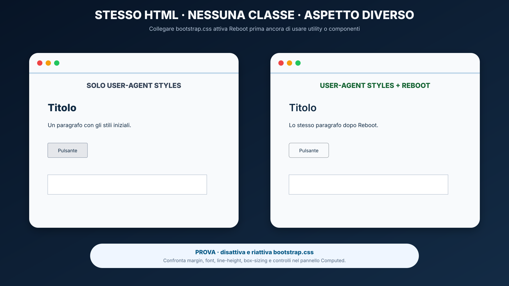
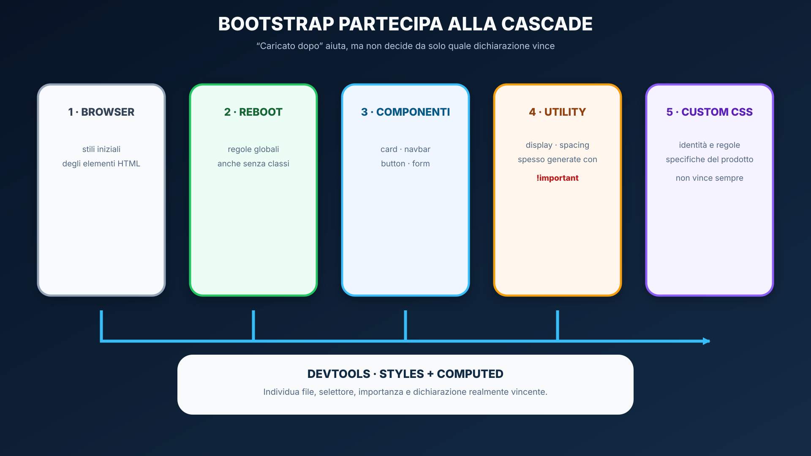
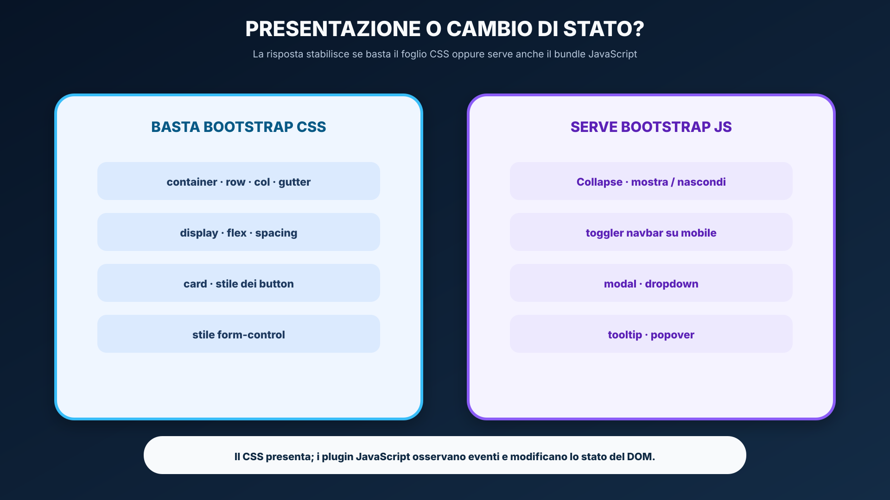
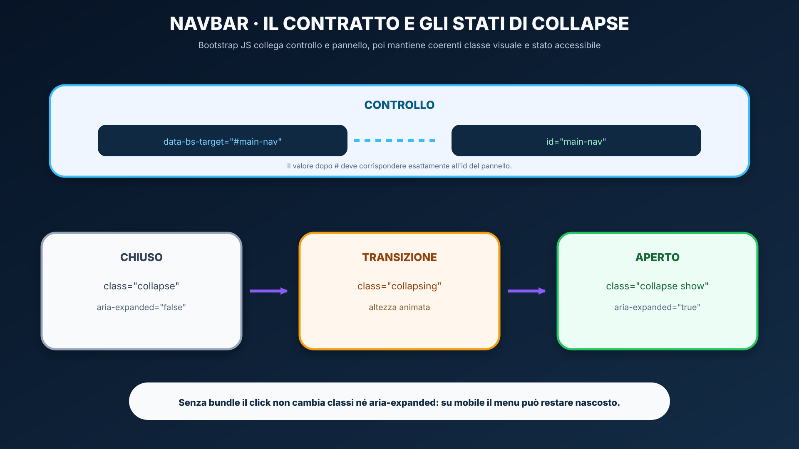
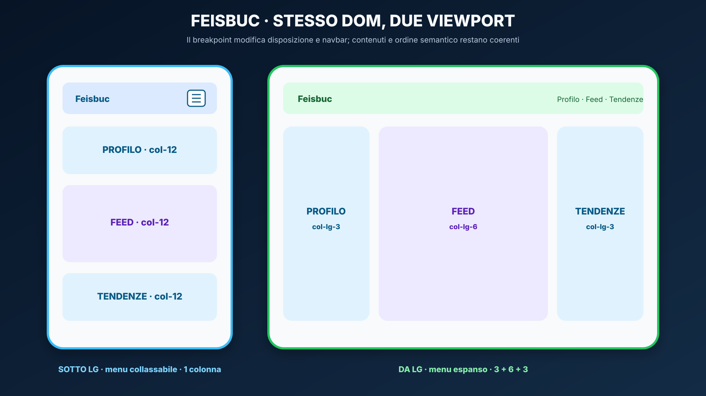

<a id="lesson-start"></a>
# Bootstrap: dal CSS nativo a un framework frontend

<a id="lesson-objectives"></a>
## In questa unità impareremo

<table align="center"><tr><td>
<details>
<summary>&#129517; <strong>Orientamento della sezione</strong></summary>

<p align="justify"><strong><span style="font-size: 1.15em;">&#128506;</span> Contesto:</strong>
nella lezione precedente abbiamo costruito layout con cascade, box model, Flexbox, Grid e media query. Ora osserviamo come Bootstrap organizza parte di quelle soluzioni in un linguaggio condiviso di classi e componenti.</p>

<p align="justify"><strong><span style="font-size: 1.15em;">&#10067;</span> Domande guida:</strong>
quale regola CSS si nasconde dietro una classe Bootstrap? Quando una convenzione del framework migliora il progetto? Quali responsabilità rimangono comunque allo sviluppatore?</p>

<p align="justify"><strong><span style="font-size: 1.15em;">&#127919;</span> Obiettivi:</strong>
Al termine lo studente dovrà saper:</p>
<ul>
  <li>spiegare che cosa offre un framework frontend e che cosa non sostituisce;</li>
  <li>caricare Bootstrap 5.3 tramite CDN e distinguere foglio CSS e bundle JavaScript;</li>
  <li>riconoscere gli effetti di Reboot;</li>
  <li>usare container, grid mobile-first, breakpoint, gutter e utility;</li>
  <li>leggere la grammatica delle utility e risalire al concetto CSS sottostante;</li>
  <li>costruire card, pulsanti e una navbar responsive conservando la semantica HTML;</li>
  <li>applicare lo stile Bootstrap a un form lasciando al browser la validazione nativa;</li>
  <li>distinguere componenti solo CSS da componenti interattivi;</li>
  <li>diagnosticare classi errate, bundle mancanti, target non corrispondenti e override inutili;</li>
  <li>motivare la scelta tra utility, componente Bootstrap e CSS personalizzato;</li>
  <li>rifattorizzare la shell Feisbuc senza perdere accessibilità e responsive design.</li>
</ul>

<p align="justify"><strong><span style="font-size: 1.15em;">&#129504;</span> Prerequisiti:</strong></p>
<ul>
  <li>aver completato <a href="02_CSS_MODERNO_RESPONSIVE.md">CSS moderno, layout e responsive design</a>;</li>
  <li>saper riconoscere Flexbox, Grid, media query, box model e specificità;</li>
  <li>saper usare HTML semantico e le funzioni essenziali dei DevTools;</li>
  <li>aver completato le Activity A–D dell'UDA 21.</li>
</ul>

<p align="justify"><strong><span style="font-size: 1.15em;">&#10145;</span> Prossimo passo:</strong>
nella lezione 04 aggiungeremo comportamento alla UI con JavaScript, DOM ed eventi.</p>

</details>
</td></tr></table>

<a id="lesson-docs-maps"></a>
## Orientamento nella documentazione Bootstrap e MDN

<p align="justify">La documentazione Bootstrap descrive il <strong>contratto pubblico del framework</strong>: classi, strutture, attributi, opzioni ed esempi. Qui la parola «API» non indica una REST API e non implica una comunicazione di rete: indica semplicemente ciò che il framework permette di usare. MDN spiega invece HTML, CSS e JavaScript sui quali Bootstrap è costruito. La dispensa collega le due prospettive e seleziona ciò che serve studiare ora.</p>

<table align="center"><tr><td>
<p align="justify"><strong><span style="font-size: 1.15em;">&#128506;</span> Come leggere i colori:</strong>
<strong>coperto</strong> indica un contenuto spiegato e richiesto; <strong>riconoscere</strong> una funzione da saper individuare nella documentazione; <strong>più avanti</strong> un argomento escluso dalla verifica attuale. Ogni stato è anche scritto, quindi il significato non dipende solo dal colore.</p>
</td></tr></table>

<a id="lesson-bootstrap-docs-map"></a>
<table align="center"><tr><td>
<details>
<summary>&#128506;&#65039; <strong>Mappa — dalla dispensa alla documentazione Bootstrap e MDN</strong></summary>

<p align="justify">La mappa mostra il percorso di studio: fondamenti e caricamento, layout, utility, componenti, form e responsabilità di accessibilità. Sass, theming avanzato e Bootstrap CSS Grid restano riconoscibili, ma fuori dal nucleo operativo della lezione.</p>

<p align="center">
  
</p>

</details>
</td></tr></table>

<a id="lesson-bootstrap-cross-index"></a>
<table align="center" width="100%"><tr><td>
<details>
<summary>&#128279; <strong>Indice incrociato navigabile — Dispensa ↔ Bootstrap e MDN</strong></summary>

<p align="justify">Ogni scheda collega un paragrafo della lezione alla fonte ufficiale pertinente. I titoli sono cliccabili; le descrizioni sintetiche sottostanti non lo sono.</p>
<p><strong>Legenda:</strong> &#128309; dispensa · &#128994; documentazione ufficiale · &#128993; riconoscere per dopo.</p>

<details>
<summary><strong>Fondamenti e caricamento</strong> · 4 voci</summary>

<blockquote>
<p><strong>01 · CORRISPONDENZA</strong></p>
<p><strong>&#128309; DISPENSA</strong><br><strong><a href="#lesson-bootstrap-framework">Bootstrap è costruito sulla Web Platform</a></strong></p>
<ul><li>Framework, contratto di classi e responsabilità di HTML, CSS e JavaScript.</li></ul>
<p><strong>&#128994; BOOTSTRAP / MDN</strong><br><strong><a href="https://getbootstrap.com/docs/5.3/getting-started/introduction/">Introduction</a></strong><br><strong><a href="https://developer.mozilla.org/en-US/docs/Learn_web_development/Getting_started/Web_standards/The_web_standards_model">The web standards model</a></strong></p>
<ul><li>Avvio del framework e tecnologie native sottostanti.</li></ul>
</blockquote>

<blockquote>
<p><strong>02 · CORRISPONDENZA</strong></p>
<p><strong>&#128309; DISPENSA</strong><br><strong><a href="#lesson-bootstrap-reboot">Reboot e stili globali</a></strong></p>
<ul><li>Stili globali, cascade, <code>box-sizing</code> e utility generate con <code>!important</code>.</li></ul>
<p><strong>&#128994; BOOTSTRAP</strong><br><strong><a href="https://getbootstrap.com/docs/5.3/content/reboot/">Reboot</a></strong></p>
<ul><li>Modifiche globali applicate agli elementi HTML.</li></ul>
</blockquote>

<blockquote>
<p><strong>03 · CORRISPONDENZA</strong></p>
<p><strong>&#128309; DISPENSA</strong><br><strong><a href="#lesson-bootstrap-loading">Caricare Bootstrap correttamente</a></strong></p>
<ul><li>Documento minimo, CSS nel <code>head</code> e bundle prima di <code>/body</code>.</li></ul>
<p><strong>&#128994; BOOTSTRAP</strong><br><strong><a href="https://getbootstrap.com/docs/5.3/getting-started/introduction/#quick-start">Quick start</a></strong><br><strong><a href="https://getbootstrap.com/docs/5.3/getting-started/javascript/">JavaScript</a></strong></p>
<ul><li>CDN, viewport, integrity e plugin interattivi.</li></ul>
</blockquote>

<blockquote>
<p><strong>04 · CORRISPONDENZA</strong></p>
<p><strong>&#128309; DISPENSA</strong><br><strong><a href="#lesson-bootstrap-doc-method">Metodo di consultazione</a></strong></p>
<ul><li>Dal problema all'esempio minimo e alla regola CSS reale.</li></ul>
<p><strong>&#128994; GUIDA DEL CORSO</strong><br><strong><a href="GUIDA_USO_MDN.md#mdn-guide-source-choice">Scegliere la fonte giusta</a></strong></p>
<ul><li>Bootstrap per l'API; MDN per la Web Platform.</li></ul>
</blockquote>

</details>

<details>
<summary><strong>Layout e utility</strong> · 4 voci</summary>

<blockquote>
<p><strong>05 · CORRISPONDENZA</strong></p>
<p><strong>&#128309; DISPENSA</strong><br><strong><a href="#lesson-bootstrap-containers">Container</a></strong></p>
<ul><li>Contenitori responsive, fluidi e vincolati a un breakpoint.</li></ul>
<p><strong>&#128994; BOOTSTRAP</strong><br><strong><a href="https://getbootstrap.com/docs/5.3/layout/containers/">Containers</a></strong></p>
<ul><li>Tipi di container e variazione di <code>max-width</code>.</li></ul>
</blockquote>

<blockquote>
<p><strong>06 · CORRISPONDENZA</strong></p>
<p><strong>&#128309; DISPENSA</strong><br><strong><a href="#lesson-bootstrap-grid">Grid Bootstrap: Flexbox e 12 colonne</a></strong></p>
<ul><li>Gerarchia container–row–column, proporzioni e gutter.</li></ul>
<p><strong>&#128994; BOOTSTRAP / MDN</strong><br><strong><a href="https://getbootstrap.com/docs/5.3/layout/grid/#how-it-works">Grid — How it works</a></strong><br><strong><a href="https://getbootstrap.com/docs/5.3/layout/grid/#responsive-classes">Grid — Responsive classes</a></strong><br><strong><a href="https://developer.mozilla.org/en-US/docs/Web/CSS/Guides/Flexible_box_layout/Basic_concepts">MDN — Concetti fondamentali di Flexbox</a></strong></p>
<ul><li>Griglia mobile-first basata su Flexbox, proporzioni e classi responsive.</li></ul>
</blockquote>

<blockquote>
<p><strong>07 · CORRISPONDENZA</strong></p>
<p><strong>&#128309; DISPENSA</strong><br><strong><a href="#lesson-bootstrap-breakpoints">Breakpoint guidati dal contenuto</a></strong></p>
<ul><li>Sei tier e applicazione mobile-first delle classi responsive.</li></ul>
<p><strong>&#128994; BOOTSTRAP / MDN</strong><br><strong><a href="https://getbootstrap.com/docs/5.3/layout/breakpoints/#available-breakpoints">Bootstrap — Available breakpoints</a></strong><br><strong><a href="https://developer.mozilla.org/en-US/docs/Web/CSS/Guides/Media_queries/Using">MDN — Usare le media query</a></strong></p>
<ul><li>Soglie <code>xs</code>–<code>xxl</code> e funzionamento delle media query <code>min-width</code>.</li></ul>
</blockquote>

<blockquote>
<p><strong>08 · CORRISPONDENZA</strong></p>
<p><strong>&#128309; DISPENSA</strong><br><strong><a href="#lesson-bootstrap-utilities">Utility: una grammatica di classi</a></strong></p>
<ul><li>Display, Flexbox, spacing e varianti responsive.</li></ul>
<p><strong>&#128994; BOOTSTRAP / MDN</strong><br><strong><a href="https://getbootstrap.com/docs/5.3/utilities/display/#notation">Display — Notation</a></strong><br><strong><a href="https://getbootstrap.com/docs/5.3/utilities/flex/#enable-flex-behaviors">Flex — Enable flex behaviors</a></strong><br><strong><a href="https://getbootstrap.com/docs/5.3/utilities/spacing/#notation">Spacing — Notation</a></strong><br><strong><a href="https://developer.mozilla.org/en-US/docs/Web/CSS/gap">MDN — <code>gap</code></a></strong></p>
<ul><li>Grammatica delle classi e proprietà CSS realmente applicate; la Sass Utilities API è rimandata.</li></ul>
</blockquote>

</details>

<details>
<summary><strong>Componenti, form e accessibilità</strong> · 4 voci</summary>

<blockquote>
<p><strong>09 · CORRISPONDENZA</strong></p>
<p><strong>&#128309; DISPENSA</strong><br><strong><a href="#lesson-bootstrap-components">Componenti: struttura, varianti e comportamento</a></strong></p>
<ul><li>Anatomia di card e button senza perdere la semantica.</li></ul>
<p><strong>&#128994; BOOTSTRAP / MDN</strong><br><strong><a href="https://getbootstrap.com/docs/5.3/components/card/#about">Card — About</a></strong><br><strong><a href="https://getbootstrap.com/docs/5.3/components/card/#body">Card — Body</a></strong><br><strong><a href="https://getbootstrap.com/docs/5.3/components/buttons/#button-tags">Buttons — Button tags</a></strong><br><strong><a href="https://developer.mozilla.org/en-US/docs/Web/HTML/Reference/Elements/button">MDN — <code>&lt;button&gt;</code></a></strong></p>
<ul><li>Markup, parti interne, varianti e scelta semantica tra pulsante e collegamento.</li></ul>
</blockquote>

<blockquote>
<p><strong>10 · CORRISPONDENZA</strong></p>
<p><strong>&#128309; DISPENSA</strong><br><strong><a href="#lesson-bootstrap-navbar">Navbar e plugin Collapse</a></strong></p>
<ul><li>Toggler, target, attributi ARIA e dipendenza JavaScript.</li></ul>
<p><strong>&#128994; BOOTSTRAP / MDN</strong><br><strong><a href="https://getbootstrap.com/docs/5.3/components/navbar/#how-it-works">Navbar — How it works</a></strong><br><strong><a href="https://getbootstrap.com/docs/5.3/components/navbar/#responsive-behaviors">Navbar — Responsive behaviors</a></strong><br><strong><a href="https://getbootstrap.com/docs/5.3/components/collapse/#how-it-works">Collapse — How it works</a></strong><br><strong><a href="https://developer.mozilla.org/en-US/docs/Web/HTML/How_to/Use_data_attributes">MDN — attributi <code>data-*</code></a></strong></p>
<ul><li>Componente responsive, target identificato dall'<code>id</code> e meccanismo interattivo.</li></ul>
</blockquote>

<blockquote>
<p><strong>11 · CORRISPONDENZA</strong></p>
<p><strong>&#128309; DISPENSA</strong><br><strong><a href="#lesson-bootstrap-forms">Form e validazione</a></strong></p>
<ul><li>Label, controlli e feedback nativo; riconoscimento della validazione personalizzata.</li></ul>
<p><strong>&#128994; BOOTSTRAP / MDN</strong><br><strong><a href="https://getbootstrap.com/docs/5.3/forms/overview/#overview">Forms — Overview</a></strong><br><strong><a href="https://getbootstrap.com/docs/5.3/forms/overview/#accessibility">Forms — Accessibility</a></strong><br><strong><a href="https://developer.mozilla.org/en-US/docs/Learn_web_development/Extensions/Forms/Form_validation">MDN — validazione dei form</a></strong></p>
<ul><li>Stile dei controlli, contratto HTML e validazione nativa; il feedback JavaScript custom è rimandato.</li></ul>
</blockquote>

<blockquote>
<p><strong>12 · CORRISPONDENZA</strong></p>
<p><strong>&#128309; DISPENSA</strong><br><strong><a href="#lesson-bootstrap-accessibility">Accessibilità: responsabilità condivise</a></strong></p>
<ul><li>Semantica, tastiera, focus, contrasto e test.</li></ul>
<p><strong>&#128994; BOOTSTRAP</strong><br><strong><a href="https://getbootstrap.com/docs/5.3/getting-started/accessibility/">Accessibility</a></strong></p>
<ul><li>Supporto offerto dal framework e lavoro richiesto all'autore.</li></ul>
</blockquote>

</details>

<details>
<summary><strong>Applicazione e confini</strong> · 3 voci</summary>

<blockquote>
<p><strong>13 · CORRISPONDENZA</strong></p>
<p><strong>&#128309; DISPENSA</strong><br><strong><a href="#lesson-bootstrap-choice">Bootstrap o CSS personalizzato?</a></strong></p>
<ul><li>Criteri per utility, componenti, classi proprie e class soup.</li></ul>
<p><strong>&#128994; BOOTSTRAP</strong><br><strong><a href="https://getbootstrap.com/docs/5.3/customize/overview/">Customize</a></strong></p>
<ul><li>Panoramica da riconoscere, non richiesta in autonomia.</li></ul>
</blockquote>

<blockquote>
<p><strong>14 · CORRISPONDENZA</strong></p>
<p><strong>&#128309; DISPENSA</strong><br><strong><a href="#lesson-bootstrap-feisbuc">Feisbuc: migrazione controllata</a></strong></p>
<ul><li>Dalla shell CSS nativa alla milestone Bootstrap documentata.</li></ul>
<p><strong>&#128994; DOCUMENTAZIONE</strong><br><em>Nessuna pagina unica: l'attività integra layout, utility, componenti e accessibilità.</em></p>
</blockquote>

<blockquote>
<p><strong>15 · FUORI DAL NUCLEO</strong></p>
<p><strong>&#128309; DISPENSA</strong><br><em>Nessun paragrafo operativo in questa lezione.</em></p>
<p><strong>&#128993; BOOTSTRAP</strong><br><strong><a href="https://getbootstrap.com/docs/5.3/layout/css-grid/">CSS Grid</a></strong><br><strong><a href="https://getbootstrap.com/docs/5.3/utilities/api/">Utility API</a></strong></p>
<ul><li>Bootstrap CSS Grid opzionale e personalizzazione Sass: riconoscere per dopo.</li></ul>
</blockquote>

</details>

</details>
</td></tr></table>

<a id="lesson-bootstrap-reference-map"></a>
<table align="center"><tr><td>
<details>
<summary>&#128218; <strong>Mappa delle schede tecniche — classi e componenti della lezione</strong></summary>

<table align="center">
<thead><tr><th>Famiglia</th><th>Studiare ora</th><th>Riconoscere per dopo</th></tr></thead>
<tbody>
<tr><td>Caricamento</td><td><a href="https://getbootstrap.com/docs/5.3/getting-started/introduction/">CDN e quick start</a></td><td>Installazione npm</td></tr>
<tr><td>Layout</td><td><a href="https://getbootstrap.com/docs/5.3/layout/containers/">container</a>, <a href="https://getbootstrap.com/docs/5.3/layout/grid/">row e col</a></td><td><a href="https://getbootstrap.com/docs/5.3/layout/css-grid/">Bootstrap CSS Grid</a></td></tr>
<tr><td>Utility</td><td><a href="https://getbootstrap.com/docs/5.3/utilities/display/">display</a>, <a href="https://getbootstrap.com/docs/5.3/utilities/flex/">flex</a>, <a href="https://getbootstrap.com/docs/5.3/utilities/spacing/">spacing</a>, <a href="https://getbootstrap.com/docs/5.3/utilities/borders/">border</a>, <a href="https://getbootstrap.com/docs/5.3/utilities/background/">background</a>, <a href="https://getbootstrap.com/docs/5.3/utilities/sizing/">sizing</a></td><td><a href="https://getbootstrap.com/docs/5.3/utilities/api/">Sass Utilities API</a></td></tr>
<tr><td>Componenti</td><td><a href="https://getbootstrap.com/docs/5.3/components/card/">card</a>, <a href="https://getbootstrap.com/docs/5.3/components/buttons/">button</a>, <a href="https://getbootstrap.com/docs/5.3/components/list-group/">list group</a>, <a href="https://getbootstrap.com/docs/5.3/components/navbar/">navbar</a>, <a href="https://getbootstrap.com/docs/5.3/components/collapse/">collapse</a></td><td>Temi e plugin esterni</td></tr>
<tr><td>Form</td><td><a href="https://getbootstrap.com/docs/5.3/forms/form-control/">form-control</a>, <a href="https://getbootstrap.com/docs/5.3/forms/validation/">validation</a></td><td>Validazione asincrona</td></tr>
</tbody>
</table>

</details>
</td></tr></table>

<table align="center"><tr><td>
<details>
<summary>&#128218; <strong>Glossario operativo — le parole da saper spiegare</strong></summary>
<ul>
  <li><strong>toolkit:</strong> insieme coordinato di strumenti riutilizzabili; Bootstrap usa questo termine per descriversi;</li>
  <li><strong>framework frontend:</strong> convenzioni, CSS e plugin che guidano la costruzione dell'interfaccia;</li>
  <li><strong>utility:</strong> classe che applica una responsabilità piccola, per esempio display o spacing;</li>
  <li><strong>componente:</strong> struttura documentata composta da più parti, stati e varianti;</li>
  <li><strong>breakpoint:</strong> soglia di viewport alla quale entra in vigore una variante responsive;</li>
  <li><strong>gutter:</strong> spazio fra le colonne della grid Bootstrap;</li>
  <li><strong>bundle:</strong> file JavaScript che raggruppa i plugin Bootstrap e, nella versione bundle, Popper;</li>
  <li><strong>CDN:</strong> rete dalla quale il browser può scaricare asset già pubblicati;</li>
  <li><strong>Reboot:</strong> base di stili globali che rende più coerenti i valori iniziali;</li>
  <li><strong>Collapse:</strong> plugin che gestisce apertura e chiusura di un pannello;</li>
  <li><strong>SRI / <code>integrity</code>:</strong> verifica crittografica dell'asset ricevuto da una fonte esterna.</li>
</ul>
</details>
</td></tr></table>

<a id="lesson-bootstrap-problem"></a>
## Problema iniziale: riusare senza perdere comprensione

<p align="justify">Nella lezione precedente abbiamo scritto direttamente una shell responsive:</p>

```css
.page-shell {
  display: grid;
  grid-template-columns: 1fr;
  gap: 1rem;
}

@media (min-width: 56rem) {
  .page-shell {
    grid-template-columns: minmax(0, 1fr) minmax(0, 2fr) minmax(0, 1fr);
  }
}
```

<p align="justify">Molte applicazioni ripetono però famiglie di soluzioni già note: contenitori centrati, colonne responsive, spaziature, pulsanti, navbar, card e form. Riscriverle ogni volta può rallentare il lavoro e produrre convenzioni diverse tra membri dello stesso team.</p>

<table align="center"><tr><td>
<p align="justify"><strong><span style="font-size: 1.15em;">&#128161;</span> Domanda centrale:</strong>
non chiederti soltanto «quale classe devo ricordare?», ma «quale problema sto delegando al framework e quale concetto CSS applica quella classe?».</p>
</td></tr></table>

<table align="center"><tr><td>
<details>
<summary>&#128337; <strong>Articolazione suggerita — 3 incontri, 6 ore</strong></summary>
<ul>
  <li><strong>Arco 1 — fondamenti e layout:</strong> framework, Reboot, cascade, caricamento, container, grid, breakpoint e gutter;</li>
  <li><strong>Arco 2 — dal CSS alle classi:</strong> grammatica delle utility, componenti, pulsanti, scelta fra framework e CSS custom;</li>
  <li><strong>Arco 3 — interazione e applicazione:</strong> navbar/Collapse, accessibilità, debug e migrazione Feisbuc.</li>
</ul>
<p align="justify">I form vengono mostrati soltanto per collegare stile Bootstrap e contratto HTML. La validazione personalizzata con DOM ed eventi appartiene alla lezione 04.</p>
</details>
</td></tr></table>

<a id="lesson-bootstrap-framework"></a>
## Bootstrap è costruito sulla Web Platform

<p align="justify">Un <strong>framework frontend</strong> è un insieme coordinato di convenzioni, fogli di stile e, quando serve, script che offre soluzioni riutilizzabili. Bootstrap espone un <strong>contratto di classi, strutture e attributi pubblici</strong>: lo sviluppatore usa nomi documentati e il browser applica il CSS già compilato del framework; soltanto i componenti interattivi coinvolgono anche JavaScript.</p>

<p align="center">
  
</p>

<p align="justify">Per esempio, il markup:</p>

```html
<div class="d-flex gap-3">
```

<p align="justify">non introduce un nuovo motore di layout e non invia richieste a un server. Nel foglio Bootstrap esistono già selettori come <code>.d-flex</code>: il browser confronta i selettori con il valore dell'attributo <code>class</code> e applica <code>display: flex</code>. <code>gap-3</code> seleziona invece un valore dalla scala di spaziatura del framework. Per i componenti JavaScript, lo script Bootstrap legge anche attributi <code>data-bs-*</code> e modifica classi e attributi del DOM.</p>

<table align="center"><tr><td>
<p align="justify"><strong><span style="font-size: 1.15em;">&#128214;</span> Definizione — astrazione:</strong>
Bootstrap nasconde alcuni dettagli ripetitivi dietro nomi e strutture condivise, ma non elimina i meccanismi sottostanti. Per fare debug bisogna ancora comprendere HTML, cascade, box model, Flexbox, media query e JavaScript.</p>
</td></tr></table>

### Un esempio cumulativo, una responsabilità alla volta

<p align="justify">Per non trasformare la lezione in una collezione di frammenti scollegati, faremo evolvere sempre lo stesso post Feisbuc. Ogni passaggio deve lasciare intatta la semantica e aggiungere una sola responsabilità verificabile.</p>

<table align="center">
<thead><tr><th>Passaggio</th><th>Cambiamento</th><th>Prova</th></tr></thead>
<tbody>
<tr><td>0 · HTML</td><td><code>article</code>, heading, testo e <code>button</code> senza Bootstrap</td><td>struttura leggibile anche senza CSS</td></tr>
<tr><td>1 · componente</td><td><code>card</code>, <code>card-body</code>, <code>card-title</code></td><td>box e spazi interni compaiono</td></tr>
<tr><td>2 · utility</td><td><code>mb-3</code>, <code>d-flex</code>, <code>gap-2</code></td><td>Computed mostra margin, display e gap</td></tr>
<tr><td>3 · layout</td><td>il post entra in <code>row</code> e <code>col-*</code></td><td>la proporzione cambia al breakpoint previsto</td></tr>
<tr><td>4 · interazione</td><td>la pagina riceve navbar e Collapse</td><td>tastiera, classi e <code>aria-expanded</code> cambiano insieme</td></tr>
</tbody>
</table>

<p align="justify">Dopo ogni passaggio rispondi a tre domande: quale problema ho risolto? Quale meccanismo Web Platform è attivo? Quale evidenza nel browser lo dimostra?</p>

<table align="center"><tr><td>
<p align="justify"><strong><span style="font-size: 1.15em;">&#9888;</span> Attenzione — non è la REST API della lezione 00:</strong>
qui «interfaccia pubblica» significa un contratto usato nel codice della stessa pagina. Non ci sono endpoint, HTTP, JSON, richiesta o risposta. Quando incontreremo una REST API, il client comunicherà invece con un server attraverso la rete.</p>
</td></tr></table>

<a id="lesson-bootstrap-reboot"></a>
## Reboot e stili globali

<p align="justify">Prima ancora di aggiungere una classe, il CSS di Bootstrap modifica alcuni stili predefiniti degli elementi. Questa base si chiama <strong>Reboot</strong>, deriva da Normalize.css e rende più coerente il punto di partenza tra browser.</p>

<p align="justify">Fra gli effetti da osservare ci sono il <code>box-sizing: border-box</code> globale, le impostazioni di base del <code>body</code>, la tipografia e valori iniziali più coerenti per titoli, paragrafi, tabelle e form. Per questo una pagina può cambiare aspetto appena si collega Bootstrap, anche senza classi specifiche.</p>

<p align="center">
  
</p>

<p align="justify"><strong>Prova controllata:</strong> apri lo stesso documento in due schede, collega Bootstrap soltanto nella seconda e non aggiungere classi. Confronta nel pannello <em>Computed</em> margin, font, line-height, <code>box-sizing</code> e controlli. Registra proprietà, valore prima, valore dopo e regola sorgente: l'immagine anticipa il metodo, non sostituisce la prova nel browser.</p>

<p align="justify">Dopo Reboot, tutte le dichiarazioni partecipano alla stessa <strong>cascade CSS</strong>. Caricare <code>custom.css</code> dopo Bootstrap aiuta soltanto quando origine, importanza, livello e specificità consentono alla regola successiva di vincere. Molte utility Bootstrap di spaziatura e display sono generate con <code>!important</code>: una normale dichiarazione custom caricata dopo può quindi non sostituirle.</p>

<p align="center">
  
</p>

<ol>
  <li><strong>stili del browser:</strong> il punto di partenza nativo;</li>
  <li><strong>Reboot:</strong> le regole globali introdotte dal framework;</li>
  <li><strong>componenti Bootstrap:</strong> regole associate a strutture come card e navbar;</li>
  <li><strong>utility:</strong> dichiarazioni mirate, spesso generate con <code>!important</code>;</li>
  <li><strong>CSS custom:</strong> identità e requisiti del prodotto, non una gara di specificità.</li>
</ol>

<table align="center"><tr><td>
<p align="justify"><strong><span style="font-size: 1.15em;">&#9888;</span> Attenzione:</strong>
«non ho usato classi Bootstrap» non significa «Bootstrap non ha effetto». Inoltre, aggiungere <code>!important</code> al proprio CSS senza conoscere la dichiarazione vincente nasconde il problema. Con DevTools confronta gli stili computati, individua file, selettore e motivo della vittoria nella cascade.</p>
</td></tr></table>

<p align="justify">Riferimenti: <a href="https://getbootstrap.com/docs/5.3/content/reboot/">Bootstrap — Reboot</a>, <a href="https://getbootstrap.com/docs/5.3/utilities/spacing/#sass-maps">Bootstrap — mappa Sass delle utility di spacing</a> e <a href="https://developer.mozilla.org/en-US/docs/Web/CSS/Reference/Values/important">MDN — <code>!important</code></a>.</p>

<a id="lesson-bootstrap-loading"></a>
## Caricare Bootstrap correttamente

<p align="justify">Per gli esempi iniziali usiamo Bootstrap 5.3.8 tramite CDN. Il foglio CSS va nel <code>head</code>; il file <code>custom.css</code> viene dopo, così le personalizzazioni normali possono partecipare correttamente alla cascade. Il bundle JavaScript va caricato prima della chiusura di <code>body</code> quando servono componenti interattivi.</p>

```html
<!doctype html>
<html lang="it">
<head>
  <meta charset="utf-8">
  <meta name="viewport" content="width=device-width, initial-scale=1">
  <title>Feisbuc</title>
  <link
    href="https://cdn.jsdelivr.net/npm/bootstrap@5.3.8/dist/css/bootstrap.min.css"
    rel="stylesheet"
    integrity="sha384-sRIl4kxILFvY47J16cr9ZwB07vP4J8+LH7qKQnuqkuIAvNWLzeN8tE5YBujZqJLB"
    crossorigin="anonymous"
  >
  <link rel="stylesheet" href="custom.css">
</head>
<body>
  <main class="container py-4">
    <h1>Feisbuc</h1>
  </main>

  <script
    src="https://cdn.jsdelivr.net/npm/bootstrap@5.3.8/dist/js/bootstrap.bundle.min.js"
    integrity="sha384-FKyoEForCGlyvwx9Hj09JcYn3nv7wiPVlz7YYwJrWVcXK/BmnVDxM+D2scQbITxI"
    crossorigin="anonymous"
  ></script>
</body>
</html>
```

<p align="justify"><code>integrity</code> consente al browser di verificare che la risorsa ricevuta corrisponda a quella attesa; <code>crossorigin="anonymous"</code> completa la configurazione necessaria al controllo per questa risorsa esterna. Il file <code>bootstrap.bundle.min.js</code> include anche Popper: serve ai componenti che devono posizionare elementi flottanti, per esempio dropdown, tooltip e popover; <strong>non è Popper ad aprire Collapse</strong>.</p>

### Uso offline

<p align="justify">Il modello didattico non dipende dal CDN. In laboratorio si possono distribuire i file compilati ufficiali e sostituire gli URL con percorsi locali. L'installazione tramite npm verrà affrontata dopo l'introduzione degli strumenti di progetto.</p>

<a id="lesson-bootstrap-doc-method"></a>
## Metodo di consultazione: dalla necessità alla regola reale

<ol>
  <li>descrivi il problema senza nominare una classe;</li>
  <li>scegli nella documentazione Bootstrap la famiglia pertinente;</li>
  <li>leggi introduzione, esempio minimo e note di accessibilità;</li>
  <li>prova l'esempio isolato e ridimensionalo;</li>
  <li>ispeziona in DevTools le regole CSS e gli eventuali attributi/stati JavaScript;</li>
  <li>consulta MDN se il meccanismo nativo non è chiaro;</li>
  <li>adatta il pattern conservando semantica e requisiti del progetto.</li>
</ol>

<table align="center"><tr><td>
<p align="justify"><strong><span style="font-size: 1.15em;">&#128279;</span> Due documentazioni, due responsabilità:</strong>
per <code>.d-flex</code> parti dalla pagina Bootstrap sulle utility Flex; per comprendere davvero <code>display: flex</code> usa MDN. Consulta anche <a href="GUIDA_USO_MDN.md#mdn-guide-source-choice">come scegliere la fonte nel corso full stack</a>.</p>
<p align="justify"><strong>Prodotto atteso:</strong> per ogni nuova classe annota problema risolto, classe Bootstrap e concetto Web Platform sottostante.</p>
</td></tr></table>

<a id="lesson-bootstrap-containers"></a>
## Container: delimitare lo spazio della pagina

<p align="justify">Il container è il livello esterno del sistema di layout. Fornisce padding orizzontale e decide se la larghezza deve essere fluida o limitata. Bootstrap offre tre famiglie:</p>

<ul>
  <li><code>.container</code>: larghezza massima che cambia ai breakpoint;</li>
  <li><code>.container-fluid</code>: larghezza sempre pari al 100% dello spazio disponibile;</li>
  <li><code>.container-{breakpoint}</code>: fluido fino alla soglia indicata, poi soggetto a <code>max-width</code>.</li>
</ul>

```html
<main class="container py-4">
  <!-- contenuto centrato e responsive -->
</main>
```

<p align="justify">Il problema è simile a quello affrontato con CSS nativo:</p>

```css
main {
  width: min(100% - 2rem, 75rem);
  margin-inline: auto;
}
```

<p align="justify">Le implementazioni non sono identiche: Bootstrap usa proprie soglie e larghezze massime. La scelta del container viene prima delle colonne perché stabilisce quanto spazio può usare l'intero layout.</p>

<a id="lesson-bootstrap-grid"></a>
## Grid Bootstrap: Flexbox e 12 colonne

<p align="justify">La <strong>grid predefinita di Bootstrap è un sistema mobile-first basato su Flexbox</strong>. Non va confusa né con CSS Grid studiato nella lezione 02 né con l'alternativa opzionale «Bootstrap CSS Grid». Divide idealmente ogni riga in 12 parti, così le colonne possono esprimere proporzioni con numeri interi.</p>

<p align="center">
  
</p>

```html
<main class="container py-4">
  <div class="row g-3">
    <aside class="col-12 col-lg-3">Profilo</aside>
    <section class="col-12 col-lg-6">Feed</section>
    <aside class="col-12 col-lg-3">Tendenze</aside>
  </div>
</main>
```

<p align="justify">La gerarchia si legge dall'esterno verso l'interno:</p>

<ul>
  <li><code>container</code> limita e centra l'area di lavoro;</li>
  <li><code>row</code> crea una riga Flexbox che avvolge le colonne;</li>
  <li><code>col-12</code> occupa 12 parti su 12 dalla soglia minima;</li>
  <li><code>col-lg-3</code> e <code>col-lg-6</code> sostituiscono quella larghezza da <code>lg</code> in avanti;</li>
  <li><code>g-3</code> imposta il gutter orizzontale e verticale con la scala Bootstrap.</li>
</ul>

<p align="justify">Le colonne usano padding per creare il gutter; la riga compensa il padding esterno secondo il modello del framework. Per questo una <code>col-*</code> dovrebbe essere figlia di una <code>row</code>. Se la somma supera 12, le colonne eccedenti vanno a capo.</p>

<p align="justify">Prima del layout Feisbuc conviene costruire tre casi minimi. La classe <code>col</code> distribuisce in parti uguali lo spazio disponibile; <code>col-6</code> assegna sei dodicesimi; <code>col-12 col-lg-6</code> occupa l'intera riga e diventa metà riga da <code>lg</code>.</p>

```html
<!-- colonne automatiche: 6 + 6 -->
<div class="row">
  <div class="col">A</div>
  <div class="col">B</div>
</div>

<!-- proporzione esplicita: 6 + 6 = 12 -->
<div class="row">
  <div class="col-6">A</div>
  <div class="col-6">B</div>
</div>

<!-- una colonna, poi due colonne da lg -->
<div class="row">
  <div class="col-12 col-lg-6">A</div>
  <div class="col-12 col-lg-6">B</div>
</div>
```

<table align="center">
<thead><tr><th>Somma nella riga</th><th>Risultato</th><th>Domanda da farsi</th></tr></thead>
<tbody>
<tr><td>minore di 12</td><td>resta spazio libero</td><td>lo spazio è intenzionale?</td></tr>
<tr><td>uguale a 12</td><td>la riga è occupata completamente</td><td>la proporzione comunica la priorità?</td></tr>
<tr><td>maggiore di 12</td><td>la colonna eccedente va a capo</td><td>è un comportamento voluto o un errore?</td></tr>
</tbody>
</table>

### Gutter: lo spazio tra le colonne

<p align="justify">Il <strong>gutter</strong> è lo spazio interno tra le colonne. Nella configurazione predefinita di Bootstrap vale <code>1.5rem</code>, ma può essere modificato. <code>g-*</code> controlla entrambi gli assi, <code>gx-*</code> quello orizzontale e <code>gy-*</code> quello verticale; <code>g-0</code> azzera il gutter.</p>

```html
<div class="row gx-4 gy-2">
  <div class="col-12 col-md-6">A</div>
  <div class="col-12 col-md-6">B</div>
</div>
```

<p align="justify">Non aggiungere margini casuali alle colonne per simulare il gutter: si sommerebbero al meccanismo della riga. Per collezioni di elementi tutti equivalenti, come una galleria di card, si può anche <strong>riconoscere</strong> <code>row-cols-*</code>; nesting e ordinamento delle colonne restano fuori dal nucleo operativo.</p>

<table align="center"><tr><td>
<p align="justify"><strong><span style="font-size: 1.15em;">&#128214;</span> Modello mentale — mobile-first:</strong>
le classi senza infisso di breakpoint valgono sempre; una classe con <code>lg</code> entra in vigore da <code>lg</code> e continua alle larghezze maggiori finché non viene sostituita.</p>
</td></tr></table>

<table align="center"><tr><td>
<p align="justify"><strong><span style="font-size: 1.15em;">&#9888;</span> Attenzione — ordine visuale e ordine del documento:</strong>
le utility di ordinamento Flexbox possono spostare visivamente una colonna senza cambiare l'ordine del DOM. Tastiera e tecnologie assistive possono continuare a seguire l'ordine sorgente: in questa lezione preferiamo quindi un DOM già coerente.</p>
</td></tr></table>

<p align="justify">Riferimenti puntuali: <a href="https://getbootstrap.com/docs/5.3/layout/grid/#grid-options">Grid options</a>, <a href="https://getbootstrap.com/docs/5.3/layout/grid/#responsive-classes">Responsive classes</a>, <a href="https://getbootstrap.com/docs/5.3/layout/gutters/#how-they-work">Gutters — How they work</a> e <a href="https://getbootstrap.com/docs/5.3/layout/gutters/#horizontal-gutters">Horizontal gutters</a>.</p>

<a id="lesson-bootstrap-breakpoints"></a>
## Breakpoint guidati dal contenuto

<p align="justify">I breakpoint non identificano dispositivi reali. Indicano soglie di larghezza alle quali il contenuto dispone di spazio sufficiente per cambiare organizzazione.</p>

<table align="center">
<thead><tr><th>Tier</th><th>Infisso</th><th>Inizio</th><th>Esempio</th></tr></thead>
<tbody>
<tr><td>Extra small</td><td>nessuno</td><td>&lt; 576 px</td><td><code>col-12</code></td></tr>
<tr><td>Small</td><td><code>sm</code></td><td>≥ 576 px</td><td><code>col-sm-6</code></td></tr>
<tr><td>Medium</td><td><code>md</code></td><td>≥ 768 px</td><td><code>d-md-flex</code></td></tr>
<tr><td>Large</td><td><code>lg</code></td><td>≥ 992 px</td><td><code>col-lg-3</code></td></tr>
<tr><td>Extra large</td><td><code>xl</code></td><td>≥ 1200 px</td><td><code>container-xl</code></td></tr>
<tr><td>Extra extra large</td><td><code>xxl</code></td><td>≥ 1400 px</td><td><code>col-xxl-2</code></td></tr>
</tbody>
</table>

<p align="justify">Quindi <code>lg</code> non significa «laptop»: significa «da 992 CSS pixel in su». Il test corretto consiste nel ridimensionare gradualmente la viewport e osservare quando il contenuto ha davvero bisogno di cambiare.</p>

<a id="lesson-bootstrap-utilities"></a>
## Utility: una grammatica di classi

<p align="justify">Una utility applica una responsabilità CSS piccola e dichiarativa. I nomi non sono casuali: combinano spesso <strong>proprietà</strong>, eventuale <strong>lato</strong>, eventuale <strong>breakpoint</strong> e <strong>valore</strong>.</p>

<p align="center">
  
</p>

<table align="center">
<thead><tr><th>Classe</th><th>Come si legge</th><th>Concetto CSS</th></tr></thead>
<tbody>
<tr><td><code>d-flex</code></td><td>display = flex</td><td><code>display: flex</code></td></tr>
<tr><td><code>d-md-flex</code></td><td>display = flex da <code>md</code></td><td>media query + <code>display</code></td></tr>
<tr><td><code>flex-wrap</code></td><td>flex wrap</td><td><code>flex-wrap: wrap</code></td></tr>
<tr><td><code>align-items-center</code></td><td>allinea gli item al centro</td><td><code>align-items: center</code></td></tr>
<tr><td><code>p-3</code></td><td>padding, valore 3</td><td>padding dalla scala Bootstrap</td></tr>
<tr><td><code>mb-3</code></td><td>margin bottom, valore 3</td><td>margine inferiore dalla scala</td></tr>
<tr><td><code>px-lg-4</code></td><td>padding inline da <code>lg</code>, valore 4</td><td>media query + padding sinistro e destro</td></tr>
<tr><td><code>m-0</code></td><td>margin su tutti i lati = 0</td><td><code>margin: 0</code></td></tr>
<tr><td><code>ms-auto</code></td><td>margin sul lato iniziale = auto</td><td>spinge l'elemento lungo l'asse disponibile</td></tr>
<tr><td><code>gap-2</code></td><td>gap, valore 2</td><td>spazio tra item dalla scala</td></tr>
<tr><td><code>d-none d-md-block</code></td><td>nascosto, poi block da <code>md</code></td><td>display + media query</td></tr>
</tbody>
</table>

<p align="justify">Per margin e padding, la forma generale è <code>{proprietà}{lato}-{breakpoint?}-{valore}</code>. Le proprietà sono <code>m</code> e <code>p</code>; i lati sono <code>t</code> (top), <code>b</code> (bottom), <code>s</code> (start), <code>e</code> (end), <code>x</code> (asse orizzontale) e <code>y</code> (asse verticale). <code>s</code> ed <code>e</code> significano <strong>inizio e fine logici</strong>, non sempre sinistra e destra: si adattano alla direzione di scrittura.</p>

<p align="justify">I valori predefiniti di spacing sono <code>0</code>–<code>5</code>; per i margini è disponibile anche <code>auto</code>. Nella configurazione standard <code>3</code> corrisponde a <code>1rem</code>, ma il progetto può personalizzare la scala Sass: il nome esprime quindi una posizione nella scala, non un'unità universale.</p>

```html
<div class="d-flex flex-column flex-md-row gap-3 align-items-md-center">
  ...
</div>
```

<p align="justify">Prima di <code>md</code> gli elementi sono in colonna; da <code>md</code> diventano una riga e vengono allineati sull'asse trasversale. Le utility responsive fanno quindi la stessa famiglia di lavoro delle media query, ma tramite una convenzione predefinita.</p>

<table align="center"><tr><td>
<p align="justify"><strong><span style="font-size: 1.15em;">&#9888;</span> Attenzione — scala, non pixel:</strong>
il numero <code>3</code> non significa 3 px. Seleziona un valore dalla scala di Bootstrap. Consulta la pagina della famiglia prima di dedurne il risultato.</p>
</td></tr></table>

<table align="center"><tr><td>
<p align="justify"><strong><span style="font-size: 1.15em;">&#128161;</span> Metodo — prevedi, prova, spiega:</strong>
prima di aprire il browser, descrivi a parole l'effetto di <code>d-none d-md-block</code> o <code>px-lg-4</code>; poi ridimensiona la viewport e verifica nei pannelli <em>Styles</em> e <em>Computed</em> quale regola è attiva. La previsione trasforma la classe da formula da memorizzare a comportamento compreso.</p>
</td></tr></table>

<p align="justify">La grammatica aiuta, ma non tutte le famiglie hanno la stessa sintassi. Prima di inventare una classe, controlla la pagina specifica: <a href="https://getbootstrap.com/docs/5.3/utilities/spacing/#notation">Spacing — Notation</a>, <a href="https://getbootstrap.com/docs/5.3/utilities/spacing/#gap">Gap</a>, <a href="https://getbootstrap.com/docs/5.3/utilities/display/#notation">Display — Notation</a> e <a href="https://getbootstrap.com/docs/5.3/utilities/flex/#responsive-variations">Flex — Responsive variations</a>.</p>

<a id="lesson-bootstrap-components"></a>
## Componenti: struttura, varianti e comportamento

<p align="justify">Un componente combina più regole e spesso richiede una <strong>struttura interna documentata</strong>. Conviene leggerlo in tre strati: markup semantico scelto dall'autore, classi e parti previste da Bootstrap, eventuale comportamento JavaScript.</p>

<p align="center">
  
</p>

### Card

<p align="justify">Una card è un contenitore visuale flessibile. Non impone il significato dell'elemento esterno e non aggiunge margini automaticamente. Un post resta quindi un <code>article</code>:</p>

```html
<article class="card mb-3">
  <div class="card-body">
    <h2 class="card-title h5">Titolo del post</h2>
    <p class="card-text">Contenuto del post.</p>
    <button class="btn btn-outline-primary" type="button">Mi piace</button>
  </div>
</article>
```

<ul>
  <li><code>card</code> definisce il contenitore;</li>
  <li><code>card-body</code> gestisce la zona interna e il padding;</li>
  <li><code>card-title</code> e <code>card-text</code> applicano stili coerenti;</li>
  <li><code>h5</code> cambia la scala visuale, non il livello semantico <code>h2</code>;</li>
  <li><code>mb-3</code> separa questa card dalla successiva.</li>
</ul>

### Button

<p align="justify"><code>btn</code> fornisce la base, mentre <code>btn-primary</code> o <code>btn-outline-primary</code> esprimono una variante. La classe decide l'aspetto; l'elemento decide il significato:</p>

<ul>
  <li>usa <code>&lt;button type="button"&gt;</code> per un'azione nella pagina che non invia un form;</li>
  <li>usa <code>&lt;button type="submit"&gt;</code> per inviare un form;</li>
  <li>usa <code>&lt;a href="..."&gt;</code> per raggiungere una risorsa o una destinazione;</li>
  <li>non affidare soltanto al colore la distinzione fra azione principale, pericolo e stato disabilitato.</li>
</ul>

```html
<button class="btn btn-primary" type="button">Mi piace</button>
<a class="btn btn-outline-primary" href="/profilo">Apri il profilo</a>
```

<p align="justify">Riferimenti puntuali: <a href="https://getbootstrap.com/docs/5.3/components/card/#about">Card — About</a>, <a href="https://getbootstrap.com/docs/5.3/components/card/#body">Card — Body</a>, <a href="https://getbootstrap.com/docs/5.3/components/buttons/#button-tags">Buttons — Button tags</a> e <a href="https://developer.mozilla.org/en-US/docs/Web/HTML/Reference/Elements/button">MDN — elemento <code>&lt;button&gt;</code></a>.</p>

### Quali componenti richiedono JavaScript?

<p align="justify">Bootstrap CSS può presentare un componente senza renderlo interattivo. La domanda corretta non è «questo componente è Bootstrap?», ma «il suo stato deve cambiare in risposta all'utente?».</p>

<p align="center">
  
</p>

<table align="center">
<thead><tr><th>Solo CSS per il compito corrente</th><th>Richiede il JavaScript Bootstrap</th></tr></thead>
<tbody>
<tr><td>container, grid e gutter</td><td>apertura e chiusura di Collapse</td></tr>
<tr><td>utility display, Flexbox e spacing</td><td>toggler della navbar su viewport stretta</td></tr>
<tr><td>card e stile dei button</td><td>dropdown, modal, tooltip e popover</td></tr>
<tr><td>stile <code>form-control</code></td><td>stati interattivi dei plugin documentati</td></tr>
</tbody>
</table>

<a id="lesson-bootstrap-navbar"></a>
## Navbar e plugin Collapse

<p align="justify">Una navbar responsive unisce un landmark <code>nav</code>, classi di layout e il plugin JavaScript Collapse. Il bottone non «trova» il menu per magia: <code>data-bs-target</code> deve corrispondere esattamente all'<code>id</code> del pannello.</p>

```html
<nav class="navbar navbar-expand-lg bg-body-tertiary" aria-label="Principale">
  <div class="container">
    <a class="navbar-brand" href="/">Feisbuc</a>
    <button
      class="navbar-toggler"
      type="button"
      data-bs-toggle="collapse"
      data-bs-target="#main-nav"
      aria-controls="main-nav"
      aria-expanded="false"
      aria-label="Apri la navigazione"
    >
      <span class="navbar-toggler-icon"></span>
    </button>

    <div class="collapse navbar-collapse" id="main-nav">
      <ul class="navbar-nav ms-auto">
        <li class="nav-item">
          <a class="nav-link active" aria-current="page" href="/">Home</a>
        </li>
        <li class="nav-item">
          <a class="nav-link" href="/profilo">Profilo</a>
        </li>
      </ul>
    </div>
  </div>
</nav>
```

<p align="justify">Leggiamo il contratto riga per riga:</p>

<ul>
  <li><code>nav</code> e <code>aria-label</code> identificano semanticamente la navigazione;</li>
  <li><code>navbar</code> applica la struttura base; <code>navbar-expand-lg</code> mantiene il menu collassabile sotto <code>lg</code> e lo espande da <code>lg</code>;</li>
  <li><code>navbar-brand</code>, <code>navbar-nav</code>, <code>nav-item</code> e <code>nav-link</code> assegnano i ruoli visuali previsti dal componente;</li>
  <li><code>navbar-toggler</code> presenta il controllo; <code>type="button"</code> evita un eventuale submit involontario;</li>
  <li><code>data-bs-toggle="collapse"</code> sceglie il plugin; <code>data-bs-target="#main-nav"</code> usa un selettore CSS per individuare il pannello con <code>id="main-nav"</code>;</li>
  <li><code>aria-controls="main-nav"</code> dichiara quale elemento viene controllato e <code>aria-expanded</code> ne comunica lo stato;</li>
  <li><code>collapse navbar-collapse</code> identifica il pannello che il plugin mostra o nasconde;</li>
  <li><code>ms-auto</code> usa un margine logico automatico per spingere la lista verso la fine dello spazio disponibile.</li>
</ul>

<p align="justify">Gli attributi <code>data-*</code> sono dati personalizzati inseriti nell'HTML. Bootstrap adotta il prefisso <code>data-bs-</code> per configurare i propri plugin; lo script li legge nel DOM. In questo esempio la relazione fondamentale è <code>#main-nav</code> → <code>id="main-nav"</code>.</p>

<p align="center">
  
</p>

<p align="justify">Il pannello passa normalmente da <code>.collapse</code> (chiuso) a <code>.collapsing</code> (transizione) e infine a <code>.collapse.show</code> (aperto). Il plugin aggiorna anche <code>aria-expanded</code>. Senza bundle, su viewport stretta il menu può restare nascosto e il toggler non può aprirlo: non basta dire che «la pagina resta visibile».</p>

<table align="center"><tr><td>
<p align="justify"><strong><span style="font-size: 1.15em;">&#9989;</span> Prova minima:</strong>
porta la viewport sotto <code>lg</code>, usa <kbd>Tab</kbd> per raggiungere il toggler, premi <kbd>Invio</kbd> e verifica che menu, classe <code>show</code> e <code>aria-expanded</code> cambino insieme. Poi disabilita temporaneamente il bundle e spiega il fallimento osservato.</p>
</td></tr></table>

<p align="justify">Riferimenti puntuali: <a href="https://getbootstrap.com/docs/5.3/components/navbar/#how-it-works">Navbar — How it works</a>, <a href="https://getbootstrap.com/docs/5.3/components/navbar/#responsive-behaviors">Responsive behaviors</a>, <a href="https://getbootstrap.com/docs/5.3/components/collapse/#how-it-works">Collapse — How it works</a>, <a href="https://getbootstrap.com/docs/5.3/components/collapse/#accessibility">Collapse — Accessibility</a> e <a href="https://developer.mozilla.org/en-US/docs/Web/HTML/How_to/Use_data_attributes">MDN — usare gli attributi <code>data-*</code></a>.</p>

<a id="lesson-bootstrap-forms"></a>
## Form: stile Bootstrap, contratto HTML e validazione nativa

<p align="justify">Bootstrap rende coerente l'aspetto dei controlli, ma il contratto del form resta HTML: una <code>label</code> assegna il nome accessibile, <code>type</code> descrive il dato, <code>name</code> identifica il campo inviato e gli attributi di constraint validation definiscono requisiti verificabili.</p>

### Obiettivo di questa lezione: presentare senza sostituire il browser

```html
<form class="row g-3">
  <div class="col-12">
    <label class="form-label" for="post-text">Testo del post</label>
    <textarea
      class="form-control"
      id="post-text"
      name="text"
      required
      maxlength="280"
      aria-describedby="post-help"
    ></textarea>
    <div id="post-help" class="form-text">Massimo 280 caratteri.</div>
  </div>
  <div class="col-12">
    <button class="btn btn-primary" type="submit">Pubblica</button>
  </div>
</form>
```

<p align="justify">Questa versione conserva l'interfaccia di validazione del browser ed è il punto di partenza consigliato nella lezione.</p>

<p align="justify"><code>form-label</code>, <code>form-control</code>, <code>form-text</code> e <code>btn</code> modificano la presentazione. Non sostituiscono <code>for</code>/<code>id</code>, <code>name</code>, <code>required</code>, <code>maxlength</code> o gli altri attributi che descrivono il contratto del controllo. Prova a inviare il form vuoto: è il browser a bloccare l'invio e a mostrare il feedback nativo.</p>

### Più avanti: feedback personalizzato con JavaScript

<p align="justify">La documentazione mostra anche il pattern <code>novalidate</code> + <code>.was-validated</code>. <code>novalidate</code> disattiva l'interfaccia nativa e non va aggiunto da solo: occorre intercettare l'evento <code>submit</code>, chiamare <code>checkValidity()</code>, gestire il feedback e collegarlo al campo in modo accessibile. Questo lavoro richiede DOM ed eventi e sarà affrontato nella <a href="04_JAVASCRIPT_DOM_BROWSER_APIS.md">lezione 04</a>; qui basta <strong>riconoscerlo nella documentazione</strong>.</p>

<table align="center"><tr><td>
<p align="justify"><strong><span style="font-size: 1.15em;">&#9888;</span> Limite di accessibilità:</strong>
la documentazione Bootstrap segnala che gli stili e i tooltip di validazione personalizzati non sono attualmente pienamente esposti alle tecnologie assistive. Nel corso preferiamo per ora il feedback nativo. Quando costruiremo un feedback testuale custom, gli assegneremo un <code>id</code> e lo collegheremo al controllo, per esempio con <code>aria-describedby</code>. Il server dovrà comunque validare ogni richiesta.</p>
</td></tr></table>

<p align="justify">Riferimenti puntuali: <a href="https://getbootstrap.com/docs/5.3/forms/overview/#overview">Forms — Overview</a>, <a href="https://getbootstrap.com/docs/5.3/forms/overview/#accessibility">Forms — Accessibility</a>, <a href="https://getbootstrap.com/docs/5.3/forms/validation/#browser-defaults">Validation — Browser defaults</a> e <a href="https://developer.mozilla.org/en-US/docs/Learn_web_development/Extensions/Forms/Form_validation">MDN — validazione dei form lato client</a>.</p>

<a id="lesson-bootstrap-accessibility"></a>
## Accessibilità: una responsabilità condivisa

<p align="justify">Bootstrap offre pattern, classi e stati utili, ma non può conoscere il significato del contenuto né verificare l'intero percorso utente. L'accessibilità finale dipende dal framework, dal markup dell'autore, dalle personalizzazioni e dai test.</p>

<p align="center">
  
</p>

<ul>
  <li>conserva heading e landmark coerenti;</li>
  <li>usa link per navigare e button per eseguire azioni;</li>
  <li>associa sempre label e controlli dei form;</li>
  <li>mantieni gli attributi ARIA previsti dai componenti interattivi;</li>
  <li>verifica focus visibile, ordine di tabulazione e uso da tastiera;</li>
  <li>controlla il contrasto dopo ogni personalizzazione cromatica;</li>
  <li>non comunicare stato o errore soltanto attraverso il colore.</li>
</ul>

<p align="justify">Bootstrap offre anche <code>.visually-hidden</code> per testo utile alle tecnologie assistive ma non visibile e <code>.visually-hidden-focusable</code> per contenuti che diventano visibili quando ricevono focus, per esempio uno skip link. Queste classi non devono nascondere informazioni che servono anche agli utenti vedenti. Le transizioni dei componenti rispettano inoltre la preferenza <code>prefers-reduced-motion</code>, ma ogni animazione custom rimane responsabilità dell'autore.</p>

<table align="center">
<thead><tr><th>Prova</th><th>Azione osservabile</th><th>Esito atteso</th></tr></thead>
<tbody>
<tr><td>tastiera</td><td>usa solo <kbd>Tab</kbd>, <kbd>Shift</kbd>+<kbd>Tab</kbd>, <kbd>Invio</kbd> e <kbd>Spazio</kbd></td><td>ordine logico, focus sempre visibile, toggler utilizzabile</td></tr>
<tr><td>zoom e reflow</td><td>porta lo zoom al 200% e riduci la viewport</td><td>nessun contenuto o comando indispensabile scompare</td></tr>
<tr><td>stato</td><td>apri e chiudi la navbar</td><td>stato visuale e <code>aria-expanded</code> restano coerenti</td></tr>
<tr><td>contrasto</td><td>controlla ogni combinazione dopo aver cambiato i colori</td><td>testo e controlli restano distinguibili; il colore non è l'unico segnale</td></tr>
<tr><td>form</td><td>invia un campo richiesto vuoto e poi corretto</td><td>label, istruzioni ed errore restano associati al controllo</td></tr>
</tbody>
</table>

<p align="justify">Le combinazioni cromatiche predefinite non garantiscono automaticamente contrasto sufficiente in ogni composizione. Una verifica non è «sembra leggibile»: deve dichiarare viewport, percorso da tastiera, stato testato ed esito.</p>

<p align="justify">Riferimenti: <a href="https://getbootstrap.com/docs/5.3/getting-started/accessibility/">Bootstrap — Accessibility</a> e <a href="https://getbootstrap.com/docs/5.3/helpers/visually-hidden/">Bootstrap — Visually hidden</a>.</p>

<a id="lesson-bootstrap-choice"></a>
## Bootstrap o CSS personalizzato?

<p align="justify">Bootstrap è utile per pattern condivisi; il CSS personalizzato esprime identità e regole specifiche del prodotto. La decisione va presa per responsabilità, non per preferenza assoluta.</p>

<p align="center">
  
</p>

<table align="center">
<thead><tr><th>Situazione</th><th>Scelta iniziale</th><th>Motivo</th></tr></thead>
<tbody>
<tr><td>spaziatura o display standard</td><td>utility</td><td>intento piccolo e riconoscibile</td></tr>
<tr><td>card, navbar o pulsante convenzionale</td><td>componente</td><td>struttura condivisa già documentata</td></tr>
<tr><td>identità Feisbuc o pattern di dominio</td><td>classe custom</td><td>la regola appartiene al prodotto</td></tr>
<tr><td>layout incompatibile con il framework</td><td>CSS nativo</td><td>evita override e dipendenze inutili</td></tr>
</tbody>
</table>

```css
:root {
  --feisbuc-brand: #243b53;
}

.feisbuc-brand {
  color: var(--feisbuc-brand);
}
```

### Il segnale del class soup

```html
<div class="d-flex flex-column flex-md-row align-items-start align-items-md-center gap-1 gap-md-3 p-1 p-md-3 mt-2 mb-4 border rounded shadow-sm">
```

<p align="justify">Il markup è valido, ma una lunga sequenza ripetuta può nascondere un componente del design. Se le classi descrivono un pattern di dominio stabile, una classe come <code>.feisbuc-post-header</code> può rendere più chiari il markup e la manutenzione. Se invece la sequenza compare una sola volta ed è leggibile, le utility possono restare la soluzione più diretta.</p>

<a id="lesson-bootstrap-feisbuc"></a>
## Feisbuc: migrazione controllata

<p align="justify">La milestone <code>feisbuc-02-bootstrap-ui</code> non ricostruisce la pagina alla cieca. Parte dalla shell CSS nativa e sostituisce una responsabilità alla volta, verificando che il comportamento resti corretto.</p>

<p align="center">
  
</p>

<p align="justify">Prima di modificare lo starter salva due evidenze della baseline, una a 375 px e una a 1280 px. Ripeti le stesse catture dopo la migrazione: la grafica può cambiare, ma ordine dei contenuti, operazioni disponibili e comportamento responsive non devono regredire.</p>

<p align="center">
  
</p>

<ol>
  <li>fotografa la baseline e annota semantica, breakpoint e comportamento;</li>
  <li>mappa container, regioni, spaziature e componenti;</li>
  <li>sostituisci il macro-layout con <code>container</code>, <code>row</code> e <code>col-*</code>;</li>
  <li>trasforma i post in <code>article.card</code> e le azioni in button coerenti;</li>
  <li>aggiungi navbar responsive e verifica Collapse;</li>
  <li>mantieni nel CSS custom soltanto identità e regole specifiche;</li>
  <li>prova viewport, tastiera, zoom, stati della navbar e console;</li>
  <li>documenta almeno sei decisioni in <code>MAPPING.md</code>.</li>
</ol>

```text
problema osservato
→ soluzione CSS nativa precedente
→ classe o componente Bootstrap scelto
→ concetto Web Platform sottostante
→ prova che conferma il comportamento
```

<table align="center"><tr><td>
<details>
<summary>&#128218; <strong>Inventario Activity E — tutte le classi che incontrerai</strong></summary>
<p align="justify">Non è un elenco da memorizzare: apri il gruppo che ti serve, consulta la pagina collegata e registra nel mapping il concetto sottostante.</p>
<ul>
  <li><strong>layout:</strong> <code>container</code>, <code>row</code>, <code>col-12</code>, <code>col-lg-3</code>, <code>col-lg-6</code>, <code>g-4</code>;</li>
  <li><strong>navbar/Collapse:</strong> <code>navbar</code>, <code>navbar-expand-lg</code>, <code>navbar-brand</code>, <code>navbar-toggler</code>, <code>navbar-toggler-icon</code>, <code>collapse</code>, <code>navbar-collapse</code>, <code>navbar-nav</code>, <code>nav-item</code>, <code>nav-link</code>, <code>ms-auto</code>;</li>
  <li><strong>card e liste:</strong> <code>card</code>, <code>card-body</code>, <code>card-title</code>, <code>card-text</code>, <code>list-group</code>, <code>list-group-flush</code>, <code>list-group-item</code>;</li>
  <li><strong>button:</strong> <code>btn</code>, <code>btn-outline-primary</code>, <code>btn-outline-secondary</code>;</li>
  <li><strong>utility e helper:</strong> <code>bg-body</code>, <code>bg-body-tertiary</code>, <code>border-top</code>, <code>border-bottom</code>, <code>h-100</code>, <code>h4</code>, <code>h5</code>, <code>mb-0</code>, <code>mb-3</code>, <code>py-3</code>, <code>py-4</code>, <code>d-flex</code>, <code>flex-wrap</code>, <code>gap-2</code>, <code>visually-hidden</code>.</li>
</ul>
<p align="justify">Schede: <a href="https://getbootstrap.com/docs/5.3/layout/grid/">Grid</a>, <a href="https://getbootstrap.com/docs/5.3/components/navbar/">Navbar</a>, <a href="https://getbootstrap.com/docs/5.3/components/card/">Card</a>, <a href="https://getbootstrap.com/docs/5.3/components/list-group/">List group</a>, <a href="https://getbootstrap.com/docs/5.3/components/buttons/">Buttons</a>, <a href="https://getbootstrap.com/docs/5.3/utilities/spacing/">Spacing</a>, <a href="https://getbootstrap.com/docs/5.3/utilities/borders/">Borders</a>, <a href="https://getbootstrap.com/docs/5.3/utilities/background/">Background</a> e <a href="https://getbootstrap.com/docs/5.3/utilities/sizing/">Sizing</a>.</p>
</details>
</td></tr></table>

<a id="lesson-bootstrap-debug"></a>
## Debug: leggere il framework invece di combatterlo

<table align="center">
<thead><tr><th>Sintomo</th><th>Controllo</th><th>Causa probabile</th></tr></thead>
<tbody>
<tr><td>nessuno stile Bootstrap</td><td>Network e <code>href</code></td><td>CSS non caricato o percorso errato</td></tr>
<tr><td>navbar immobile</td><td>Console, script e target</td><td>bundle assente o <code>data-bs-target</code> diverso dall'<code>id</code></td></tr>
<tr><td>colonne sempre verticali</td><td>classi e larghezza viewport</td><td>infisso errato o soglia non raggiunta</td></tr>
<tr><td>spaziatura inattesa</td><td>Computed e Box Model</td><td>gutter, Reboot o utility ereditata male</td></tr>
<tr><td>override ignorato</td><td>Styles, regola barrata e Computed</td><td>cascade, specificità, <code>!important</code> di una utility o file custom caricato prima</td></tr>
<tr><td>layout con scrollbar</td><td>Layout e larghezze</td><td><code>row</code> fuori dal container o contenuto non comprimibile</td></tr>
</tbody>
</table>

<p align="justify">Procedura: riproduci il problema, riduci il caso, verifica il caricamento, ispeziona elemento e regole computate, disattiva temporaneamente le dichiarazioni, controlla la documentazione e modifica una sola causa alla volta. <code>!important</code> non è una diagnosi.</p>

<a id="lesson-lab"></a>
## Laboratorio e Activity

<table align="center"><tr><td>
<details>
<summary>&#128187; <strong>Laboratorio A–B — osservare grid e utility</strong></summary>
<ol>
  <li>costruisci in sequenza <code>col</code>, <code>col-6</code> e <code>col-12 col-lg-6</code>;</li>
  <li>prevedi il risultato di una somma minore, uguale e maggiore di 12, poi verifica;</li>
  <li>confronta <code>g-0</code>, <code>gx-4</code> e <code>gy-2</code> nel Box Model;</li>
  <li>prevedi <code>px-lg-4</code>, <code>ms-auto</code> e <code>d-none d-md-block</code>, poi ridimensiona la viewport;</li>
  <li>in DevTools collega ogni utility alla dichiarazione CSS effettiva e indica se usa <code>!important</code>.</li>
</ol>
<p align="justify"><strong>Prodotto:</strong> tabella con classe, regola calcolata, breakpoint ed evidenza osservata.</p>
</details>
</td></tr></table>

<table align="center"><tr><td>
<details>
<summary>&#128187; <strong>Laboratorio C–D — layout 3/6/3 e diagnosi navbar</strong></summary>
<ol>
  <li>costruisci un layout a una colonna che diventa 3/6/3 da <code>lg</code>;</li>
  <li>aggiungi gutter e verifica che la somma delle colonne sia 12;</li>
  <li>ricevi una navbar guasta e individua se manca bundle, target o <code>id</code>;</li>
  <li>osserva il ciclo <code>collapse</code> → <code>collapsing</code> → <code>collapse show</code>;</li>
  <li>dimostra la correzione con tastiera e viewport stretta, registrando anche <code>aria-expanded</code>.</li>
</ol>
</details>
</td></tr></table>

<table align="center"><tr><td>
<details>
<summary>&#128187; <strong>Activity E — Feisbuc Bootstrap UI</strong></summary>
<p align="justify"><strong>Identificativo:</strong> <code>tpsi5-activity-e-feisbuc-bootstrap-ui-001</code>.</p>
<ul>
  <li><a href="../../activities/tpsi5/feisbuc_bootstrap_e/student/README.md">Consegna studente</a>;</li>
  <li><a href="../../activities/tpsi5/feisbuc_bootstrap_e/starter/index.html">Starter HTML</a>;</li>
  <li><a href="../../activities/tpsi5/feisbuc_bootstrap_e/starter/custom.css">Starter CSS</a>;</li>
  <li><a href="../../activities/tpsi5/feisbuc_bootstrap_e/starter/MAPPING.md">Mappa delle decisioni</a>.</li>
</ul>
<p align="justify"><strong>Vincoli:</strong> semantica conservata, layout mobile-first, regioni desktop 3/6/3, navbar responsive, post come <code>article.card</code>, CSS custom minimo e almeno sei mapping motivati.</p>
</details>
</td></tr></table>

<table align="center"><tr><td>
<details>
<summary>&#128187; <strong>Activity F — confine del modulo</strong></summary>
<p align="justify">Il prodotto integrato con frontend dinamico e backend arriverà nelle UDA successive. In questa lezione non si richiedono fetch, persistenza, autenticazione o build Sass.</p>
</details>
</td></tr></table>

<a id="lesson-checkpoint"></a>
## Verifica rapida

<table align="center"><tr><td>
<details>
<summary>&#9989; <strong>Checkpoint — so spiegare ciò che Bootstrap sta facendo?</strong></summary>
<ol>
  <li>Perché Bootstrap non sostituisce HTML, CSS e JavaScript?</li>
  <li>Quali effetti può avere Reboot prima di aggiungere classi?</li>
  <li>Che responsabilità hanno <code>container</code>, <code>row</code> e <code>col-*</code>?</li>
  <li>Perché la grid Bootstrap predefinita non è CSS Grid?</li>
  <li>Come si legge <code>d-md-flex</code>? E <code>mb-3</code>?</li>
  <li>Che differenza c'è fra una utility e un componente?</li>
  <li>Perché una navbar collassabile richiede il bundle?</li>
  <li>Quali responsabilità restano all'HTML quando Bootstrap presenta un form?</li>
  <li>Quali controlli di accessibilità restano responsabilità dell'autore?</li>
  <li>Quando una lunga sequenza di utility suggerisce una classe custom?</li>
</ol>
</details>
</td></tr></table>

<a id="lesson-summary"></a>
## Sintesi inclusiva

<p align="justify">Bootstrap organizza soluzioni ricorrenti sopra la Web Platform. Il browser applica selettori CSS già compilati e i plugin JavaScript leggono attributi e modificano stati del DOM. Reboot stabilisce una base che partecipa alla cascade; container e grid Flexbox costruiscono il macro-layout; gutter e utility applicano responsabilità mirate; i componenti combinano struttura e varianti. Collapse richiede JavaScript, mentre grid, card e stile dei form no. Semantica, accessibilità, debug e validazione server restano responsabilità dello sviluppatore.</p>

<p align="center">
  
</p>

<a id="lesson-bootstrap-docs"></a>
## Documentazione da usare in questa lezione

<table align="center"><tr><td>
<details>
<summary>&#128218; <strong>Bootstrap e MDN — pagine da studiare, riconoscere e rimandare</strong></summary>

<p align="justify"><strong>Studiare ora:</strong></p>
<ul>
  <li><a href="https://getbootstrap.com/docs/5.3/getting-started/introduction/#quick-start">Bootstrap — Quick start</a>;</li>
  <li><a href="https://getbootstrap.com/docs/5.3/content/reboot/">Bootstrap — Reboot</a>;</li>
  <li><a href="https://getbootstrap.com/docs/5.3/layout/containers/">Bootstrap — Containers</a>;</li>
  <li><a href="https://getbootstrap.com/docs/5.3/layout/grid/#how-it-works">Grid — How it works</a>, <a href="https://getbootstrap.com/docs/5.3/layout/grid/#grid-options">Grid options</a> e <a href="https://getbootstrap.com/docs/5.3/layout/grid/#responsive-classes">Responsive classes</a>;</li>
  <li><a href="https://getbootstrap.com/docs/5.3/layout/gutters/#how-they-work">Gutters — How they work</a> e <a href="https://getbootstrap.com/docs/5.3/layout/breakpoints/#available-breakpoints">Available breakpoints</a>;</li>
  <li><a href="https://getbootstrap.com/docs/5.3/utilities/display/#notation">Display — Notation</a>, <a href="https://getbootstrap.com/docs/5.3/utilities/flex/#enable-flex-behaviors">Flex behaviors</a> e <a href="https://getbootstrap.com/docs/5.3/utilities/spacing/#notation">Spacing — Notation</a>;</li>
  <li><a href="https://getbootstrap.com/docs/5.3/components/card/#about">Card — About</a>, <a href="https://getbootstrap.com/docs/5.3/components/buttons/#button-tags">Buttons — Button tags</a>, <a href="https://getbootstrap.com/docs/5.3/components/navbar/#how-it-works">Navbar — How it works</a> e <a href="https://getbootstrap.com/docs/5.3/components/collapse/#how-it-works">Collapse — How it works</a>;</li>
  <li><a href="https://getbootstrap.com/docs/5.3/forms/overview/#overview">Forms — Overview</a> e <a href="https://getbootstrap.com/docs/5.3/forms/validation/#browser-defaults">Validation — Browser defaults</a>;</li>
  <li><a href="https://getbootstrap.com/docs/5.3/getting-started/accessibility/">Bootstrap — Accessibility</a>.</li>
</ul>

<p align="justify"><strong>Riconoscere per dopo:</strong> <a href="https://getbootstrap.com/docs/5.3/forms/validation/#custom-styles">form validation custom</a>, <a href="https://getbootstrap.com/docs/5.3/layout/css-grid/">Bootstrap CSS Grid</a>, <a href="https://getbootstrap.com/docs/5.3/utilities/api/">Sass Utilities API</a> e <a href="https://getbootstrap.com/docs/5.3/customize/overview/">Customize</a>.</p>

<p align="justify"><strong>MDN da affiancare:</strong></p>
<ul>
  <li><a href="https://developer.mozilla.org/en-US/docs/Web/CSS/Guides/Flexible_box_layout/Basic_concepts">concetti fondamentali di Flexbox</a> per grid e utility flex;</li>
  <li><a href="https://developer.mozilla.org/en-US/docs/Web/CSS/Guides/Media_queries/Using">media query</a> per breakpoint e varianti responsive;</li>
  <li><a href="https://developer.mozilla.org/en-US/docs/Web/CSS/gap"><code>gap</code></a> e <a href="https://developer.mozilla.org/en-US/docs/Learn_web_development/Core/Styling_basics/Box_model">box model</a> per gutter e spacing;</li>
  <li><a href="https://developer.mozilla.org/en-US/docs/Web/HTML/How_to/Use_data_attributes">attributi <code>data-*</code></a> per la configurazione dei plugin;</li>
  <li><a href="https://developer.mozilla.org/en-US/docs/Web/HTML/Reference/Elements/button">elemento <code>&lt;button&gt;</code></a> per distinguere azione e navigazione;</li>
  <li><a href="https://developer.mozilla.org/en-US/docs/Learn_web_development/Extensions/Forms/Form_validation">validazione dei form lato client</a> per il comportamento nativo.</li>
</ul>
<p align="justify">Usa <a href="GUIDA_USO_MDN.md">la guida del corso</a> per registrare la prova osservata nei DevTools.</p>

</details>
</td></tr></table>

<a id="lesson-sources"></a>
## Fonti, provenienza e collegamento

<ul>
  <li><strong>Fonte primaria:</strong> documentazione ufficiale <a href="https://getbootstrap.com/docs/5.3/">Bootstrap 5.3</a>, verificata sulla release 5.3.8;</li>
  <li><strong>Web Platform:</strong> <a href="https://developer.mozilla.org/">MDN Web Docs</a> e <a href="GUIDA_USO_MDN.md">guida trasversale del corso</a>;</li>
  <li><strong>Provenienza interna:</strong> <a href="02_CSS_MODERNO_RESPONSIVE.md">lezione 02</a> e Activity C–D come baseline CSS nativa;</li>
  <li><strong>Attività successiva:</strong> <a href="../../activities/tpsi5/feisbuc_bootstrap_e/student/README.md">Activity E — Feisbuc Bootstrap UI</a>;</li>
  <li><strong>Lezione successiva:</strong> <a href="04_JAVASCRIPT_DOM_BROWSER_APIS.md">JavaScript, DOM e Browser API</a>.</li>
</ul>
