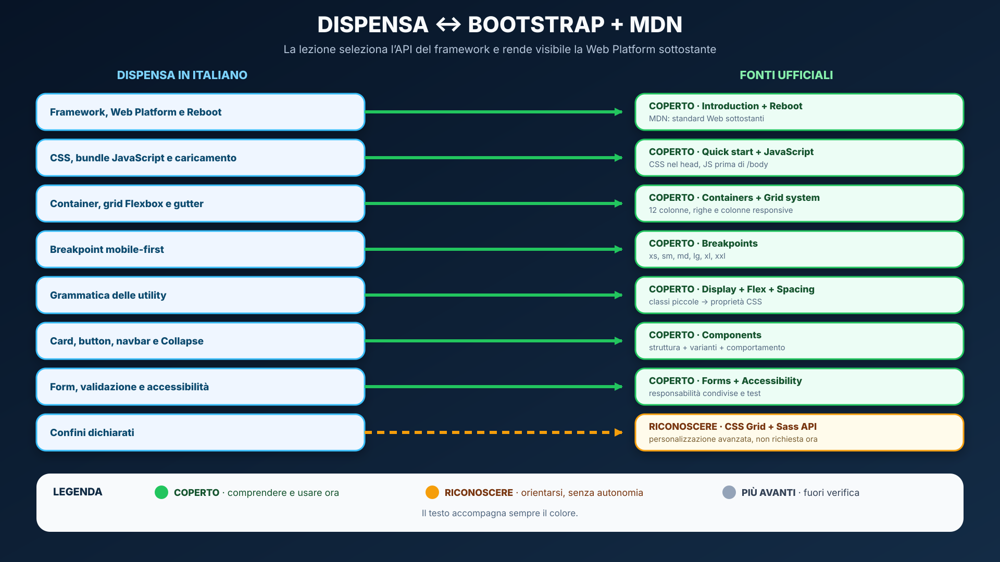
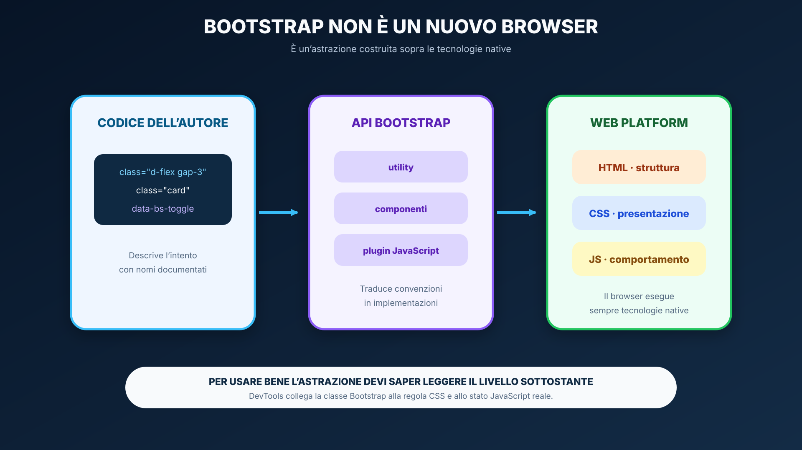
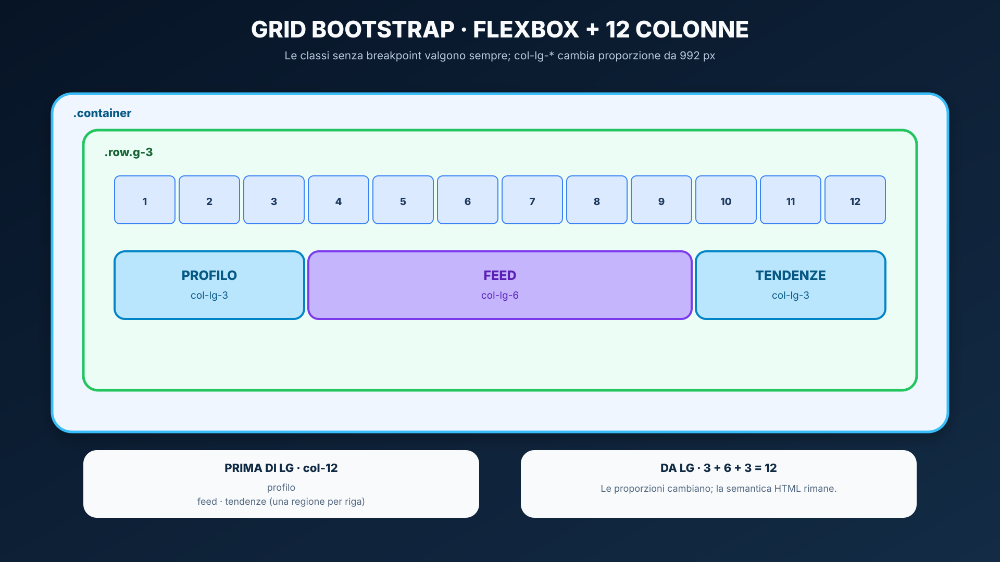
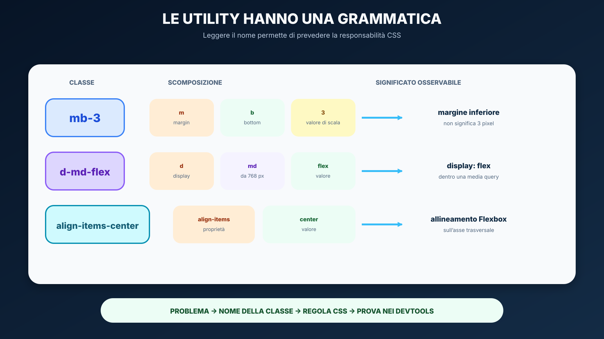
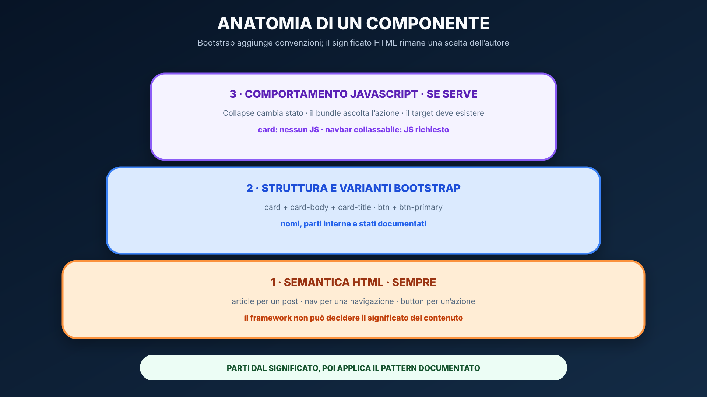
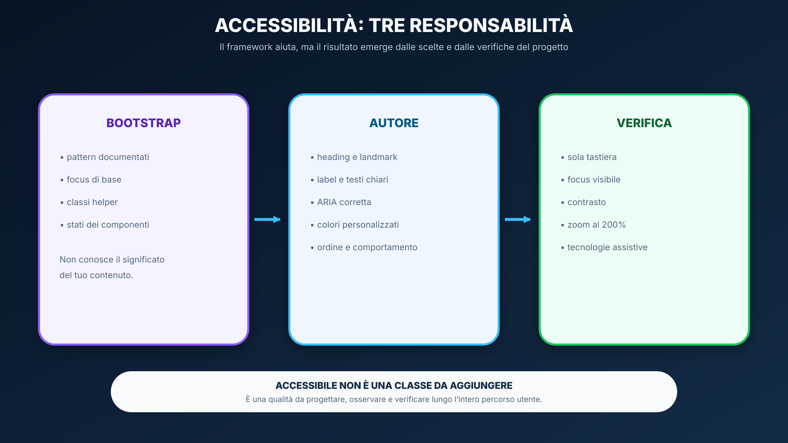
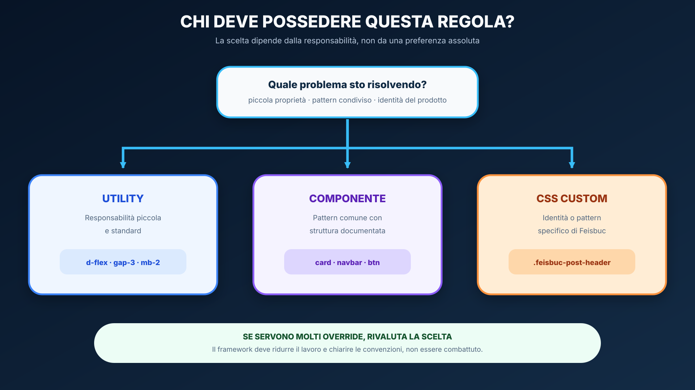
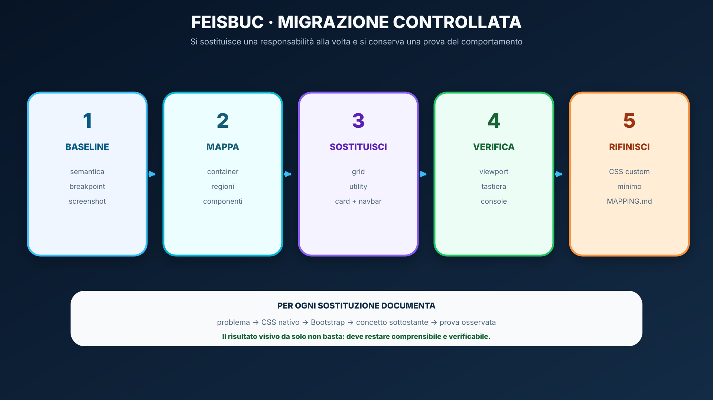
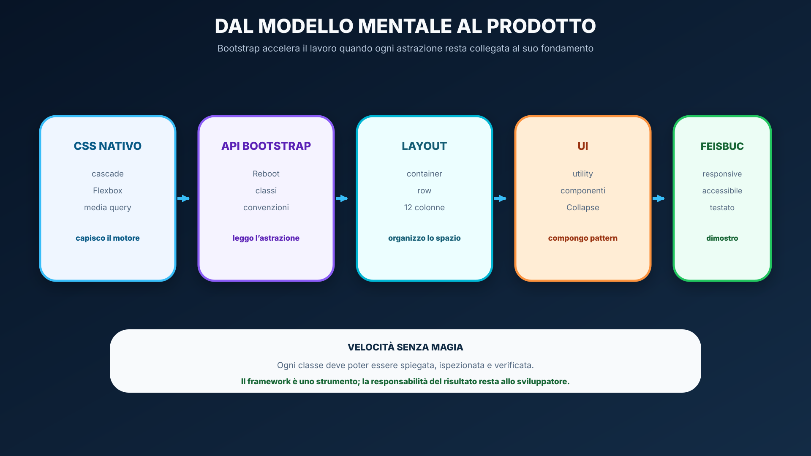

<a id="lesson-start"></a>
# Bootstrap: dal CSS nativo a un framework frontend

<a id="lesson-objectives"></a>
## In questa unità impareremo

<table align="center"><tr><td>
<details>
<summary>&#129517; <strong>Orientamento della sezione</strong></summary>

<p align="justify"><strong><span style="font-size: 1.15em;">&#128506;</span> Contesto:</strong>
nella lezione precedente abbiamo costruito layout con cascade, box model, Flexbox, Grid e media query. Ora osserviamo come Bootstrap organizza parte di quelle soluzioni in un linguaggio condiviso di classi e componenti.</p>

<p align="justify"><strong><span style="font-size: 1.15em;">&#10067;</span> Domande guida:</strong>
quale regola CSS si nasconde dietro una classe Bootstrap? Quando una convenzione del framework migliora il progetto? Quali responsabilità rimangono comunque allo sviluppatore?</p>

<p align="justify"><strong><span style="font-size: 1.15em;">&#127919;</span> Obiettivi:</strong>
Al termine lo studente dovrà saper:</p>
<ul>
  <li>spiegare che cosa offre un framework frontend e che cosa non sostituisce;</li>
  <li>caricare Bootstrap 5.3 tramite CDN e distinguere foglio CSS e bundle JavaScript;</li>
  <li>riconoscere gli effetti di Reboot;</li>
  <li>usare container, grid mobile-first, breakpoint, gutter e utility;</li>
  <li>leggere la grammatica delle utility e risalire al concetto CSS sottostante;</li>
  <li>costruire card, pulsanti, navbar responsive e form conservando la semantica HTML;</li>
  <li>distinguere componenti solo CSS da componenti interattivi;</li>
  <li>diagnosticare classi errate, bundle mancanti, target non corrispondenti e override inutili;</li>
  <li>motivare la scelta tra utility, componente Bootstrap e CSS personalizzato;</li>
  <li>rifattorizzare la shell Feisbuc senza perdere accessibilità e responsive design.</li>
</ul>

<p align="justify"><strong><span style="font-size: 1.15em;">&#129504;</span> Prerequisiti:</strong></p>
<ul>
  <li>aver completato <a href="02_CSS_MODERNO_RESPONSIVE.md">CSS moderno, layout e responsive design</a>;</li>
  <li>saper riconoscere Flexbox, Grid, media query, box model e specificità;</li>
  <li>saper usare HTML semantico e le funzioni essenziali dei DevTools;</li>
  <li>aver completato le Activity A–D dell'UDA 21.</li>
</ul>

<p align="justify"><strong><span style="font-size: 1.15em;">&#10145;</span> Prossimo passo:</strong>
nella lezione 04 aggiungeremo comportamento alla UI con JavaScript, DOM ed eventi.</p>

</details>
</td></tr></table>

<a id="lesson-docs-maps"></a>
## Orientamento nella documentazione Bootstrap e MDN

<p align="justify">La documentazione Bootstrap descrive l'<strong>API del framework</strong>: classi, componenti, opzioni ed esempi. MDN spiega invece HTML, CSS e JavaScript su cui Bootstrap è costruito. La dispensa collega le due prospettive e seleziona ciò che serve studiare ora.</p>

<table align="center"><tr><td>
<p align="justify"><strong><span style="font-size: 1.15em;">&#128506;</span> Come leggere i colori:</strong>
<strong>coperto</strong> indica un contenuto spiegato e richiesto; <strong>riconoscere</strong> una funzione da saper individuare nella documentazione; <strong>più avanti</strong> un argomento escluso dalla verifica attuale. Ogni stato è anche scritto, quindi il significato non dipende solo dal colore.</p>
</td></tr></table>

<a id="lesson-bootstrap-docs-map"></a>
<table align="center"><tr><td>
<details>
<summary>&#128506;&#65039; <strong>Mappa — dalla dispensa alla documentazione Bootstrap e MDN</strong></summary>

<p align="justify">La mappa mostra il percorso di studio: fondamenti e caricamento, layout, utility, componenti, form e responsabilità di accessibilità. Sass, theming avanzato e Bootstrap CSS Grid restano riconoscibili, ma fuori dal nucleo operativo della lezione.</p>

<p align="center">
  
</p>

</details>
</td></tr></table>

<a id="lesson-bootstrap-cross-index"></a>
<table align="center" width="100%"><tr><td>
<details>
<summary>&#128279; <strong>Indice incrociato navigabile — Dispensa ↔ Bootstrap e MDN</strong></summary>

<p align="justify">Ogni scheda collega un paragrafo della lezione alla fonte ufficiale pertinente. I titoli sono cliccabili; le descrizioni sintetiche sottostanti non lo sono.</p>
<p><strong>Legenda:</strong> &#128309; dispensa · &#128994; documentazione ufficiale · &#128993; riconoscere per dopo.</p>

<details>
<summary><strong>Fondamenti e caricamento</strong> · 4 voci</summary>

<blockquote>
<p><strong>01 · CORRISPONDENZA</strong></p>
<p><strong>&#128309; DISPENSA</strong><br><strong><a href="#lesson-bootstrap-framework">Bootstrap è costruito sulla Web Platform</a></strong></p>
<ul><li>Framework, API di classi e responsabilità di HTML, CSS e JavaScript.</li></ul>
<p><strong>&#128994; BOOTSTRAP / MDN</strong><br><strong><a href="https://getbootstrap.com/docs/5.3/getting-started/introduction/">Introduction</a></strong><br><strong><a href="https://developer.mozilla.org/en-US/docs/Learn_web_development/Getting_started/Web_standards/The_web_standards_model">The web standards model</a></strong></p>
<ul><li>Avvio del framework e tecnologie native sottostanti.</li></ul>
</blockquote>

<blockquote>
<p><strong>02 · CORRISPONDENZA</strong></p>
<p><strong>&#128309; DISPENSA</strong><br><strong><a href="#lesson-bootstrap-reboot">Reboot e stili globali</a></strong></p>
<ul><li>Normalizzazione, valori iniziali e <code>box-sizing</code>.</li></ul>
<p><strong>&#128994; BOOTSTRAP</strong><br><strong><a href="https://getbootstrap.com/docs/5.3/content/reboot/">Reboot</a></strong></p>
<ul><li>Modifiche globali applicate agli elementi HTML.</li></ul>
</blockquote>

<blockquote>
<p><strong>03 · CORRISPONDENZA</strong></p>
<p><strong>&#128309; DISPENSA</strong><br><strong><a href="#lesson-bootstrap-loading">Caricare Bootstrap correttamente</a></strong></p>
<ul><li>Documento minimo, CSS nel <code>head</code> e bundle prima di <code>/body</code>.</li></ul>
<p><strong>&#128994; BOOTSTRAP</strong><br><strong><a href="https://getbootstrap.com/docs/5.3/getting-started/introduction/#quick-start">Quick start</a></strong><br><strong><a href="https://getbootstrap.com/docs/5.3/getting-started/javascript/">JavaScript</a></strong></p>
<ul><li>CDN, viewport, integrity e plugin interattivi.</li></ul>
</blockquote>

<blockquote>
<p><strong>04 · CORRISPONDENZA</strong></p>
<p><strong>&#128309; DISPENSA</strong><br><strong><a href="#lesson-bootstrap-doc-method">Metodo di consultazione</a></strong></p>
<ul><li>Dal problema all'esempio minimo e alla regola CSS reale.</li></ul>
<p><strong>&#128994; GUIDA DEL CORSO</strong><br><strong><a href="GUIDA_USO_MDN.md#mdn-guide-source-choice">Scegliere la fonte giusta</a></strong></p>
<ul><li>Bootstrap per l'API; MDN per la Web Platform.</li></ul>
</blockquote>

</details>

<details>
<summary><strong>Layout e utility</strong> · 4 voci</summary>

<blockquote>
<p><strong>05 · CORRISPONDENZA</strong></p>
<p><strong>&#128309; DISPENSA</strong><br><strong><a href="#lesson-bootstrap-containers">Container</a></strong></p>
<ul><li>Contenitori responsive, fluidi e vincolati a un breakpoint.</li></ul>
<p><strong>&#128994; BOOTSTRAP</strong><br><strong><a href="https://getbootstrap.com/docs/5.3/layout/containers/">Containers</a></strong></p>
<ul><li>Tipi di container e variazione di <code>max-width</code>.</li></ul>
</blockquote>

<blockquote>
<p><strong>06 · CORRISPONDENZA</strong></p>
<p><strong>&#128309; DISPENSA</strong><br><strong><a href="#lesson-bootstrap-grid">Grid Bootstrap: Flexbox e 12 colonne</a></strong></p>
<ul><li>Gerarchia container–row–column, proporzioni e gutter.</li></ul>
<p><strong>&#128994; BOOTSTRAP</strong><br><strong><a href="https://getbootstrap.com/docs/5.3/layout/grid/">Grid system</a></strong></p>
<ul><li>Griglia mobile-first predefinita, basata su Flexbox.</li></ul>
</blockquote>

<blockquote>
<p><strong>07 · CORRISPONDENZA</strong></p>
<p><strong>&#128309; DISPENSA</strong><br><strong><a href="#lesson-bootstrap-breakpoints">Breakpoint guidati dal contenuto</a></strong></p>
<ul><li>Sei tier e applicazione mobile-first delle classi responsive.</li></ul>
<p><strong>&#128994; BOOTSTRAP</strong><br><strong><a href="https://getbootstrap.com/docs/5.3/layout/breakpoints/">Breakpoints</a></strong></p>
<ul><li>Soglie <code>xs</code>–<code>xxl</code> e media query min-width.</li></ul>
</blockquote>

<blockquote>
<p><strong>08 · CORRISPONDENZA</strong></p>
<p><strong>&#128309; DISPENSA</strong><br><strong><a href="#lesson-bootstrap-utilities">Utility: una grammatica di classi</a></strong></p>
<ul><li>Display, Flexbox, spacing e varianti responsive.</li></ul>
<p><strong>&#128994; BOOTSTRAP</strong><br><strong><a href="https://getbootstrap.com/docs/5.3/utilities/display/">Display</a></strong><br><strong><a href="https://getbootstrap.com/docs/5.3/utilities/flex/">Flex</a></strong><br><strong><a href="https://getbootstrap.com/docs/5.3/utilities/spacing/">Spacing</a></strong></p>
<ul><li>Classi operative da studiare; la Sass Utilities API è rimandata.</li></ul>
</blockquote>

</details>

<details>
<summary><strong>Componenti, form e accessibilità</strong> · 4 voci</summary>

<blockquote>
<p><strong>09 · CORRISPONDENZA</strong></p>
<p><strong>&#128309; DISPENSA</strong><br><strong><a href="#lesson-bootstrap-components">Componenti: struttura, varianti e comportamento</a></strong></p>
<ul><li>Anatomia di card e button senza perdere la semantica.</li></ul>
<p><strong>&#128994; BOOTSTRAP</strong><br><strong><a href="https://getbootstrap.com/docs/5.3/components/card/">Card</a></strong><br><strong><a href="https://getbootstrap.com/docs/5.3/components/buttons/">Buttons</a></strong></p>
<ul><li>Markup, parti interne e varianti previste.</li></ul>
</blockquote>

<blockquote>
<p><strong>10 · CORRISPONDENZA</strong></p>
<p><strong>&#128309; DISPENSA</strong><br><strong><a href="#lesson-bootstrap-navbar">Navbar e plugin Collapse</a></strong></p>
<ul><li>Toggler, target, attributi ARIA e dipendenza JavaScript.</li></ul>
<p><strong>&#128994; BOOTSTRAP</strong><br><strong><a href="https://getbootstrap.com/docs/5.3/components/navbar/">Navbar</a></strong><br><strong><a href="https://getbootstrap.com/docs/5.3/components/collapse/">Collapse</a></strong></p>
<ul><li>Componente responsive e meccanismo interattivo.</li></ul>
</blockquote>

<blockquote>
<p><strong>11 · CORRISPONDENZA</strong></p>
<p><strong>&#128309; DISPENSA</strong><br><strong><a href="#lesson-bootstrap-forms">Form e validazione</a></strong></p>
<ul><li>Label, controlli, feedback nativo e validazione personalizzata.</li></ul>
<p><strong>&#128994; BOOTSTRAP</strong><br><strong><a href="https://getbootstrap.com/docs/5.3/forms/overview/">Forms overview</a></strong><br><strong><a href="https://getbootstrap.com/docs/5.3/forms/validation/">Validation</a></strong></p>
<ul><li>Markup dei controlli e confini di accessibilità del feedback custom.</li></ul>
</blockquote>

<blockquote>
<p><strong>12 · CORRISPONDENZA</strong></p>
<p><strong>&#128309; DISPENSA</strong><br><strong><a href="#lesson-bootstrap-accessibility">Accessibilità: responsabilità condivise</a></strong></p>
<ul><li>Semantica, tastiera, focus, contrasto e test.</li></ul>
<p><strong>&#128994; BOOTSTRAP</strong><br><strong><a href="https://getbootstrap.com/docs/5.3/getting-started/accessibility/">Accessibility</a></strong></p>
<ul><li>Supporto offerto dal framework e lavoro richiesto all'autore.</li></ul>
</blockquote>

</details>

<details>
<summary><strong>Applicazione e confini</strong> · 3 voci</summary>

<blockquote>
<p><strong>13 · CORRISPONDENZA</strong></p>
<p><strong>&#128309; DISPENSA</strong><br><strong><a href="#lesson-bootstrap-choice">Bootstrap o CSS personalizzato?</a></strong></p>
<ul><li>Criteri per utility, componenti, classi proprie e class soup.</li></ul>
<p><strong>&#128994; BOOTSTRAP</strong><br><strong><a href="https://getbootstrap.com/docs/5.3/customize/overview/">Customize</a></strong></p>
<ul><li>Panoramica da riconoscere, non richiesta in autonomia.</li></ul>
</blockquote>

<blockquote>
<p><strong>14 · CORRISPONDENZA</strong></p>
<p><strong>&#128309; DISPENSA</strong><br><strong><a href="#lesson-bootstrap-feisbuc">Feisbuc: migrazione controllata</a></strong></p>
<ul><li>Dalla shell CSS nativa alla milestone Bootstrap documentata.</li></ul>
<p><strong>&#128994; DOCUMENTAZIONE</strong><br><em>Nessuna pagina unica: l'attività integra layout, utility, componenti e accessibilità.</em></p>
</blockquote>

<blockquote>
<p><strong>15 · FUORI DAL NUCLEO</strong></p>
<p><strong>&#128309; DISPENSA</strong><br><em>Nessun paragrafo operativo in questa lezione.</em></p>
<p><strong>&#128993; BOOTSTRAP</strong><br><strong><a href="https://getbootstrap.com/docs/5.3/layout/css-grid/">CSS Grid</a></strong><br><strong><a href="https://getbootstrap.com/docs/5.3/utilities/api/">Utility API</a></strong></p>
<ul><li>Bootstrap CSS Grid opzionale e personalizzazione Sass: riconoscere per dopo.</li></ul>
</blockquote>

</details>

</details>
</td></tr></table>

<a id="lesson-bootstrap-reference-map"></a>
<table align="center"><tr><td>
<details>
<summary>&#128218; <strong>Mappa delle schede tecniche — classi e componenti della lezione</strong></summary>

<table align="center">
<thead><tr><th>Famiglia</th><th>Studiare ora</th><th>Riconoscere per dopo</th></tr></thead>
<tbody>
<tr><td>Caricamento</td><td><a href="https://getbootstrap.com/docs/5.3/getting-started/introduction/">CDN e quick start</a></td><td>Installazione npm</td></tr>
<tr><td>Layout</td><td><a href="https://getbootstrap.com/docs/5.3/layout/containers/">container</a>, <a href="https://getbootstrap.com/docs/5.3/layout/grid/">row e col</a></td><td><a href="https://getbootstrap.com/docs/5.3/layout/css-grid/">Bootstrap CSS Grid</a></td></tr>
<tr><td>Utility</td><td><a href="https://getbootstrap.com/docs/5.3/utilities/display/">display</a>, <a href="https://getbootstrap.com/docs/5.3/utilities/flex/">flex</a>, <a href="https://getbootstrap.com/docs/5.3/utilities/spacing/">spacing</a></td><td><a href="https://getbootstrap.com/docs/5.3/utilities/api/">Sass Utilities API</a></td></tr>
<tr><td>Componenti</td><td><a href="https://getbootstrap.com/docs/5.3/components/card/">card</a>, <a href="https://getbootstrap.com/docs/5.3/components/buttons/">button</a>, <a href="https://getbootstrap.com/docs/5.3/components/navbar/">navbar</a>, <a href="https://getbootstrap.com/docs/5.3/components/collapse/">collapse</a></td><td>Temi e plugin esterni</td></tr>
<tr><td>Form</td><td><a href="https://getbootstrap.com/docs/5.3/forms/form-control/">form-control</a>, <a href="https://getbootstrap.com/docs/5.3/forms/validation/">validation</a></td><td>Validazione asincrona</td></tr>
</tbody>
</table>

</details>
</td></tr></table>

<a id="lesson-bootstrap-problem"></a>
## Problema iniziale: riusare senza perdere comprensione

<p align="justify">Nella lezione precedente abbiamo scritto direttamente una shell responsive:</p>

```css
.page-shell {
  display: grid;
  grid-template-columns: 1fr;
  gap: 1rem;
}

@media (min-width: 56rem) {
  .page-shell {
    grid-template-columns: minmax(0, 1fr) minmax(0, 2fr) minmax(0, 1fr);
  }
}
```

<p align="justify">Molte applicazioni ripetono però famiglie di soluzioni già note: contenitori centrati, colonne responsive, spaziature, pulsanti, navbar, card e form. Riscriverle ogni volta può rallentare il lavoro e produrre convenzioni diverse tra membri dello stesso team.</p>

<table align="center"><tr><td>
<p align="justify"><strong><span style="font-size: 1.15em;">&#128161;</span> Domanda centrale:</strong>
non chiederti soltanto «quale classe devo ricordare?», ma «quale problema sto delegando al framework e quale concetto CSS applica quella classe?».</p>
</td></tr></table>

<table align="center"><tr><td>
<details>
<summary>&#128337; <strong>Articolazione suggerita — 3 incontri, 6 ore</strong></summary>
<ul>
  <li><strong>Incontro 1:</strong> framework, Reboot, caricamento, container e grid;</li>
  <li><strong>Incontro 2:</strong> utility, componenti, navbar, form e accessibilità;</li>
  <li><strong>Incontro 3:</strong> migrazione Feisbuc, debug, confronto e restituzione.</li>
</ul>
</details>
</td></tr></table>

<a id="lesson-bootstrap-framework"></a>
## Bootstrap è costruito sulla Web Platform

<p align="justify">Un <strong>framework frontend</strong> è un insieme coordinato di convenzioni, fogli di stile e, quando serve, script che offre soluzioni riutilizzabili. Bootstrap espone una sorta di <strong>API visuale</strong>: lo sviluppatore applica nomi di classe e strutture documentate, il framework le traduce in regole CSS e comportamenti JavaScript.</p>

<p align="center">
  
</p>

<p align="justify">Per esempio, il markup:</p>

```html
<div class="d-flex gap-3">
```

<p align="justify">non introduce un nuovo motore di layout. <code>d-flex</code> applica il concetto CSS <code>display: flex</code>; <code>gap-3</code> sceglie un valore dalla scala di spaziatura del framework. Nel browser continuano a esistere elementi HTML, box CSS, DOM ed eventi.</p>

<table align="center"><tr><td>
<p align="justify"><strong><span style="font-size: 1.15em;">&#128214;</span> Definizione — astrazione:</strong>
Bootstrap nasconde alcuni dettagli ripetitivi dietro nomi e strutture condivise, ma non elimina i meccanismi sottostanti. Per fare debug bisogna ancora comprendere HTML, cascade, box model, Flexbox, media query e JavaScript.</p>
</td></tr></table>

<a id="lesson-bootstrap-reboot"></a>
## Reboot e stili globali

<p align="justify">Prima ancora di aggiungere una classe, il CSS di Bootstrap modifica alcuni stili predefiniti degli elementi. Questa base si chiama <strong>Reboot</strong>, deriva da Normalize.css e rende più coerente il punto di partenza tra browser.</p>

<p align="justify">Fra gli effetti da osservare ci sono il <code>box-sizing: border-box</code> globale, le impostazioni di base del <code>body</code>, la tipografia e valori iniziali più coerenti per titoli, paragrafi, tabelle e form. Per questo una pagina può cambiare aspetto appena si collega Bootstrap, anche senza classi specifiche.</p>

<table align="center"><tr><td>
<p align="justify"><strong><span style="font-size: 1.15em;">&#9888;</span> Attenzione:</strong>
«non ho usato classi Bootstrap» non significa «Bootstrap non ha effetto». Con DevTools confronta gli stili computati prima e dopo il collegamento del foglio e individua le regole provenienti da Reboot.</p>
</td></tr></table>

<p align="justify">Riferimento: <a href="https://getbootstrap.com/docs/5.3/content/reboot/">Bootstrap — Reboot</a>.</p>

<a id="lesson-bootstrap-loading"></a>
## Caricare Bootstrap correttamente

<p align="justify">Per gli esempi iniziali usiamo Bootstrap 5.3.8 tramite CDN. Il foglio CSS va nel <code>head</code>; il file <code>custom.css</code> viene dopo, così le personalizzazioni normali possono partecipare correttamente alla cascade. Il bundle JavaScript va caricato prima della chiusura di <code>body</code> quando servono componenti interattivi.</p>

```html
<!doctype html>
<html lang="it">
<head>
  <meta charset="utf-8">
  <meta name="viewport" content="width=device-width, initial-scale=1">
  <title>Feisbuc</title>
  <link
    href="https://cdn.jsdelivr.net/npm/bootstrap@5.3.8/dist/css/bootstrap.min.css"
    rel="stylesheet"
    integrity="sha384-sRIl4kxILFvY47J16cr9ZwB07vP4J8+LH7qKQnuqkuIAvNWLzeN8tE5YBujZqJLB"
    crossorigin="anonymous"
  >
  <link rel="stylesheet" href="custom.css">
</head>
<body>
  <main class="container py-4">
    <h1>Feisbuc</h1>
  </main>

  <script
    src="https://cdn.jsdelivr.net/npm/bootstrap@5.3.8/dist/js/bootstrap.bundle.min.js"
    integrity="sha384-FKyoEForCGlyvwx9Hj09JcYn3nv7wiPVlz7YYwJrWVcXK/BmnVDxM+D2scQbITxI"
    crossorigin="anonymous"
  ></script>
</body>
</html>
```

<p align="justify"><code>integrity</code> consente al browser di verificare che la risorsa ricevuta corrisponda a quella attesa; <code>crossorigin="anonymous"</code> completa la configurazione necessaria al controllo per questa risorsa esterna. Il file <code>bootstrap.bundle.min.js</code> include anche Popper, richiesto da alcuni plugin.</p>

### Uso offline

<p align="justify">Il modello didattico non dipende dal CDN. In laboratorio si possono distribuire i file compilati ufficiali e sostituire gli URL con percorsi locali. L'installazione tramite npm verrà affrontata dopo l'introduzione degli strumenti di progetto.</p>

<a id="lesson-bootstrap-doc-method"></a>
## Metodo di consultazione: dalla necessità alla regola reale

<ol>
  <li>descrivi il problema senza nominare una classe;</li>
  <li>scegli nella documentazione Bootstrap la famiglia pertinente;</li>
  <li>leggi introduzione, esempio minimo e note di accessibilità;</li>
  <li>prova l'esempio isolato e ridimensionalo;</li>
  <li>ispeziona in DevTools le regole CSS e gli eventuali attributi/stati JavaScript;</li>
  <li>consulta MDN se il meccanismo nativo non è chiaro;</li>
  <li>adatta il pattern conservando semantica e requisiti del progetto.</li>
</ol>

<table align="center"><tr><td>
<p align="justify"><strong><span style="font-size: 1.15em;">&#128279;</span> Due documentazioni, due responsabilità:</strong>
per <code>.d-flex</code> parti dalla pagina Bootstrap sulle utility Flex; per comprendere davvero <code>display: flex</code> usa MDN. Consulta anche <a href="GUIDA_USO_MDN.md#mdn-guide-source-choice">come scegliere la fonte nel corso full stack</a>.</p>
<p align="justify"><strong>Prodotto atteso:</strong> per ogni nuova classe annota problema risolto, classe Bootstrap e concetto Web Platform sottostante.</p>
</td></tr></table>

<a id="lesson-bootstrap-containers"></a>
## Container: delimitare lo spazio della pagina

<p align="justify">Il container è il livello esterno del sistema di layout. Fornisce padding orizzontale e decide se la larghezza deve essere fluida o limitata. Bootstrap offre tre famiglie:</p>

<ul>
  <li><code>.container</code>: larghezza massima che cambia ai breakpoint;</li>
  <li><code>.container-fluid</code>: larghezza sempre pari al 100% dello spazio disponibile;</li>
  <li><code>.container-{breakpoint}</code>: fluido fino alla soglia indicata, poi soggetto a <code>max-width</code>.</li>
</ul>

```html
<main class="container py-4">
  <!-- contenuto centrato e responsive -->
</main>
```

<p align="justify">Il problema è simile a quello affrontato con CSS nativo:</p>

```css
main {
  width: min(100% - 2rem, 75rem);
  margin-inline: auto;
}
```

<p align="justify">Le implementazioni non sono identiche: Bootstrap usa proprie soglie e larghezze massime. La scelta del container viene prima delle colonne perché stabilisce quanto spazio può usare l'intero layout.</p>

<a id="lesson-bootstrap-grid"></a>
## Grid Bootstrap: Flexbox e 12 colonne

<p align="justify">La <strong>grid predefinita di Bootstrap è un sistema mobile-first basato su Flexbox</strong>. Non va confusa né con CSS Grid studiato nella lezione 02 né con l'alternativa opzionale «Bootstrap CSS Grid». Divide idealmente ogni riga in 12 parti, così le colonne possono esprimere proporzioni con numeri interi.</p>

<p align="center">
  
</p>

```html
<main class="container py-4">
  <div class="row g-3">
    <aside class="col-12 col-lg-3">Profilo</aside>
    <section class="col-12 col-lg-6">Feed</section>
    <aside class="col-12 col-lg-3">Tendenze</aside>
  </div>
</main>
```

<p align="justify">La gerarchia si legge dall'esterno verso l'interno:</p>

<ul>
  <li><code>container</code> limita e centra l'area di lavoro;</li>
  <li><code>row</code> crea una riga Flexbox che avvolge le colonne;</li>
  <li><code>col-12</code> occupa 12 parti su 12 dalla soglia minima;</li>
  <li><code>col-lg-3</code> e <code>col-lg-6</code> sostituiscono quella larghezza da <code>lg</code> in avanti;</li>
  <li><code>g-3</code> imposta il gutter orizzontale e verticale con la scala Bootstrap.</li>
</ul>

<p align="justify">Le colonne usano padding per creare il gutter; la riga compensa il padding esterno secondo il modello del framework. Per questo una <code>col-*</code> dovrebbe essere figlia di una <code>row</code>. Se la somma supera 12, le colonne eccedenti vanno a capo.</p>

<table align="center"><tr><td>
<p align="justify"><strong><span style="font-size: 1.15em;">&#128214;</span> Modello mentale — mobile-first:</strong>
le classi senza infisso di breakpoint valgono sempre; una classe con <code>lg</code> entra in vigore da <code>lg</code> e continua alle larghezze maggiori finché non viene sostituita.</p>
</td></tr></table>

<a id="lesson-bootstrap-breakpoints"></a>
## Breakpoint guidati dal contenuto

<p align="justify">I breakpoint non identificano dispositivi reali. Indicano soglie di larghezza alle quali il contenuto dispone di spazio sufficiente per cambiare organizzazione.</p>

<table align="center">
<thead><tr><th>Tier</th><th>Infisso</th><th>Inizio</th><th>Esempio</th></tr></thead>
<tbody>
<tr><td>Extra small</td><td>nessuno</td><td>&lt; 576 px</td><td><code>col-12</code></td></tr>
<tr><td>Small</td><td><code>sm</code></td><td>≥ 576 px</td><td><code>col-sm-6</code></td></tr>
<tr><td>Medium</td><td><code>md</code></td><td>≥ 768 px</td><td><code>d-md-flex</code></td></tr>
<tr><td>Large</td><td><code>lg</code></td><td>≥ 992 px</td><td><code>col-lg-3</code></td></tr>
<tr><td>Extra large</td><td><code>xl</code></td><td>≥ 1200 px</td><td><code>container-xl</code></td></tr>
<tr><td>Extra extra large</td><td><code>xxl</code></td><td>≥ 1400 px</td><td><code>col-xxl-2</code></td></tr>
</tbody>
</table>

<p align="justify">Quindi <code>lg</code> non significa «laptop»: significa «da 992 CSS pixel in su». Il test corretto consiste nel ridimensionare gradualmente la viewport e osservare quando il contenuto ha davvero bisogno di cambiare.</p>

<a id="lesson-bootstrap-utilities"></a>
## Utility: una grammatica di classi

<p align="justify">Una utility applica una responsabilità CSS piccola e dichiarativa. I nomi non sono casuali: combinano spesso <strong>proprietà</strong>, eventuale <strong>lato</strong>, eventuale <strong>breakpoint</strong> e <strong>valore</strong>.</p>

<p align="center">
  
</p>

<table align="center">
<thead><tr><th>Classe</th><th>Come si legge</th><th>Concetto CSS</th></tr></thead>
<tbody>
<tr><td><code>d-flex</code></td><td>display = flex</td><td><code>display: flex</code></td></tr>
<tr><td><code>d-md-flex</code></td><td>display = flex da <code>md</code></td><td>media query + <code>display</code></td></tr>
<tr><td><code>flex-wrap</code></td><td>flex wrap</td><td><code>flex-wrap: wrap</code></td></tr>
<tr><td><code>align-items-center</code></td><td>allinea gli item al centro</td><td><code>align-items: center</code></td></tr>
<tr><td><code>p-3</code></td><td>padding, valore 3</td><td>padding dalla scala Bootstrap</td></tr>
<tr><td><code>mb-3</code></td><td>margin bottom, valore 3</td><td>margine inferiore dalla scala</td></tr>
<tr><td><code>gap-2</code></td><td>gap, valore 2</td><td>spazio tra item dalla scala</td></tr>
</tbody>
</table>

```html
<div class="d-flex flex-column flex-md-row gap-3 align-items-md-center">
  ...
</div>
```

<p align="justify">Prima di <code>md</code> gli elementi sono in colonna; da <code>md</code> diventano una riga e vengono allineati sull'asse trasversale. Le utility responsive fanno quindi la stessa famiglia di lavoro delle media query, ma tramite una convenzione predefinita.</p>

<table align="center"><tr><td>
<p align="justify"><strong><span style="font-size: 1.15em;">&#9888;</span> Attenzione — scala, non pixel:</strong>
il numero <code>3</code> non significa 3 px. Seleziona un valore dalla scala di Bootstrap. Consulta la pagina della famiglia prima di dedurne il risultato.</p>
</td></tr></table>

<a id="lesson-bootstrap-components"></a>
## Componenti: struttura, varianti e comportamento

<p align="justify">Un componente combina più regole e spesso richiede una <strong>struttura interna documentata</strong>. Conviene leggerlo in tre strati: markup semantico scelto dall'autore, classi e parti previste da Bootstrap, eventuale comportamento JavaScript.</p>

<p align="center">
  
</p>

### Card

<p align="justify">Una card è un contenitore visuale flessibile. Non impone il significato dell'elemento esterno e non aggiunge margini automaticamente. Un post resta quindi un <code>article</code>:</p>

```html
<article class="card mb-3">
  <div class="card-body">
    <h2 class="card-title h5">Titolo del post</h2>
    <p class="card-text">Contenuto del post.</p>
    <button class="btn btn-outline-primary" type="button">Mi piace</button>
  </div>
</article>
```

<ul>
  <li><code>card</code> definisce il contenitore;</li>
  <li><code>card-body</code> gestisce la zona interna e il padding;</li>
  <li><code>card-title</code> e <code>card-text</code> applicano stili coerenti;</li>
  <li><code>h5</code> cambia la scala visuale, non il livello semantico <code>h2</code>;</li>
  <li><code>mb-3</code> separa questa card dalla successiva.</li>
</ul>

### Button

<p align="justify"><code>btn</code> fornisce la base, mentre <code>btn-primary</code> o <code>btn-outline-primary</code> esprimono una variante. L'elemento deve comunque essere scelto per significato: <code>button</code> per un'azione nella pagina, <code>a</code> per una navigazione.</p>

<a id="lesson-bootstrap-navbar"></a>
## Navbar e plugin Collapse

<p align="justify">Una navbar responsive unisce un landmark <code>nav</code>, classi di layout e il plugin JavaScript Collapse. Il bottone non «trova» il menu per magia: <code>data-bs-target</code> deve corrispondere esattamente all'<code>id</code> del pannello.</p>

```html
<nav class="navbar navbar-expand-lg bg-body-tertiary" aria-label="Principale">
  <div class="container">
    <a class="navbar-brand" href="/">Feisbuc</a>
    <button
      class="navbar-toggler"
      type="button"
      data-bs-toggle="collapse"
      data-bs-target="#main-nav"
      aria-controls="main-nav"
      aria-expanded="false"
      aria-label="Apri la navigazione"
    >
      <span class="navbar-toggler-icon"></span>
    </button>

    <div class="collapse navbar-collapse" id="main-nav">
      <ul class="navbar-nav ms-auto">
        <li class="nav-item">
          <a class="nav-link active" aria-current="page" href="/">Home</a>
        </li>
        <li class="nav-item">
          <a class="nav-link" href="/profilo">Profilo</a>
        </li>
      </ul>
    </div>
  </div>
</nav>
```

<p align="justify"><code>navbar-expand-lg</code> mantiene il menu collassabile sotto <code>lg</code> e lo espande da <code>lg</code>. Senza il bundle JavaScript la pagina resta visibile, ma il toggler non modifica lo stato del pannello. Durante il debug controlla bundle, console, attributi <code>data-bs-*</code>, target e <code>id</code>.</p>

<a id="lesson-bootstrap-forms"></a>
## Form: stile, significato e validazione

<p align="justify">Bootstrap rende coerente l'aspetto dei controlli, ma il contratto del form resta HTML: una <code>label</code> assegna il nome accessibile, <code>type</code> descrive il dato, <code>name</code> identifica il campo inviato e gli attributi di constraint validation definiscono requisiti verificabili.</p>

### Prima scelta: validazione nativa del browser

```html
<form class="row g-3">
  <div class="col-12">
    <label class="form-label" for="post-text">Testo del post</label>
    <textarea
      class="form-control"
      id="post-text"
      name="text"
      required
      maxlength="280"
      aria-describedby="post-help"
    ></textarea>
    <div id="post-help" class="form-text">Massimo 280 caratteri.</div>
  </div>
  <div class="col-12">
    <button class="btn btn-primary" type="submit">Pubblica</button>
  </div>
</form>
```

<p align="justify">Questa versione conserva l'interfaccia di validazione del browser ed è il punto di partenza consigliato nella lezione.</p>

### Quando si usa il feedback personalizzato Bootstrap

<p align="justify">Aggiungere <code>novalidate</code> disattiva l'interfaccia nativa: non va quindi usato da solo. Il pattern Bootstrap richiede uno script che blocchi l'invio non valido e aggiunga <code>.was-validated</code>, così le regole <code>:valid</code> e <code>:invalid</code> diventano visibili.</p>

```html
<form class="needs-validation" novalidate>
  <label class="form-label" for="title">Titolo</label>
  <input class="form-control" id="title" name="title" required>
  <div class="invalid-feedback">Inserisci un titolo.</div>
  <button class="btn btn-primary mt-3" type="submit">Pubblica</button>
</form>

<script>
const form = document.querySelector('.needs-validation');

form.addEventListener('submit', (event) => {
  if (!form.checkValidity()) {
    event.preventDefault();
    event.stopPropagation();
  }

  form.classList.add('was-validated');
});
</script>
```

<p align="justify">Poiché JavaScript verrà studiato nella lezione successiva, qui è richiesto saper <strong>leggere il flusso</strong> — intercettare l'invio, interrogare la validità e rendere visibile lo stato — non riprodurre lo script a memoria.</p>

<table align="center"><tr><td>
<p align="justify"><strong><span style="font-size: 1.15em;">&#9888;</span> Limite di accessibilità:</strong>
la documentazione Bootstrap segnala che gli stili e i tooltip di validazione personalizzati non sono attualmente pienamente esposti alle tecnologie assistive. Nel corso preferiamo il feedback nativo oppure un feedback testuale progettato e testato con cura. Il server dovrà comunque validare ogni richiesta.</p>
</td></tr></table>

<a id="lesson-bootstrap-accessibility"></a>
## Accessibilità: una responsabilità condivisa

<p align="justify">Bootstrap offre pattern, classi e stati utili, ma non può conoscere il significato del contenuto né verificare l'intero percorso utente. L'accessibilità finale dipende dal framework, dal markup dell'autore, dalle personalizzazioni e dai test.</p>

<p align="center">
  
</p>

<ul>
  <li>conserva heading e landmark coerenti;</li>
  <li>usa link per navigare e button per eseguire azioni;</li>
  <li>associa sempre label e controlli dei form;</li>
  <li>mantieni gli attributi ARIA previsti dai componenti interattivi;</li>
  <li>verifica focus visibile, ordine di tabulazione e uso da tastiera;</li>
  <li>controlla il contrasto dopo ogni personalizzazione cromatica;</li>
  <li>non comunicare stato o errore soltanto attraverso il colore.</li>
</ul>

<p align="justify">Una verifica osservabile consiste nel navigare la navbar e il form senza mouse, ridimensionare la pagina al 200% e controllare che l'informazione e il focus rimangano disponibili.</p>

<a id="lesson-bootstrap-choice"></a>
## Bootstrap o CSS personalizzato?

<p align="justify">Bootstrap è utile per pattern condivisi; il CSS personalizzato esprime identità e regole specifiche del prodotto. La decisione va presa per responsabilità, non per preferenza assoluta.</p>

<p align="center">
  
</p>

<table align="center">
<thead><tr><th>Situazione</th><th>Scelta iniziale</th><th>Motivo</th></tr></thead>
<tbody>
<tr><td>spaziatura o display standard</td><td>utility</td><td>intento piccolo e riconoscibile</td></tr>
<tr><td>card, navbar o pulsante convenzionale</td><td>componente</td><td>struttura condivisa già documentata</td></tr>
<tr><td>identità Feisbuc o pattern di dominio</td><td>classe custom</td><td>la regola appartiene al prodotto</td></tr>
<tr><td>layout incompatibile con il framework</td><td>CSS nativo</td><td>evita override e dipendenze inutili</td></tr>
</tbody>
</table>

```css
:root {
  --feisbuc-brand: #243b53;
}

.feisbuc-brand {
  color: var(--feisbuc-brand);
}
```

### Il segnale del class soup

```html
<div class="d-flex flex-column flex-md-row align-items-start align-items-md-center gap-1 gap-md-3 p-1 p-md-3 mt-2 mb-4 border rounded shadow-sm">
```

<p align="justify">Il markup è valido, ma una lunga sequenza ripetuta può nascondere un componente del design. Se le classi descrivono un pattern di dominio stabile, una classe come <code>.feisbuc-post-header</code> può rendere più chiari il markup e la manutenzione. Se invece la sequenza compare una sola volta ed è leggibile, le utility possono restare la soluzione più diretta.</p>

<a id="lesson-bootstrap-feisbuc"></a>
## Feisbuc: migrazione controllata

<p align="justify">La milestone <code>feisbuc-02-bootstrap-ui</code> non ricostruisce la pagina alla cieca. Parte dalla shell CSS nativa e sostituisce una responsabilità alla volta, verificando che il comportamento resti corretto.</p>

<p align="center">
  
</p>

<ol>
  <li>fotografa la baseline e annota semantica, breakpoint e comportamento;</li>
  <li>mappa container, regioni, spaziature e componenti;</li>
  <li>sostituisci il macro-layout con <code>container</code>, <code>row</code> e <code>col-*</code>;</li>
  <li>trasforma i post in <code>article.card</code> e le azioni in button coerenti;</li>
  <li>aggiungi navbar responsive e verifica Collapse;</li>
  <li>mantieni nel CSS custom soltanto identità e regole specifiche;</li>
  <li>prova viewport, tastiera, zoom, form e console;</li>
  <li>documenta almeno sei decisioni in <code>MAPPING.md</code>.</li>
</ol>

```text
problema osservato
→ soluzione CSS nativa precedente
→ classe o componente Bootstrap scelto
→ concetto Web Platform sottostante
→ prova che conferma il comportamento
```

<a id="lesson-bootstrap-debug"></a>
## Debug: leggere il framework invece di combatterlo

<table align="center">
<thead><tr><th>Sintomo</th><th>Controllo</th><th>Causa probabile</th></tr></thead>
<tbody>
<tr><td>nessuno stile Bootstrap</td><td>Network e <code>href</code></td><td>CSS non caricato o percorso errato</td></tr>
<tr><td>navbar immobile</td><td>Console, script e target</td><td>bundle assente o <code>data-bs-target</code> diverso dall'<code>id</code></td></tr>
<tr><td>colonne sempre verticali</td><td>classi e larghezza viewport</td><td>infisso errato o soglia non raggiunta</td></tr>
<tr><td>spaziatura inattesa</td><td>Computed e Box Model</td><td>gutter, Reboot o utility ereditata male</td></tr>
<tr><td>override ignorato</td><td>Styles e ordine dei fogli</td><td>cascade, specificità o file custom caricato prima</td></tr>
<tr><td>layout con scrollbar</td><td>Layout e larghezze</td><td><code>row</code> fuori dal container o contenuto non comprimibile</td></tr>
</tbody>
</table>

<p align="justify">Procedura: riproduci il problema, riduci il caso, verifica il caricamento, ispeziona elemento e regole computate, disattiva temporaneamente le dichiarazioni, controlla la documentazione e modifica una sola causa alla volta. <code>!important</code> non è una diagnosi.</p>

<a id="lesson-lab"></a>
## Laboratorio e Activity

<table align="center"><tr><td>
<details>
<summary>&#128187; <strong>Laboratorio A–B — osservare grid e utility</strong></summary>
<ol>
  <li>apri un esempio ufficiale della grid e individua container, row, colonne e gutter;</li>
  <li>ridimensiona la viewport e annota il punto in cui cambiano le colonne;</li>
  <li>sostituisci una semplice regola Flexbox con utility equivalenti;</li>
  <li>in DevTools collega ogni utility alla dichiarazione CSS effettiva.</li>
</ol>
<p align="justify"><strong>Prodotto:</strong> tabella con classe, regola calcolata, breakpoint ed evidenza osservata.</p>
</details>
</td></tr></table>

<table align="center"><tr><td>
<details>
<summary>&#128187; <strong>Laboratorio C–D — layout 3/6/3 e diagnosi navbar</strong></summary>
<ol>
  <li>costruisci un layout a una colonna che diventa 3/6/3 da <code>lg</code>;</li>
  <li>aggiungi gutter e verifica che la somma delle colonne sia 12;</li>
  <li>ricevi una navbar guasta e individua se manca bundle, target o <code>id</code>;</li>
  <li>dimostra la correzione con tastiera e viewport stretta.</li>
</ol>
</details>
</td></tr></table>

<table align="center"><tr><td>
<details>
<summary>&#128187; <strong>Activity E — Feisbuc Bootstrap UI</strong></summary>
<p align="justify"><strong>Identificativo:</strong> <code>tpsi5-activity-e-feisbuc-bootstrap-ui-001</code>.</p>
<ul>
  <li><a href="../../activities/tpsi5/feisbuc_bootstrap_e/student/README.md">Consegna studente</a>;</li>
  <li><a href="../../activities/tpsi5/feisbuc_bootstrap_e/starter/index.html">Starter HTML</a>;</li>
  <li><a href="../../activities/tpsi5/feisbuc_bootstrap_e/starter/custom.css">Starter CSS</a>;</li>
  <li><a href="../../activities/tpsi5/feisbuc_bootstrap_e/starter/MAPPING.md">Mappa delle decisioni</a>.</li>
</ul>
<p align="justify"><strong>Vincoli:</strong> semantica conservata, layout mobile-first, regioni desktop 3/6/3, navbar responsive, post come <code>article.card</code>, CSS custom minimo e almeno sei mapping motivati.</p>
</details>
</td></tr></table>

<table align="center"><tr><td>
<details>
<summary>&#128187; <strong>Activity F — confine del modulo</strong></summary>
<p align="justify">Il prodotto integrato con frontend dinamico e backend arriverà nelle UDA successive. In questa lezione non si richiedono fetch, persistenza, autenticazione o build Sass.</p>
</details>
</td></tr></table>

<a id="lesson-checkpoint"></a>
## Verifica rapida

<table align="center"><tr><td>
<details>
<summary>&#9989; <strong>Checkpoint — so spiegare ciò che Bootstrap sta facendo?</strong></summary>
<ol>
  <li>Perché Bootstrap non sostituisce HTML, CSS e JavaScript?</li>
  <li>Quali effetti può avere Reboot prima di aggiungere classi?</li>
  <li>Che responsabilità hanno <code>container</code>, <code>row</code> e <code>col-*</code>?</li>
  <li>Perché la grid Bootstrap predefinita non è CSS Grid?</li>
  <li>Come si legge <code>d-md-flex</code>? E <code>mb-3</code>?</li>
  <li>Che differenza c'è fra una utility e un componente?</li>
  <li>Perché una navbar collassabile richiede il bundle?</li>
  <li>Perché <code>novalidate</code> non va aggiunto senza gestire la validazione?</li>
  <li>Quali controlli di accessibilità restano responsabilità dell'autore?</li>
  <li>Quando una lunga sequenza di utility suggerisce una classe custom?</li>
</ol>
</details>
</td></tr></table>

<a id="lesson-summary"></a>
## Sintesi inclusiva

<p align="justify">Bootstrap organizza soluzioni ricorrenti sopra la Web Platform. Reboot stabilisce una base; container e grid costruiscono il macro-layout; le utility applicano singole responsabilità; i componenti combinano struttura e varianti; alcuni comportamenti, come Collapse, richiedono JavaScript. Semantica, accessibilità, debug e validazione server restano responsabilità dello sviluppatore.</p>

<p align="center">
  
</p>

<a id="lesson-bootstrap-docs"></a>
## Documentazione da usare in questa lezione

<table align="center"><tr><td>
<details>
<summary>&#128218; <strong>Bootstrap e MDN — pagine da studiare, riconoscere e rimandare</strong></summary>

<p align="justify"><strong>Studiare ora:</strong></p>
<ul>
  <li><a href="https://getbootstrap.com/docs/5.3/getting-started/introduction/">Bootstrap — Introduction e Quick start</a>;</li>
  <li><a href="https://getbootstrap.com/docs/5.3/content/reboot/">Bootstrap — Reboot</a>;</li>
  <li><a href="https://getbootstrap.com/docs/5.3/layout/containers/">Bootstrap — Containers</a>;</li>
  <li><a href="https://getbootstrap.com/docs/5.3/layout/grid/">Bootstrap — Grid system</a>;</li>
  <li><a href="https://getbootstrap.com/docs/5.3/layout/breakpoints/">Bootstrap — Breakpoints</a>;</li>
  <li><a href="https://getbootstrap.com/docs/5.3/utilities/display/">Display</a>, <a href="https://getbootstrap.com/docs/5.3/utilities/flex/">Flex</a> e <a href="https://getbootstrap.com/docs/5.3/utilities/spacing/">Spacing</a>;</li>
  <li><a href="https://getbootstrap.com/docs/5.3/components/card/">Card</a>, <a href="https://getbootstrap.com/docs/5.3/components/buttons/">Buttons</a>, <a href="https://getbootstrap.com/docs/5.3/components/navbar/">Navbar</a> e <a href="https://getbootstrap.com/docs/5.3/components/collapse/">Collapse</a>;</li>
  <li><a href="https://getbootstrap.com/docs/5.3/forms/overview/">Forms overview</a> e <a href="https://getbootstrap.com/docs/5.3/forms/validation/">Validation</a>;</li>
  <li><a href="https://getbootstrap.com/docs/5.3/getting-started/accessibility/">Bootstrap — Accessibility</a>.</li>
</ul>

<p align="justify"><strong>Riconoscere per dopo:</strong> <a href="https://getbootstrap.com/docs/5.3/layout/css-grid/">Bootstrap CSS Grid</a>, <a href="https://getbootstrap.com/docs/5.3/utilities/api/">Sass Utilities API</a> e <a href="https://getbootstrap.com/docs/5.3/customize/overview/">Customize</a>.</p>

<p align="justify"><strong>MDN di supporto:</strong> usa <a href="GUIDA_USO_MDN.md">la guida del corso</a> per approfondire Flexbox, media query, semantica HTML, constraint validation e gli altri meccanismi nativi osservati nei DevTools.</p>

</details>
</td></tr></table>

<a id="lesson-sources"></a>
## Fonti, provenienza e collegamento

<ul>
  <li><strong>Fonte primaria:</strong> documentazione ufficiale <a href="https://getbootstrap.com/docs/5.3/">Bootstrap 5.3</a>, verificata sulla release 5.3.8;</li>
  <li><strong>Web Platform:</strong> <a href="https://developer.mozilla.org/">MDN Web Docs</a> e <a href="GUIDA_USO_MDN.md">guida trasversale del corso</a>;</li>
  <li><strong>Provenienza interna:</strong> <a href="02_CSS_MODERNO_RESPONSIVE.md">lezione 02</a> e Activity C–D come baseline CSS nativa;</li>
  <li><strong>Attività successiva:</strong> <a href="../../activities/tpsi5/feisbuc_bootstrap_e/student/README.md">Activity E — Feisbuc Bootstrap UI</a>;</li>
  <li><strong>Lezione successiva:</strong> <a href="04_JAVASCRIPT_DOM_BROWSER_APIS.md">JavaScript, DOM e Browser API</a>.</li>
</ul>
