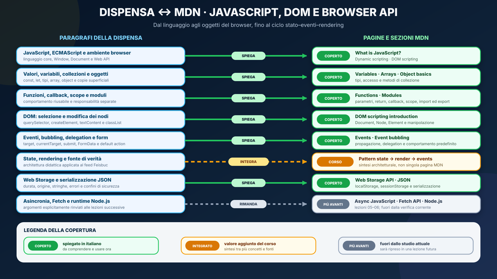
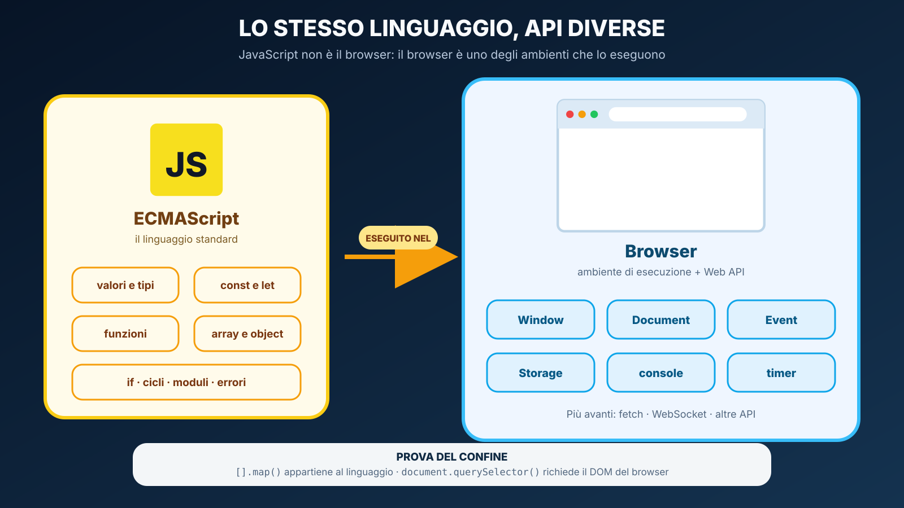
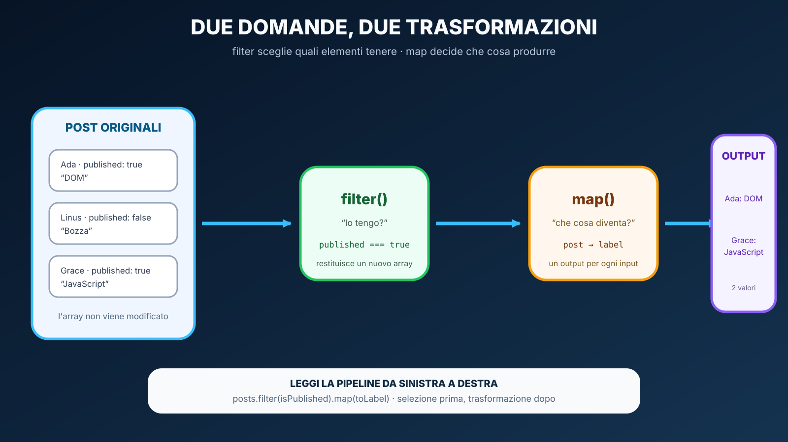
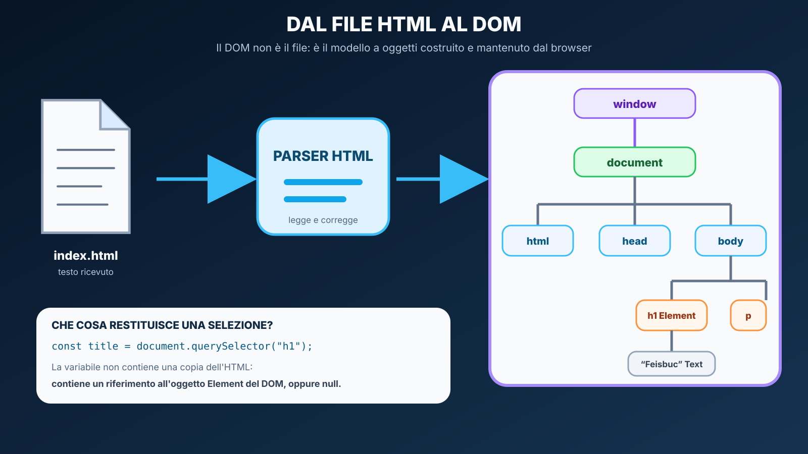
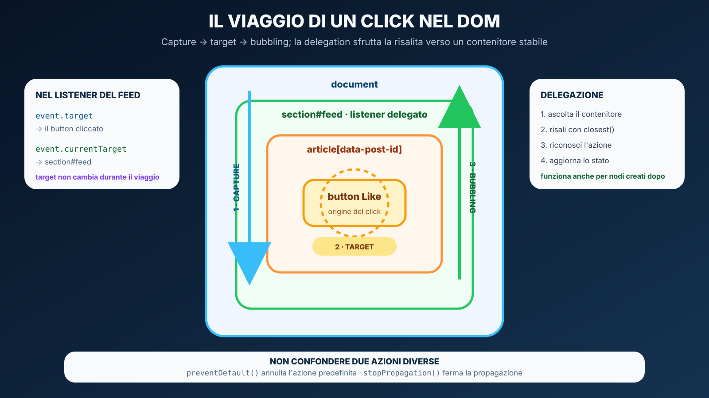
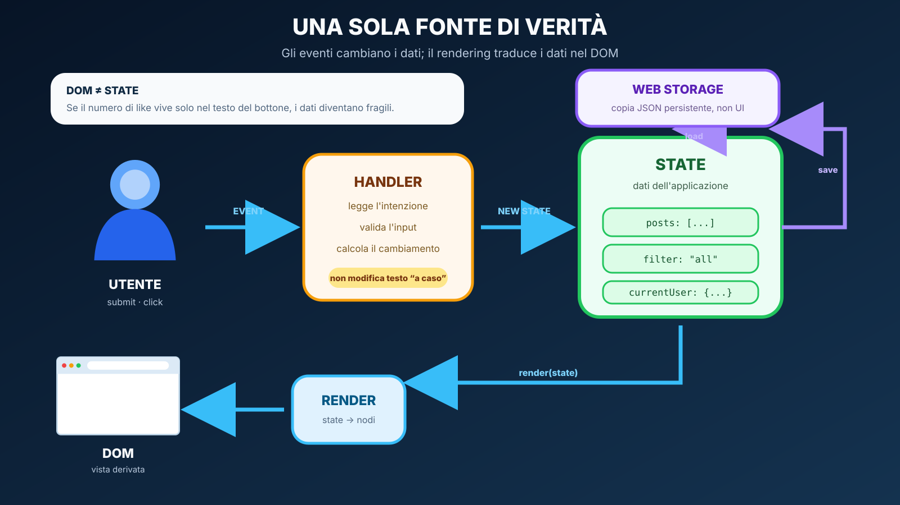
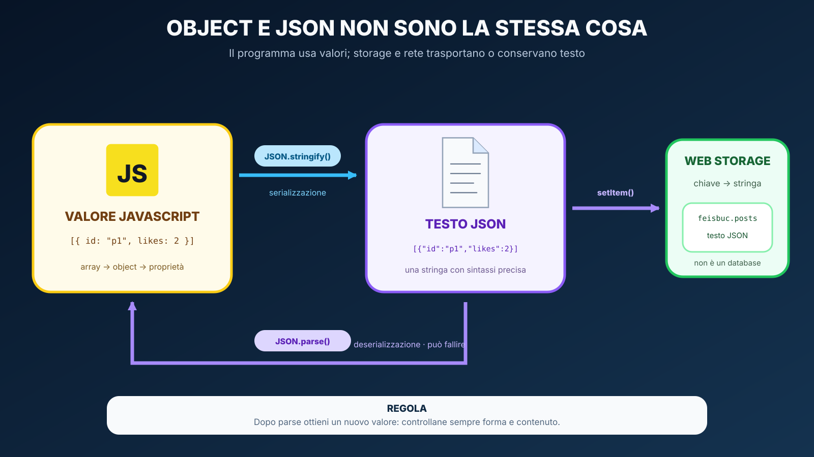

# JavaScript moderno, DOM e Browser APIs

<table align="center" width="100%"><tr><td>
<details>
<summary>&#128506; <strong>Orientamento della lezione</strong></summary>

<p align="justify"><strong>Contesto:</strong> HTML e CSS descrivono struttura e presentazione. JavaScript introduce stato e comportamento, mentre le Web API permettono al programma di interagire con documento, eventi e storage del browser.</p>
<p align="justify"><strong>Domande guida:</strong> che cosa appartiene al linguaggio e che cosa al browser? Come si mantiene una sola fonte di verità? Come si aggiorna il DOM senza perdere sicurezza e possibilità di debug?</p>
<p align="justify"><strong>Obiettivi osservabili:</strong> trasformare dati con funzioni e array methods, selezionare e creare nodi, gestire eventi e bubbling, separare stato e rendering e persistere uno snapshot locale.</p>
<p align="justify"><strong>Prossimo passo:</strong> la lezione 05 sostituirà lo storage locale come fonte condivisa con un contratto HTTP e una REST API.</p>

</details>
</td></tr></table>

<p align="justify">Stato: <strong>lezione revisionata</strong>. Modulo di UDA 22. L'obiettivo non è imparare una lunga lista di sintassi, ma capire come JavaScript rappresenta dati e comportamento e come il browser espone la pagina attraverso API manipolabili dal programma.</p>

## Obiettivi

<p align="justify">Al termine del modulo lo studente deve saper:</p>

<ul>
  <li>distinguere <strong>ECMAScript</strong> dal DOM e dalle altre Web APIs del browser;</li>
  <li>usare <code>const</code> e <code>let</code> in modo consapevole e spiegare perché <code>var</code> non è la scelta predefinita del corso;</li>
  <li>riconoscere primitive, array, object, <code>null</code> e <code>undefined</code> nei casi d'uso più comuni;</li>
  <li>distinguere riassegnazione di una variabile da mutazione di un oggetto;</li>
  <li>usare template literal, destructuring, spread e optional chaining quando migliorano la leggibilità;</li>
  <li>manipolare collezioni con <code>map</code>, <code>filter</code>, <code>find</code>, <code>some</code>, <code>every</code> e, quando utile, <code>reduce</code>;</li>
  <li>scrivere funzioni, callback e arrow function senza trattarle come sintassi magica;</li>
  <li>comprendere scope a blocchi e problemi causati da stato globale non necessario;</li>
  <li>separare codice in ES modules con <code>import</code> ed <code>export</code>;</li>
  <li>ricostruire la sequenza di inizializzazione di una piccola applicazione a moduli;</li>
  <li>selezionare elementi DOM con <code>querySelector</code>/<code>querySelectorAll</code>;</li>
  <li>creare e modificare nodi con <code>createElement</code>, <code>textContent</code>, <code>classList</code>, <code>dataset</code> e <code>append</code>;</li>
  <li>registrare eventi con <code>addEventListener</code> e usare correttamente l'oggetto <code>Event</code>;</li>
  <li>distinguere <code>target</code> e <code>currentTarget</code> e spiegare il bubbling;</li>
  <li>usare <strong>event delegation</strong> quando gli elementi possono essere creati dinamicamente;</li>
  <li>intercettare una form con <code>submit</code>, <code>preventDefault()</code> e <code>FormData</code>;</li>
  <li>distinguere valori JavaScript e testo JSON, validando ciò che viene deserializzato;</li>
  <li>usare <code>localStorage</code> e <code>sessionStorage</code> per dati semplici, gestendo anche gli errori di lettura e scrittura;</li>
  <li>organizzare una piccola UI secondo il flusso <code>state -&gt; render -&gt; events -&gt; new state</code>;</li>
  <li>rendere osservabili le modifiche tramite status accessibili, stato dei controlli e gestione del focus;</li>
  <li>diagnosticare errori JavaScript con console, breakpoint, stack trace e DevTools.</li>
</ul>

## Prerequisiti

<ul>
  <li>UDA 21: HTML semantico, CSS responsive e Bootstrap;</li>
  <li>concetti generali di variabile, selezione, iterazione e funzione studiati negli anni precedenti;</li>
  <li>uso essenziale della console e di DevTools.</li>
</ul>

<a id="lesson-learning-path"></a>
## Percorso didattico delle 19 ore

<p align="justify">La lezione è un percorso di più incontri, non un capitolo da leggere tutto in una volta. Ogni blocco introduce soltanto i concetti necessari al prodotto successivo; le Activity verificano ciò che è già stato costruito.</p>

<table align="center" width="100%"><tr><td>
<details>
<summary>&#129517; <strong>Sei blocchi progressivi — contenuti, prodotto e tempo</strong></summary>

<ol>
  <li><strong>3 ore — dal browser alle funzioni:</strong> ambiente JavaScript, console, valori, operatori, decisioni, funzioni e callback; prodotto: contatore interattivo minimo;</li>
  <li><strong>3 ore — dai dati alle trasformazioni:</strong> array, object, riferimenti, copie e pipeline; prodotti: Activity A e B;</li>
  <li><strong>3 ore — dai file al DOM:</strong> moduli, sequenza di avvio, selezione, creazione e modifica dei nodi;</li>
  <li><strong>4 ore — dall'interazione all'intenzione:</strong> eventi, form, bubbling, delegation e accessibilità;</li>
  <li><strong>4 ore — dallo stato alla persistenza:</strong> state/render, JSON, Web Storage e Activity C;</li>
  <li><strong>2 ore — dalla diagnosi alla verifica:</strong> DevTools, Activity D, correzione motivata e checkpoint.</li>
</ol>

<p align="justify"><strong>Totale:</strong> 19 ore. Ogni blocco termina con una domanda di uscita prima di introdurre il successivo.</p>

</details>
</td></tr></table>

<a id="lesson-docs-maps"></a>
## Orientamento nella documentazione MDN

<p align="justify">La dispensa costruisce un percorso guidato in italiano, mentre MDN rimane la documentazione professionale da imparare a consultare. Se è la prima volta che la usi, apri prima la <a href="GUIDA_USO_MDN.md">guida trasversale a MDN</a>. In questa lezione è importante distinguere le pagine <strong>Learn</strong>, che costruiscono il modello mentale, dalle pagine <strong>Reference</strong>, che descrivono il contratto puntuale di un metodo, una proprietà o un'interfaccia.</p>

<table align="center"><tr><td>
<p align="justify"><strong><span style="font-size: 1.15em;">&#128506;</span> Come leggere i colori:</strong>
<strong>coperto</strong> indica un contenuto spiegato e richiesto; <strong>integrato dal corso</strong> una sintesi architetturale costruita collegando più fonti; <strong>più avanti</strong> un argomento escluso dalla verifica attuale. Ogni stato è scritto, quindi il significato non dipende soltanto dal colore.</p>
</td></tr></table>

<a id="lesson-js-mdn-map"></a>
<table align="center"><tr><td>
<details>
<summary>&#128506;&#65039; <strong>Mappa — JavaScript, DOM e Browser API nella documentazione MDN</strong></summary>

<p align="justify">La mappa mostra la progressione della lezione: prima il linguaggio, poi le API offerte dal browser, quindi eventi, stato, rendering e persistenza locale. Asincronia, Fetch e Node.js sono visibili per orientarsi, ma vengono studiati nelle lezioni successive.</p>

<p align="center">
  
</p>

</details>
</td></tr></table>

<a id="lesson-js-mdn-cross-index"></a>
<table align="center" width="100%"><tr><td>
<details>
<summary>&#128279; <strong>Indice incrociato navigabile — Dispensa ↔ MDN</strong></summary>

<p align="justify">Ogni scheda collega un paragrafo della lezione alla fonte ufficiale pertinente. I titoli sono cliccabili; le descrizioni sintetiche sottostanti non lo sono.</p>
<p><strong>Legenda:</strong> &#128309; contenuto della dispensa · &#128994; contenuto MDN · &#128993; argomento rimandato.</p>

<details>
<summary><strong>Linguaggio e dati</strong> · 4 voci</summary>

<blockquote>
<p><strong>01 · CORRISPONDENZA</strong></p>
<p><strong>&#128309; DISPENSA</strong><br><strong><a href="#lesson-js-language">ECMAScript, JavaScript e Web API</a></strong></p>
<ul><li>Distingue il linguaggio dagli oggetti messi a disposizione dal browser.</li></ul>
<p><strong>&#128994; MDN</strong><br><strong><a href="https://developer.mozilla.org/en-US/docs/Learn_web_development/Core/Scripting/What_is_JavaScript">What is JavaScript?</a></strong><br><strong><a href="https://developer.mozilla.org/en-US/docs/Learn_web_development/Core/Scripting/DOM_scripting#the_important_parts_of_a_web_browser">The important parts of a web browser</a></strong></p>
<ul><li>Ruolo del linguaggio client-side e oggetti <code>Window</code>, <code>Navigator</code> e <code>Document</code>.</li></ul>
</blockquote>

<blockquote>
<p><strong>02 · CORRISPONDENZA</strong></p>
<p><strong>&#128309; DISPENSA</strong><br><strong><a href="#lesson-js-bindings">Variabili, valori e tipi</a></strong></p>
<ul><li><code>const</code>, <code>let</code>, riassegnazione, mutazione e tipi usati da Feisbuc.</li></ul>
<p><strong>&#128994; MDN</strong><br><strong><a href="https://developer.mozilla.org/en-US/docs/Learn_web_development/Core/Scripting/Variables">Variables</a></strong></p>
<ul><li>Dichiarazione, inizializzazione, tipi dinamici e costanti.</li></ul>
</blockquote>

<blockquote>
<p><strong>03 · CORRISPONDENZA</strong></p>
<p><strong>&#128309; DISPENSA</strong><br><strong><a href="#lesson-js-control-flow">Controllo di flusso e array</a></strong></p>
<ul><li>Decisioni, iterazioni, ricerca, filtro, trasformazione e mutazione.</li></ul>
<p><strong>&#128994; MDN</strong><br><strong><a href="https://developer.mozilla.org/en-US/docs/Learn_web_development/Core/Scripting/Conditionals">Conditionals</a></strong><br><strong><a href="https://developer.mozilla.org/en-US/docs/Learn_web_development/Core/Scripting/Loops">Looping code</a></strong><br><strong><a href="https://developer.mozilla.org/en-US/docs/Learn_web_development/Core/Scripting/Arrays">Arrays</a></strong></p>
<ul><li>Rami, cicli e operazioni fondamentali sulle collezioni ordinate.</li></ul>
</blockquote>

<blockquote>
<p><strong>04 · CORRISPONDENZA</strong></p>
<p><strong>&#128309; DISPENSA</strong><br><strong><a href="#lesson-js-objects">Object, destructuring e spread</a></strong></p>
<ul><li>Dati con proprietà nominate, accesso e copia superficiale.</li></ul>
<p><strong>&#128994; MDN</strong><br><strong><a href="https://developer.mozilla.org/en-US/docs/Learn_web_development/Core/Scripting/Object_basics">Object basics</a></strong><br><strong><a href="https://developer.mozilla.org/en-US/docs/Web/JavaScript/Reference/Operators/Spread_syntax">Spread syntax</a></strong></p>
<ul><li>Notazione a punto/parentesi e copia o espansione di object e array.</li></ul>
</blockquote>

</details>

<details>
<summary><strong>Funzioni, scope e moduli</strong> · 3 voci</summary>

<blockquote>
<p><strong>05 · CORRISPONDENZA</strong></p>
<p><strong>&#128309; DISPENSA</strong><br><strong><a href="#lesson-js-functions">Funzioni e callback</a></strong></p>
<ul><li>Parametri, valore restituito, effetti e funzioni passate ad altre API.</li></ul>
<p><strong>&#128994; MDN</strong><br><strong><a href="https://developer.mozilla.org/en-US/docs/Learn_web_development/Core/Scripting/Functions">Functions — reusable blocks of code</a></strong><br><strong><a href="https://developer.mozilla.org/en-US/docs/Learn_web_development/Core/Scripting/Return_values">Function return values</a></strong></p>
<ul><li>Definizione, invocazione, parametri, scope e <code>return</code>.</li></ul>
</blockquote>

<blockquote>
<p><strong>06 · CORRISPONDENZA</strong></p>
<p><strong>&#128309; DISPENSA</strong><br><strong><a href="#lesson-js-scope">Scope ed errori recuperabili</a></strong></p>
<ul><li>Visibilità dei nomi, stato globale e uso mirato di <code>try/catch</code>.</li></ul>
<p><strong>&#128994; MDN</strong><br><strong><a href="https://developer.mozilla.org/en-US/docs/Glossary/Scope">Scope</a></strong><br><strong><a href="https://developer.mozilla.org/en-US/docs/Web/JavaScript/Guide/Control_flow_and_error_handling#exception_handling_statements">Exception handling statements</a></strong></p>
<ul><li>Ambito dei binding e gestione delle eccezioni quando esiste una strategia di recupero.</li></ul>
</blockquote>

<blockquote>
<p><strong>07 · CORRISPONDENZA</strong></p>
<p><strong>&#128309; DISPENSA</strong><br><strong><a href="#lesson-js-modules">ES modules nel browser</a></strong></p>
<ul><li>File con responsabilità separate collegati da <code>import</code> ed <code>export</code>.</li></ul>
<p><strong>&#128994; MDN</strong><br><strong><a href="https://developer.mozilla.org/en-US/docs/Web/JavaScript/Guide/Modules">JavaScript modules</a></strong></p>
<ul><li>Esportazioni, importazioni, caricamento tramite <code>type="module"</code> e vincoli del browser.</li></ul>
</blockquote>

</details>

<details>
<summary><strong>DOM, eventi e form</strong> · 4 voci</summary>

<blockquote>
<p><strong>08 · CORRISPONDENZA</strong></p>
<p><strong>&#128309; DISPENSA</strong><br><strong><a href="#lesson-js-dom">Il DOM e la manipolazione dei nodi</a></strong></p>
<ul><li>Albero di oggetti, selezione, creazione, testo, classi e attributi <code>data-*</code>.</li></ul>
<p><strong>&#128994; MDN</strong><br><strong><a href="https://developer.mozilla.org/en-US/docs/Learn_web_development/Core/Scripting/DOM_scripting">DOM scripting introduction</a></strong></p>
<ul><li>Relazioni fra nodi e operazioni fondamentali sul documento.</li></ul>
</blockquote>

<blockquote>
<p><strong>09 · CORRISPONDENZA</strong></p>
<p><strong>&#128309; DISPENSA</strong><br><strong><a href="#lesson-js-events">Eventi e listener</a></strong></p>
<ul><li>Registrazione di callback e lettura dell'oggetto <code>Event</code>.</li></ul>
<p><strong>&#128994; MDN</strong><br><strong><a href="https://developer.mozilla.org/en-US/docs/Learn_web_development/Core/Scripting/Events">Introduction to events</a></strong><br><strong><a href="https://developer.mozilla.org/en-US/docs/Web/API/EventTarget/addEventListener"><code>addEventListener()</code></a></strong></p>
<ul><li>Tipi di evento, handler, comportamento predefinito e contratto del listener.</li></ul>
</blockquote>

<blockquote>
<p><strong>10 · CORRISPONDENZA</strong></p>
<p><strong>&#128309; DISPENSA</strong><br><strong><a href="#lesson-js-event-flow">Bubbling ed event delegation</a></strong></p>
<ul><li><code>target</code>, <code>currentTarget</code> e un listener sul contenitore stabile.</li></ul>
<p><strong>&#128994; MDN</strong><br><strong><a href="https://developer.mozilla.org/en-US/docs/Learn_web_development/Core/Scripting/Event_bubbling">Event bubbling</a></strong><br><strong><a href="https://developer.mozilla.org/en-US/docs/Web/API/Element/closest"><code>Element.closest()</code></a></strong></p>
<ul><li>Propagazione, delegation e ricerca dell'antenato che rappresenta l'azione.</li></ul>
</blockquote>

<blockquote>
<p><strong>11 · CORRISPONDENZA</strong></p>
<p><strong>&#128309; DISPENSA</strong><br><strong><a href="#lesson-js-forms">Form, <code>submit</code> e <code>FormData</code></a></strong></p>
<ul><li>Un solo flusso per pulsante e tastiera, lettura dei campi e annullamento controllato.</li></ul>
<p><strong>&#128994; MDN</strong><br><strong><a href="https://developer.mozilla.org/en-US/docs/Web/API/HTMLFormElement/submit_event"><code>submit</code> event</a></strong><br><strong><a href="https://developer.mozilla.org/en-US/docs/Web/API/FormData"><code>FormData</code></a></strong></p>
<ul><li>Evento emesso dalla form e insieme chiave/valore dei controlli con <code>name</code>.</li></ul>
</blockquote>

</details>

<details>
<summary><strong>Architettura della UI, storage e confini</strong> · 4 voci</summary>

<blockquote>
<p><strong>12 · INTEGRAZIONE DEL CORSO</strong></p>
<p><strong>&#128309; DISPENSA</strong><br><strong><a href="#lesson-js-state">Stato, rendering ed eventi</a></strong></p>
<ul><li>Una sola fonte di verità e trasformazione esplicita dai dati al DOM.</li></ul>
<p><strong>&#128994; MDN</strong><br><em>Nessuna singola pagina MDN descrive l'intero pattern usato da Feisbuc.</em></p>
<ul><li>La dispensa integra funzioni, array, DOM ed eventi in un modello architetturale osservabile.</li></ul>
</blockquote>

<blockquote>
<p><strong>13 · CORRISPONDENZA</strong></p>
<p><strong>&#128309; DISPENSA</strong><br><strong><a href="#lesson-js-json">JSON: valori e testo</a></strong><br><strong><a href="#lesson-js-storage">Web Storage</a></strong></p>
<ul><li>Serializzazione, validazione, persistenza locale a stringhe, durata, origine ed errori.</li></ul>
<p><strong>&#128994; MDN</strong><br><strong><a href="https://developer.mozilla.org/en-US/docs/Web/API/Web_Storage_API">Web Storage API</a></strong><br><strong><a href="https://developer.mozilla.org/en-US/docs/Learn_web_development/Core/Scripting/JSON">Working with JSON</a></strong></p>
<ul><li><code>localStorage</code>, <code>sessionStorage</code> e conversione fra valori JavaScript e testo JSON.</li></ul>
</blockquote>

<blockquote>
<p><strong>14 · CORRISPONDENZA</strong></p>
<p><strong>&#128309; DISPENSA</strong><br><strong><a href="#lesson-js-debug">Debug JavaScript</a></strong></p>
<ul><li>Riproduzione, eccezione, stack trace, breakpoint, ipotesi e regressione.</li></ul>
<p><strong>&#128994; MDN</strong><br><strong><a href="https://developer.mozilla.org/en-US/docs/Learn_web_development/Core/Scripting/Debugging_JavaScript">Debugging JavaScript</a></strong></p>
<ul><li>Console, messaggi d'errore, strumenti del browser e diagnosi sistematica.</li></ul>
</blockquote>

<blockquote>
<p><strong>15 · PIÙ AVANTI</strong></p>
<p><strong>&#128309; DISPENSA</strong><br><strong><a href="#lesson-js-boundaries">Cosa non entra ancora in UDA 22</a></strong></p>
<ul><li>Colloca asincronia, rete e runtime server nelle lezioni corrette.</li></ul>
<p><strong>&#128993; MDN</strong><br><strong><a href="https://developer.mozilla.org/en-US/docs/Learn_web_development/Core/Scripting/Async_JavaScript">Asynchronous JavaScript</a></strong><br><strong><a href="https://developer.mozilla.org/en-US/docs/Learn_web_development/Core/Scripting/Network_requests">Network requests</a></strong></p>
<ul><li>Riconoscere i termini; studio operativo dalla lezione 05.</li></ul>
</blockquote>

</details>

</details>
</td></tr></table>

<a id="lesson-js-api-map"></a>
<table align="center" width="100%"><tr><td>
<details>
<summary>&#129513; <strong>Mappa delle schede tecniche — oggetti e API della lezione</strong></summary>

<p align="justify">“Studiare ora” indica il contratto minimo da comprendere e utilizzare. “Riconoscere per dopo” raccoglie varianti utili che non sono richieste in autonomia nella verifica corrente.</p>

<table align="center">
<thead><tr><th>Famiglia</th><th>Studiare ora</th><th>Riconoscere per dopo</th></tr></thead>
<tbody>
<tr><td><strong>Collezioni</strong></td><td><ul><li><a href="https://developer.mozilla.org/en-US/docs/Web/JavaScript/Reference/Global_Objects/Array/find"><code>find()</code></a>, <a href="https://developer.mozilla.org/en-US/docs/Web/JavaScript/Reference/Global_Objects/Array/filter"><code>filter()</code></a>, <a href="https://developer.mozilla.org/en-US/docs/Web/JavaScript/Reference/Global_Objects/Array/map"><code>map()</code></a>.</li><li><a href="https://developer.mozilla.org/en-US/docs/Web/JavaScript/Reference/Global_Objects/Array/some"><code>some()</code></a>, <a href="https://developer.mozilla.org/en-US/docs/Web/JavaScript/Reference/Global_Objects/Array/every"><code>every()</code></a>.</li></ul></td><td><ul><li><a href="https://developer.mozilla.org/en-US/docs/Web/JavaScript/Reference/Global_Objects/Array/reduce"><code>reduce()</code></a> per accumulare.</li><li>Metodi avanzati e typed array.</li></ul></td></tr>
<tr><td><strong>Document</strong></td><td><ul><li><a href="https://developer.mozilla.org/en-US/docs/Web/API/Document/querySelector"><code>querySelector()</code></a>.</li><li><a href="https://developer.mozilla.org/en-US/docs/Web/API/Document/querySelectorAll"><code>querySelectorAll()</code></a>.</li><li><a href="https://developer.mozilla.org/en-US/docs/Web/API/Document/createElement"><code>createElement()</code></a>.</li></ul></td><td><ul><li>Selettori legacy dedicati.</li><li><code>DocumentFragment</code>.</li></ul></td></tr>
<tr><td><strong>Node ed Element</strong></td><td><ul><li><a href="https://developer.mozilla.org/en-US/docs/Web/API/Node/textContent"><code>textContent</code></a> e <a href="https://developer.mozilla.org/en-US/docs/Web/API/Element/append"><code>append()</code></a>.</li><li><a href="https://developer.mozilla.org/en-US/docs/Web/API/Element/classList"><code>classList</code></a>, <a href="https://developer.mozilla.org/en-US/docs/Web/API/HTMLElement/dataset"><code>dataset</code></a>, <a href="https://developer.mozilla.org/en-US/docs/Web/API/Element/closest"><code>closest()</code></a>.</li></ul></td><td><ul><li><code>cloneNode()</code>.</li><li><code>DocumentFragment</code> e template avanzati.</li></ul></td></tr>
<tr><td><strong>Eventi e form</strong></td><td><ul><li><a href="https://developer.mozilla.org/en-US/docs/Web/API/EventTarget/addEventListener"><code>addEventListener()</code></a>.</li><li><a href="https://developer.mozilla.org/en-US/docs/Web/API/Event/target"><code>target</code></a>, <a href="https://developer.mozilla.org/en-US/docs/Web/API/Event/currentTarget"><code>currentTarget</code></a>, <a href="https://developer.mozilla.org/en-US/docs/Web/API/Event/preventDefault"><code>preventDefault()</code></a>.</li><li><a href="https://developer.mozilla.org/en-US/docs/Web/API/FormData"><code>FormData</code></a>.</li></ul></td><td><ul><li>Capture e opzioni avanzate del listener.</li><li>Custom events.</li></ul></td></tr>
<tr><td><strong>Storage e JSON</strong></td><td><ul><li><a href="https://developer.mozilla.org/en-US/docs/Web/API/Window/localStorage"><code>localStorage</code></a> e <a href="https://developer.mozilla.org/en-US/docs/Web/API/Window/sessionStorage"><code>sessionStorage</code></a>.</li><li><a href="https://developer.mozilla.org/en-US/docs/Web/API/Storage/getItem"><code>getItem()</code></a>, <a href="https://developer.mozilla.org/en-US/docs/Web/API/Storage/setItem"><code>setItem()</code></a>.</li><li><a href="https://developer.mozilla.org/en-US/docs/Web/JavaScript/Reference/Global_Objects/JSON/stringify"><code>JSON.stringify()</code></a> e <a href="https://developer.mozilla.org/en-US/docs/Web/JavaScript/Reference/Global_Objects/JSON/parse"><code>JSON.parse()</code></a>.</li></ul></td><td><ul><li>Evento <code>storage</code>.</li><li>IndexedDB per dati strutturati.</li></ul></td></tr>
</tbody>
</table>

</details>
</td></tr></table>

<table align="center"><tr><td>
<details>
<summary>&#128218; <strong>Glossario operativo — le parole da saper spiegare</strong></summary>
<ul>
  <li><strong>ECMAScript:</strong> standard che definisce il linguaggio JavaScript;</li>
  <li><strong>Web API:</strong> interfaccia offerta dall'ambiente browser al codice JavaScript;</li>
  <li><strong>binding:</strong> associazione fra un nome e un valore, creata per esempio con <code>const</code> o <code>let</code>;</li>
  <li><strong>callback:</strong> funzione passata a un'altra funzione o API perché venga richiamata;</li>
  <li><strong>DOM:</strong> rappresentazione del documento come albero di oggetti;</li>
  <li><strong>listener:</strong> callback registrata per reagire a un evento;</li>
  <li><strong>bubbling:</strong> propagazione di molti eventi dal target verso gli antenati;</li>
  <li><strong>state:</strong> dati correnti che descrivono l'applicazione;</li>
  <li><strong>rendering:</strong> trasformazione dello state nella rappresentazione DOM;</li>
  <li><strong>serializzazione:</strong> conversione di un valore in un formato testuale memorizzabile o trasmissibile;</li>
  <li><strong>truthy/falsy:</strong> modo in cui JavaScript interpreta un valore quando deve prendere una decisione booleana;</li>
  <li><strong>alias:</strong> un secondo binding che fa riferimento allo stesso object;</li>
  <li><strong>entry point:</strong> modulo dal quale parte l'inizializzazione dell'applicazione;</li>
</ul>
</details>
</td></tr></table>

## Problema iniziale

<p align="justify">HTML descrive <strong>che cosa esiste</strong> nella pagina. CSS descrive <strong>come appare</strong>. Ma come facciamo a dire:</p>

<blockquote>
<p align="justify">quando l'utente preme "Mi piace", aggiorna il post; quando pubblica, aggiungi un nuovo articolo al feed; se ricarica la pagina, conserva i post locali?</p>
</blockquote>

<p align="justify">Serve comportamento. Nel browser, gran parte di questo comportamento viene scritto in JavaScript.</p>

<p align="justify">La prima idea da fissare è però questa: <strong>JavaScript è il linguaggio; il browser è un ambiente che esegue quel linguaggio e gli affianca proprie API</strong>. Per questo una funzione sugli array può esistere anche fuori dal browser, mentre <code>document.querySelector()</code> richiede un documento e quindi il DOM.</p>

<a id="lesson-js-language"></a>
## ECMAScript, JavaScript e Web APIs

<p align="justify">Lo standard del linguaggio si chiama <strong>ECMAScript</strong>. La specifica tecnica descrive sintassi e semantica di dichiarazioni, funzioni, object, array, moduli e così via. “JavaScript” è il nome normalmente usato per le implementazioni di ECMAScript e per l'ecosistema che le circonda.</p>

<p align="justify">Il browser aggiunge oggetti come <code>Window</code>, <code>Navigator</code>, <code>Document</code>, <code>Element</code>, <code>Event</code> e <code>Storage</code>, oltre ad API quali console, timer, Fetch e WebSocket. <code>Navigator</code>, per esempio, espone informazioni e funzionalità relative al browser e al dispositivo. Questi oggetti non diventano parte del linguaggio: sono servizi pubblici dell'ambiente browser.</p>

<p align="center"></p>

<table align="center"><tr><td>
<p align="justify"><strong><span style="font-size: 1.15em;">&#129504;</span> Prova mentale:</strong> chiediti “questo oggetto esisterebbe anche in un programma JavaScript eseguito senza una pagina web?”. <code>Array</code> e <code>JSON</code> appartengono al linguaggio; <code>document</code> e <code>localStorage</code> sono forniti dal browser. Nella lezione 06 confronteremo questo ambiente con Node.js.</p>
</td></tr></table>

<p align="justify">Per esempio:</p>

```js
const posts = [];
```

<p align="justify">usa solo il linguaggio ECMAScript.</p>

```js
const feed = document.querySelector("#feed");
```

<p align="justify">usa anche la DOM API fornita dal browser.</p>

<p align="justify">Questa distinzione diventerà essenziale quando useremo JavaScript anche in Node.js: stesso linguaggio, ambiente e API differenti.</p>

<p align="justify">Riferimenti professionali:</p>

<ul>
  <li>MDN JavaScript Guide: <a href="https://developer.mozilla.org/en-US/docs/Web/JavaScript/Guide">https://developer.mozilla.org/en-US/docs/Web/JavaScript/Guide</a></li>
  <li>ECMAScript specification: <a href="https://tc39.es/ecma262/">https://tc39.es/ecma262/</a></li>
  <li>MDN DOM scripting: <a href="https://developer.mozilla.org/en-US/docs/Learn_web_development/Core/Scripting/DOM_scripting">https://developer.mozilla.org/en-US/docs/Learn_web_development/Core/Scripting/DOM_scripting</a></li>
</ul>

## Primo incontro: osservare un comportamento completo

<p align="justify">Prima di studiare ogni parola osserviamo una piccola applicazione completa. Non serve ancora memorizzare la sintassi: segui il percorso dal dato alla pagina.</p>

```html
<button id="increment" type="button">Aggiungi</button>
<output id="count">0</output>
<script type="module" src="counter.js"></script>
```

```js
const button = document.querySelector("#increment");
const output = document.querySelector("#count");

if (!button || !output) {
  throw new Error("Interfaccia del contatore incompleta");
}

let count = 0;

function render() {
  output.textContent = String(count);
}

button.addEventListener("click", () => {
  count += 1;
  render();
});
```

<ol>
  <li>il browser costruisce gli oggetti corrispondenti a <code>button</code> e <code>output</code>;</li>
  <li>JavaScript conserva il dato <code>count</code>;</li>
  <li>il listener registra una funzione da eseguire più tardi;</li>
  <li>il click modifica il dato;</li>
  <li><code>render()</code> traduce il dato nel DOM.</li>
</ol>

<table align="center"><tr><td>
<p align="justify"><strong><span style="font-size: 1.15em;">&#128269;</span> Prima previsione:</strong> indica quali righe vengono eseguite una sola volta e quali vengono eseguite a ogni click. Poi aggiungi un <code>console.log(count)</code> nel listener e verifica la previsione.</p>
</td></tr></table>

<p align="justify">Feisbuc userà lo stesso meccanismo con un array di post al posto di un numero. I paragrafi successivi danno un nome preciso a ogni elemento appena osservato.</p>

<a id="lesson-js-bindings"></a>
## `const`, `let` e il significato di una variabile

### Regola pratica del corso

<p align="justify">Parti da <code>const</code>.</p>

<p align="justify">Usa <code>let</code> quando <strong>la variabile deve essere riassegnata</strong>.</p>

<p align="justify">Non usare <code>var</code> come scelta predefinita.</p>

```js
const course = "TPSI";
let currentPost = 0;

currentPost += 1;
```

<p align="justify"><code>const</code> non significa "oggetto immutabile".</p>

```js
const post = {
  text: "Primo post",
  likes: 0,
};

post.likes += 1; // valido
```

<p align="justify">Non stiamo assegnando un nuovo oggetto alla variabile <code>post</code>: stiamo modificando una proprietà dell'oggetto esistente.</p>

<p align="justify">Questo invece non è valido:</p>

```js
const post = { text: "Ciao" };
post = { text: "Altro" };
```

<table align="center"><tr><td>
<p align="justify"><strong><span style="font-size: 1.15em;">&#128204;</span> Binding e valore:</strong> una variabile è un nome collegato a un valore. Con <code>const</code> non possiamo collegare quel nome a un altro valore; se il valore è un object o un array, le sue proprietà possono comunque cambiare. Per ottenere trasformazioni più prevedibili, nel Feisbuc useremo spesso spread, <code>map()</code> e <code>filter()</code> per produrre nuovi valori.</p>
</td></tr></table>

### Perché non trasformiamo ogni errore in una regola da memorizzare

<p align="justify">Nel vecchio materiale <code>lab3</code> esiste un esempio che assegna un nuovo valore a una <code>const</code>. Nel nuovo corso non lo presentiamo come normale codice da eseguire fino in fondo: diventa un esperimento controllato per osservare l'errore e capire la differenza fra <strong>binding</strong> e <strong>mutazione</strong>.</p>

## Valori e tipi che ci servono davvero

<p align="justify">Per il corso non partiamo da un catalogo enciclopedico. Partiamo dai dati di Feisbuc.</p>

```js
const author = "Ada";          // string
const likes = 3;                // number
const liked = false;            // boolean
const deletedAt = null;         // null esplicito
let selectedPost;               // undefined finché non assegniamo
const tags = ["web", "tpsi"];  // array
const post = {                   // object
  author,
  likes,
  liked,
  tags,
};
```

### `null` e `undefined`

<p align="justify">Useremo questa convenzione didattica:</p>

<ul>
  <li><code>undefined</code>: un valore non è stato ancora fornito/trovato;</li>
  <li><code>null</code>: il programma rappresenta intenzionalmente l'assenza di un valore.</li>
</ul>

<p align="justify">Non è una legge universale di ogni codebase, ma è una convenzione leggibile.</p>

### Controllare il tipo

```js
console.log(typeof likes);  // "number"
console.log(typeof author); // "string"
```

<p align="justify">Ricorda che JavaScript ha alcune particolarità storiche. Non cercheremo di impararle tutte a memoria: quando serve controlliamo MDN.</p>

### Tipizzazione dinamica e conversioni esplicite

<p align="justify">JavaScript è <strong>dinamicamente tipizzato</strong>: una variabile non dichiara un tipo fisso, mentre ogni valore possiede un tipo durante l'esecuzione. Questa libertà non elimina il bisogno di controllare i dati ai confini dell'applicazione.</p>

```js
const data = new FormData(form);
const rawLikes = data.get("likes"); // stringa, File oppure null
const likes = Number(rawLikes);

if (!Number.isFinite(likes) || likes < 0) {
  throw new TypeError("Il numero di like non è valido");
}
```

<p align="justify">I valori letti da campi HTML sono normalmente stringhe; <code>localStorage</code> conserva stringhe; una risposta JSON può avere una forma inattesa. Preferiamo conversioni e controlli espliciti alla coercizione implicita. Riferimenti: <a href="https://developer.mozilla.org/en-US/docs/Learn_web_development/Core/Scripting/Variables#dynamic_typing">MDN — Dynamic typing</a> e <a href="https://developer.mozilla.org/en-US/docs/Web/JavaScript/Reference/Global_Objects/Number">MDN — <code>Number</code></a>.</p>

## Uguaglianza: preferire `===`

<p align="justify">Nel core del corso usiamo normalmente:</p>

```js
if (post.likes === 0) {
  // ...
}
```

<p align="justify">invece di affidarsi alla conversione implicita di <code>==</code>.</p>

<p align="justify">L'obiettivo è ridurre i comportamenti sorprendenti mentre costruiamo un modello mentale solido. Con i valori primitivi <code>===</code> confronta valore e tipo; con object e array confronta invece se i due operandi fanno riferimento allo stesso oggetto.</p>

## Stringhe e template literal

```js
const author = "Ada";
const likes = 4;
const label = `${author} ha ${likes} like`;
```

<p align="justify">Le template literal sono particolarmente utili quando combiniamo testo e valori, ma non devono diventare un modo per costruire grandi blocchi HTML non controllati.</p>

## Espressioni, operatori e valori booleani

<p align="justify">Un'<strong>espressione</strong> produce un valore: <code>likes + 1</code> produce un numero, <code>likes === 0</code> produce un booleano. Una condizione decide il ramo da eseguire convertendo il proprio risultato in <code>true</code> o <code>false</code>.</p>

<ul>
  <li><code>!</code> nega un valore booleano;</li>
  <li><code>&amp;&amp;</code> restituisce il primo operando falsy oppure l'ultimo, quindi permette di richiedere che più condizioni siano soddisfatte;</li>
  <li><code>||</code> restituisce il primo operando truthy oppure l'ultimo e viene spesso usato per alternative generiche;</li>
  <li><code>??</code> usa l'alternativa soltanto quando il primo valore è <code>null</code> o <code>undefined</code>;</li>
  <li><code>condizione ? valoreA : valoreB</code> sceglie uno fra due valori.</li>
</ul>

<p align="justify">I valori <code>false</code>, <code>0</code>, <code>-0</code>, <code>0n</code>, la stringa vuota, <code>null</code>, <code>undefined</code> e <code>NaN</code> sono <strong>falsy</strong>; gli altri valori sono truthy. Per questo <code>if (!postList)</code> riconosce il <code>null</code> restituito da <code>querySelector()</code>. Non usiamo però la truthiness quando <code>0</code> o la stringa vuota sono dati validi che devono essere distinti dall'assenza.</p>

```js
const label = post.liked ? "Non mi piace più" : "Mi piace";
const displayName = user.nickname ?? "Utente anonimo";
```

<p align="justify">Riferimenti: <a href="https://developer.mozilla.org/en-US/docs/Web/JavaScript/Guide/Expressions_and_operators">MDN — Expressions and operators</a> e <a href="https://developer.mozilla.org/en-US/docs/Glossary/Falsy">MDN — Falsy</a>.</p>

<a id="lesson-js-functions"></a>
## Funzioni: comportamento riutilizzabile

<p align="justify">Una funzione definisce un piccolo contratto: riceve zero o più <strong>argomenti</strong>, li rende disponibili tramite i <strong>parametri</strong>, può restituire un valore con <code>return</code> e può produrre effetti osservabili. <code>formatPost</code> è una funzione; <code>posts.filter</code> è un metodo, cioè una funzione raggiunta come proprietà di un oggetto.</p>

```js
function formatPost(post, prefix = "Post") {
  return `${prefix} di ${post.author}: ${post.text}`;
}

const label = formatPost(post, "Messaggio");
```

<p align="justify"><code>post</code> e <code>prefix</code> sono parametri; <code>"Messaggio"</code> è un argomento; <code>prefix</code> ha un valore predefinito. Scrivere <code>formatPost</code> indica il valore funzione, mentre <code>formatPost(post)</code> la invoca.</p>

### Declaration, expression e arrow function

```js
function isPublished(post) {
  return post.published === true;
}

const isPublishedExpression = function (post) {
  return post.published === true;
};

const isPublishedArrow = (post) => post.published === true;
```

<p align="justify">Nel corso usiamo declaration per funzioni principali con un nome chiaro e arrow function soprattutto per callback brevi. Non scegliamo una arrow function perché è “più nuova”; il suo comportamento con <code>this</code> è diverso e verrà approfondito soltanto quando servirà.</p>

### Valore restituito ed effetto

<p align="justify"><code>return</code> conclude la funzione e consegna un valore al chiamante. Scrivere nel DOM, nella console o nello storage è invece un <strong>effetto</strong>. Separare il calcolo dagli effetti rende il codice più semplice da provare.</p>

```js
function increment(likes) {
  return likes + 1; // calcolo
}

function showLikes(element, likes) {
  element.textContent = String(likes); // effetto sul DOM
}
```

### Le funzioni sono valori: le callback

<p align="justify">Una <strong>callback</strong> è una funzione passata a un'altra funzione o API affinché venga invocata nel momento appropriato.</p>

```js
const published = posts.filter(isPublished);
button.addEventListener("click", handleClick);
```

<p align="justify">Nel primo caso <code>filter()</code> invoca la callback una volta per ogni elemento; nel secondo il browser la invoca quando avviene il click. Non scriviamo <code>handleClick()</code> durante la registrazione, perché la eseguiremmo immediatamente.</p>

<a id="lesson-js-scope"></a>
## Scope: dove esiste un nome

<p align="justify"><code>let</code> e <code>const</code> hanno scope di blocco. Una funzione può leggere i nomi definiti nel proprio scope e negli scope esterni in cui è stata creata.</p>

```js
let posts = [];

function handleSubmit() {
  const first = posts[0];
  // first esiste soltanto dentro questa funzione
}
```

<p align="justify">Il listener potrà leggere il valore aggiornato di <code>posts</code> anche quando verrà invocato più tardi. Questa relazione con lo scope esterno è alla base delle <strong>closure</strong>; per ora è sufficiente riconoscere chi può leggere o modificare ogni nome.</p>

<p align="justify">Riferimenti: <a href="https://developer.mozilla.org/en-US/docs/Learn_web_development/Core/Scripting/Functions">MDN — Functions</a>, <a href="https://developer.mozilla.org/en-US/docs/Learn_web_development/Core/Scripting/Return_values">MDN — Function return values</a> e <a href="https://developer.mozilla.org/en-US/docs/Glossary/Scope">MDN — Scope</a>.</p>

<table align="center"><tr><td>
<p align="justify"><strong><span style="font-size: 1.15em;">&#9989;</span> Micro-checkpoint 1:</strong> spiega senza eseguire il codice quando viene invocata la callback di <code>filter()</code>, quando quella di <code>addEventListener()</code> e quale valore restituisce ciascuna. Poi verifica dalla console.</p>
</td></tr></table>

<a id="lesson-js-control-flow"></a>
## Controllo di flusso: scegliere e ripetere

<p align="justify">Un programma non esegue sempre tutte le istruzioni nello stesso modo. Le condizioni scelgono un ramo; i cicli ripetono un'operazione.</p>

```js
function canDelete(post, currentUser) {
  if (!currentUser) return false;
  if (currentUser.role === "admin") return true;
  return post.authorId === currentUser.id;
}
```

<p align="justify">Gli <strong>early return</strong> rendono espliciti i casi che interrompono una funzione ed evitano annidamenti profondi. <code>switch</code> è utile quando uno stesso valore deve essere confrontato con molti casi discreti, ma non sostituisce automaticamente <code>if</code>.</p>

<p align="justify">Per attraversare una collezione scegliamo in base all'intenzione:</p>

```js
for (const post of posts) {
  console.log(post.author); // effetto: scrive nella console
}

const authors = posts.map((post) => post.author); // trasformazione
```

<ul>
  <li><code>for...of</code> comunica bene una sequenza di operazioni o effetti;</li>
  <li><code>map</code>, <code>filter</code> e <code>find</code> comunicano una trasformazione o una ricerca;</li>
  <li>non usiamo <code>map</code> soltanto per produrre effetti ignorando l'array restituito;</li>
  <li><code>break</code> interrompe il ciclo, <code>continue</code> salta all'iterazione successiva.</li>
</ul>

<p align="justify">Studia su MDN <a href="https://developer.mozilla.org/en-US/docs/Learn_web_development/Core/Scripting/Conditionals">Making decisions in your code</a> e <a href="https://developer.mozilla.org/en-US/docs/Learn_web_development/Core/Scripting/Loops">Looping code</a>. In questa lezione servono <code>if/else</code>, early return e <code>for...of</code>; le forme più specialistiche si consultano quando nasce un caso reale.</p>

## Array: una collezione ordinata

```js
const posts = [
  { id: 1, author: "Ada", likes: 4 },
  { id: 2, author: "Linus", likes: 1 },
  { id: 3, author: "Grace", likes: 7 },
];
```

### Leggere senza trasformare

```js
console.log(posts.length);
console.log(posts[0]);
```

<p align="justify">Gli indici partono da zero: il primo elemento è <code>posts[0]</code>, mentre l'ultimo si trova in <code>posts[posts.length - 1]</code>. Possiamo sostituire un elemento assegnando un nuovo valore a un indice; questo modifica l'array.</p>

### Aggiungere, rimuovere e cercare valori semplici

```js
const tags = ["html", "css"];
tags.push("javascript");       // aggiunge in fondo e modifica tags
const removed = tags.pop();   // rimuove e restituisce l'ultimo elemento
const hasCss = tags.includes("css");
const cssIndex = tags.indexOf("css");
const label = tags.join(" · ");
```

<p align="justify"><code>split()</code> compie il percorso inverso su una stringa: <code>"html,css".split(",")</code> produce un array. Prima di usare un metodo controlliamo sempre input, risultato e possibile mutazione.</p>

### Cercare

```js
const post = posts.find((item) => item.id === 2);
const hasPopularPost = posts.some((item) => item.likes >= 5);
const allHaveAuthors = posts.every((item) => item.author.length > 0);
```

### Filtrare

```js
const popular = posts.filter((item) => item.likes >= 5);
```

<p align="justify"><code>filter</code> produce un nuovo array contenente soltanto gli elementi che superano il test.</p>

### Trasformare

```js
const labels = posts.map((item) => `${item.author}: ${item.likes}`);
```

<p align="justify"><code>map</code> produce un nuovo array con un elemento di output per ogni elemento di input.</p>

<p align="center"></p>

<table align="center" width="100%">
<thead><tr><th>Metodo</th><th>Domanda</th><th>Risultato</th><th>Muta l'array?</th></tr></thead>
<tbody>
<tr><td><code>find()</code></td><td>Qual è il primo elemento valido?</td><td>elemento o <code>undefined</code></td><td>no</td></tr>
<tr><td><code>filter()</code></td><td>Quali elementi tengo?</td><td>nuovo array</td><td>no</td></tr>
<tr><td><code>map()</code></td><td>Che cosa diventa ogni elemento?</td><td>nuovo array</td><td>no</td></tr>
<tr><td><code>some()</code>/<code>every()</code></td><td>Almeno uno/tutti superano il test?</td><td>booleano</td><td>no</td></tr>
<tr><td><code>push()</code>/<code>pop()</code></td><td>Come aggiungo/rimuovo in fondo?</td><td>lunghezza/elemento rimosso</td><td>sì</td></tr>
</tbody>
</table>

### `reduce`: utile, non obbligatorio ovunque

```js
const totalLikes = posts.reduce((sum, item) => sum + item.likes, 0);
```

<p align="justify"><code>reduce</code> è potente, ma non è automaticamente migliore di codice più semplice. Nel corso lo usiamo quando rende chiaro che stiamo <strong>accumulando</strong> un risultato.</p>

### Metodi che mutano e metodi che restituiscono nuovi valori

<p align="justify">È importante sapere se un'operazione modifica l'array originale.</p>

```js
posts.push(newPost); // muta posts
```

```js
const visiblePosts = posts.filter((post) => !post.hidden); // nuovo array
```

<p align="justify">Quando non ricordiamo il comportamento esatto di un metodo, la risposta professionale e aprire la documentazione.</p>

<p align="justify">Riferimento: <a href="https://developer.mozilla.org/en-US/docs/Web/JavaScript/Reference/Global_Objects/Array">https://developer.mozilla.org/en-US/docs/Web/JavaScript/Reference/Global_Objects/Array</a></p>

<table align="center"><tr><td>
<p align="justify"><strong><span style="font-size: 1.15em;">&#9989;</span> Micro-checkpoint 2:</strong> dato l'array dei tre post, prevedi quanti elementi saranno prodotti da <code>filter()</code>, quante volte verrà invocata la callback di <code>map()</code> e se l'array originale cambierà. Verifica poi con l'Activity A.</p>
</td></tr></table>

<a id="lesson-js-objects"></a>
## Object: dati con un significato

```js
const post = {
  id: crypto.randomUUID(),
  author: "Ada",
  text: "Sto studiando il DOM",
  likes: 0,
  liked: false,
};
```

<p align="justify"><code>crypto.randomUUID()</code> è una Web API del browser, non una funzione ECMAScript. Produce un identificatore adatto alla demo quando la pagina è servita in un contesto sicuro, compreso <code>localhost</code>. L'identità appartiene al post e verrà rappresentata nel DOM con <code>data-post-id</code>.</p>

### Property access

```js
console.log(post.author);
console.log(post["author"]);
```

<p align="justify">La forma con punto è normalmente la più leggibile quando conosciamo il nome della proprietà.</p>

## Destructuring

```js
const { author, text, likes } = post;
```

<p align="justify">equivale concettualmente a estrarre le proprietà che ci interessano.</p>

<p align="justify">Con gli array:</p>

```js
const [firstPost, secondPost] = posts;
```

<p align="justify">Non usiamo destructuring per rendere il codice “più moderno”: lo usiamo quando riduce rumore.</p>

## Spread: copiare una struttura superficiale

<p align="justify">Assegnare un object a una nuova variabile non crea una copia: crea un secondo riferimento allo stesso object.</p>

```js
const original = { likes: 0, liked: false };
const alias = original;
alias.likes += 1;

console.log(original.likes); // 1
console.log(original === alias); // true
```

<p align="center"></p>

```js
const likedPost = {
  ...post,
  liked: true,
  likes: post.likes + 1,
};
```

<p align="justify">Abbiamo creato un <strong>nuovo object</strong> copiando le proprietà di <code>post</code> e sostituendo quelle indicate dopo.</p>

<p align="justify">Per un array:</p>

```js
const newPosts = [...posts, newPost];
```

<p align="justify">Lo spread è superficiale (<em>shallow</em>): se dentro l'oggetto ci sono altri object o array, quei valori richiedono attenzione. La copia profonda non viene data per scontata.</p>

### Aggiornare un post dentro un array

<p align="justify">L'Activity B combina <code>map()</code> e spread. <code>map()</code> crea il nuovo array; per il post con l'id cercato, spread crea un nuovo object. Gli altri post possono mantenere lo stesso riferimento perché non cambiano.</p>

```js
export function toggleLike(posts, targetId) {
  return posts.map((post) => {
    if (post.id !== targetId) {
      return post;
    }

    const liked = !post.liked;

    return {
      ...post,
      liked,
      likes: liked ? post.likes + 1 : Math.max(0, post.likes - 1),
    };
  });
}
```

<p align="justify"><code>Math.max(0, ...)</code> impedisce al contatore di diventare negativo. Questa trasformazione non rende l'intero programma “immutabile”: stabilisce soltanto una politica chiara per l'aggiornamento dello stato.</p>

## Optional chaining e nullish coalescing

<p align="justify">Quando un valore può mancare:</p>

```js
const city = user.profile?.city ?? "Città non indicata";
```

<ul>
  <li><code>?.</code> interrompe l'accesso se la parte precedente e <code>null</code>/<code>undefined</code>;</li>
  <li><code>??</code> usa il valore a destra soltanto per <code>null</code>/<code>undefined</code>.</li>
</ul>

<p align="justify">Non sostituiscono una buona modellazione dei dati.</p>

## Errori: fallire in modo comprensibile

```js
function parsePosts(json) {
  try {
    const value = JSON.parse(json);

    if (!Array.isArray(value)) {
      throw new TypeError("Atteso un array di post");
    }

    return value;
  } catch (error) {
    console.error("Impossibile leggere i post", error);
    return [];
  }
}
```

<p align="justify">Non usiamo <code>try/catch</code> per nascondere ogni errore. Lo usiamo quando sappiamo <strong>che cosa possiamo recuperare</strong> o quando vogliamo aggiungere contesto utile.</p>

<a id="lesson-js-modules"></a>
## ES modules nel browser

<p align="justify">Prima dei moduli dobbiamo capire <strong>quando</strong> viene eseguito uno script. Uno script classico inserito nel <code>head</code> senza accorgimenti può essere eseguito mentre il browser non ha ancora costruito gli elementi successivi. Esistono tre scelte didatticamente utili:</p>

<ul>
  <li>script classico in fondo al <code>body</code>: funziona, ma lega la correttezza alla posizione;</li>
  <li><code>&lt;script defer src="app.js"&gt;&lt;/script&gt;</code>: scarica senza bloccare il parsing ed esegue dopo che il documento è stato analizzato;</li>
  <li><code>&lt;script type="module" src="app.js"&gt;&lt;/script&gt;</code>: abilita <code>import</code>/<code>export</code> e ha comportamento differito per impostazione predefinita.</li>
</ul>

<p align="justify">HTML:</p>

```html
<script type="module" src="app.js"></script>
```

<p align="justify"><code>posts.js</code>:</p>

```js
export function createPost(author, text) {
  return {
    id: crypto.randomUUID(),
    author,
    text,
    likes: 0,
    liked: false,
  };
}
```

<p align="justify"><code>app.js</code>:</p>

```js
import { createPost } from "./posts.js";

const post = createPost("Ada", "Ciao moduli!");
console.log(post);
```

<p align="justify">Il vecchio <code>lab3</code> mostra anche CommonJS e moduli Node.js. È materiale utile più avanti nel backend, ma <strong>non è il modello iniziale del browser</strong>. In UDA 22 iniziamo dal module system standard <code>import</code>/<code>export</code>; CommonJS verrà contestualizzato quando confronteremo ambienti e pacchetti Node.</p>

<table align="center"><tr><td>
<p align="justify"><strong><span style="font-size: 1.15em;">&#9888;</span> Moduli e server locale:</strong> aprire direttamente la pagina con un URL <code>file://</code> può produrre errori di origine o caricamento. Per il laboratorio avvia sempre il server locale indicato dallo starter e controlla la scheda Network. Gli import relativi devono includere il percorso, per esempio <code>./posts.js</code>.</p>
</td></tr></table>

<p align="justify">Riferimenti: <a href="https://developer.mozilla.org/en-US/docs/Web/HTML/Element/script"><code>&lt;script&gt;</code></a>, <a href="https://developer.mozilla.org/en-US/docs/Web/HTML/Element/script#defer"><code>defer</code></a> e <a href="https://developer.mozilla.org/en-US/docs/Web/JavaScript/Guide/Modules">JavaScript modules</a>.</p>

## Come parte Feisbuc

<p align="justify">Un modulo principale è l'<strong>entry point</strong> dell'applicazione. Il browser risolve prima le sue dipendenze, poi esegue l'inizializzazione. Al termine non rimane un ciclo scritto da noi: sono i listener registrati ad attendere i futuri eventi del browser.</p>

<p align="center"></p>

```js
import { createPost, toggleLike } from "./posts.js";
import { loadPosts, savePosts } from "./storage.js";

const form = document.querySelector("#composer-form");
const postList = document.querySelector("#post-list");
const status = document.querySelector("#feed-status");

if (!form || !postList || !status) {
  throw new Error("Markup Feisbuc incompleto");
}

let posts = loadPosts();

form.addEventListener("submit", handleSubmit);
postList.addEventListener("click", handlePostListClick);
renderPosts();
```

<p align="justify">Le dichiarazioni di funzione possono comparire più avanti nel file, ma la sequenza logica resta: importare, selezionare, caricare, registrare, renderizzare. Usare sempre gli stessi id dello starter permette di confrontare direttamente dispensa e codice.</p>

<table align="center"><tr><td>
<p align="justify"><strong><span style="font-size: 1.15em;">&#9989;</span> Micro-checkpoint 3:</strong> se <code>storage.js</code> contiene un errore di sintassi, quale delle otto fasi viene raggiunta? Se invece <code>#post-list</code> manca, quale controllo interrompe l'avvio?</p>
</td></tr></table>

<a id="lesson-js-dom"></a>
## Il DOM: il documento come oggetti in memoria

<p align="justify">Il browser riceve HTML come testo, lo analizza e costruisce il <strong>Document Object Model</strong>: un albero di oggetti collegati che rappresenta il documento corrente. Il DOM non è una fotografia immutabile del file: può includere correzioni del parser e cambia quando JavaScript crea, sposta o rimuove nodi.</p>

<p align="center"></p>

<p align="justify"><code>window</code> rappresenta la finestra o scheda e costituisce l'oggetto globale dell'ambiente browser. La sua proprietà <code>document</code> è il punto di ingresso al DOM della pagina. Nell'albero incontriamo diversi tipi di nodo: <code>Document</code> per il documento, <code>Element</code> per gli elementi HTML e nodi testuali per il testo contenuto negli elementi.</p>

<ul>
  <li><strong>root:</strong> il nodo radice dell'albero; nel documento HTML l'elemento radice è <code>html</code>;</li>
  <li><strong>parent/child:</strong> relazione diretta fra contenitore e nodo contenuto;</li>
  <li><strong>ancestor/descendant:</strong> relazione anche attraverso più livelli;</li>
  <li><strong>sibling:</strong> nodi che hanno lo stesso parent.</li>
</ul>

<p align="justify">Queste non sono soltanto parole teoriche: i selettori CSS descrivono relazioni fra elementi, <code>closest()</code> risale gli ancestor e il bubbling attraversa il percorso dal target verso i suoi ancestor.</p>

<table align="center"><tr><td>
<p align="justify"><strong><span style="font-size: 1.15em;">&#128161;</span> File, DOM e riferimento:</strong> <code>document.querySelector("h1")</code> non restituisce una stringa HTML. Restituisce un riferimento all'oggetto <code>Element</code> già presente nel DOM, oppure <code>null</code>. Modificare quell'oggetto cambia la pagina visualizzata, non riscrive automaticamente il file <code>index.html</code> sul disco.</p>
</td></tr></table>

<p align="justify">Riferimenti: <a href="https://developer.mozilla.org/en-US/docs/Web/API/Window"><code>Window</code></a>, <a href="https://developer.mozilla.org/en-US/docs/Web/API/Document"><code>Document</code></a>, <a href="https://developer.mozilla.org/en-US/docs/Web/API/Node"><code>Node</code></a> e <a href="https://developer.mozilla.org/en-US/docs/Web/API/Element"><code>Element</code></a>.</p>

## Selezionare elementi

```js
const postList = document.querySelector("#post-list");
const postElements = document.querySelectorAll("#post-list article");
```

<p align="justify"><code>querySelector()</code> restituisce il primo elemento che corrisponde al selettore oppure <code>null</code>.</p>

<p align="justify"><code>querySelectorAll()</code> restituisce invece una <code>NodeList</code> statica con tutti i risultati. Una <code>NodeList</code> è iterabile con <code>for...of</code> o <code>forEach()</code>, ma <strong>non è un array</strong> e non possiede automaticamente tutti i metodi di <code>Array</code>.</p>

```js
const cards = document.querySelectorAll("#post-list article");

for (const card of cards) {
  card.classList.add("feed-card");
}
```

<p align="justify">Questo significa che dobbiamo ragionare anche sul caso "elemento non trovato":</p>

```js
const postList = document.querySelector("#post-list");

if (!postList) {
  throw new Error("#post-list non trovato");
}
```

<p align="justify">Riferimenti: <a href="https://developer.mozilla.org/en-US/docs/Web/API/Document/querySelector"><code>Document.querySelector()</code></a>, <a href="https://developer.mozilla.org/en-US/docs/Web/API/Document/querySelectorAll"><code>Document.querySelectorAll()</code></a> e <a href="https://developer.mozilla.org/en-US/docs/Web/API/NodeList"><code>NodeList</code></a>.</p>

## Leggere e modificare il DOM

```js
const title = document.querySelector("#feed-title");
title.textContent = "Feed aggiornato";
```

### `textContent` prima di `innerHTML` quando dobbiamo inserire testo

<p align="justify">Se il contenuto proviene dall'utente:</p>

```js
paragraph.textContent = userText;
```

<p align="justify">lo trattiamo come testo.</p>

<p align="justify">Non costruiamo markup concatenando input utente dentro <code>innerHTML</code> senza una ragione precisa. La sicurezza XSS verrà approfondita nel modulo security, ma l'abitudine parte subito.</p>

## Creare elementi

```js
const article = document.createElement("article");
article.classList.add("card", "mb-3");
article.dataset.postId = post.id;

const heading = document.createElement("h3");
heading.textContent = post.author;

const body = document.createElement("p");
body.textContent = post.text;

article.append(heading, body);
postList.append(article);
```

<p align="justify">La pagina diventa dinamica senza perdere la semantica HTML.</p>

### Inserire, sostituire e rimuovere

<ul>
  <li><code>append()</code> aggiunge nodi o testo in fondo a un elemento;</li>
  <li><code>prepend()</code> li aggiunge all'inizio;</li>
  <li><code>replaceChildren()</code> sostituisce i figli ed è utile nel rendering;</li>
  <li><code>remove()</code> elimina il nodo dal DOM.</li>
</ul>

<p align="justify">Ogni operazione deve mantenere semantica e accessibilità. Se dopo il submit viene aggiunto un contenuto importante, valutiamo un messaggio con <code>aria-live</code>; se apriamo un pannello o una finestra modale, dobbiamo gestire anche focus e tastiera. Una UI dinamica non è accessibile soltanto perché il markup iniziale lo era.</p>

<p align="justify">Aggiungere con <code>append()</code> un nodo già presente non lo copia: lo <strong>sposta</strong>. Per creare una copia distinta servirebbe <code>cloneNode()</code>, che non duplica automaticamente tutti i comportamenti collegati da JavaScript.</p>

## `classList` e `dataset`

```js
button.classList.toggle("active", post.liked);
```

```js
article.dataset.postId = post.id;
```

<p align="justify">HTML risultante:</p>

```html
<article data-post-id="...">...</article>
```

<p align="justify"><code>dataset</code> è utile per collegare un elemento visuale all'identità del dato senza inventare id globali per ogni controllo.</p>

### Stili dinamici: classi prima degli inline style

<p align="justify">JavaScript può modificare <code>element.style</code>, ma nel corso teniamo le regole visuali nel CSS e usiamo <code>classList</code> per esprimere uno stato dell'interfaccia. Un valore veramente calcolato, come una percentuale di avanzamento, può invece giustificare uno stile inline o una custom property.</p>

```js
likeButton.classList.toggle("btn-primary", post.liked);
likeButton.classList.toggle("btn-outline-primary", !post.liked);
```

<table align="center"><tr><td>
<p align="justify"><strong><span style="font-size: 1.15em;">&#9989;</span> Micro-checkpoint 4:</strong> seleziona un elemento in DevTools, salvalo in una variabile dalla Console, modificalo con <code>textContent</code> e spostalo con <code>append()</code>. Spiega perché il file HTML sul disco non cambia.</p>
</td></tr></table>

<a id="lesson-js-events"></a>
## Eventi: "quando succede X, esegui Y"

```js
const button = document.querySelector("#share-button");
button.addEventListener("click", handleShare);
```

```js
function handleShare(event) {
  console.log(event.type);
}
```

<p align="justify">La callback viene eseguita <strong>quando</strong> l'evento avviene, non quando registriamo il listener.</p>

<p align="justify">Il browser costruisce un oggetto <code>Event</code> che descrive l'accaduto e lo passa alla callback. Il listener può leggere il tipo, l'origine, il percorso di propagazione e, quando previsto, annullare l'azione predefinita. Registrare un listener non significa invocare subito la funzione:</p>

```js
button.addEventListener("click", handleShare);   // passa la funzione
// button.addEventListener("click", handleShare()); // la eseguirebbe subito: errore
```

<p align="justify">Riferimento: <a href="https://developer.mozilla.org/en-US/docs/Web/API/EventTarget/addEventListener">https://developer.mozilla.org/en-US/docs/Web/API/EventTarget/addEventListener</a></p>

### Perché usiamo `addEventListener()`

<p align="justify">Evitiamo attributi HTML come <code>onclick="like()"</code>: mescolano struttura e comportamento, dipendono da nomi globali e rendono più difficile registrare più reazioni. <code>addEventListener()</code> mantiene il JavaScript nel modulo e permette di rimuovere un listener quando conserviamo la stessa funzione.</p>

```js
function handleShare(event) {
  console.log(event.type);
}

button.addEventListener("click", handleShare);
button.removeEventListener("click", handleShare);
```

<p align="justify">Una nuova arrow function, anche se scritta nello stesso modo, sarebbe un valore funzione diverso e non rimuoverebbe il listener precedente.</p>

## `target` e `currentTarget`

<p align="justify">Dentro un listener:</p>

```js
function handleClick(event) {
  console.log(event.target);
  console.log(event.currentTarget);
}
```

<ul>
  <li><code>target</code>: l'elemento da cui l'evento ha avuto origine;</li>
  <li><code>currentTarget</code>: l'elemento sul quale sta girando quel listener.</li>
</ul>

<p align="justify">La differenza e fondamentale per l'event delegation.</p>

<a id="lesson-js-event-flow"></a>
## Bubbling

<p align="justify">La propagazione completa può essere osservata in tre fasi: <strong>capture</strong>, dall'alto verso il target; <strong>target</strong>, sull'elemento originario; <strong>bubbling</strong>, dal target verso gli antenati. Per impostazione predefinita i listener comuni lavorano durante il bubbling. Non tutti gli eventi propagano nello stesso modo: il contratto va controllato nella relativa scheda MDN.</p>

<p align="center"></p>

<p align="justify">Il bubbling permette di ascoltare una sola volta un contenitore stabile. Durante la risalita <code>event.target</code> resta l'elemento originario, mentre <code>event.currentTarget</code> indica il nodo sul quale è registrato il listener in esecuzione.</p>

<table align="center"><tr><td>
<p align="justify"><strong><span style="font-size: 1.15em;">&#9888;</span> Due operazioni diverse:</strong> <code>preventDefault()</code> impedisce l'azione predefinita del browser, per esempio l'invio tradizionale di una form; <code>stopPropagation()</code> interrompe il viaggio dell'evento nell'albero. Una non sostituisce l'altra. Nel corso fermiamo la propagazione soltanto quando esiste una motivazione precisa.</p>
</td></tr></table>

## Event delegation

<p align="justify">Problema:</p>

<ol>
  <li>all'avvio abbiamo due post;</li>
  <li>registriamo listener sui loro pulsanti;</li>
  <li>dopo un minuto JavaScript crea un nuovo post;</li>
  <li>il nuovo pulsante non esisteva quando abbiamo registrato i listener.</li>
</ol>

<p align="justify">Soluzione:</p>

```js
postList.addEventListener("click", (event) => {
  const origin = event.target;
  if (!(origin instanceof Element)) return;

  const likeButton = origin.closest("[data-action='like']");

  if (!likeButton || !postList.contains(likeButton)) {
    return;
  }

  const article = likeButton.closest("[data-post-id]");
  if (!article) {
    return;
  }

  toggleLike(article.dataset.postId);
});
```

<p align="justify">Un solo listener sul feed gestisce anche controlli creati successivamente.</p>

<p align="justify">Il controllo <code>instanceof Element</code> rende sicuro l'uso di <code>closest()</code>; il controllo con <code>contains()</code> assicura che il controllo individuato appartenga davvero al contenitore delegato. L'attributo <code>data-action</code> esprime l'azione, mentre <code>data-post-id</code> collega la card al dato.</p>

<p align="justify">Il Feisbuc legacy contiene già l'intuizione dell'event delegation; la conserveremo, ma riscriveremo identificazione, gestione dello stato e aggiornamento DOM.</p>

<a id="lesson-js-forms"></a>
## Form: ascoltare `submit`, non soltanto il click

<p align="justify">HTML:</p>

```html
<form id="composer-form">
  <label for="post-text">Nuovo post</label>
  <textarea id="post-text" name="text" required></textarea>
  <button type="submit">Pubblica</button>
</form>
```

<p align="justify">JavaScript:</p>

```js
form.addEventListener("submit", (event) => {
  event.preventDefault();

  const data = new FormData(form);
  const text = String(data.get("text") ?? "").trim();

  if (!text) {
    return;
  }

  addPost(text);
  form.reset();
});
```

<p align="justify">Ascoltare <code>submit</code> copre anche invii da tastiera e rispetta meglio il modello della form.</p>

<p align="justify"><code>FormData</code> include soltanto i controlli associati alla form che possiedono un attributo <code>name</code>. I valori possono essere stringhe o file e <code>get()</code> può restituire <code>null</code>: per questo convertiamo e validiamo esplicitamente. <code>required</code> offre una prima validazione del browser, ma il programma deve comunque trattare i dati come input non fidato.</p>

<p align="justify">Riferimenti: <a href="https://developer.mozilla.org/en-US/docs/Web/API/HTMLFormElement/submit_event">evento <code>submit</code></a>, <a href="https://developer.mozilla.org/en-US/docs/Web/API/Event/preventDefault"><code>preventDefault()</code></a> e <a href="https://developer.mozilla.org/en-US/docs/Web/API/FormData"><code>FormData</code></a>.</p>

### Rendere osservabile e accessibile il risultato

<p align="justify">Nello starter, <code>#feed-status</code> possiede <code>aria-live="polite"</code>: aggiornandone il testo comunichiamo l'esito anche a chi usa tecnologie assistive. Il pulsante Like comunica invece il proprio stato con <code>aria-pressed</code>.</p>

```js
likeButton.setAttribute("aria-pressed", String(post.liked));
likeButton.textContent = `Mi piace (${post.likes})`;

status.textContent = "Post pubblicato.";
form.reset();
form.elements.namedItem("text")?.focus();
```

<p align="justify">Usare un vero <code>button</code> ci offre già attivazione da tastiera e semantica corretta. Non ricreiamo con <code>div</code> e listener ciò che HTML fornisce nativamente.</p>

<table align="center"><tr><td>
<p align="justify"><strong><span style="font-size: 1.15em;">&#9989;</span> Micro-checkpoint 5:</strong> prova il composer senza mouse, verifica <code>aria-pressed</code> nel pannello Elements e spiega perché il listener delegato continua a funzionare dopo la creazione di un nuovo post.</p>
</td></tr></table>

### Un bug concreto del Feisbuc legacy

<p align="justify">Nel vecchio <code>add_post.js</code> il listener riceve il parametro <code>e</code>, ma chiama:</p>

```js
event.preventDefault();
```

<p align="justify">invece di:</p>

```js
e.preventDefault();
```

<p align="justify">Il nuovo corso trasforma questo genere di problema in un'Activity D di diagnosi, non in una correzione nascosta.</p>

<a id="lesson-js-state"></a>
## Stato dell'applicazione

<p align="justify">Lo <strong>stato</strong> è l'insieme minimo dei dati necessari per descrivere l'applicazione in un certo istante: post, filtro selezionato, utente corrente. Il DOM mostra una vista di quei dati, ma non dovrebbe diventarne una seconda copia indipendente.</p>

<p align="center"></p>

<p align="justify">Il flusso di lavoro è sempre leggibile: un evento descrive l'intenzione dell'utente; un handler valida l'input e calcola il nuovo stato; <code>render(state)</code> aggiorna il DOM; lo storage può conservare uno snapshot serializzato. In questo modo il numero di like non vive contemporaneamente nel testo del bottone, in una variabile globale e nello storage.</p>

<p align="justify">Esempio:</p>

```js
let posts = [];

function addPost(text) {
  posts = [
    ...posts,
    {
      id: crypto.randomUUID(),
      author: "Studente",
      text,
      likes: 0,
      liked: false,
    },
  ];

  renderPosts();
}
```

<p align="justify">Non significa che ogni click debba ricostruire l'intera applicazione. Significa che <strong>il dato è la fonte di verità</strong>, mentre il DOM è una rappresentazione. Per una piccola applicazione didattica il rendering completo è semplice e verificabile; su interfacce più grandi potremo aggiornare solo la parte interessata, senza abbandonare la stessa separazione delle responsabilità.</p>

<p align="justify">Questo prepara naturalmente componenti e framework frontend.</p>

## Rendering con funzioni piccole

```js
function createPostElement(post) {
  const article = document.createElement("article");
  article.className = "card mb-3";
  article.dataset.postId = post.id;

  const body = document.createElement("div");
  body.className = "card-body";

  const title = document.createElement("h3");
  title.className = "h5";
  title.textContent = post.author;

  const text = document.createElement("p");
  text.textContent = post.text;

  body.append(title, text);
  article.append(body);
  return article;
}
```

<p align="justify">Poi:</p>

```js
function renderPosts() {
  postList.replaceChildren(...posts.map(createPostElement));
}
```

<p align="justify">Qui si incontrano due mondi del modulo: <code>posts.map(createPostElement)</code> trasforma una collezione di dati in una collezione di nodi, mentre <code>replaceChildren()</code> rende quei nodi la vista corrente. La funzione <code>createPostElement()</code> può essere provata separatamente e il rendering non deve decidere come salvare i dati.</p>

### Un solo punto per confermare il nuovo stato

<p align="justify">Nella solution di Feisbuc tutte le azioni passano da una piccola funzione di orchestrazione. Il nome <code>commitPosts</code> significa “rendi questo il nuovo stato e sincronizza le sue rappresentazioni”; non ha relazione con un commit Git.</p>

```js
function commitPosts(nextPosts, message) {
  posts = nextPosts;
  const saved = savePosts(posts);
  renderPosts();
  status.textContent = saved ? message : `${message} Salvataggio non riuscito.`;
}
```

<p align="justify">Le funzioni di dominio come <code>toggleLike()</code> calcolano <code>nextPosts</code>; <code>commitPosts()</code> esegue gli effetti in un ordine unico. Questo evita che un handler salvi senza renderizzare e un altro renderizzi senza salvare.</p>

<a id="lesson-js-json"></a>
## JSON: testo per rappresentare dati strutturati

<p align="justify"><strong>JSON</strong> significa JavaScript Object Notation, ma non è un object JavaScript: è un formato testuale indipendente dal linguaggio. Il programma manipola array e object; storage e rete conservano o trasmettono stringhe.</p>

<p align="center"></p>

<table align="center" width="100%">
<thead><tr><th>Object JavaScript</th><th>Testo JSON</th></tr></thead>
<tbody>
<tr><td><code>{ id: "p1", likes: 2 }</code></td><td><code>{"id":"p1","likes":2}</code></td></tr>
<tr><td>valore in memoria</td><td>sequenza di caratteri</td></tr>
<tr><td>può contenere metodi e <code>undefined</code></td><td>rappresenta object, array, stringhe, numeri, booleani e <code>null</code></td></tr>
<tr><td>nomi proprietà anche senza virgolette</td><td>nomi proprietà e stringhe fra doppi apici</td></tr>
</tbody>
</table>

<ul>
  <li><code>JSON.stringify(value)</code> <strong>serializza</strong> un valore in una stringa;</li>
  <li><code>JSON.parse(text)</code> <strong>deserializza</strong> una stringa e può lanciare <code>SyntaxError</code>;</li>
  <li>il valore prodotto da <code>parse()</code> è nuovo e deve essere validato: JSON corretto non significa dati adatti all'applicazione;</li>
  <li>funzioni, riferimenti circolari e alcuni valori speciali non possono essere rappresentati normalmente in JSON.</li>
</ul>

```js
const json = JSON.stringify([{ id: "p1", likes: 2 }]);
const value = JSON.parse(json);

if (!Array.isArray(value)) {
  throw new TypeError("Atteso un array di post");
}
```

<p align="justify">Riferimenti: <a href="https://developer.mozilla.org/en-US/docs/Learn_web_development/Core/Scripting/JSON">MDN — Working with JSON</a>, <a href="https://developer.mozilla.org/en-US/docs/Web/JavaScript/Reference/Global_Objects/JSON/stringify"><code>JSON.stringify()</code></a> e <a href="https://developer.mozilla.org/en-US/docs/Web/JavaScript/Reference/Global_Objects/JSON/parse"><code>JSON.parse()</code></a>.</p>

<a id="lesson-js-storage"></a>
## Web Storage

<p align="justify">Per una prima persistenza locale non serve ancora un server. Web Storage espone due contenitori chiave/valore associati all'<strong>origine</strong> della pagina, cioè in modo semplificato alla combinazione di schema, host e porta. Pagine di origini diverse non leggono lo stesso contenuto.</p>

```js
localStorage.setItem("feisbuc.posts", JSON.stringify(posts));
```

<p align="justify">Lettura:</p>

```js
const raw = localStorage.getItem("feisbuc.posts");
const savedPosts = raw ? JSON.parse(raw) : [];
```

### `localStorage` vs `sessionStorage`

<p align="justify">Entrambi espongono una semplice interfaccia chiave/valore, ma con ciclo di vita differente.</p>

<p align="justify">Nel corso:</p>

<ul>
  <li><code>localStorage</code>: preferenze o dati demo che devono sopravvivere alla riapertura;</li>
  <li><code>sessionStorage</code>: dati temporanei della singola sessione e scheda; una nuova scheda ha un contenitore distinto.</li>
</ul>

<p align="justify">Entrambe le API sono <strong>sincrone</strong>: lettura e scrittura bloccano il thread mentre vengono eseguite. Sono adatte a piccoli dati locali, non a grandi dataset o a un database applicativo. Non devono contenere password, token o altri segreti accessibili al codice della pagina.</p>

<p align="justify">Riferimento: <a href="https://developer.mozilla.org/en-US/docs/Web/API/Web_Storage_API">https://developer.mozilla.org/en-US/docs/Web/API/Web_Storage_API</a></p>

### Storage conserva stringhe

<p align="justify">Questo non funziona come molti principianti immaginano:</p>

```js
localStorage.setItem("posts", posts);
```

<p align="justify">Per object/array usiamo JSON:</p>

```js
localStorage.setItem("posts", JSON.stringify(posts));
```

```js
// Versione minima: può lanciare SyntaxError se il testo è corrotto.
const posts = JSON.parse(localStorage.getItem("posts") ?? "[]");
```

## Isolare lo storage dietro funzioni

<p align="justify"><code>storage.js</code>:</p>

```js
const STORAGE_KEY = "feisbuc.posts";

export function savePosts(posts) {
  try {
    localStorage.setItem(STORAGE_KEY, JSON.stringify(posts));
    return true;
  } catch (error) {
    console.error("Impossibile salvare i post", error);
    return false;
  }
}

export function loadPosts() {
  try {
    const raw = localStorage.getItem(STORAGE_KEY);
    const value = raw ? JSON.parse(raw) : [];

    if (!Array.isArray(value)) {
      throw new TypeError("Formato dei post non valido");
    }

    return value;
  } catch (error) {
    console.error("Storage Feisbuc non leggibile", error);
    return [];
  }
}
```

<p align="justify">Il resto dell'app non deve conoscere ogni dettaglio del formato di persistenza.</p>

<p align="justify">Il <code>try/catch</code> copre JSON corrotto, storage non disponibile e limiti di quota. Il controllo <code>Array.isArray()</code> verifica almeno la forma esterna; in un'applicazione reale controlleremmo anche ogni proprietà dei post. Se cambierà il formato dei dati, introdurremo una versione o una migrazione invece di assumere che ogni snapshot precedente sia compatibile.</p>

<table align="center"><tr><td>
<p align="justify"><strong><span style="font-size: 1.15em;">&#9989;</span> Micro-checkpoint 6:</strong> apri Application/Storage, identifica la chiave e dimostra che il valore è testo JSON. Corrompilo volontariamente, ricarica e spiega quale ramo di <code>loadPosts()</code> mantiene utilizzabile l'applicazione.</p>
</td></tr></table>

## Feisbuc milestone 3: feed dinamico locale

<p align="justify">Partiamo dalla UI Bootstrap della milestone 2 e applichiamo il ciclo mostrato nel diagramma precedente. Il submit produce un nuovo post, il click sul like viene riconosciuto tramite event delegation, entrambe le azioni calcolano un nuovo array <code>posts</code>, quindi salvano e renderizzano. Form e listener sono porte d'ingresso; lo stato è la fonte di verità; storage e DOM sono due rappresentazioni con scopi diversi.</p>

<p align="justify">Nessun server e nessun <code>fetch</code> in questa milestone.</p>

<p align="justify">È una scelta intenzionale: prima rendiamo comprensibile il comportamento client, poi in UDA 23 sostituiremo gradualmente la persistenza locale con un contratto HTTP/REST.</p>

<a id="lesson-js-boundaries"></a>
## Cosa NON entra ancora in UDA 22

### `fetch`

<p align="justify">È una Web API importante, ma viene affrontata in UDA 23 insieme a HTTP.</p>

### Promise e `async`/`await`

<p align="justify">Il vecchio <code>lab3</code> le introduce nella sezione async. Nel nuovo corso le spostiamo a UDA 23, dove possiamo spiegare <strong>perché</strong> l'operazione è asincrona e collegarla a request/response, errori di rete e <code>fetch</code>.</p>

### Node.js filesystem, CommonJS e package ecosystem

<p align="justify">Verranno affrontati nel backend. Non li confondiamo con il primo modello di JavaScript nel browser.</p>

### Prototype internals, metaprogramming e performance avanzata

<p align="justify">Percorso avanzato: questi temi richiedono un modello del linguaggio più profondo e non sono necessari per costruire la milestone corrente.</p>

<a id="lesson-js-debug"></a>
## Debug JavaScript: metodo prima della modifica

<p align="justify">Prima distinguiamo tre famiglie di problema:</p>

<ul>
  <li><strong>errore di sintassi:</strong> il motore non riesce a interpretare il file e spesso il modulo non parte;</li>
  <li><strong>errore runtime:</strong> il codice parte, ma durante un percorso incontra un'operazione non valida;</li>
  <li><strong>errore logico:</strong> il programma termina senza eccezioni ma produce un risultato sbagliato.</li>
</ul>

<p align="justify">Un linter intercetta molti problemi prima dell'esecuzione; Console e stack trace mostrano le eccezioni; breakpoint e osservazione dei valori aiutano con errori runtime e logici.</p>

<p align="justify">Quando qualcosa non funziona:</p>

<ol>
  <li><strong>riproduci</strong> il comportamento;</li>
  <li>leggi la prima eccezione utile nella console;</li>
  <li>apri lo stack trace;</li>
  <li>controlla il valore delle variabili;</li>
  <li>metti un breakpoint nel listener/funzione sospetta;</li>
  <li>osserva <code>event.target</code>, <code>event.currentTarget</code> e lo stato;</li>
  <li>formula un'ipotesi;</li>
  <li>modifica una causa alla volta;</li>
  <li>verifica anche il caso che funzionava già.</li>
</ol>

### Quale pannello usare

<table align="center" width="100%">
<thead><tr><th>Pannello DevTools</th><th>Domanda</th><th>Evidenza da annotare</th></tr></thead>
<tbody>
<tr><td><strong>Console</strong></td><td>Qual è la prima eccezione utile?</td><td>tipo, messaggio, file e riga</td></tr>
<tr><td><strong>Sources/Debugger</strong></td><td>Quale percorso sta eseguendo il programma?</td><td>stack, breakpoint, valori e ramo scelto</td></tr>
<tr><td><strong>Elements</strong></td><td>Il DOM rappresenta davvero lo stato?</td><td>nodo, attributi <code>data-*</code>, classi e <code>aria-pressed</code></td></tr>
<tr><td><strong>Application/Storage</strong></td><td>Che cosa è stato persistito?</td><td>chiave, stringa JSON e comportamento al reload</td></tr>
<tr><td><strong>Network</strong></td><td>Modulo e dipendenze sono stati caricati?</td><td>URL, status e Content-Type</td></tr>
</tbody>
</table>

### Esempio di diagnosi completa

<ol>
  <li><strong>sintomo:</strong> premendo Pubblica la pagina si ricarica;</li>
  <li><strong>evidenza:</strong> Console indica <code>ReferenceError: event is not defined</code> nel listener <code>submit</code>;</li>
  <li><strong>causa:</strong> il parametro si chiama <code>e</code>, ma il codice usa un'altra variabile;</li>
  <li><strong>ipotesi:</strong> usando il parametro ricevuto, <code>preventDefault()</code> verrà eseguito;</li>
  <li><strong>fix minimo:</strong> rinominare il parametro in <code>event</code> oppure chiamare <code>e.preventDefault()</code>;</li>
  <li><strong>regressione:</strong> verificare submit con pulsante e tastiera, testo vuoto e post valido.</li>
</ol>

<p align="justify">Activity D richiede per ogni problema questa catena: <strong>sintomo → causa → evidenza → modifica → verifica</strong>. “Ho cambiato una riga e ora funziona” non è ancora una diagnosi.</p>

### Errori frequenti

#### Usare una variabile globale inesistente al posto del parametro

```js
button.addEventListener("click", (e) => {
  event.preventDefault(); // sbagliato nel nostro codice legacy
});
```

<p align="justify">Corretto:</p>

```js
button.addEventListener("click", (event) => {
  event.preventDefault();
});
```

#### Registrare listener solo sugli elementi iniziali

```js
const buttons = document.querySelectorAll(".like");
buttons.forEach((button) => button.addEventListener("click", like));
```

<p align="justify">Se i post vengono aggiunti dopo, i nuovi pulsanti non hanno quel listener.</p>

<p align="justify">Per un feed dinamico è spesso migliore la delegation sul contenitore stabile.</p>

#### Costruire testo utente con HTML concatenato

```js
feed.innerHTML += `<p>${userText}</p>`;
```

<p align="justify">Nel core preferiamo creare elementi e assegnare <code>textContent</code>.</p>

#### Stato nel DOM ma non nei dati

<p align="justify">Se il numero di like vive solo nel testo di un button, il programma perde una fonte di verità chiara.</p>

#### Salvare object direttamente in localStorage

<p align="justify">Lo storage conserva stringhe: serializzare/deserializzare esplicitamente.</p>

#### `querySelector` senza controllare `null`

<p align="justify">Il selettore può essere sbagliato o il markup può cambiare.</p>

## Approfondimento guidato su MDN

<table align="center"><tr><td>
<p align="justify"><strong><span style="font-size: 1.15em;">&#128279;</span> Percorso MDN — JavaScript e Web API:</strong> applica il processo della <a href="GUIDA_USO_MDN.md#mdn-guide-workflow">guida trasversale a MDN</a> e usa la checklist per <a href="GUIDA_USO_MDN.md#mdn-guide-js-api">JavaScript e Web API</a>.</p>
<ul>
  <li><strong>JavaScript:</strong> individua oggetto proprietario, parametri, valore restituito, mutazione e casi limite;</li>
  <li><strong>DOM:</strong> individua interfaccia, metodo, input, possibile assenza ed eccezioni;</li>
  <li><strong>eventi:</strong> individua target, tipo di evento, fase di propagazione e possibilità di annullamento;</li>
  <li><strong>storage:</strong> individua durata, formato dei dati, origine e limiti dell'API;</li>
  <li><strong>JSON:</strong> distingui formato testuale, serializzazione, parsing e validazione della struttura ottenuta.</li>
</ul>
<p align="justify"><strong>Prodotto atteso:</strong> compila una <a href="GUIDA_USO_MDN.md#mdn-guide-study-card">scheda di lettura</a> per <a href="https://developer.mozilla.org/en-US/docs/Web/API/Document/querySelector"><code>Document.querySelector()</code></a>, poi modifica l'esempio minimo nel Feisbuc e gestisci esplicitamente il caso <code>null</code>.</p>
</td></tr></table>

<a id="lesson-lab"></a>
## Laboratorio

<p align="justify">Il laboratorio procede dai dati alla UI completa: prima osserviamo trasformazioni pure, poi rifattorizziamo il codice e infine costruiamo la milestone dinamica di Feisbuc. Le Activity sono collegate direttamente alle consegne e agli starter; ciascuna può essere svolta anche da chi non ha concluso perfettamente la precedente.</p>

<table align="center"><tr><td>
<details>
<summary>&#128187; <strong>Activity A — Pipeline dei post</strong></summary>

<p align="justify">Completa una pipeline che riceve un array di post e produce un riepilogo deterministico con <code>filter()</code> e <code>map()</code>. L'obiettivo è riconoscere input, callback, valore restituito e assenza di mutazioni inattese.</p>

<p align="justify"><a href="../../activities/tpsi5/js_feed_pipeline_a/student/README.md">Apri la consegna dell'Activity A</a> e lavora sullo <a href="../../activities/tpsi5/js_feed_pipeline_a/starter/main.js">starter <code>main.js</code></a>.</p>

</details>
</td></tr></table>

<table align="center"><tr><td>
<details>
<summary>&#128187; <strong>Activity B — Rifattorizzazione dei post</strong></summary>

<p align="justify">Rifattorizza una pipeline imperativa in funzioni piccole usando destructuring, spread e array methods, mantenendo invariato il risultato osservabile.</p>

<p align="justify"><a href="../../activities/tpsi5/js_post_refactor_b/student/README.md">Apri la consegna dell'Activity B</a> e lavora sullo <a href="../../activities/tpsi5/js_post_refactor_b/starter/main.js">starter <code>main.js</code></a>.</p>

</details>
</td></tr></table>

<table align="center"><tr><td>
<details>
<summary>&#128187; <strong>Activity C — Feisbuc dinamico locale</strong></summary>

<p align="justify">Costruisci la milestone 3: form, stato dei post, rendering DOM, event delegation, persistenza locale ed ES modules. Lo starter conserva una base funzionante della milestone precedente.</p>

<p align="justify"><a href="../../activities/tpsi5/feisbuc_dynamic_c/student/README.md">Apri la consegna dell'Activity C</a>; avvia lo <a href="../../activities/tpsi5/feisbuc_dynamic_c/starter/index.html">starter da <code>index.html</code></a> e completa i moduli <a href="../../activities/tpsi5/feisbuc_dynamic_c/starter/app.js"><code>app.js</code></a>, <a href="../../activities/tpsi5/feisbuc_dynamic_c/starter/posts.js"><code>posts.js</code></a> e <a href="../../activities/tpsi5/feisbuc_dynamic_c/starter/storage.js"><code>storage.js</code></a>.</p>

</details>
</td></tr></table>

<table align="center"><tr><td>
<details>
<summary>&#128295; <strong>Activity D — Debug del Feisbuc JavaScript</strong></summary>

<p align="justify">Diagnostica una versione con parametro evento errato, listener fragili per nodi dinamici, stato disperso nel DOM e gestione storage incompleta. Prima documenta la causa, poi applica la correzione minima e verifica la regressione.</p>

<p align="justify"><a href="../../activities/tpsi5/js_debug_d/student/README.md">Apri la consegna dell'Activity D</a>, lavora sullo <a href="../../activities/tpsi5/js_debug_d/starter/index.html">starter <code>index.html</code></a> e compila <a href="../../activities/tpsi5/js_debug_d/starter/DIAGNOSI.md"><code>DIAGNOSI.md</code></a>.</p>

</details>
</td></tr></table>

<table align="center"><tr><td>
<details>
<summary>&#10145; <strong>Sviluppi successivi — punti E e F</strong></summary>

<ul>
  <li><strong>E — mini-progetto futuro:</strong> filtri locali, contatori derivati, preferenze di sessione e stato vuoto accessibile, mantenendo state e render separati;</li>
  <li><strong>F — prodotto integrato futuro:</strong> client, API REST, database, autenticazione, frontend componentizzato e realtime.</li>
</ul>

</details>
</td></tr></table>

<a id="lesson-checkpoint"></a>
## Verifica rapida

<table align="center"><tr><td>
<details>
<summary>&#9989; <strong>Checkpoint — controlla ciò che hai compreso</strong></summary>

<ol>
  <li>Che differenza c'è tra ECMAScript e una Web API del browser?</li>
  <li>Perché <code>const</code> non rende immutabile un object?</li>
  <li>Che differenza c'è fra riassegnazione e mutazione? E fra <code>map()</code> e <code>filter()</code>?</li>
  <li>Qual è la differenza fra parametro, argomento, valore restituito ed effetto?</li>
  <li>Quando viene invocata una callback passata a <code>filter()</code> e quando una passata ad <code>addEventListener()</code>?</li>
  <li>Perché <code>||</code> e <code>??</code> non sono intercambiabili quando <code>0</code> o stringa vuota sono valori validi?</li>
  <li>Che differenza c'è fra un alias e la copia superficiale creata con object spread?</li>
  <li>Perché uno script con <code>type="module"</code> va eseguito tramite un server locale?</li>
  <li>In quale ordine <code>app.js</code> importa i moduli, seleziona il DOM, carica lo stato, registra gli eventi ed esegue il primo render?</li>
  <li>Qual è la differenza tra file HTML, albero DOM e oggetto <code>Element</code>?</li>
  <li>Cosa restituiscono <code>querySelector()</code> e <code>querySelectorAll()</code> quando non trovano elementi?</li>
  <li>Perché <code>textContent</code> è una buona scelta per testo inserito dall'utente?</li>
  <li>Che cosa cambia fra capture, target e bubbling?</li>
  <li>Qual è la differenza fra <code>target</code> e <code>currentTarget</code>?</li>
  <li>Perché l'event delegation aiuta con elementi dinamici?</li>
  <li>Perché <code>preventDefault()</code> e <code>stopPropagation()</code> non sono equivalenti?</li>
  <li>Perché i controlli di una form richiedono <code>name</code> per entrare in <code>FormData</code>?</li>
  <li>Perché il DOM non dovrebbe essere la fonte primaria dello stato?</li>
  <li>Perché un object JavaScript non è testo JSON e perché un JSON sintatticamente valido deve ancora essere validato?</li>
  <li>Quali limiti rendono Web Storage diverso da un database?</li>
  <li>Quale pannello DevTools useresti per controllare un listener, un attributo ARIA e una chiave di storage?</li>
  <li>Perché <code>fetch</code> e <code>async/await</code> vengono spostati in UDA 23?</li>
</ol>

</details>
</td></tr></table>

<a id="lesson-summary"></a>
## Sintesi

<ul>
  <li><strong>ECMAScript</strong> definisce il linguaggio; il <strong>browser</strong> aggiunge Web API come DOM, eventi e storage.</li>
  <li><code>const</code> impedisce la riassegnazione del binding, non rende immutabili object e array.</li>
  <li>JavaScript è dinamicamente tipizzato: input da form, JSON e storage devono essere convertiti e controllati.</li>
  <li>Truthy e falsy guidano le condizioni; <code>||</code> e <code>??</code> gestiscono casi diversi.</li>
  <li>Una funzione riceve argomenti, può restituire un valore e può produrre effetti; una callback viene consegnata a chi la invocherà.</li>
  <li>Array e object sono riferimenti: object spread crea un nuovo contenitore, ma soltanto una copia superficiale.</li>
  <li>Gli ES modules separano responsabilità; l'entry point inizializza dipendenze, DOM, stato, listener e primo render in un ordine leggibile.</li>
  <li>Il DOM è l'albero di oggetti costruito dal browser, non il file HTML sul disco.</li>
  <li>Gli eventi attraversano capture, target e bubbling; la delegation usa il bubbling per gestire nodi dinamici.</li>
  <li><code>submit</code> rappresenta l'invio della form; <code>FormData</code> legge i controlli dotati di <code>name</code>.</li>
  <li>Lo <strong>state</strong> è la fonte di verità; il <strong>render</strong> lo trasforma in DOM.</li>
  <li>JSON è testo, non un object; parsing e validazione sono operazioni distinte.</li>
  <li>Web Storage conserva piccole quantità di stringhe per origine ed è sincrono; letture e scritture possono fallire.</li>
</ul>

<p align="justify">Nel Feisbuc il percorso completo è: intenzione dell'utente → evento → handler → nuovo stato → salvataggio → rendering. Il diagramma <a href="#lesson-js-state">stato–rendering</a> rimane la mappa di riferimento per leggere il codice della milestone.</p>

<a id="lesson-sources"></a>
## Fonti e documentazione

### Documentazione tecnica

<ul>
  <li><a href="https://developer.mozilla.org/en-US/docs/Web/JavaScript/Guide">MDN — JavaScript Guide</a>;</li>
  <li><a href="https://developer.mozilla.org/en-US/docs/Web/JavaScript/Reference/Global_Objects/Array">MDN — <code>Array</code></a>;</li>
  <li><a href="https://developer.mozilla.org/en-US/docs/Web/JavaScript/Guide/Modules">MDN — JavaScript modules</a>;</li>
  <li><a href="https://developer.mozilla.org/en-US/docs/Learn_web_development/Core/Scripting/DOM_scripting">MDN — DOM scripting introduction</a>;</li>
  <li><a href="https://developer.mozilla.org/en-US/docs/Learn_web_development/Core/Scripting/Events">MDN — Introduction to events</a>;</li>
  <li><a href="https://developer.mozilla.org/en-US/docs/Learn_web_development/Core/Scripting/Event_bubbling">MDN — Event bubbling</a>;</li>
  <li><a href="https://developer.mozilla.org/en-US/docs/Web/API/Web_Storage_API">MDN — Web Storage API</a>;</li>
  <li><a href="https://tc39.es/ecma262/">ECMAScript language specification</a>.</li>
</ul>

### Provenance legacy

<ul>
  <li><code>TheBitPoets/labs_summary</code> pinned dal Content Pack: progressione <code>lab2</code>/<code>lab3</code>/<code>lab4</code>;</li>
  <li><code>kinderp/lab3</code> snapshot auditato: <code>0deae0eb606bc9c2849ba271bdf03c128910f1ac</code>;</li>
  <li><code>TheBitPoets/feisbuc</code> pinned dal Content Pack: <code>add_post.js</code> e <code>like_button_pressed.js</code> usati come input di audit, non copiati come soluzione canonica.</li>
</ul>

### Teacher references

<ul>
  <li>Pluralsight JavaScript path registrato nel Content Pack come <code>teacher-reference</code> licensed;</li>
  <li>eventuali testi Manning JavaScript/Web Platform vengono usati solo come riferimenti di progettazione docente, senza ingestione automatica.</li>
</ul>
