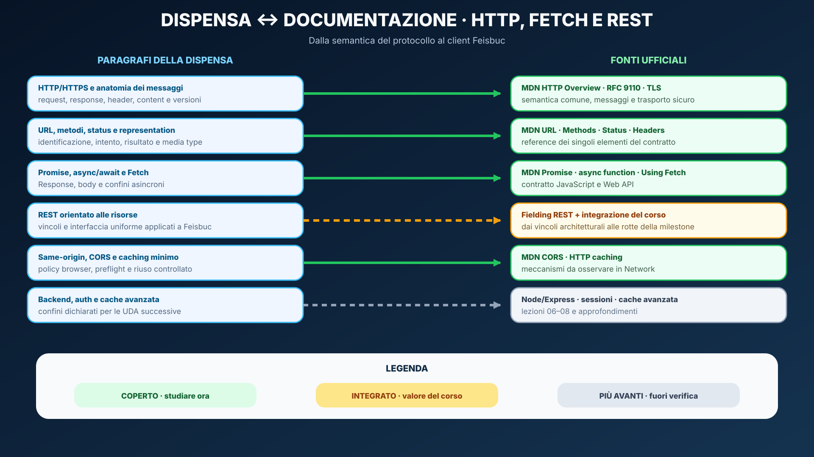
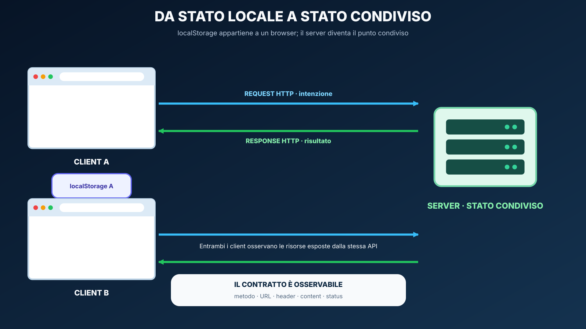
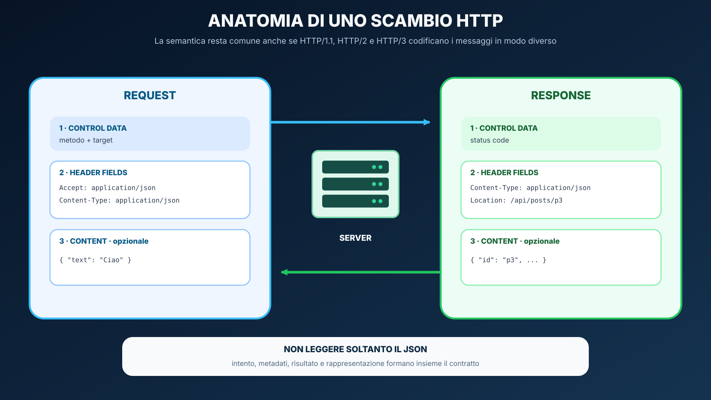
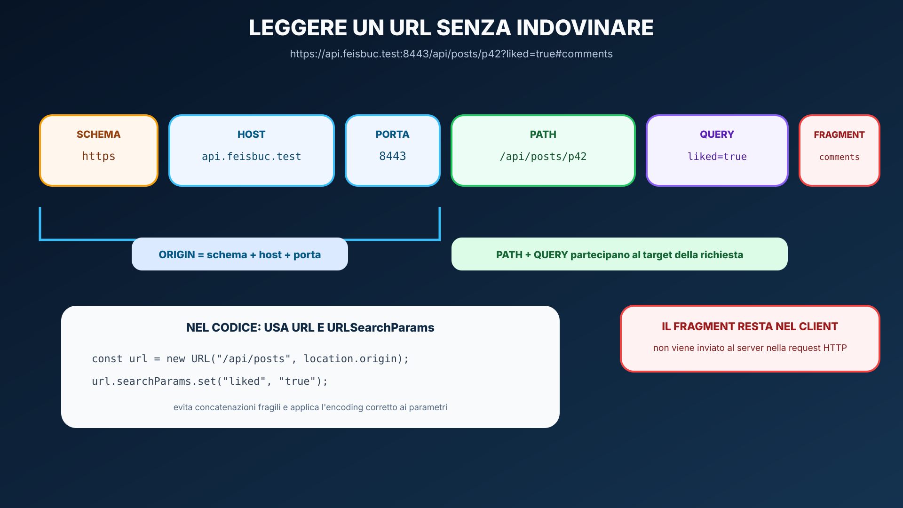
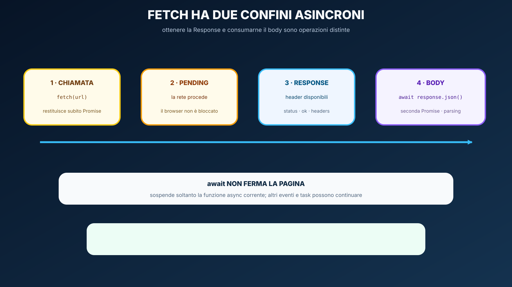
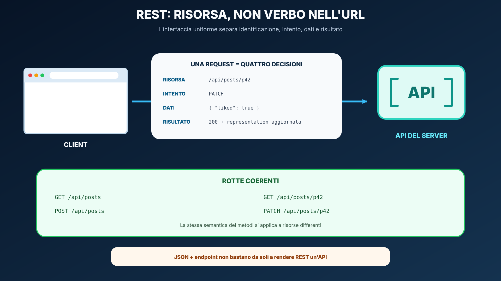
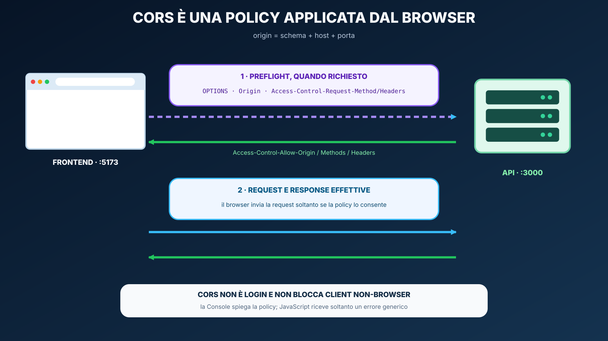

# HTTP, asincronia, Fetch e REST

<table align="center" width="100%"><tr><td>
<details>
<summary>&#128506; <strong>Orientamento della lezione</strong></summary>

<p align="justify"><strong>Contesto:</strong> il Feisbuc dinamico conserva ancora lo stato in un solo browser. Per condividerlo dobbiamo comprendere il contratto request/response prima dei framework che lo rendono più comodo da programmare.</p>
<p align="justify"><strong>Domande guida:</strong> quali informazioni viaggiano in request e response? Come esprimono intento e risultato metodi e status? Perché <code>fetch()</code> non tratta automaticamente uno status 4xx/5xx come errore di rete?</p>
<p align="justify"><strong>Obiettivi osservabili:</strong> leggere uno scambio HTTP nei DevTools, progettare endpoint orientati a risorse, usare Promise e <code>async</code>/<code>await</code> e gestire correttamente una <code>Response</code>.</p>
<p align="justify"><strong>Prossimo passo:</strong> la lezione 06 aprirà il server e implementerà lo stesso contratto con Node.js ed Express 5.</p>

</details>
</td></tr></table>

<p align="justify">Stato: <strong>lezione revisionata</strong>. Modulo di UDA 23. Il percorso parte da scambi HTTP osservabili e arriva a un client asincrono capace di distinguere protocollo, rappresentazione, dati applicativi e problemi di rete.</p>

## Obiettivi

<p align="justify">Al termine del modulo lo studente deve saper:</p>

<ul>
  <li>leggere una richiesta e una risposta HTTP distinguendo metodo, target, header, content e status;</li>
  <li>spiegare che HTTP definisce semantica request/response indipendentemente dal framework server;</li>
  <li>scegliere metodi e status code coerenti con l'intento dell'operazione;</li>
  <li>distinguere path, query string, header e body;</li>
  <li>interpretare <code>Content-Type</code> e JSON come rappresentazione, non come sinonimi di HTTP;</li>
  <li>spiegare statelessness, safe/idempotent in modo operativo;</li>
  <li>leggere una chiamata asincrona come <code>Promise</code> e riscriverla con <code>async</code>/<code>await</code>;</li>
  <li>usare <code>fetch()</code> senza confondere errore HTTP con errore di rete;</li>
  <li>controllare <code>response.ok</code>, status e content type prima di interpretare la risposta;</li>
  <li>progettare una piccola API REST orientata a risorse;</li>
  <li>usare DevTools Network e <code>curl</code> per osservare il protocollo;</li>
  <li>distinguere same-origin e cross-origin e spiegare il ruolo di CORS;</li>
  <li>trasformare Feisbuc da applicazione con <code>localStorage</code> a client di una API HTTP.</li>
</ul>

## Prerequisiti

<ul>
  <li>UDA 21: HTML, CSS, Bootstrap;</li>
  <li>UDA 22: JavaScript, moduli ES, DOM, eventi, stato e <code>localStorage</code>;</li>
  <li>concetto generale di client e server.</li>
</ul>

<a id="lesson-learning-path"></a>
## Percorso didattico delle 13 ore

<p align="justify">La lezione è organizzata come una sequenza di esperimenti. Prima si osserva il protocollo senza framework, poi si costruisce il modello asincrono del client e infine si sostituisce la persistenza locale di Feisbuc con una API condivisa.</p>

<table align="center" width="100%"><tr><td>
<details>
<summary>&#129517; <strong>Quattro blocchi progressivi — contenuti, prodotto e tempo</strong></summary>

<ol>
  <li><strong>3 ore — osservare HTTP:</strong> stato locale/condiviso, HTTP e HTTPS, request, response, URL, header e Activity A;</li>
  <li><strong>3 ore — leggere la semantica:</strong> metodi, status, representation, safe/idempotent, statelessness e progettazione REST;</li>
  <li><strong>3 ore — programmare il client:</strong> Promise, <code>async</code>/<code>await</code>, Fetch, Response, body, errori e Activity B;</li>
  <li><strong>4 ore — integrare e diagnosticare:</strong> CORS, caching minimo, Feisbuc milestone 4, Activity C, Activity D e checkpoint.</li>
</ol>

<p align="justify"><strong>Totale:</strong> 13 ore. Ogni blocco termina con una prova osservabile o un micro-checkpoint.</p>

</details>
</td></tr></table>

<a id="lesson-docs-maps"></a>
## Orientamento nella documentazione

<p align="justify">In questa lezione le fonti hanno ruoli differenti: MDN costruisce il percorso operativo e offre le reference consultabili; RFC 9110 definisce la semantica HTTP condivisa dalle diverse versioni; il Fetch Standard definisce il comportamento della Web API; la tesi di Fielding è la fonte primaria per i vincoli REST.</p>

<table align="center"><tr><td>
<p align="justify"><strong><span style="font-size: 1.15em;">&#128506;</span> Come leggere i colori:</strong> <strong>coperto</strong> indica ciò che va compreso e usato ora; <strong>integrato dal corso</strong> collega più fonti in un modello applicabile a Feisbuc; <strong>più avanti</strong> delimita argomenti non richiesti nella verifica corrente.</p>
</td></tr></table>

<a id="lesson-http-mdn-map"></a>
<table align="center" width="100%"><tr><td>
<details>
<summary>&#128506;&#65039; <strong>Mappa — HTTP, Fetch e REST nelle fonti ufficiali</strong></summary>

<p align="justify">La mappa distingue i contenuti coperti dalle integrazioni architetturali e dai temi rinviati alle lezioni backend, autenticazione e deploy.</p>

<p align="center"></p>

</details>
</td></tr></table>

<table align="center"><tr><td>
<p align="justify"><strong><span style="font-size: 1.15em;">&#128279;</span> Percorso MDN — HTTP e Fetch:</strong> usa la <a href="GUIDA_USO_MDN.md#mdn-guide-http">checklist per le reference HTTP</a> e la <a href="GUIDA_USO_MDN.md#mdn-guide-js-api">checklist per le Web API</a>. Qui MDN serve a collegare ciò che osservi nel pannello Network con il contratto usato da JavaScript.</p>
<ul>
  <li><strong>Studia:</strong> <a href="https://developer.mozilla.org/en-US/docs/Web/HTTP/Reference/Methods">metodi HTTP</a> e <a href="https://developer.mozilla.org/en-US/docs/Web/HTTP/Reference/Status">status code</a>, aprendo le singole schede quando serve un dettaglio;</li>
  <li><strong>studia:</strong> <a href="https://developer.mozilla.org/en-US/docs/Web/API/Fetch_API/Using_Fetch">Using the Fetch API</a>, in particolare richiesta, risposta, controllo dello status e lettura del body;</li>
  <li><strong>consulta:</strong> le reference di <a href="https://developer.mozilla.org/en-US/docs/Web/API/Window/fetch"><code>fetch()</code></a>, <a href="https://developer.mozilla.org/en-US/docs/Web/API/Request"><code>Request</code></a> e <a href="https://developer.mozilla.org/en-US/docs/Web/API/Response"><code>Response</code></a> per sintassi, proprietà e valori restituiti.</li>
</ul>
<p align="justify"><strong>Prodotto atteso:</strong> scegli una richiesta del Feisbuc, annota metodo, URL, header, body, status e rappresentazione; collega ogni campo alla sezione MDN che ne chiarisce il significato.</p>
</td></tr></table>

<a id="lesson-http-cross-index"></a>
<table align="center" width="100%"><tr><td>
<details>
<summary>&#128279; <strong>Indice incrociato — HTTP, Fetch e REST ↔ fonti ufficiali</strong></summary>

<p align="justify">I titoli sono collegamenti; le descrizioni sottostanti indicano che cosa cercare senza allargare la pagina con una tabella orizzontale.</p>
<p><strong>Legenda:</strong> &#128309; dispensa · &#128994; documentazione da studiare · &#128993; argomento successivo.</p>

<details><summary><strong>Protocollo e messaggi</strong> · 2 corrispondenze</summary>
<blockquote><p><strong>01 · CORRISPONDENZA</strong></p><p><strong>&#128309; DISPENSA</strong><br><strong><a href="#lesson-http-messages">HTTP/HTTPS, request e response</a></strong></p><ul><li>Ruoli client/server, semantica comune, anatomia dei messaggi e protezione TLS.</li></ul><p><strong>&#128994; FONTI</strong><br><strong><a href="https://developer.mozilla.org/en-US/docs/Web/HTTP/Guides/Overview">MDN — Overview of HTTP</a></strong><br><strong><a href="https://www.rfc-editor.org/rfc/rfc9110">RFC 9110 — HTTP Semantics</a></strong><br><strong><a href="https://developer.mozilla.org/en-US/docs/Web/Security/Defenses/Transport_Layer_Security">MDN — Transport Layer Security</a></strong></p><ul><li>Architettura HTTP, semantica indipendente dalla versione e proprietà offerte da TLS.</li></ul></blockquote>
<blockquote><p><strong>02 · CORRISPONDENZA</strong></p><p><strong>&#128309; DISPENSA</strong><br><strong><a href="#lesson-http-url">URL, target, header e content</a></strong></p><ul><li>Schema, origin, path, query, fragment e canali informativi del messaggio.</li></ul><p><strong>&#128994; FONTI</strong><br><strong><a href="https://developer.mozilla.org/en-US/docs/Learn_web_development/Howto/Web_mechanics/What_is_a_URL">MDN — What is a URL?</a></strong><br><strong><a href="https://developer.mozilla.org/en-US/docs/Web/API/URL">MDN — URL API</a></strong></p><ul><li>Anatomia dell'indirizzo e costruzione sicura tramite API.</li></ul></blockquote>
</details>

<details><summary><strong>Semantica HTTP e REST</strong> · 2 corrispondenze</summary>
<blockquote><p><strong>03 · CORRISPONDENZA</strong></p><p><strong>&#128309; DISPENSA</strong><br><strong><a href="#lesson-http-semantics">Metodi, status e representation</a></strong></p><ul><li>Intento, risultato, proprietà safe/idempotent e media type.</li></ul><p><strong>&#128994; FONTI</strong><br><strong><a href="https://developer.mozilla.org/en-US/docs/Web/HTTP/Reference/Methods">MDN — HTTP methods</a></strong><br><strong><a href="https://developer.mozilla.org/en-US/docs/Web/HTTP/Reference/Status">MDN — HTTP status codes</a></strong><br><strong><a href="https://developer.mozilla.org/en-US/docs/Web/HTTP/Reference/Headers/Content-Type">MDN — Content-Type</a></strong></p><ul><li>Reference da aprire per il contratto esatto di ogni elemento.</li></ul></blockquote>
<blockquote><p><strong>04 · INTEGRAZIONE DEL CORSO</strong></p><p><strong>&#128309; DISPENSA</strong><br><strong><a href="#lesson-rest-resources">REST e risorse Feisbuc</a></strong></p><ul><li>Collega i vincoli dello stile REST alle rotte concrete della milestone.</li></ul><p><strong>&#128994; FONTI</strong><br><strong><a href="https://ics.uci.edu/~fielding/pubs/dissertation/rest_arch_style.htm">Fielding — Representational State Transfer</a></strong><br><strong><a href="https://developer.mozilla.org/en-US/docs/Glossary/REST">MDN — REST</a></strong></p><ul><li>Risorse, rappresentazioni, interfaccia uniforme, statelessness e caching.</li></ul></blockquote>
</details>

<details><summary><strong>Asincronia e Fetch</strong> · 2 corrispondenze</summary>
<blockquote><p><strong>05 · CORRISPONDENZA</strong></p><p><strong>&#128309; DISPENSA</strong><br><strong><a href="#lesson-fetch-api">Promise e <code>async</code>/<code>await</code></a></strong></p><ul><li>Risultato futuro, stati della Promise e sospensione della sola funzione corrente.</li></ul><p><strong>&#128994; FONTI</strong><br><strong><a href="https://developer.mozilla.org/en-US/docs/Web/JavaScript/Guide/Using_promises">MDN — Using promises</a></strong><br><strong><a href="https://developer.mozilla.org/en-US/docs/Web/JavaScript/Reference/Operators/await">MDN — <code>await</code></a></strong></p><ul><li>Composizione, propagazione degli errori e contratto delle funzioni asincrone.</li></ul></blockquote>
<blockquote><p><strong>06 · CORRISPONDENZA</strong></p><p><strong>&#128309; DISPENSA</strong><br><strong><a href="#lesson-fetch-response">Fetch, Response e body</a></strong></p><ul><li>Due confini asincroni, status, header, parsing e tassonomia degli errori.</li></ul><p><strong>&#128994; FONTI</strong><br><strong><a href="https://developer.mozilla.org/en-US/docs/Web/API/Fetch_API/Using_Fetch">MDN — Using the Fetch API</a></strong><br><strong><a href="https://developer.mozilla.org/en-US/docs/Web/API/Response">MDN — Response</a></strong><br><strong><a href="https://fetch.spec.whatwg.org/">Fetch Standard</a></strong></p><ul><li>Contratto di <code>fetch()</code>, consumo del body e integrazione con CORS.</li></ul></blockquote>
</details>

<details><summary><strong>Browser policy e confini</strong> · 2 corrispondenze</summary>
<blockquote><p><strong>07 · CORRISPONDENZA</strong></p><p><strong>&#128309; DISPENSA</strong><br><strong><a href="#lesson-http-cors">Same-origin e CORS</a></strong></p><ul><li>Origin, richiesta semplice, preflight e risposta esposta allo script.</li></ul><p><strong>&#128994; FONTI</strong><br><strong><a href="https://developer.mozilla.org/en-US/docs/Web/HTTP/Guides/CORS">MDN — Cross-Origin Resource Sharing</a></strong></p><ul><li>Meccanismo basato su header applicato dal browser.</li></ul></blockquote>
<blockquote><p><strong>08 · PIÙ AVANTI</strong></p><p><strong>&#128309; DISPENSA</strong><br><strong><a href="#lesson-http-boundaries">Confini della lezione</a></strong></p><ul><li>Colloca backend, autenticazione, streaming e cache avanzata nelle UDA appropriate.</li></ul><p><strong>&#128993; DOCUMENTAZIONE</strong><br><strong><a href="https://developer.mozilla.org/en-US/docs/Web/API/Streams_API">MDN — Streams API</a></strong><br><strong><a href="https://developer.mozilla.org/en-US/docs/Web/HTTP/Guides/Caching">MDN — HTTP caching</a></strong></p><ul><li>Riconoscere i termini; implementazione approfondita più avanti.</li></ul></blockquote>
</details>

</details>
</td></tr></table>

<a id="lesson-http-api-map"></a>
<table align="center" width="100%"><tr><td>
<details>
<summary>&#129513; <strong>Mappa delle schede tecniche — protocollo e Web API</strong></summary>

<details><summary><strong>HTTP</strong></summary><ul><li><a href="https://developer.mozilla.org/en-US/docs/Web/HTTP/Reference/Methods"><strong>Methods</strong></a>: semantica, safety e idempotenza;</li><li><a href="https://developer.mozilla.org/en-US/docs/Web/HTTP/Reference/Status"><strong>Status</strong></a>: classi e significato del risultato;</li><li><a href="https://developer.mozilla.org/en-US/docs/Web/HTTP/Reference/Headers"><strong>Headers</strong></a>: metadati del messaggio e della rappresentazione.</li></ul></details>
<details><summary><strong>URL</strong></summary><ul><li><a href="https://developer.mozilla.org/en-US/docs/Web/API/URL"><code>URL</code></a>: parsing e composizione;</li><li><a href="https://developer.mozilla.org/en-US/docs/Web/API/URLSearchParams"><code>URLSearchParams</code></a>: query senza concatenazioni manuali;</li><li><a href="https://developer.mozilla.org/en-US/docs/Web/JavaScript/Reference/Global_Objects/encodeURIComponent"><code>encodeURIComponent()</code></a>: segmenti dinamici nel path.</li></ul></details>
<details><summary><strong>Fetch</strong></summary><ul><li><a href="https://developer.mozilla.org/en-US/docs/Web/API/Window/fetch"><code>fetch()</code></a>: restituisce una Promise di <code>Response</code>;</li><li><a href="https://developer.mozilla.org/en-US/docs/Web/API/Request"><code>Request</code></a>: URL, metodo, header, body e opzioni;</li><li><a href="https://developer.mozilla.org/en-US/docs/Web/API/Response"><code>Response</code></a>: <code>status</code>, <code>ok</code>, <code>headers</code>, <code>bodyUsed</code> e metodi di lettura;</li><li><a href="https://developer.mozilla.org/en-US/docs/Web/API/AbortController"><code>AbortController</code></a>: annullamento esplicito.</li></ul></details>
<details><summary><strong>Riconoscere per dopo</strong></summary><ul><li>streaming del body e backpressure;</li><li>service worker e strategie di cache;</li><li>credential cross-origin e policy avanzate;</li><li>retry, backoff e richieste idempotenti distribuite.</li></ul></details>

</details>
</td></tr></table>

<table align="center" width="100%"><tr><td>
<details>
<summary>&#128218; <strong>Glossario operativo — le parole da saper spiegare</strong></summary>
<ul>
  <li><strong>request:</strong> messaggio con cui il client esprime un intento verso una risorsa;</li>
  <li><strong>response:</strong> messaggio con cui il server comunica l'esito e, quando presente, una rappresentazione;</li>
  <li><strong>target resource:</strong> risorsa alla quale si applica la semantica della richiesta;</li>
  <li><strong>representation:</strong> dati che rappresentano lo stato corrente o desiderato di una risorsa;</li>
  <li><strong>media type:</strong> formato e modello di elaborazione dichiarati, per esempio <code>application/json</code>;</li>
  <li><strong>safe:</strong> metodo con cui il client non richiede una modifica dello stato del server;</li>
  <li><strong>idempotent:</strong> metodo il cui effetto intenzionale ripetuto equivale a quello di una singola richiesta;</li>
  <li><strong>Promise:</strong> oggetto che rappresenta l'esito futuro di un'operazione;</li>
  <li><strong>Response:</strong> oggetto Fetch che espone status, header e stream del body;</li>
  <li><strong>origin:</strong> combinazione di schema, host e porta;</li>
  <li><strong>CORS:</strong> meccanismo a header con cui un server dichiara quali origin browser possono leggere una risposta;</li>
  <li><strong>REST:</strong> stile architetturale per sistemi distribuiti basato su un insieme di vincoli.</li>
</ul>
</details>
</td></tr></table>

## Problema iniziale

<p align="justify">Nella milestone precedente Feisbuc conserva i post nello state JavaScript e in <code>localStorage</code>. Funziona, ma soltanto in quel browser: un secondo computer possiede un altro storage e non vede gli stessi dati.</p>

<p align="center"></p>

<p align="justify">La domanda di questa UDA è:</p>

<blockquote>
<p align="justify">Che cosa viene realmente scambiato fra client e server prima ancora di parlare di Express, FastAPI o Vue?</p>
</blockquote>

<p align="justify">La risposta è il contratto HTTP. Nella lezione 00 abbiamo chiamato <strong>web service</strong> il servizio software accessibile via Web e <strong>API</strong> la sua interfaccia pubblica: ora osserviamo il protocollo usato dal client per entrare in quell'interfaccia.</p>

---

<a id="lesson-http-messages"></a>
## HTTP prima dei framework

<p align="justify"><strong>HTTP</strong> è un protocollo applicativo client/server basato su richieste e risposte. Il client invia una richiesta che esprime un intento verso una risorsa; il server interpreta quell'intento e produce una risposta.</p>

<p align="justify"><strong>HTTPS</strong> conserva la semantica HTTP ma protegge la connessione tramite TLS. TLS offre cifratura durante il transito, controllo dell'integrità e autenticazione, normalmente del server verso il client. HTTPS non rende automaticamente corretti endpoint, autorizzazioni o dati applicativi: protegge il canale.</p>

<p align="justify">Riferimenti: <a href="https://developer.mozilla.org/en-US/docs/Web/HTTP/Guides/Overview">MDN — Overview of HTTP</a>, <a href="https://www.rfc-editor.org/rfc/rfc9110">RFC 9110 — HTTP Semantics</a> e <a href="https://developer.mozilla.org/en-US/docs/Web/Security/Defenses/Transport_Layer_Security">MDN — Transport Layer Security</a>.</p>

<p align="center"></p>

<p align="justify">Express non crea questo modello: lo rende più comodo da programmare.</p>

<table align="center"><tr><td><p align="justify"><strong><span style="font-size: 1.15em;">&#129504;</span> Semantica e codifica:</strong> le righe testuali mostrate sotto sono un ottimo modello osservabile di HTTP/1.1. HTTP/2 e HTTP/3 codificano i messaggi diversamente, ma conservano la stessa semantica di metodo, target, header, status e content. DevTools ricostruisce per noi questa vista concettuale.</p></td></tr></table>

### Una richiesta osservabile

<p align="justify">Esempio concettuale:</p>

```http
POST /api/posts HTTP/1.1
Host: localhost:3000
Content-Type: application/json
Accept: application/json

{"text":"Primo post via API"}
```

<p align="justify">La stessa informazione può essere costruita dal browser con <code>fetch()</code> o da <code>curl</code>.</p>

### Una risposta osservabile

```http
HTTP/1.1 201 Created
Content-Type: application/json
Location: /api/posts/p3

{"id":"p3","text":"Primo post via API","likes":0,"liked":false}
```

<p align="justify">Non bisogna leggere solo il JSON: anche <code>201</code>, <code>Content-Type</code> e <code>Location</code> fanno parte del contratto.</p>

<table align="center"><tr><td><p align="justify"><strong><span style="font-size: 1.15em;">&#9989;</span> Micro-checkpoint 1:</strong> nella request e nella response precedenti evidenzia control data, header e content. Poi spiega quali elementi manterrebbero lo stesso significato passando da HTTP/1.1 a HTTP/2.</p></td></tr></table>

---

<a id="lesson-http-url"></a>
## URL, target, header e content

<p align="justify">Questi canali non sono intercambiabili.</p>

<p align="center"></p>

<p align="justify">Il <strong>target</strong> della request viene ricostruito usando l'URL e il contesto della connessione. Nel modello del corso leggiamo sempre almeno origin, path e query. Il fragment, cioè la parte dopo <code>#</code>, serve al client e non viene trasferito al server nella richiesta HTTP.</p>

### Path

<p align="justify">Il path identifica normalmente la risorsa o la collezione di base:</p>

```text
/api/posts
/api/posts/p42
```

### Query string

<p align="justify">La query aggiunge parametri al target e viene spesso usata per filtro, ricerca, ordinamento o paginazione. URL con query differenti possono identificare selezioni o rappresentazioni differenti: non assumiamo che la query sia semanticamente irrilevante.</p>

```text
/api/posts?author=ada
/api/posts?limit=10
```

### Header

<p align="justify">Gli header trasportano metadati e controllo del protocollo:</p>

```text
Accept: application/json
Content-Type: application/json
Authorization: ...        # verrà approfondito più avanti
```

<ul>
  <li><code>Accept</code> descrive quali media type il client preferisce ricevere nella risposta;</li>
  <li><code>Content-Type</code> descrive il media type del content presente in quello specifico messaggio;</li>
  <li>i nomi degli header HTTP sono case-insensitive, anche se nel corso manteniamo la grafia convenzionale.</li>
</ul>

### Body/content

<p align="justify">Il content contiene una rappresentazione da elaborare:</p>

```json
{
  "text": "Nuovo post"
}
```

<p align="justify">Nel codice evitiamo concatenazioni fragili: <code>URL</code> e <code>URLSearchParams</code> costruiscono query correttamente; <code>encodeURIComponent()</code> protegge un identificatore inserito come singolo segmento dinamico del path.</p>

```js
const url = new URL("/api/posts", location.origin);
url.searchParams.set("author", "Ada Lovelace");

const postUrl = `/api/posts/${encodeURIComponent(postId)}`;
```

<p align="justify">Nel vecchio <code>lab7</code> query, path parameter e body erano già presenti; nel nuovo corso vengono prima letti come parti della request HTTP e solo dopo verranno mappati a <code>req.query</code>, <code>req.params</code> e <code>req.body</code> in Express.</p>

<p align="justify">Riferimenti: <a href="https://developer.mozilla.org/en-US/docs/Learn_web_development/Howto/Web_mechanics/What_is_a_URL">MDN — What is a URL?</a>, <a href="https://developer.mozilla.org/en-US/docs/Web/API/URL"><code>URL</code></a>, <a href="https://developer.mozilla.org/en-US/docs/Web/HTTP/Reference/Headers/Accept"><code>Accept</code></a> e <a href="https://developer.mozilla.org/en-US/docs/Web/HTTP/Reference/Headers/Content-Type"><code>Content-Type</code></a>.</p>

---

<a id="lesson-http-semantics"></a>
## Metodi HTTP: intento, non CRUD meccanico

<p align="justify">Per il core del corso:</p>

<table align="center">
<thead>
<tr>
<th>Metodo</th>
<th>Intenzione tipica</th>
</tr>
</thead>
<tbody>
<tr>
<td><code>GET</code></td>
<td>leggere una rappresentazione</td>
</tr>
<tr>
<td><code>POST</code></td>
<td>creare/processare secondo la semantica della risorsa</td>
</tr>
<tr>
<td><code>PUT</code></td>
<td>sostituire la rappresentazione di una risorsa</td>
</tr>
<tr>
<td><code>PATCH</code></td>
<td>applicare una modifica parziale</td>
</tr>
<tr>
<td><code>DELETE</code></td>
<td>rimuovere una risorsa</td>
</tr>
<tr>
<td><code>HEAD</code></td>
<td>come GET, ma senza trasferire il content della rappresentazione</td>
</tr>
<tr>
<td><code>OPTIONS</code></td>
<td>descrivere opzioni di comunicazione</td>
</tr>
</tbody>
</table>

<p align="justify">Non insegniamo la falsa regola:</p>

```text
GET = SELECT
POST = INSERT
PUT = UPDATE
DELETE = DELETE SQL
```

<p align="justify">HTTP non è SQL: il metodo descrive l'intento applicato alla risorsa HTTP, non l'istruzione usata internamente dal server.</p>

### Safe e idempotent

<p align="justify">Due concetti utili per ragionare sulle API:</p>

<ul>
  <li><strong>safe</strong>: il client non richiede un cambiamento di stato sul server;</li>
  <li><strong>idempotent</strong>: ripetere la stessa richiesta intenzionale una o più volte deve avere lo stesso effetto previsto della singola richiesta.</li>
</ul>

<p align="justify">Esempi operativi:</p>

```text
GET     safe + idempotent
PUT     non safe + idempotent
DELETE  non safe + idempotent nella semantica dell'intento
POST    non è garantito idempotent
```

<p align="justify">Questa distinzione riguarda l'effetto richiesto dal client: logging e altre conseguenze interne possono comunque avvenire più volte. Diventa importante quando un client valuta un retry dopo una connessione interrotta.</p>

<p align="justify">Riferimenti: <a href="https://developer.mozilla.org/en-US/docs/Glossary/Safe/HTTP">MDN — Safe method</a>, <a href="https://developer.mozilla.org/en-US/docs/Glossary/Idempotent">MDN — Idempotent method</a> e <a href="https://www.rfc-editor.org/rfc/rfc9110#section-9.2">RFC 9110 — Common Method Properties</a>.</p>

<table align="center"><tr><td><p align="justify"><strong><span style="font-size: 1.15em;">&#9989;</span> Micro-checkpoint 2:</strong> classifica GET, POST, PUT, PATCH e DELETE come safe/non-safe e idempotent/non garantito. Per ogni risposta indica se stai descrivendo la semantica standard o una scelta della nostra API.</p></td></tr></table>

---

## Status code: il risultato appartiene al protocollo

<p align="justify">Lo status code non è decorazione: comunica l'esito semantico della richiesta prima che il client interpreti l'eventuale rappresentazione.</p>

<p align="justify">Le classi principali:</p>

```text
1xx  informational
2xx  successo
3xx  redirezione
4xx  problema attribuito alla richiesta/client
5xx  errore del server nell'elaborare una richiesta apparentemente valida
```

<p align="justify">Per Feisbuc useremo soprattutto:</p>

<table align="center">
<thead>
<tr>
<th>Status</th>
<th>Uso didattico</th>
</tr>
</thead>
<tbody>
<tr>
<td><code>200 OK</code></td>
<td>lettura o modifica con representation in risposta</td>
</tr>
<tr>
<td><code>201 Created</code></td>
<td>nuova risorsa creata</td>
</tr>
<tr>
<td><code>204 No Content</code></td>
<td>successo senza content</td>
</tr>
<tr>
<td><code>400 Bad Request</code></td>
<td>request non interpretabile/valida</td>
</tr>
<tr>
<td><code>404 Not Found</code></td>
<td>risorsa non trovata</td>
</tr>
<tr>
<td><code>405 Method Not Allowed</code></td>
<td>metodo noto ma non ammesso sulla risorsa</td>
</tr>
<tr>
<td><code>415 Unsupported Media Type</code></td>
<td>representation inviata con media type non supportato</td>
</tr>
<tr>
<td><code>500 Internal Server Error</code></td>
<td>errore non gestito lato server</td>
</tr>
</tbody>
</table>

<p align="justify">Regola didattica:</p>

<blockquote>
<p align="justify">Prima interpretiamo lo status, poi il payload.</p>
</blockquote>

<ul>
  <li><code>201 Created</code> indica che è stata creata una nuova risorsa; <code>Location</code> può indicarne l'URI;</li>
  <li><code>204 No Content</code> conferma il successo senza content da interpretare;</li>
  <li><code>405 Method Not Allowed</code> riguarda una risorsa esistente che non accetta quel metodo e deve essere accompagnato da <code>Allow</code>;</li>
  <li>un errore applicativo nel JSON non sostituisce uno status coerente.</li>
</ul>

<p align="justify">Riferimenti: <a href="https://developer.mozilla.org/en-US/docs/Web/HTTP/Reference/Status">MDN — HTTP status codes</a>, <a href="https://developer.mozilla.org/en-US/docs/Web/HTTP/Reference/Status/201"><code>201 Created</code></a>, <a href="https://developer.mozilla.org/en-US/docs/Web/HTTP/Reference/Status/204"><code>204 No Content</code></a> e <a href="https://developer.mozilla.org/en-US/docs/Web/HTTP/Reference/Status/405"><code>405 Method Not Allowed</code></a>.</p>

---

## Representation e Content-Type

<p align="justify">Una <strong>risorsa</strong> è il concetto identificato dal target; una <strong>representation</strong> è una sequenza di dati che ne rappresenta lo stato corrente o desiderato in uno specifico formato. HTTP può trasferire HTML, JSON, immagini, testo e molti altri media type: JSON è una possibile representation, non il protocollo.</p>

```http
Content-Type: application/json
```

<p align="justify">significa che il content di quel messaggio usa il media type JSON. Nella request descrive ciò che il client sta inviando; nella response descrive ciò che il server ha restituito.</p>

<p align="justify">Se inviamo JSON con <code>fetch</code>:</p>

```js
await fetch("/api/posts", {
  method: "POST",
  headers: {
    "Content-Type": "application/json"
  },
  body: JSON.stringify({ text: "Ciao" })
});
```

<p align="justify">Le due parti hanno ruoli diversi:</p>

```text
Content-Type       dichiara formato e modello di elaborazione del content
JSON.stringify()   produce una stringa JSON
```

<p align="justify">Dimenticarne una delle due è un bug diverso. Il server non deve dedurre automaticamente il formato soltanto guardando i caratteri ricevuti.</p>

<p align="justify">Riferimenti: <a href="https://www.rfc-editor.org/rfc/rfc9110#section-8">RFC 9110 — Representation Data and Metadata</a> e <a href="https://developer.mozilla.org/en-US/docs/Web/HTTP/Reference/Headers/Content-Type">MDN — <code>Content-Type</code></a>.</p>

---

## Statelessness

<p align="justify">HTTP è stateless a livello di semantica del protocollo: il significato di ogni request può essere compreso isolatamente e non dipende dalla connessione sulla quale sono passati messaggi precedenti.</p>

<p align="justify">Questo non vieta stato applicativo, account o sessioni. Significa che le informazioni necessarie a interpretare la richiesta devono essere esplicite nel messaggio o raggiungibili tramite il contesto che esso identifica. Lo stato può vivere, per esempio:</p>

```text
database
sessione server
cookie/token
cache
browser state
```

<p align="justify">Cookie e sessioni verranno approfonditi nell'UDA dedicata all'autenticazione. Statelessness non significa “il server non possiede un database” e non significa “l'utente non può autenticarsi”.</p>

---

## Osservare HTTP con DevTools e curl

<p align="justify">Prima di programmare <code>fetch</code>, osserviamo richieste vere.</p>

<p align="justify">Esempio:</p>

```bash
curl -i http://localhost:3000/api/posts
```

<p align="justify">Per inviare JSON:</p>

```bash
curl -i \
  -X POST \
  -H "Content-Type: application/json" \
  -H "Accept: application/json" \
  -d '{"text":"Post da curl"}' \
  http://localhost:3000/api/posts
```

<p align="justify">Nel pannello <strong>Network</strong> del browser cerchiamo sempre:</p>

```text
Request URL
Request Method
Status Code
Request Headers
Request Payload
Response Headers
Response / Preview
Timing
```

<p align="justify">Il browser diventa uno strumento di protocol analysis, non solo un visualizzatore della pagina.</p>

---

<a id="lesson-fetch-api"></a>
## Dall'evento al risultato asincrono

<p align="justify">Un listener di eventi può essere invocato molte volte: ogni click è un nuovo evento. Una <strong>Promise</strong> rappresenta invece l'esito futuro di una singola operazione asincrona, per esempio una specifica richiesta di rete.</p>

<ul>
  <li><strong>pending:</strong> l'esito non è ancora disponibile;</li>
  <li><strong>fulfilled:</strong> l'operazione ha prodotto un valore;</li>
  <li><strong>rejected:</strong> l'operazione è terminata con un motivo di fallimento;</li>
  <li><strong>settled:</strong> termine che comprende fulfilled e rejected.</li>
</ul>

<p align="justify"><code>then()</code> registra che cosa fare con il valore; <code>catch()</code> gestisce una rejection o un'eccezione propagata nella catena; <code>finally()</code> esegue pulizia indipendentemente dall'esito. Ogni chiamata restituisce una nuova Promise, quindi una pipeline può trasformare e propagare il risultato.</p>

<p align="justify">Esempio equivalente al primo caricamento del feed:</p>

```js
fetch("/api/posts")
  .then((response) => {
    if (!response.ok) {
      throw new Error(`HTTP ${response.status}`);
    }
    return response.json();
  })
  .then((posts) => console.log(posts))
  .catch((error) => console.error(error))
  .finally(() => console.log("Operazione conclusa"));
```

<p align="justify"><code>.then()</code> non è sbagliato e rimane importante saperlo leggere. <code>async</code>/<code>await</code> offre una sintassi differente per consumare le stesse API basate su Promise.</p>

<p align="justify">Riferimenti: <a href="https://developer.mozilla.org/en-US/docs/Web/JavaScript/Guide/Using_promises">MDN — Using promises</a> e <a href="https://developer.mozilla.org/en-US/docs/Web/JavaScript/Reference/Global_Objects/Promise">MDN — <code>Promise</code></a>.</p>

---

## async/await

<p align="justify">Una funzione <code>async</code> restituisce sempre una Promise. Un valore restituito con <code>return</code> diventa il valore di fulfillment; un'eccezione non gestita produce una rejection.</p>

```js
function setLoading(isLoading) {
  postList.setAttribute("aria-busy", String(isLoading));
}

const loadPosts = async () => {
  const response = await fetch("/api/posts");
  return response.json();
};
```

<p align="justify"><code>await</code> sospende soltanto l'esecuzione della funzione <code>async</code> corrente fino al settlement della Promise. Non blocca il browser: altri eventi, rendering e operazioni possono continuare.</p>

<p align="center"></p>

<p align="justify">Con <code>try/catch/finally</code> possiamo esprimere successo, fallimento e pulizia nello stesso scope:</p>

```js
const loadPosts = async () => {
  setLoading(true);
  try {
    const response = await fetch("/api/posts");
    if (!response.ok) {
      throw new Error(`HTTP ${response.status}`);
    }
    return await response.json();
  } catch (error) {
    console.error(error);
    throw error;
  } finally {
    setLoading(false);
  }
};
```

<p align="justify">Riferimenti: <a href="https://developer.mozilla.org/en-US/docs/Web/JavaScript/Reference/Statements/async_function">MDN — async function</a> e <a href="https://developer.mozilla.org/en-US/docs/Web/JavaScript/Reference/Operators/await">MDN — <code>await</code></a>.</p>

<table align="center"><tr><td><p align="justify"><strong><span style="font-size: 1.15em;">&#9989;</span> Micro-checkpoint 3:</strong> spiega che cosa restituisce una funzione <code>async</code>, che cosa sospende <code>await</code> e come un <code>throw</code> attraversa una catena Promise.</p></td></tr></table>

---

<a id="lesson-fetch-response"></a>
## Fetch, Response e body

<p align="justify"><code>fetch()</code> restituisce una Promise fulfilled con una <code>Response</code> appena sono disponibili gli header della risposta, anche quando lo status è <code>404</code> o <code>500</code>. La Promise viene normalmente rejected quando non è disponibile una Response utilizzabile, per esempio per un problema di rete, una policy CORS o un annullamento.</p>

```js
const response = await fetch("/api/posts/manca");
```

<p align="justify">Se il server risponde <code>404</code>, abbiamo comunque ricevuto una risposta HTTP. <code>response.ok</code> vale <code>true</code> soltanto per status compresi fra 200 e 299.</p>

<p align="justify">Per questo il codice robusto controlla:</p>

```js
if (!response.ok) {
  throw new Error(`HTTP ${response.status}`);
}
```

<p align="justify">La <code>Response</code> contiene anche gli header e uno stream per il body. Metodi come <code>json()</code> e <code>text()</code> consumano quello stream una volta e restituiscono un'altra Promise. JSON vuoto o non valido può quindi fallire in un secondo momento, dopo che <code>fetch()</code> ha già prodotto la Response.</p>

### Una policy completa ma leggibile

```js
function responseHasNoBody(response, method) {
  return method === "HEAD" || response.status === 204 || response.status === 205;
}

async function readPayload(response, method) {
  if (responseHasNoBody(response, method)) {
    return null;
  }

  const contentType = response.headers.get("content-type") ?? "";
  const mediaType = contentType.split(";", 1)[0].trim().toLowerCase();
  const isJson = mediaType === "application/json" || mediaType.endsWith("+json");

  return isJson ? await response.json() : await response.text();
}

async function request(url, options = {}) {
  const method = String(options.method ?? "GET").toUpperCase();
  const response = await fetch(url, options);
  const payload = await readPayload(response, method);

  if (!response.ok) {
    const message = payload && typeof payload === "object"
      ? payload.message ?? payload.error ?? `HTTP ${response.status}`
      : `HTTP ${response.status}`;
    const error = new Error(message);
    error.kind = "http";
    error.status = response.status;
    error.payload = payload;
    throw error;
  }

  return payload;
}
```

<p align="justify">La policy osserva status e header, decide se e come leggere il body, quindi trasforma uno status negativo in un errore applicativo utile. Leggere anche il payload di errore permette di mostrare il messaggio del server; controllare prima i casi senza body evita di chiamare <code>json()</code> su una risposta <code>204</code>.</p>

<p align="center"></p>

<p align="justify">Il quarto livello richiede validazione: una response può contenere JSON sintatticamente corretto ma incompatibile con il contratto, per esempio <code>{"posts": null}</code> quando il client attende un array.</p>

<p align="justify">Riferimenti: <a href="https://developer.mozilla.org/en-US/docs/Web/API/Fetch_API/Using_Fetch">MDN — Using the Fetch API</a>, <a href="https://developer.mozilla.org/en-US/docs/Web/API/Response"><code>Response</code></a>, <a href="https://developer.mozilla.org/en-US/docs/Web/API/Response/ok"><code>Response.ok</code></a> e <a href="https://developer.mozilla.org/en-US/docs/Web/API/Response/bodyUsed"><code>Response.bodyUsed</code></a>.</p>

<table align="center"><tr><td><p align="justify"><strong><span style="font-size: 1.15em;">&#9989;</span> Micro-checkpoint 4:</strong> classifica separatamente server irraggiungibile, status 404 con JSON, status 200 con JSON corrotto e status 200 con struttura dati inattesa.</p></td></tr></table>

---

## Abort e timeout applicativo

<p align="justify">Una request non dovrebbe necessariamente restare pendente per sempre.</p>

<p align="justify">Pattern:</p>

```js
const controller = new AbortController();
const timer = setTimeout(() => controller.abort(), 5000);

try {
  const response = await fetch("/api/posts", {
    signal: controller.signal
  });
  // ...
} finally {
  clearTimeout(timer);
}
```

<p align="justify">Per il core basta capire:</p>

<ul>
  <li>abort e timeout applicativo sono decisioni del client;</li>
  <li>un timeout non è uno status HTTP;</li>
  <li>non va confuso <code>500</code> con una mancata connessione.</li>
</ul>

<p align="justify">Nel <code>catch</code> un annullamento va riconosciuto separatamente quando l'interfaccia deve distinguere “operazione annullata” da “server non raggiungibile”. Il blocco <code>finally</code> cancella sempre il timer.</p>

<p align="justify">Riferimenti: <a href="https://developer.mozilla.org/en-US/docs/Web/API/AbortController"><code>AbortController</code></a> e <a href="https://developer.mozilla.org/en-US/docs/Web/API/AbortSignal"><code>AbortSignal</code></a>.</p>

---

<a id="lesson-rest-resources"></a>
## REST: modellare risorse

<p align="justify"><strong>REST</strong> è uno stile architetturale per sistemi distribuiti, non un protocollo, un formato o una libreria. HTTP si presta a realizzarne l'interfaccia uniforme, ma usare JSON e alcuni endpoint non rende automaticamente completa un'architettura REST.</p>

<p align="justify">I vincoli da collegare al nostro progetto sono:</p>

<ul>
  <li><strong>client–server:</strong> interfaccia e dati possono evolvere separatamente dietro un contratto;</li>
  <li><strong>stateless:</strong> ogni richiesta contiene il contesto necessario a comprenderne l'intento;</li>
  <li><strong>cache:</strong> le risposte dichiarano se e come possono essere riutilizzate;</li>
  <li><strong>uniform interface:</strong> risorse identificate, manipolate tramite rappresentazioni e messaggi autodescrittivi;</li>
  <li><strong>layered system:</strong> il client non deve conoscere ogni intermediario fra sé e il server;</li>
  <li><strong>code on demand:</strong> vincolo opzionale, non usato dalla nostra API JSON.</li>
</ul>

<p align="justify">All'interno della uniform interface, l'ipermedia come motore dello stato applicativo è un vincolo da <strong>riconoscere</strong>; la milestone Feisbuc si concentra prima su identificazione delle risorse, rappresentazioni e messaggi autodescrittivi.</p>

<p align="justify">La regola pratica del core diventa:</p>

<blockquote>
<p align="justify">URL descrive la risorsa; metodo descrive l'intento; status descrive il risultato; representation descrive i dati.</p>
</blockquote>

<p align="center"></p>

<p align="justify">Per Feisbuc:</p>

```text
GET   /api/posts
POST  /api/posts
GET   /api/posts/p42
PATCH /api/posts/p42
```

<p align="justify">Esempi:</p>

```text
GET /api/posts
-> lista dei post

POST /api/posts
{ "text": "Ciao" }
-> 201 + nuova representation

PATCH /api/posts/p42
{ "liked": true }
-> 200 + representation aggiornata
```

### Endpoint orientati alle azioni

<p align="justify">Un endpoint come:</p>

```text
POST /api/likePost42
```

<p align="justify">lega URL e azione in modo rigido.</p>

<p align="justify">Per il nostro modello preferiamo:</p>

```text
PATCH /api/posts/p42
{ "liked": true }
```

<p align="justify">Non è una legge universale: è una scelta di design coerente con una risorsa <code>post</code>. Quando un'operazione non coincide con una semplice modifica di attributi, può essere necessario modellare una nuova risorsa o documentare esplicitamente un endpoint operativo.</p>

<p align="justify">Riferimenti: <a href="https://ics.uci.edu/~fielding/pubs/dissertation/rest_arch_style.htm">Fielding — Representational State Transfer</a>, <a href="https://developer.mozilla.org/en-US/docs/Glossary/REST">MDN — REST</a> e <a href="https://www.rfc-editor.org/rfc/rfc9110#section-3.1">RFC 9110 — Resources</a>.</p>

<table align="center"><tr><td><p align="justify"><strong><span style="font-size: 1.15em;">&#9989;</span> Micro-checkpoint 5:</strong> spiega perché <code>POST /api/likePost42</code> nasconde parte della semantica nell'URL e quali informazioni rende invece visibili <code>PATCH /api/posts/p42</code>.</p></td></tr></table>

---

## Query e filtri

<p align="justify">Per leggere una selezione della collezione usiamo parametri di query documentati:</p>

```text
GET /api/posts?author=ada
GET /api/posts?limit=10
```

<p align="justify">Non useremo un body GET per passare filtri ordinari. Il server deve validare tipo, intervallo e valori ammessi, per esempio impedendo un <code>limit</code> negativo o eccessivo.</p>

---

## Error model della API

<p align="justify">Una API didattica deve avere errori prevedibili e lo stesso media type dichiarato nell'header deve descrivere anche le rappresentazioni d'errore.</p>

<p align="justify">Formato scelto:</p>

```json
{
  "error": "post-not-found",
  "message": "Il post richiesto non esiste"
}
```

<p align="justify">Il codice <code>error</code> è stabile e utile al programma; <code>message</code> è leggibile dall'utente. Il client non deve cercare stringhe casuali nell'HTML di errore. Lo standard <code>application/problem+json</code> è da riconoscere come possibile evoluzione, non è richiesto nella milestone.</p>

---

<a id="lesson-http-cors"></a>
## Same-origin e CORS

<p align="justify">Origin comprende schema, host e porta.</p>

<p align="justify">Quindi:</p>

```text
http://localhost:3000
http://localhost:5173
```

<p align="justify">sono origin diverse perché cambia la porta.</p>

<p align="justify"><strong>CORS</strong> è un meccanismo basato su header con cui un server dichiara quali origin possono leggere una risposta tramite codice eseguito nel browser. È il browser ad applicare la policy: non è un sistema di autenticazione e non impedisce a <code>curl</code> o a un altro server di inviare richieste.</p>

<p align="center"></p>

<p align="justify">Non tutte le richieste cross-origin eseguono un preflight. Una richiesta che soddisfa i criteri delle cosiddette richieste semplici può partire direttamente; una richiesta <code>PATCH</code> o una request JSON con header non safelisted richiede normalmente un <code>OPTIONS</code> preliminare. Se la policy non consente l'accesso, JavaScript riceve un errore generico e la Console fornisce il dettaglio diagnostico.</p>

<p align="justify">Strategia didattica:</p>

<ol>
  <li>prima Feisbuc e API sono same-origin, così HTTP resta il problema principale;</li>
  <li>poi l'Activity A avvia una pagina osservatore su un'altra porta;</li>
  <li>osserviamo <code>Origin</code>, eventuale preflight <code>OPTIONS</code> e header <code>Access-Control-Allow-*</code>;</li>
  <li>solo dopo, in Express, vedremo middleware/librerie che configurano CORS.</li>
</ol>

<p align="justify">Riferimento: <a href="https://developer.mozilla.org/en-US/docs/Web/HTTP/Guides/CORS">MDN — Cross-Origin Resource Sharing</a>.</p>

---

## Caching: concetto minimo

<p align="justify">HTTP prevede meccanismi di caching.</p>

<p align="justify">In questa UDA ci basta riconoscere che header come:</p>

```text
Cache-Control
ETag
If-None-Match
```

<p align="justify">possono cambiare se e quando una representation viene riusata. Un server può inviare un <code>ETag</code>; il client può validarlo con <code>If-None-Match</code>; uno status <code>304 Not Modified</code> comunica che può essere riutilizzata la rappresentazione già disponibile e non contiene un nuovo body.</p>

<p align="justify">La progettazione avanzata della cache resta nel percorso avanzato. In questa lezione è sufficiente non assumere che ogni GET attraversi sempre l'intera rete e riconoscere gli header nel pannello Network.</p>

<p align="justify">Riferimenti: <a href="https://developer.mozilla.org/en-US/docs/Web/HTTP/Guides/Caching">MDN — HTTP caching</a>, <a href="https://developer.mozilla.org/en-US/docs/Web/HTTP/Reference/Headers/ETag"><code>ETag</code></a> e <a href="https://developer.mozilla.org/en-US/docs/Web/HTTP/Reference/Status/304"><code>304 Not Modified</code></a>.</p>

<a id="lesson-http-boundaries"></a>
### Confini della lezione

<ul>
  <li>routing e middleware server-side: lezione 06;</li>
  <li>database e persistenza reale: lezione 07;</li>
  <li>cookie, sessioni, autenticazione e autorizzazione: lezione 08;</li>
  <li>streaming, service worker, retry e caching avanzato: percorsi successivi o avanzati.</li>
</ul>

---

<a id="feisbuc-milestone-4-da-localstorage-a-api"></a>
## Feisbuc milestone 4: da localStorage a API

<p align="center"></p>

<p align="justify">Il server è volutamente una fixture: in questa UDA non vogliamo ancora studiare routing e middleware server-side. È una <strong>black box osservabile</strong>: non dobbiamo implementarla, ma possiamo ispezionare ogni messaggio in Network e con <code>curl</code>.</p>

### Contratto

```text
GET /api/posts
-> 200 application/json

POST /api/posts
Content-Type: application/json
{ "text": "..." }
-> 201 + Location

PATCH /api/posts/:id
Content-Type: application/json
{ "liked": true|false }
-> 200
```

### Responsabilità client

<p align="justify"><code>api.js</code> possiede la comunicazione: costruzione degli URL, <code>request()</code>, <code>getPosts()</code>, <code>createPost()</code>, <code>setLiked()</code> e trasformazione degli esiti HTTP in valori o errori utili.</p>

<p align="justify"><code>app.js</code> possiede DOM, state, rendering, submit, click delegation e rappresentazione accessibile di loading, error e success. Dopo un POST o PATCH usa la representation restituita dal server, invece di immaginare quale sia diventato lo stato condiviso.</p>

<p align="justify">Lo stato persistente non vive più nel browser. Durante una richiesta i controlli interessati vengono disabilitati, <code>aria-busy</code> rende osservabile l'attesa e <code>finally</code> ripristina sempre l'interazione. Dopo una pubblicazione valida la form viene ripristinata e il focus torna al campo di testo.</p>

<table align="center"><tr><td><p align="justify"><strong><span style="font-size: 1.15em;">&#9989;</span> Micro-checkpoint 6:</strong> per GET, POST e PATCH indica chi costruisce la richiesta, chi interpreta la Response, dove viene aggiornato lo state e quale funzione rende visibile il risultato.</p></td></tr></table>

---

<a id="errori-frequenti"></a>
## Errori frequenti

<p align="justify">Gli errori più insidiosi nascono quando si confondono livelli differenti. Le schede seguenti collegano il sintomo alla regola violata.</p>

<table align="center" width="100%"><tr><td>
<details>
<summary>&#9888;&#65039; <strong>Apri le sette trappole ricorrenti</strong></summary>

<ol>
  <li><strong>Usare solo <code>catch</code>:</strong> uno status 404 produce normalmente una <code>Response</code>; senza il controllo di <code>response.ok</code> il client può trattarlo come successo.</li>
  <li><strong>Passare un object come body:</strong> <code>body: { text: "ciao" }</code> non serializza JSON; serve <code>JSON.stringify()</code>.</li>
  <li><strong>Serializzare senza dichiarare il media type:</strong> il server riceve byte JSON, ma non sa che deve interpretarli come <code>application/json</code>.</li>
  <li><strong>Dichiarare JSON con un body differente:</strong> header e rappresentazione devono essere coerenti.</li>
  <li><strong>Eseguire sempre <code>response.json()</code>:</strong> una risposta può essere vuota oppure contenere testo o un JSON non valido.</li>
  <li><strong>Usare sempre status 200:</strong> 201, 204, 400, 404, 405 e 415 comunicano risultati differenti al client.</li>
  <li><strong>Confondere CORS con autenticazione:</strong> CORS limita la lettura cross-origin da parte di script nel browser; non identifica l'utente e non protegge l'API dagli altri client.</li>
</ol>

</details>
</td></tr></table>

---

## Metodo di debug HTTP/Fetch

<p align="justify">Il debug parte dalle evidenze del pannello Network, non da modifiche casuali. La sequenza mantiene separati protocollo, rappresentazione, dati applicativi e interfaccia.</p>

<ol>
  <li><strong>Sintomo:</strong> descrivi ciò che vede l'utente senza anticipare la causa.</li>
  <li><strong>Request:</strong> verifica che sia partita e leggi URL, metodo, header e payload.</li>
  <li><strong>Response:</strong> leggi status, <code>Content-Type</code> e body; se non esiste una Response, controlla Console, rete e CORS.</li>
  <li><strong>Confine Fetch:</strong> individua se il fallimento avviene durante <code>fetch()</code>, nella policy HTTP, nel parsing o nella validazione dei dati.</li>
  <li><strong>Ipotesi:</strong> formula una sola causa compatibile con le evidenze raccolte.</li>
  <li><strong>Fix minimo:</strong> correggi il livello responsabile senza nascondere il sintomo con un messaggio generico.</li>
  <li><strong>Regressione:</strong> ripeti il caso fallito e almeno un caso che funzionava già; verifica anche loading, error e success nella UI.</li>
</ol>

<table align="center"><tr><td><p align="justify"><strong><span style="font-size: 1.15em;">&#128270;</span> Domanda diagnostica:</strong> “Ho ricevuto una Response?” separa subito il ramo rete/CORS/abort dal ramo HTTP/parsing/dati.</p></td></tr></table>

---

## Laboratorio

<p align="justify">Le quattro Activity ripercorrono la lezione con autonomia crescente. Ogni scheda collega consegna, starter e prodotto atteso, così lo studente può ripartire da una base funzionante senza copie manuali.</p>

<table align="center" width="100%"><tr><td>
<details>
<summary>&#128300; <strong>Activity A — HTTP al microscopio</strong> · osservazione guidata</summary>
<p align="justify">Confronta <code>curl -i</code> e DevTools Network su casi 2xx e 4xx; poi osserva stessa origine, origine diversa e preflight CORS.</p>
<ul>
  <li><a href="../../activities/tpsi5/http_microscope_a/student/README.md"><strong>Consegna e scheda di osservazione</strong></a></li>
  <li><a href="../../activities/tpsi5/http_microscope_a/starter/server.mjs"><strong>Fixture HTTP</strong></a></li>
  <li><a href="../../activities/tpsi5/http_microscope_a/starter/observer.html"><strong>Osservatore browser</strong></a></li>
</ul>
</details>

<details>
<summary>&#129514; <strong>Activity B — Policy della Response</strong> · modifica controllata</summary>
<p align="justify">Interpreta status e <code>Content-Type</code> con una funzione pura e testabile, senza fingere un'operazione asincrona dove non esiste.</p>
<ul>
  <li><a href="../../activities/tpsi5/async_response_b/student/README.md"><strong>Contratto input/output</strong></a></li>
  <li><a href="../../activities/tpsi5/async_response_b/starter/main.js"><strong>Starter JavaScript</strong></a></li>
</ul>
</details>

<details>
<summary>&#128187; <strong>Activity C — Feisbuc milestone 4</strong> · implementazione</summary>
<p align="justify">Sostituisci <code>localStorage</code> con una API same-origin e separa client HTTP, stato, DOM e feedback accessibile.</p>
<ul>
  <li><a href="../../activities/tpsi5/feisbuc_rest_c/student/README.md"><strong>Consegna e definition of done</strong></a></li>
  <li><a href="../../activities/tpsi5/feisbuc_rest_c/starter/api.js"><strong>Starter API adapter</strong></a></li>
  <li><a href="../../activities/tpsi5/feisbuc_rest_c/starter/app.js"><strong>Starter applicazione</strong></a></li>
</ul>
</details>

<details>
<summary>&#128027; <strong>Activity D — Debug Fetch/HTTP</strong> · diagnosi prima del fix</summary>
<p align="justify">Riproduci 404, 415 e 204; usa Network e Console per classificare errore di rete/CORS, HTTP, rappresentazione o dati.</p>
<ul>
  <li><a href="../../activities/tpsi5/fetch_debug_d/student/README.md"><strong>Metodo e definition of done</strong></a></li>
  <li><a href="../../activities/tpsi5/fetch_debug_d/starter/DIAGNOSI.md"><strong>Scheda di diagnosi</strong></a></li>
  <li><a href="../../activities/tpsi5/fetch_debug_d/starter/client.js"><strong>Client volutamente difettoso</strong></a></li>
</ul>
</details>

<details>
<summary>&#128640; <strong>Estensioni E–F — dopo il core</strong></summary>
<ul>
  <li><strong>E:</strong> aggiungi <code>?liked=true</code> o <code>?limit=n</code>, validando parametri e documentando contratto e status.</li>
  <li><strong>F:</strong> nelle UDA successive sostituisci la fixture con backend Express, database e autenticazione.</li>
</ul>
</details>
</td></tr></table>

---

## Verifica rapida

<table align="center" width="100%"><tr><td>
<details>
<summary>&#9989; <strong>Dieci domande per controllare la comprensione</strong></summary>
<ol>
  <li>Quali sono le quattro parti che vogliamo riconoscere in una request HTTP?</li>
  <li>Perché <code>GET /posts?id=7</code> e <code>GET /posts/7</code> non esprimono necessariamente lo stesso design?</li>
  <li>Che cosa comunica <code>Content-Type</code>?</li>
  <li>Perché <code>fetch()</code> con response 404 non deve essere trattato come una semplice eccezione di rete?</li>
  <li>Quando <code>response.ok</code> è vero?</li>
  <li>Qual è la differenza fra 201 e 200 nel nostro <code>POST /api/posts</code>?</li>
  <li>Che cosa significa idempotent?</li>
  <li>Perché CORS entra in gioco fra <code>localhost:3000</code> e <code>localhost:5173</code>?</li>
  <li>Perché <code>JSON.stringify()</code> e <code>Content-Type: application/json</code> risolvono problemi diversi?</li>
  <li>Quale componente sostituisce <code>localStorage</code> nella milestone 4 di Feisbuc?</li>
</ol>
</details>
</td></tr></table>

---

## Sintesi inclusiva

<table align="center" width="100%"><tr><td>
<details open>
<summary>&#129504; <strong>Il modello minimo da ricordare</strong></summary>
<ul>
  <li><strong>HTTP:</strong> la request contiene metodo, target, header e content; la response contiene status, header e content.</li>
  <li><strong>Fetch:</strong> prima attende una <code>Response</code>, poi consuma il body; uno status 4xx/5xx non causa da solo una rejection.</li>
  <li><strong>Errori:</strong> rete/CORS/abort, status HTTP, parsing e dati applicativi sono quattro livelli distinti.</li>
  <li><strong>REST:</strong> URL identifica la risorsa, metodo esprime l'intento, status comunica il risultato e representation trasporta i dati.</li>
  <li><strong>Feisbuc:</strong> <code>api.js</code> possiede il contratto HTTP; <code>app.js</code> possiede stato, DOM e feedback; il server possiede lo stato condiviso.</li>
</ul>
<p align="center"></p>
</details>
</td></tr></table>

---

## Fonti e provenance

<table align="center" width="100%"><tr><td>
<details>
<summary>&#128218; <strong>Fonti tecniche primarie e documentazione professionale</strong></summary>
<ul>
  <li><a href="https://www.rfc-editor.org/rfc/rfc9110"><strong>RFC 9110 — HTTP Semantics</strong></a></li>
  <li><a href="https://fetch.spec.whatwg.org/"><strong>WHATWG Fetch Standard</strong></a></li>
  <li><a href="https://ics.uci.edu/~fielding/pubs/dissertation/rest_arch_style.htm"><strong>Fielding — Representational State Transfer</strong></a></li>
  <li><a href="https://developer.mozilla.org/en-US/docs/Web/HTTP"><strong>MDN — HTTP</strong></a> e <a href="https://developer.mozilla.org/en-US/docs/Web/API/Fetch_API"><strong>MDN — Fetch API</strong></a></li>
  <li><a href="https://nodejs.org/api/http.html"><strong>Node.js HTTP</strong></a> per le fixture didattiche senza framework.</li>
</ul>
</details>

<details>
<summary>&#128451;&#65039; <strong>Provenance dei laboratori precedenti</strong></summary>
<ul>
  <li><code>kinderp/lab5</code> snapshot <code>b518922bf346ffe6402d67806acf4c5bc78916b9</code>;</li>
  <li><code>kinderp/lab6</code> snapshot <code>79f4d056958b083b70f75b178ef08f00b3f902a8</code>;</li>
  <li><code>kinderp/lab7</code> snapshot <code>b4ee8a661d0127d5dc92254e5b3bc0a24b6075e5</code>;</li>
  <li><code>TheBitPoets/labs_summary</code>, snapshot già registrato nel Content Pack.</li>
</ul>
<p align="justify">I laboratori legacy sono usati come confronto storico; esempi, codice e progressione del modulo sono riscritti.</p>
</details>
</td></tr></table>

## Prossimo passo

<p align="justify">La lezione 06 apre la fixture trattata qui come black box. Partiremo dal runtime Node.js e dal server HTTP nativo, poi introdurremo <code>package.json</code>, Express, routing, middleware, validazione ed error handling. Persistenza, autenticazione e SSR resteranno passi successivi chiaramente separati.</p>
