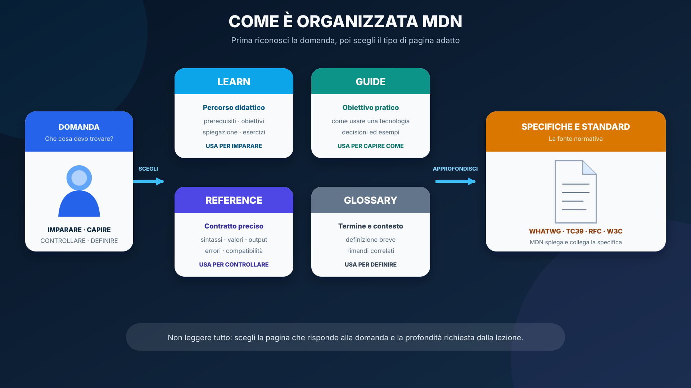
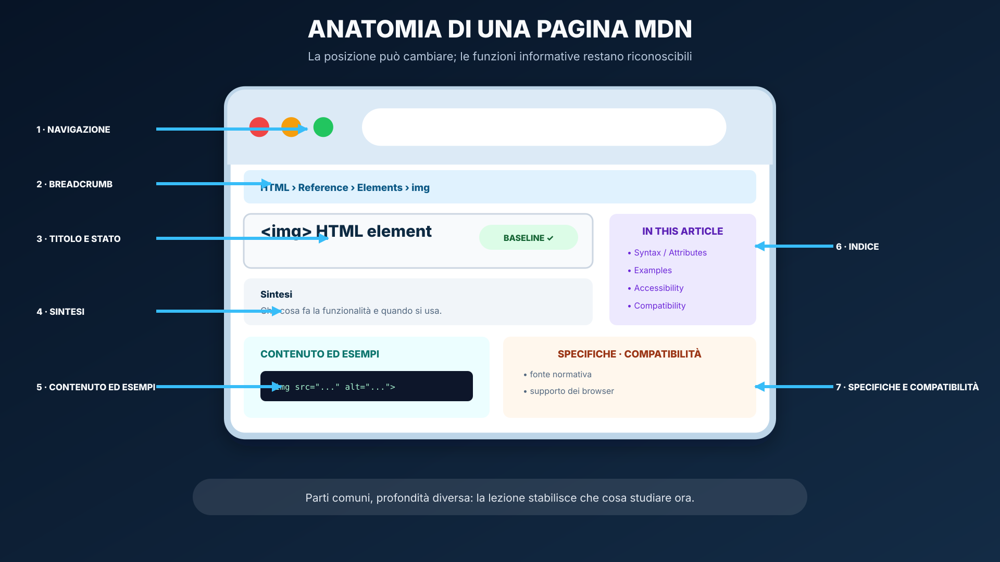
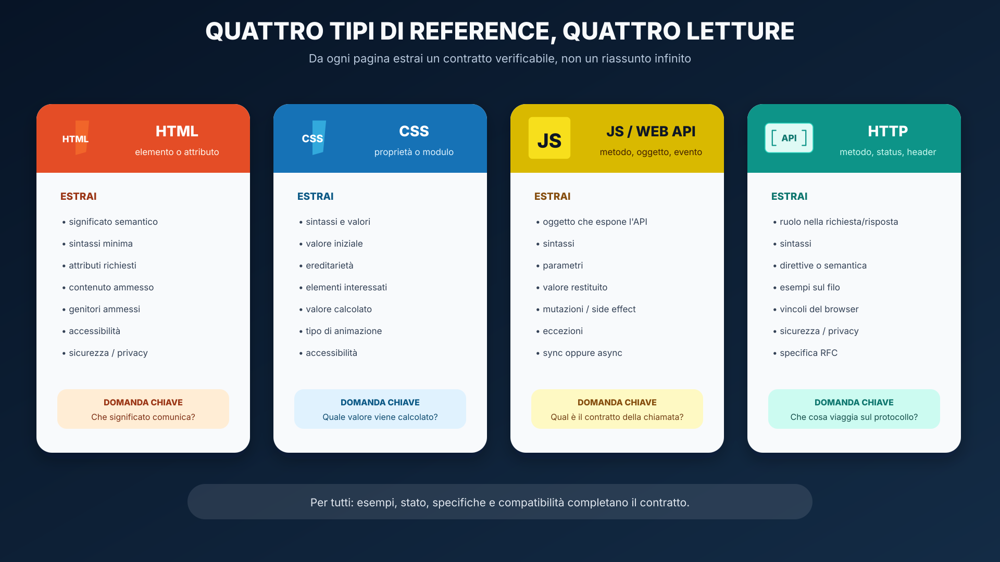
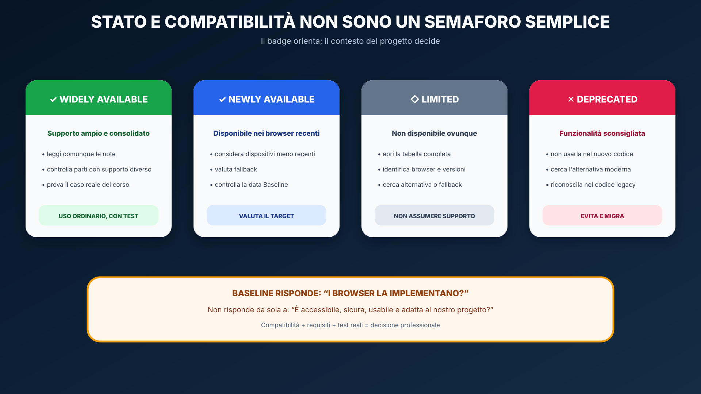
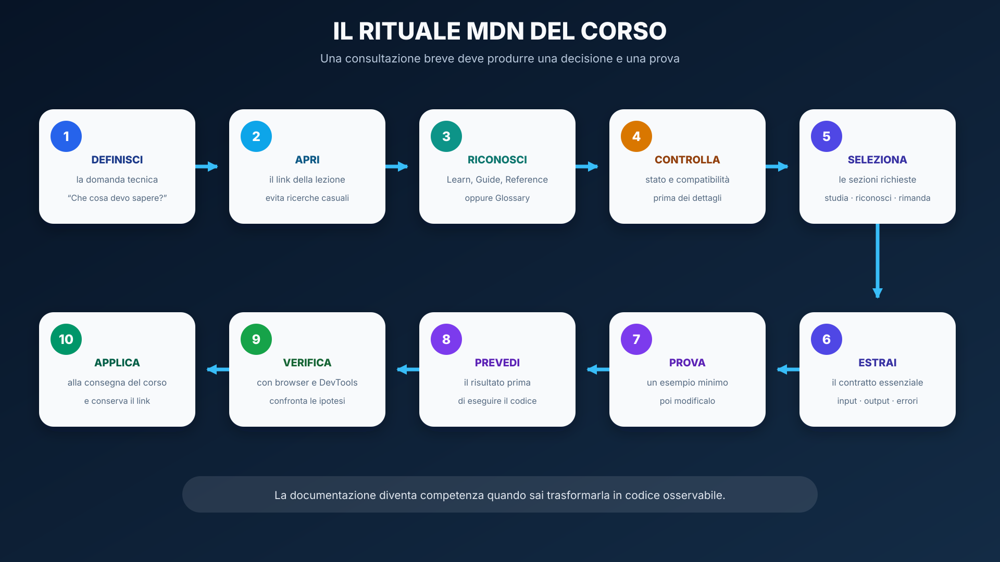

# Usare MDN come strumento di lavoro

<table align="center" width="100%"><tr><td>

&#128506; <strong>Orientamento della guida</strong>

<strong>Contesto:</strong> durante il corso incontrerai collegamenti a tutorial, guide e schede tecniche di MDN. Non devi imparare quelle pagine a memoria: devi saper trovare un'informazione affidabile, comprenderla, verificarla e applicarla al problema della lezione.

<strong>Domande guida:</strong>

<ul>
  <li>quale tipo di pagina MDN risponde alla mia domanda?</li>
  <li>quali sezioni devo studiare e quali posso rimandare?</li>
  <li>come riconosco sintassi, input, output, errori e vincoli?</li>
  <li>come controllo se una funzionalità è disponibile e consigliata?</li>
  <li>come trasformo ciò che ho letto in una prova osservabile?</li>
</ul>

<strong>Obiettivi osservabili:</strong> al termine saprai distinguere Learn, Guide, Reference e Glossary; leggere reference HTML, CSS, JavaScript, Web API e HTTP; interpretare stato e compatibilità; risalire alle specifiche; produrre una breve scheda di lettura e un esempio verificato.

<strong>Prossimo passo:</strong> nelle singole lezioni troverai un pannello “MDN in questa lezione” con le pagine da aprire e la profondità richiesta.

</td></tr></table>

## Perché imparare a usare la documentazione

Un professionista non ricorda ogni attributo, proprietà, metodo o header. Sa invece formulare una domanda precisa, scegliere una fonte adatta e controllare il comportamento reale. Questa abilità è più duratura della memorizzazione, perché la Web Platform continua a evolversi.

<table align="center"><tr><td>

<strong>&#128161; Idea chiave:</strong> la documentazione non sostituisce la comprensione. Serve a costruire una spiegazione verificabile e a prendere una decisione tecnica consapevole.

</td></tr></table>

Nel corso useremo tre livelli distinti:

<ul>
  <li><strong>dispensa:</strong> costruisce il percorso didattico, seleziona la profondità e collega i concetti;</li>
  <li><strong>MDN:</strong> documenta professionalmente le tecnologie della Web Platform;</li>
  <li><strong>specifica:</strong> definisce normativamente il comportamento della tecnologia.</li>
</ul>

## La mappa di MDN

MDN contiene pagine con scopi differenti. Prima di leggere devi capire quale tipo di pagina hai aperto: lo scopo della pagina determina il modo in cui la consulterai.

  

### Learn

<a href="https://developer.mozilla.org/en-US/docs/Learn_web_development">Learn web development</a> è un percorso didattico. Le pagine presentano prerequisiti, obiettivi, spiegazioni progressive, esempi, esercizi e collegamenti fra lezioni.

<strong>Usa Learn quando devi:</strong>

<ul>
  <li>incontrare un argomento per la prima volta;</li>
  <li>seguire una spiegazione progressiva;</li>
  <li>collegare più concetti;</li>
  <li>eseguire un esercizio guidato.</li>
</ul>

### Guide

Una guida spiega come usare una tecnologia o affrontare un problema. Può attraversare più elementi, proprietà o API per raggiungere un obiettivo, per esempio costruire un layout responsive o usare Fetch.

<strong>Usa una Guide quando la domanda inizia con:</strong> “Come posso…?”, “Quale strategia devo seguire?” oppure “Come collaborano queste funzionalità?”.

### Reference

Una reference descrive con precisione una singola funzionalità: un elemento HTML, una proprietà CSS, un metodo JavaScript, un'interfaccia Web API, un metodo HTTP, uno status o un header.

<strong>Usa una Reference quando devi controllare:</strong>

<ul>
  <li>la sintassi esatta;</li>
  <li>i parametri o i valori ammessi;</li>
  <li>il valore restituito;</li>
  <li>le eccezioni e gli edge case;</li>
  <li>la compatibilità;</li>
  <li>la specifica che definisce la funzionalità.</li>
</ul>

### Glossary

Il <a href="https://developer.mozilla.org/en-US/docs/Glossary">Glossary</a> fornisce definizioni brevi dei termini tecnici e rimandi per approfondire. È utile quando non conosci una parola, ma non sostituisce una guida o una reference.

## Orientarsi nell'interfaccia

L'aspetto del sito può cambiare, ma le funzioni informative principali restano riconoscibili. Non memorizzare la posizione in pixel di un pulsante: impara a cercare il ruolo delle varie parti.

  

<ol>
  <li><strong>Navigazione:</strong> separa HTML, CSS, JavaScript, Web API, HTTP, Learn e strumenti.</li>
  <li><strong>Breadcrumb:</strong> mostra il percorso della pagina e aiuta a risalire alla sezione generale.</li>
  <li><strong>Titolo:</strong> identifica con precisione elemento, proprietà, metodo, interfaccia o concetto.</li>
  <li><strong>Stato:</strong> segnala disponibilità, sperimentalità o deprecazione.</li>
  <li><strong>Sintesi iniziale:</strong> risponde in poche righe a “che cosa fa?”.</li>
  <li><strong>In this article:</strong> è l'indice navigabile della pagina.</li>
  <li><strong>Contenuto ed esempi:</strong> spiegano il contratto e mostrano casi d'uso.</li>
  <li><strong>Specifications e Browser compatibility:</strong> collegano fonte normativa e implementazioni.</li>
</ol>

<table align="center"><tr><td>

<strong>&#9888; Attenzione:</strong> un link della dispensa può portare direttamente a un paragrafo tramite il frammento dopo <code>#</code>. Se MDN rinomina la sezione, apri la pagina base e usa “In this article” o la ricerca nella pagina.

</td></tr></table>

## Lingua e lessico tecnico

I collegamenti del corso puntano normalmente alla versione <code>en-US</code>, che costituisce il riferimento più completo e aggiornato. MDN può offrire anche una traduzione italiana; se una frase tradotta sembra ambigua, confrontala con l'inglese.

<ul>
  <li>non tradurre nomi come <code>fetch</code>, <code>display</code>, <code>querySelector</code> o <code>Set-Cookie</code>;</li>
  <li>traduci il significato, non l'identificatore usato nel codice;</li>
  <li>conserva coppie utili come <em>return value → valore restituito</em> ed <em>inherited → ereditata</em>;</li>
  <li>usa il <a href="https://developer.mozilla.org/en-US/docs/Glossary">Glossary</a> per i termini sconosciuti;</li>
  <li>consulta lo stato ufficiale delle <a href="https://developer.mozilla.org/en-US/docs/MDN/Community/Translated_content">traduzioni MDN</a> quando devi valutarne l'aggiornamento.</li>
</ul>

## Come leggere la sintassi

La sezione <strong>Syntax</strong> mostra il contratto formale, non necessariamente il codice completo di un'applicazione. Prima osserva la forma minima; poi individua varianti e parti opzionali.

<ul>
  <li><code>nome(argomento)</code>: chiamata con un argomento;</li>
  <li><code>nome(argomento, opzione)</code>: seconda informazione prevista dalla firma;</li>
  <li><code>...</code>: altri valori o parti omesse nell'esempio;</li>
  <li><code>&lt;length&gt;</code> in CSS: categoria di valori, non testo da copiare letteralmente;</li>
  <li><code>A | B</code>: scelta fra alternative;</li>
  <li><code>inherit</code>, <code>initial</code>, <code>revert</code>, <code>unset</code>: valori globali CSS;</li>
  <li><strong>Optional:</strong> parametro o attributo che può essere omesso;</li>
  <li><strong>Deprecated:</strong> funzionalità da riconoscere nel codice esistente, non da scegliere per nuovo codice.</li>
</ul>

La <a href="https://developer.mozilla.org/en-US/docs/MDN/Writing_guidelines/Page_structures/Syntax_sections">guida MDN alle sezioni Syntax</a> mostra che API, JavaScript, CSS, HTML e HTTP adottano notazioni differenti.

## Leggere le reference senza perdersi

  

### Elemento HTML

Per una scheda come <a href="https://developer.mozilla.org/en-US/docs/Web/HTML/Reference/Elements/img"><code>&lt;img&gt;</code></a>, segui questo ordine:

<ol>
  <li>leggi la sintesi per capire il significato dell'elemento;</li>
  <li>osserva un esempio minimo;</li>
  <li>studia soltanto gli attributi richiesti dalla lezione;</li>
  <li>controlla accessibilità, sicurezza e privacy quando presenti;</li>
  <li>usa <strong>Technical summary</strong> per contenuto ammesso, genitori, tag omessi e ruolo ARIA;</li>
  <li>controlla stato, specifica e compatibilità.</li>
</ol>

<strong>Domanda finale:</strong> “Perché questo elemento comunica meglio il significato rispetto a un contenitore generico?”.

### Proprietà CSS

Per una proprietà come <a href="https://developer.mozilla.org/en-US/docs/Web/CSS/Reference/Properties/display"><code>display</code></a>, estrai:

<ul>
  <li>valori ammessi e sintassi minima;</li>
  <li><strong>Initial value:</strong> valore usato in assenza di una dichiarazione;</li>
  <li><strong>Applies to:</strong> elementi ai quali si applica;</li>
  <li><strong>Inherited:</strong> se il valore passa automaticamente ai discendenti;</li>
  <li><strong>Computed value:</strong> risultato dopo la risoluzione delle regole;</li>
  <li><strong>Animation type:</strong> come può essere animata;</li>
  <li>eventuali conseguenze di accessibilità;</li>
  <li>compatibilità dei singoli valori, non soltanto della proprietà generale.</li>
</ul>

### JavaScript e Web API

Per un metodo JavaScript o una Web API devi trasformare la pagina in un contratto di chiamata. Confronta <a href="https://developer.mozilla.org/en-US/docs/Web/JavaScript/Reference/Global_Objects/Array/map"><code>Array.prototype.map()</code></a> e <a href="https://developer.mozilla.org/en-US/docs/Web/API/Document/querySelector"><code>Document.querySelector()</code></a>.

<ol>
  <li><strong>Proprietario:</strong> quale oggetto espone il metodo?</li>
  <li><strong>Sintassi:</strong> come si effettua la chiamata?</li>
  <li><strong>Parametri:</strong> quali sono obbligatori, opzionali o callback?</li>
  <li><strong>Return value:</strong> che cosa viene restituito?</li>
  <li><strong>Assenza:</strong> restituisce <code>null</code>, <code>undefined</code>, una collezione vuota o altro?</li>
  <li><strong>Eccezioni:</strong> quali errori possono interrompere l'esecuzione?</li>
  <li><strong>Effetti:</strong> modifica l'oggetto oppure ne produce uno nuovo?</li>
  <li><strong>Tempo:</strong> il risultato è sincrono, una Promise o dipende da un evento?</li>
  <li><strong>Edge case:</strong> quali esempi mostrano usi ingannevoli o anti-pattern?</li>
</ol>

### HTTP

MDN documenta concetti HTTP, metodi, status e header. Per un header come <a href="https://developer.mozilla.org/en-US/docs/Web/HTTP/Reference/Headers/Set-Cookie"><code>Set-Cookie</code></a> chiediti:

<ul>
  <li>compare nella richiesta o nella risposta?</li>
  <li>chi può impostarlo e chi può leggerlo?</li>
  <li>qual è la sintassi sul filo HTTP?</li>
  <li>quali direttive accetta?</li>
  <li>quali valori predefiniti o restrizioni applica il browser?</li>
  <li>quali conseguenze di sicurezza e privacy produce?</li>
  <li>quale RFC definisce il comportamento?</li>
</ul>

<table align="center"><tr><td>

<strong>&#128274; Gerarchia delle fonti per la sicurezza:</strong> MDN chiarisce il comportamento della piattaforma; per decisioni di sicurezza il corso affianca standard e linee guida specialistiche come RFC, OWASP e NIST.

</td></tr></table>

## Stato, Baseline e compatibilità

Il badge iniziale offre una sintesi della disponibilità, ma non decide da solo se una funzionalità è adatta al progetto.

  

<ul>
  <li><strong>Widely available:</strong> supporto consolidato nei browser considerati da Baseline;</li>
  <li><strong>Newly available:</strong> disponibile nei browser recenti, ma non necessariamente sui dispositivi meno aggiornati;</li>
  <li><strong>Limited availability:</strong> manca un supporto uniforme e devi valutare alternative o fallback;</li>
  <li><strong>Experimental:</strong> tecnologia ancora instabile o non ampiamente implementata;</li>
  <li><strong>Deprecated:</strong> tecnologia non più consigliata;</li>
  <li><strong>Non-standard:</strong> funzionalità che non appartiene a un percorso standard condiviso.</li>
</ul>

Apri la tabella <strong>Browser compatibility</strong> quando il target del progetto include versioni o dispositivi specifici. Baseline non sostituisce test di accessibilità, sicurezza, usabilità o prestazioni. Approfondimenti: <a href="https://developer.mozilla.org/en-US/docs/Glossary/Baseline/Compatibility">Baseline</a> e <a href="https://developer.mozilla.org/en-US/docs/MDN/Writing_guidelines/Page_structures/Feature_status">feature status</a>.

## MDN e specifiche

MDN è una fonte tecnica autorevole, ma non è la specifica normativa. Nella sezione <strong>Specifications</strong> puoi trovare il documento che definisce formalmente la funzionalità.

<ul>
  <li><strong>WHATWG:</strong> HTML, DOM, Fetch e altri living standard della piattaforma;</li>
  <li><strong>TC39 / ECMA-262:</strong> linguaggio ECMAScript;</li>
  <li><strong>RFC:</strong> protocolli e semantica HTTP;</li>
  <li><strong>W3C:</strong> numerose specifiche Web e linee guida di accessibilità.</li>
</ul>

Nel corso normalmente inizierai dalla dispensa e da MDN. Risalirai alla specifica quando serve chiarire un dettaglio normativo, confrontare il comportamento di più implementazioni o motivare una decisione tecnica.

## Il processo operativo del corso

  

<ol>
  <li><strong>Definisci la domanda:</strong> scrivi che cosa non sai o che cosa devi verificare.</li>
  <li><strong>Apri il link della lezione:</strong> parti dalla pagina o dal paragrafo selezionato.</li>
  <li><strong>Riconosci il tipo:</strong> Learn, Guide, Reference, Glossary o pagina di navigazione.</li>
  <li><strong>Controlla lo stato:</strong> Baseline, compatibilità ed eventuali avvisi.</li>
  <li><strong>Seleziona la profondità:</strong> distingui “studiare ora”, “riconoscere” e “più avanti”.</li>
  <li><strong>Estrai il contratto:</strong> significato, sintassi, input, output, effetti, errori e vincoli.</li>
  <li><strong>Esegui un esempio minimo:</strong> isolalo dal resto dell'applicazione.</li>
  <li><strong>Modificalo:</strong> cambia un valore o un caso e prevedi il risultato prima dell'esecuzione.</li>
  <li><strong>Verifica:</strong> usa browser, DevTools, MDN Playground o gli strumenti indicati dalla lezione.</li>
  <li><strong>Applica:</strong> torna all'attività e conserva il link preciso che giustifica la scelta.</li>
</ol>

## Scheda di lettura MDN

Per una consultazione importante compila questa scheda. Le risposte devono essere brevi: lo scopo è estrarre ciò che serve, non ricopiare la pagina.

<table align="center">
<thead><tr><th>Campo</th><th>Domanda</th></tr></thead>
<tbody>
<tr><td>Domanda iniziale</td><td>Che cosa devo capire o verificare?</td></tr>
<tr><td>Pagina</td><td>Qual è il titolo e qual è il link?</td></tr>
<tr><td>Tipo</td><td>Learn, Guide, Reference o Glossary?</td></tr>
<tr><td>Definizione</td><td>Che problema risolve?</td></tr>
<tr><td>Contratto</td><td>Quali sintassi, input, output ed effetti devo conoscere?</td></tr>
<tr><td>Vincoli</td><td>Quali errori, limiti, note di accessibilità o sicurezza sono rilevanti?</td></tr>
<tr><td>Stato</td><td>È standard, supportata, sperimentale o deprecata?</td></tr>
<tr><td>Prova</td><td>Quale esempio minimo ho eseguito e che cosa ho modificato?</td></tr>
<tr><td>Decisione</td><td>Come userò questa informazione nell'attività?</td></tr>
</tbody>
</table>

## Scegliere la fonte giusta nel corso full stack

MDN è la fonte principale per HTML, CSS, JavaScript, DOM, Web API e per una lettura operativa di HTTP nel browser. Non è però la documentazione primaria di ogni tecnologia del corso.

<ul>
  <li><strong>Bootstrap, Vue, Vue Router e React:</strong> usa prima la documentazione ufficiale del framework; usa MDN per il comportamento HTML, CSS, DOM, URL, History, eventi e Fetch sottostante.</li>
  <li><strong>Node.js ed Express:</strong> usa le rispettive documentazioni ufficiali; usa MDN per confrontare la parte browser e la semantica HTTP.</li>
  <li><strong>SQLite e SQLAlchemy:</strong> usa la documentazione del database o della libreria.</li>
  <li><strong>Sicurezza:</strong> affianca MDN a RFC, OWASP, NIST e alle policy del corso.</li>
  <li><strong>Standard:</strong> usa WHATWG, TC39, RFC o W3C quando serve la definizione normativa.</li>
</ul>

## Errori frequenti

<ol>
  <li><strong>Leggere tutto dall'inizio alla fine:</strong> una reference si consulta a partire dalla domanda.</li>
  <li><strong>Copiare il primo esempio:</strong> prima identifica dipendenze, contesto e parti rilevanti.</li>
  <li><strong>Ignorare il tipo restituito:</strong> molti bug nascono da <code>null</code>, Promise o collezioni vuote non gestite.</li>
  <li><strong>Ignorare gli avvisi:</strong> una funzionalità può esistere ma essere deprecata, sperimentale o limitata.</li>
  <li><strong>Fermarsi al badge:</strong> compatibilità non significa automaticamente accessibilità o sicurezza.</li>
  <li><strong>Confondere MDN con la specifica:</strong> usa il collegamento normativo quando serve precisione formale.</li>
  <li><strong>Usare MDN per un framework:</strong> per l'API di Vue o Bootstrap consulta prima la documentazione del progetto.</li>
  <li><strong>Copiare senza verificare:</strong> modifica ed esegui un esempio minimo prima di inserirlo nell'applicazione.</li>
</ol>

<table align="center"><tr><td>

&#128187; <strong>Laboratorio — tre letture, tre contratti</strong>

<ol>
  <li>Apri la scheda HTML di <a href="https://developer.mozilla.org/en-US/docs/Web/HTML/Reference/Elements/img"><code>&lt;img&gt;</code></a> e ricava significato, attributi richiesti, accessibilità e contenuto ammesso.</li>
  <li>Apri la proprietà CSS <a href="https://developer.mozilla.org/en-US/docs/Web/CSS/Reference/Properties/display"><code>display</code></a> e ricava valore iniziale, ereditarietà, valore calcolato e due valori utili.</li>
  <li>Apri <a href="https://developer.mozilla.org/en-US/docs/Web/API/Document/querySelector"><code>Document.querySelector()</code></a> e ricava proprietario, input, output, caso di assenza ed eccezione.</li>
  <li>Per ciascuna pagina compila la scheda di lettura.</li>
  <li>Confronta le tre schede e spiega perché non potevi applicare lo stesso indice in modo meccanico.</li>
</ol>

</td></tr></table>

## Verifica rapida

<ol>
  <li>Qual è la differenza fra Learn, Guide e Reference?</li>
  <li>Quando è sufficiente il Glossary?</li>
  <li>Quali informazioni cerchi nella Formal definition di una proprietà CSS?</li>
  <li>Che differenza c'è fra valore restituito ed eccezione?</li>
  <li>Che cosa significa Deprecated?</li>
  <li>Perché Baseline non sostituisce un test di accessibilità?</li>
  <li>Quando devi risalire dalla pagina MDN alla specifica?</li>
  <li>Perché una documentazione di framework non sostituisce MDN?</li>
</ol>

## Fonti ufficiali

<ul>
  <li><a href="https://developer.mozilla.org/en-US/docs/MDN/Writing_guidelines/Page_structures/Page_types">MDN — Page types</a>;</li>
  <li><a href="https://developer.mozilla.org/en-US/docs/Learn_web_development">MDN — Learn web development</a>;</li>
  <li><a href="https://developer.mozilla.org/en-US/docs/MDN/Writing_guidelines/Page_structures/Syntax_sections">MDN — Syntax sections</a>;</li>
  <li><a href="https://developer.mozilla.org/en-US/docs/MDN/Writing_guidelines/Page_structures/Feature_status">MDN — Feature status</a>;</li>
  <li><a href="https://developer.mozilla.org/en-US/docs/Glossary/Baseline/Compatibility">MDN — Baseline compatibility</a>;</li>
  <li><a href="https://developer.mozilla.org/en-US/docs/MDN/Writing_guidelines/Page_structures/Specification_tables">MDN — Specification tables</a>;</li>
  <li><a href="https://developer.mozilla.org/en-US/docs/MDN/Community/Translated_content">MDN — Translated content</a>.</li>
</ul>
