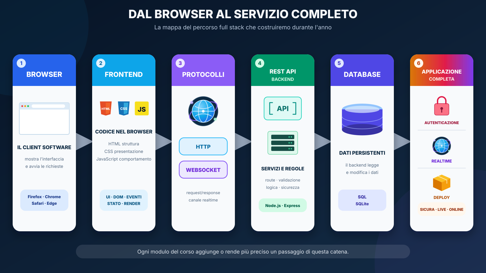
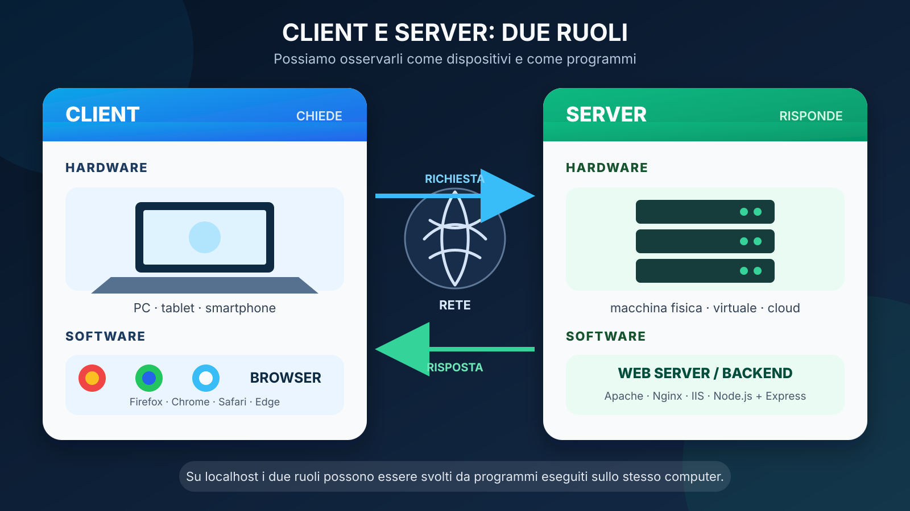
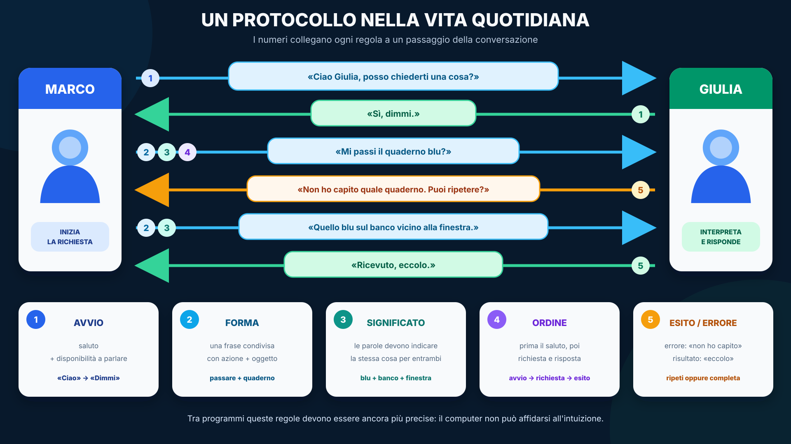
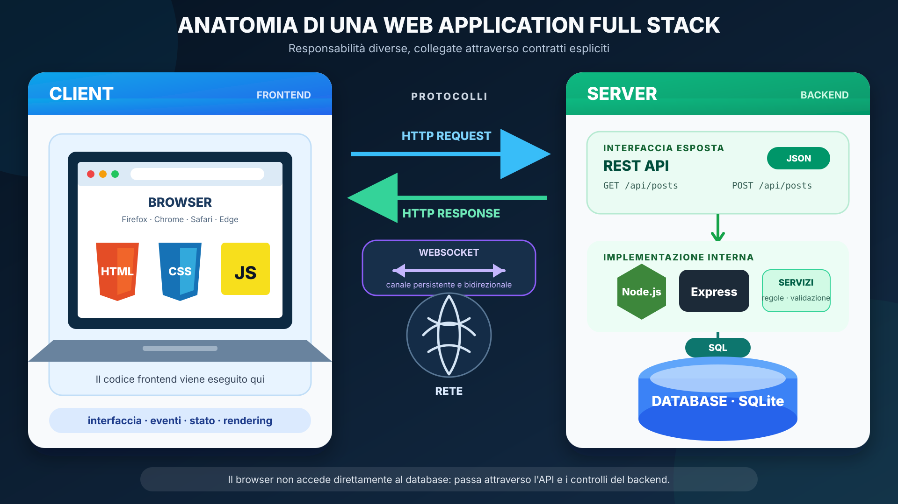

# 00 — Architettura del corso Full Stack
## Dal browser al servizio verificabile

TPSI quinto — Full Stack Web Developer 2026/27

---

# Domanda iniziale

Quando apriamo una pagina web e premiamo **Pubblica**, quante cose diverse succedono davvero?

- browser;
- rete;
- server;
- database;
- identità;
- aggiornamento della UI;
- eventualmente realtime.

> Obiettivo: smettere di vedere “il sito” come un blocco unico.

---

# Obiettivi della lezione

Alla fine dovrai saper:

- distinguere client e server come dispositivi e come programmi;
- spiegare perché serve un protocollo;
- distinguere HTTP e WebSocket;
- riconoscere servizi, API, risorse e metodi HTTP;
- distinguere frontend, backend e database;
- riconoscere un **boundary**;
- descrivere la progressione del progetto Feisbuc;
- capire perché studiamo i concetti prima dei framework.

---



---



---

# Il WWW: un esempio concreto

## Client

- **hardware:** PC, tablet o smartphone dell'utente;
- **software:** Firefox, Chrome, Safari o Edge;
- chiede pagine, dati e servizi.

## Server

- **hardware:** macchina fisica, virtuale o cloud;
- **software:** Apache, Nginx, IIS oppure un'app Node.js;
- rimane in ascolto, elabora e risponde.

Su `localhost` i due ruoli possono vivere sullo stesso computer.

---

# Un protocollo è un insieme di regole

Essere collegati alla stessa rete non basta.

Client e server devono condividere regole che stabiliscono:

- come iniziare la comunicazione;
- come sono costruiti i messaggi;
- quale significato hanno;
- in quale ordine possono essere inviati;
- come indicare un risultato o un errore.

Nel corso useremo soprattutto **HTTP** e **WebSocket**.

---



---

# HTTP e WebSocket

| HTTP | WebSocket |
|---|---|
| richiesta del client | connessione persistente |
| risposta del server | messaggi in entrambe le direzioni |
| pagine, API e comandi | aggiornamenti realtime |
| modello simile al “pull” | permette il “push” dal server |

```text
HTTP       client ──request──► server ──response──► client
WebSocket  client ◄════════ canale aperto ════════► server
```

> Pull/push è una prima semplificazione, non la definizione completa.

---

# Dal servizio all'API

Il server offre **servizi**: recuperare, creare, modificare o cancellare post.

Un'**API** (*Application Programming Interface*) è l'interfaccia attraverso cui un programma usa le funzionalità di un altro programma.

```text
client → API → servizio → risultato
```

Il client conosce il contratto dell'API, ma non deve conoscere:

- il codice interno del backend;
- le tabelle del database;
- le query SQL.

> L'API descrive **come entrare**. Il servizio descrive **che cosa il sistema sa fare**.

---

# Web service e Web API

Un **web service** è un servizio software accessibile in rete con tecnologie del Web.

Client diversi possono usare lo stesso servizio:

```text
browser ───────┐
app mobile ────┼──► Web API ──► servizio sul server
altro server ──┘
```

Non tutte le API usano la rete: anche il browser o una libreria JavaScript possiedono una API.

Quando l'API è esposta da un server attraverso il Web, parliamo di **Web API**.

---

# REST API: risorse identificabili

Una **REST API** è una Web API organizzata intorno alle **risorse**.

```text
/api/posts       collezione dei post
/api/posts/42    post identificato dal numero 42
/api/users/7     utente identificato dal numero 7
```

Per `/api/posts/42`:

- l'**URL** identifica la risorsa per il client;
- la route `/api/posts/:id` la riconosce nel backend;
- il parametro ottenuto è `id = 42`.

---

# Metodo HTTP + URL

L'URL indica **su quale risorsa** operare. Il metodo indica **quale azione** richiedere.

| Richiesta | Significato introduttivo |
|---|---|
| `GET /api/posts` | recupera i post |
| `POST /api/posts` | crea un post |
| `GET /api/posts/42` | recupera il post 42 |
| `PATCH /api/posts/42` | modifica il post 42 |
| `DELETE /api/posts/42` | cancella il post 42 |

Nel modulo HTTP vedremo con precisione request, response, status, header, body e semantica dei metodi.

---



---

# Leggiamo l'architettura

- il **frontend** viene eseguito nel browser: HTML, CSS e JavaScript;
- HTTP e WebSocket definiscono due forme diverse di comunicazione;
- la **REST API** è l'interfaccia HTTP esposta dal backend;
- il **backend** applica regole e validazione: Node.js + Express;
- SQL permette al backend di interrogare il database;
- SQLite conserva i dati nel tempo.

Il browser non accede direttamente al database: passa attraverso l'API e i controlli del backend.

---

# Boundary: il concetto chiave

Un **boundary** è un confine tra responsabilità diverse.

Esempi:

- browser ↔ server;
- JSON ↔ oggetto di dominio;
- backend ↔ database;
- utente ↔ sessione;
- request/response ↔ evento realtime.

Quando qualcosa si rompe, il primo problema è capire **in quale boundary**.

---

# Perché non partire subito da Vue o Express?

Se partiamo dal framework rischiamo di imparare solo sintassi.

Il percorso fa invece:

```text
Web Platform
→ JavaScript/DOM
→ HTTP
→ Express
→ SQL
→ auth
→ Vue
→ realtime
```

Ogni astrazione arriva dopo il problema che risolve.

---

# Feisbuc: un solo progetto che cresce

Feisbuc non riparte da zero a ogni UDA.

```text
HTML statico
→ responsive
→ feed dinamico
→ client REST
→ API Express
→ SQLite
→ sessione/auth
→ SPA Vue
→ realtime
→ mirror Python
→ deploy/evidence
```

La domanda ricorrente sarà: **cosa abbiamo spostato o aggiunto?**

---

# Stack core già deciso

Per il 2026/27 le decisioni non sono aperte:

- Vue 3 + Vite è il frontend core;
- React è solo translation/comparison lab;
- SQL raw viene prima dell'ORM;
- TypeScript è mirato ai boundary;
- FastAPI è un mirror mirato del contratto;
- il corso SQL separato non è un prerequisito bloccante.

Questa lezione presenta la mappa: non ridefinisce il curriculum.

---

# Esempio: pubblicare un post

Versione iniziale:

```text
utente → form HTML → JavaScript → array in memoria → DOM
```

Versione full stack:

```text
utente
→ Vue
→ POST /api/posts
→ Express
→ validazione
→ repository SQL
→ SQLite
→ risposta JSON
→ UI aggiornata
→ evento realtime agli altri client
```

---

# Errore tipico: “non funziona il sito”

Troppo generico.

Domande migliori:

- la request parte?
- quale status HTTP torna?
- il body è valido?
- il backend entra nella route?
- il repository scrive davvero?
- il database contiene la riga?
- il client aggiorna lo stato?

Il debugging è una ricerca del boundary rotto.

---

# Checkpoint

Per ciascun elemento, indica dove vive:

1. `button`;
2. `POST /posts`;
3. `INSERT INTO posts`;
4. cookie di sessione;
5. `socket.emit(...)`;
6. health endpoint.

Confronta la risposta con un compagno e giustificala.

---

# Come useremo il laboratorio

Dal modulo 01 in avanti useremo combinazioni di:

- Activity di osservazione;
- modifica guidata;
- implementazione;
- debug;
- milestone Feisbuc.

**Il modulo 00 è solo orientamento e non ha una Activity dedicata.**

Il primo laboratorio sarà: **Anatomia di un documento HTML moderno**.

---

# Recap

Tre idee da portare via:

1. full stack = responsabilità collegate, non “tante tecnologie”;
2. i confini sono più importanti della sintassi;
3. Feisbuc rende visibile come cambia l'architettura nel tempo.

Prossimo modulo: **Web Platform e HTML moderno**.
